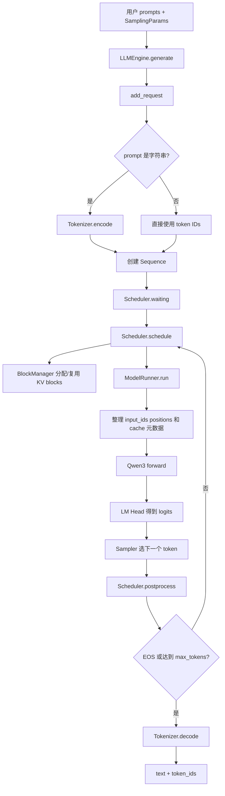
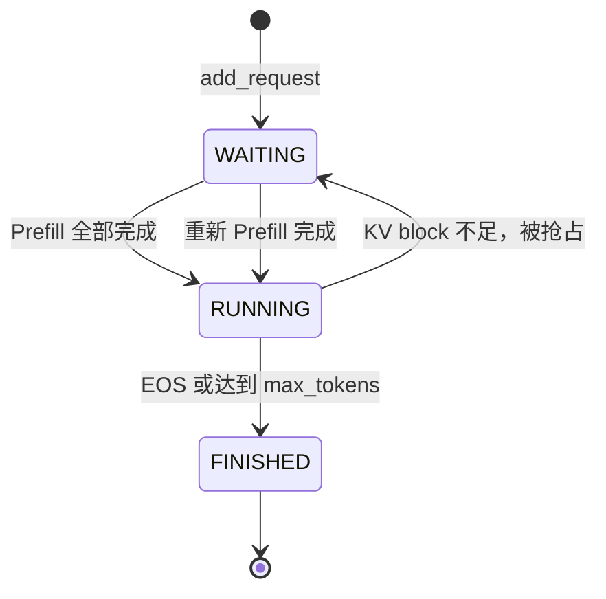
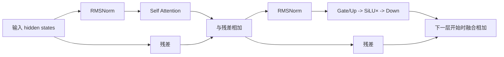

# Nano-vLLM 从 0 到 1：面向零基础的完整源码教程

> 适用代码：本仓库 `nano-vllm 0.2.0`，教程依据当前工作区源码编写。
> 适合读者：会一点点 Python 更好；完全不了解大语言模型、PyTorch、CUDA 或 vLLM 也可以从头读。
> 学习目标：不仅会运行示例，还能说清一次文本生成怎样经过调度器、模型、KV Cache 和采样器，最终变成输出文字。

---

## 目录

- [1. 先用一句话认识项目](#1-先用一句话认识项目)
- [2. 阅读前必须知道的基础概念与源码语法](#2-阅读前必须知道的基础概念与源码语法)
- [3. 这个项目能做什么、不能做什么](#3-这个项目能做什么不能做什么)
- [4. 环境要求：为什么不能直接在普通 Windows 或 CPU 上运行](#4-环境要求为什么不能直接在普通-windows-或-cpu-上运行)
- [5. 从零安装与运行](#5-从零安装与运行)
- [6. 第一个例子逐行讲解](#6-第一个例子逐行讲解)
- [7. 项目目录地图](#7-项目目录地图)
- [8. 全局架构：一次 generate 调用经过了什么](#8-全局架构一次-generate-调用经过了什么)
- [9. 两阶段生成：Prefill 与 Decode](#9-两阶段生成prefill-与-decode)
- [10. 配置系统 Config](#10-配置系统-config)
- [11. 请求的最小单位 Sequence](#11-请求的最小单位-sequence)
- [12. 调度器 Scheduler 与连续批处理](#12-调度器-scheduler-与连续批处理)
- [13. Paged KV Cache、BlockManager 与前缀缓存](#13-paged-kv-cacheblockmanager-与前缀缓存)
- [14. ModelRunner：CPU 调度与 GPU 执行的桥梁](#14-modelrunnercpu-调度与-gpu-执行的桥梁)
- [15. Qwen3 模型结构](#15-qwen3-模型结构)
- [16. Attention、RoPE、RMSNorm、SwiGLU](#16-attentionropermsnormswiglu)
- [17. 从隐藏状态到下一个 token：LM Head 与采样](#17-从隐藏状态到下一个-tokenlm-head-与采样)
- [18. 权重加载](#18-权重加载)
- [19. 张量并行 Tensor Parallelism](#19-张量并行-tensor-parallelism)
- [20. CUDA Graph 与 torch.compile](#20-cuda-graph-与-torchcompile)
- [21. 一次请求的完整时序复盘](#21-一次请求的完整时序复盘)
- [22. Benchmark 怎么读、怎么测](#22-benchmark-怎么读怎么测)
- [23. 推荐的源码阅读和调试路线](#23-推荐的源码阅读和调试路线)
- [24. 常见报错与排查](#24-常见报错与排查)
- [25. 当前实现的边界与容易忽略的行为](#25-当前实现的边界与容易忽略的行为)
- [26. 从简单到进阶的练习](#26-从简单到进阶的练习)
- [27. 术语表与速查表](#27-术语表与速查表)

---

## 1. 先用一句话认识项目

Nano-vLLM 是一个用约一千多行 Python 代码实现的、只做离线文本生成的轻量级 LLM 推理引擎。

它不是从零训练模型，而是：

1. 读取 Hugging Face 格式的 Qwen3 配置、分词器和 `safetensors` 权重；
2. 把许多生成请求动态组成批次；
3. 在 NVIDIA GPU 上执行 Qwen3 前向计算；
4. 用 Paged KV Cache、前缀缓存、FlashAttention、张量并行和 CUDA Graph 加速；
5. 每轮采样一个新 token，循环到遇到 EOS 或达到长度上限；
6. 把 token 解码成文字返回。

这个项目最大的学习价值不是支持很多模型或功能，而是用很少的代码展示了 vLLM 类推理引擎的骨架。

可以先记住下面这个关系：

```text
Transformers 风格模型：重点是“神经网络怎样算”
Nano-vLLM 推理引擎：重点是“怎样高效组织很多次模型计算”
```

---

## 2. 阅读前必须知道的基础概念与源码语法

### 2.1 模型、训练与推理

- **模型**：大量参数组成的数学函数。
- **训练**：用数据调整参数；成本很高，本项目不负责。
- **推理**：加载已经训练好的参数，输入文字并得到输出；本项目只负责推理。

### 2.2 Token

模型不直接阅读字符串，而是阅读整数编号。

```text
"Hello, world" -> tokenizer -> [9707, 11, 1879]（仅为示意）
```

每个整数叫一个 token ID。token 可能是一个字、半个单词、一个完整单词或标点。

### 2.3 Tokenizer

分词器负责两个方向：

```text
encode：文字 -> token IDs
decode：token IDs -> 文字
```

分词器和模型必须配套。不能随意拿另一个模型的 tokenizer 来编码。

### 2.4 自回归生成

Qwen3 这类 Causal Language Model 一次只决定“下一个 token”。要生成多个 token，必须循环：

```text
输入：今天天气
第 1 轮预测：很
第 2 轮输入相当于：今天天气很       -> 预测：好
第 3 轮输入相当于：今天天气很好     -> 预测：。
```

这就是自回归：新输出会成为下一轮的输入。

### 2.5 Tensor（张量）

Tensor 可以先理解为“多维数组”。常见形状：

```text
[token 数, hidden_size]
[token 数, attention head 数, head_dim]
[batch_size, vocab_size]
```

神经网络的绝大部分工作就是矩阵乘法和逐元素运算。

### 2.6 Hidden state 与 Logits

- **hidden state**：模型内部对每个 token 的向量表示。
- **logits**：词表中每个候选 token 的未归一化分数。
- **probability**：对 logits 做 softmax 后得到的概率。

假设词表只有三个 token：

```text
logits       = [2.0, 1.0, 0.1]
softmax 后   = [0.659, 0.242, 0.099]
```

采样器会根据这些概率选出一个 token。

### 2.7 Attention

Attention 让当前位置根据上下文中其他 token 的信息更新自己。简化公式为：

```text
Attention(Q, K, V) = softmax(QKᵀ / √d) V
```

- Q（Query）：当前位置想找什么；
- K（Key）：每个历史位置提供什么索引；
- V（Value）：每个历史位置真正携带的信息。

### 2.8 KV Cache

生成第 100 个 token 时，前 99 个 token 的 K、V 已经算过。把它们保存起来，下轮只算新 token 的 K、V，就叫 KV Cache。

没有 KV Cache 时，生成越长，重复计算越多；有 KV Cache 后，Decode 每轮通常只向模型送入一个新 token。

### 2.9 GPU、CUDA、Triton 与 FlashAttention

- **GPU**：擅长大规模并行计算的硬件；
- **CUDA**：NVIDIA GPU 的计算平台；
- **Triton**：用接近 Python 的方式编写 GPU kernel；
- **FlashAttention**：高效实现 Attention 的库。

本项目直接依赖这几项，不提供 CPU 后备路径。

### 2.10 EOS

EOS 是 End Of Sequence，即“文本结束”特殊 token。默认情况下，模型生成 EOS 后请求完成；设置 `ignore_eos=True` 可以忽略它，强制生成到 `max_tokens`。

### 2.11 Python 源码语法速成

如果你还没有系统学过 Python，先掌握下面这些写法就足以继续阅读。它们不是 nano-vllm 的特殊语法。

导入：

```python
from nanovllm.engine.llm_engine import LLMEngine
```

表示从某个模块中取出 `LLMEngine` 这个名字。

类与继承：

```python
class LLM(LLMEngine):
    pass
```

表示 `LLM` 继承 `LLMEngine` 的全部行为。`pass` 表示这里不额外添加内容，所以本项目的 `LLM` 本质上就是一个更简短、对外更友好的类名。

构造函数与 `self`：

```python
class Sequence:
    def __init__(self, token_ids):
        self.token_ids = token_ids
```

调用 `Sequence(ids)` 时，Python 自动运行 `__init__`。`self` 就是正在创建的对象；`self.token_ids` 是该对象自己的字段。

类型标注：

```python
prompt: str | list[int]
```

表示 `prompt` 可以是字符串，也可以是整数列表。类型标注主要帮助阅读器和检查工具，Python 运行时通常不会自动强制检查。

列表推导式：

```python
temperatures = [seq.temperature for seq in seqs]
```

表示遍历 `seqs`，取出每个对象的温度，组成新列表。

切片：

```python
token_ids[start:end]
```

取从 `start` 开始、到 `end` 之前结束的部分，包含 start，不包含 end。

字典：

```python
outputs[seq_id] = token_ids
```

把 `seq_id` 当作 key 保存结果，之后可按 ID 找回。

特殊方法（dunder method）：

```python
__len__       # len(seq) 时调用
__getitem__   # seq[i] 或 seq[a:b] 时调用
__getstate__  # pickle 序列化时调用
__setstate__  # pickle 反序列化时调用
```

装饰器：

```python
@property
def is_finished(self): ...

@torch.inference_mode()
def run_model(...): ...
```

装饰器会改变函数的使用方式或附加行为。`@property` 让方法能像字段一样写成 `seq.is_finished`；`@torch.inference_mode()` 关闭训练所需的梯度记录，节省推理开销。

dataclass：

```python
@dataclass(slots=True)
class SamplingParams:
    temperature: float = 1.0
```

`@dataclass` 自动生成保存字段所需的构造函数等代码。`slots=True` 限制实例字段集合并减少一些 Python 对象开销。

上下文管理器：

```python
with safe_open(file, "pt", "cpu") as f:
    ...
```

`with` 保证进入和退出资源时执行正确的准备与清理动作，此处用于安全地打开权重文件。

断言：

```python
assert self.temperature > 1e-10
```

条件不成立时立即抛出 `AssertionError`。本项目大量用断言表达只支持哪些输入和配置。

### 2.12 PyTorch 源码语法速成

模型类通常继承 `nn.Module`：

```python
class Sampler(nn.Module):
    def forward(self, logits, temperatures):
        ...
```

调用 `sampler(logits, temperatures)` 时，`nn.Module.__call__` 会进一步调用 `forward`。不要把它误解成 Sampler 没有 `__call__` 就不能调用。

`nn.Parameter` 表示模型参数：

```python
self.weight = nn.Parameter(torch.empty(output_size, input_size))
```

训练框架会追踪 Parameter；本项目不训练它，而是从 checkpoint 把已有权重复制进去。

设备与数据类型：

```python
x.cuda()            # 把 Tensor 放到当前 CUDA GPU
x.float()           # 转成 float32
x.to(orig_dtype)    # 转回原数据类型
```

常见 dtype 包括 FP32、FP16 和 BF16。精度越低通常越省显存、吞吐越高，但硬件支持和数值稳定性也不同。本项目采用模型配置中的 dtype。

形状变换：

```python
x.view(-1, num_heads, head_dim)
x.flatten(1, -1)
x.chunk(2, -1)
```

- `-1` 表示让 PyTorch 自动推断这一维；
- `view` 改变观察形状，不改变元素总数；
- `flatten` 合并若干维；
- `chunk` 沿某一维切成多份。

`F.linear(x, weight, bias)` 做线性变换，数学上近似：

```text
y = x Wᵀ + b
```

`torch.distributed` 中：

- `all_reduce(y)`：把各 rank 的 y 相加，并让每个 rank 都拿到结果；
- `gather(...)`：把各 rank 结果收集到指定 rank；
- `barrier()`：所有 rank 到齐后才继续。

最后，`@torch.compile` 表示让 PyTorch 尝试编译和融合函数。它不改变函数想表达的数学逻辑，但会影响首次运行耗时、调试方法与最终性能。

---

## 3. 这个项目能做什么、不能做什么

### 3.1 已实现的能力

- 加载 Hugging Face 目录中的 Qwen3 模型；
- 同时处理多个离线生成请求；
- 输入可以是字符串，也可以是 token ID 列表；
- 支持每个请求独立的温度、最大生成长度和 EOS 策略；
- chunked prefill（把太长的提示切块计算）；
- Paged KV Cache；
- 完整块级别的前缀缓存；
- 显存不足时通过 recompute 方式抢占请求；
- 1～8 张 NVIDIA GPU 的张量并行；
- `torch.compile`、Triton KV 写入 kernel、FlashAttention；
- Decode 阶段 CUDA Graph；
- 简单吞吐量 benchmark。

### 3.2 没有实现的能力

- 不训练、不微调模型；
- 没有 HTTP/OpenAI 兼容 API Server；
- 没有流式逐 token 返回接口；
- 没有 CPU、Apple Silicon、AMD GPU 后端；
- 当前模型代码只实现 Qwen3，不是通用 Transformers 模型运行器；
- 没有 beam search、top-k、top-p、重复惩罚、stop strings；
- 不允许 `temperature=0` 的 greedy decoding；
- 没有 LoRA、量化、投机解码、分布式多机；
- 没有生产级鉴权、监控、请求取消、容错和测试套件。

因此，最合适的定位是“高性能推理原理的可读实现”，不是功能齐全的生产服务。

---

## 4. 环境要求：为什么不能直接在普通 Windows 或 CPU 上运行

### 4.1 硬性要求

从源码可以直接看到：

- `ModelRunner` 固定调用 `torch.cuda.set_device(...)`；
- 分布式后端固定为 `nccl`；
- Attention 固定导入 `flash_attn`；
- KV Cache 写入使用 Triton kernel；
- 多处直接调用 `.cuda()`。

所以运行条件是：

- Python `>=3.10,<3.13`；
- NVIDIA CUDA GPU；
- 可工作的 CUDA 版 PyTorch；
- NCCL、Triton、FlashAttention 可用；
- 模型目录中有配置、tokenizer 和 `*.safetensors` 权重。

### 4.2 操作系统结论

推荐顺序：

1. 原生 Linux；
2. Windows 11 + WSL2 Ubuntu；
3. 不推荐 Windows 原生 Python。

即使 Windows 上能安装 CUDA 版 PyTorch，本项目的 NCCL 和 FlashAttention 路径通常仍要求 Linux 环境。因此 Windows 用户应在 WSL2 中运行项目，而不是直接在 PowerShell 的 Windows Python 中运行。

### 4.3 显存需求

显存主要由四部分组成：

```text
模型权重 + 模型运行时临时张量 + CUDA Graph + KV Cache
```

Qwen3-0.6B 是合适的入门模型。默认 `gpu_memory_utilization=0.9` 表示引擎尝试把约 90% 的显存预算用于整体运行并把剩余空间计算成 KV Cache block 数量。它不是说“KV Cache 独占 90%”。

如果初始化时 OOM，可以优先：

- 使用更小模型；
- 设置 `enforce_eager=True`，暂时关闭 CUDA Graph；
- 降低 `max_num_batched_tokens`；
- 降低 `max_num_seqs`；
- 降低 `max_model_len`；
- 适当降低 `gpu_memory_utilization`，给其他进程或临时工作区留空间。

---

## 5. 从零安装与运行

> 以下命令以 Ubuntu/WSL2 为例。包版本和 CUDA 版本必须匹配本机驱动；PyTorch 安装命令应以 PyTorch 官方安装选择器为准，不要盲目复制另一台机器的 CUDA 版本。

### 5.1 Windows 用户先准备 WSL2

在管理员 PowerShell 中执行：

```powershell
wsl --install -d Ubuntu
```

重启并进入 Ubuntu 后检查 GPU 是否透传：

```bash
nvidia-smi
```

如果看不到 GPU，应先处理 WSL2 和 NVIDIA 驱动问题，不要急着安装 Python 包。

### 5.2 安装基础工具

```bash
sudo apt update
sudo apt install -y python3 python3-venv python3-dev build-essential git
```

进入本项目。当前仓库位于 Windows E 盘时，WSL2 中通常对应：

```bash
cd "/mnt/e/AI infra/nano_vllm/nano-vllm"
```

频繁编译时，把仓库放在 WSL2 自己的 Linux 文件系统中通常体验更好，例如 `~/projects/nano-vllm`。

### 5.3 创建虚拟环境

```bash
python3 -m venv .venv
source .venv/bin/activate
python -m pip install --upgrade pip setuptools wheel packaging ninja
```

以后每次打开新终端都要重新运行：

```bash
source .venv/bin/activate
```

### 5.4 安装 PyTorch 与项目

先根据本机环境安装兼容的 CUDA 版 PyTorch，再以 editable 模式安装项目：

```bash
# 先执行 PyTorch 官方安装选择器为你的 CUDA 环境给出的命令
pip install -e .
```

`-e` 表示 editable。修改 `nanovllm/` 下的 Python 文件后，无需反复重新安装。

`pyproject.toml` 声明的直接依赖为：

```text
torch >= 2.4.0
triton >= 3.0.0
transformers >= 4.51.0
flash-attn
xxhash
```

FlashAttention 需要本地编译时，可以尝试在已经安装 PyTorch 后单独执行：

```bash
pip install --no-build-isolation flash-attn
pip install -e .
```

### 5.5 检查环境

```bash
python - <<'PY'
import torch
import transformers
import triton
import flash_attn
import xxhash

print("torch:", torch.__version__)
print("transformers:", transformers.__version__)
print("CUDA available:", torch.cuda.is_available())
print("GPU count:", torch.cuda.device_count())
if torch.cuda.is_available():
    print("GPU 0:", torch.cuda.get_device_name(0))
PY
```

至少要确认：

```text
CUDA available: True
GPU count: 1 或更多
```

### 5.6 下载模型

安装 Hugging Face 命令行工具：

```bash
pip install -U huggingface_hub
```

下载示例模型：

```bash
hf download Qwen/Qwen3-0.6B \
  --local-dir "$HOME/huggingface/Qwen3-0.6B"
```

旧版 Hugging Face CLI 也可能使用仓库 README 中的形式：

```bash
huggingface-cli download --resume-download Qwen/Qwen3-0.6B \
  --local-dir "$HOME/huggingface/Qwen3-0.6B" \
  --local-dir-use-symlinks False
```

模型目录至少应能看到类似内容：

```text
config.json
tokenizer.json 或其他 tokenizer 文件
tokenizer_config.json
model.safetensors 或 model-00001-of-....safetensors
model.safetensors.index.json（分片权重通常有）
```

### 5.7 运行自带示例

`example.py` 默认路径正是：

```python
path = os.path.expanduser("~/huggingface/Qwen3-0.6B/")
```

模型放在其他位置时，先修改这一行，然后运行：

```bash
python example.py
```

第一次启动可能明显较慢，因为要加载权重、预热模型、分配 KV Cache，并触发 `torch.compile`。示例使用 `enforce_eager=True`，不会捕获 CUDA Graph，更适合首次验证。

### 5.8 最小测试脚本

```python
from nanovllm import LLM, SamplingParams

model_path = "/绝对路径/Qwen3-0.6B"

llm = LLM(
    model_path,
    enforce_eager=True,
    tensor_parallel_size=1,
    max_model_len=2048,
)

params = SamplingParams(
    temperature=0.6,
    max_tokens=64,
)

outputs = llm.generate(["请用一句话介绍你自己。"], params)
print(outputs[0]["text"])
print(outputs[0]["token_ids"])
```

注意：传入普通字符串不等于使用聊天模板。对 instruct/chat 模型，更推荐像 `example.py` 一样先调用 `tokenizer.apply_chat_template(...)`。

---

## 6. 第一个例子逐行讲解

自带的 `example.py` 是公开 API 的最佳入口。

### 6.1 导入

```python
from nanovllm import LLM, SamplingParams
from transformers import AutoTokenizer
```

- `LLM`：整个推理引擎；
- `SamplingParams`：控制每个请求如何生成；
- `AutoTokenizer`：读取模型配套分词器。

`nanovllm/__init__.py` 只做了两次重新导出，所以用户不必写很长的模块路径。

### 6.2 创建 tokenizer 和引擎

```python
tokenizer = AutoTokenizer.from_pretrained(path)
llm = LLM(path, enforce_eager=True, tensor_parallel_size=1)
```

`LLM` 自己也会创建一个 tokenizer。示例额外创建 tokenizer，是为了在调用 `generate` 前套用聊天模板。

创建 `LLM` 不是一个轻量操作，它会立即：

1. 读取模型配置；
2. 建立 NCCL process group；
3. 在 GPU 上构造 Qwen3；
4. 加载全部权重；
5. 预热一次；
6. 根据剩余显存创建 KV Cache；
7. 如果 `enforce_eager=False`，再捕获 CUDA Graph。

所以应该复用一个 `LLM` 实例，不要每个 prompt 都重新创建。

### 6.3 设置采样参数

```python
sampling_params = SamplingParams(temperature=0.6, max_tokens=256)
```

本项目只有三个参数：

| 参数 | 默认值 | 含义 |
|---|---:|---|
| `temperature` | `1.0` | 越低越偏向高概率 token；必须大于约 `1e-10` |
| `max_tokens` | `64` | 最多新生成多少 token，不包含 prompt |
| `ignore_eos` | `False` | 是否忽略模型生成的 EOS |

### 6.4 应用聊天模板

```python
tokenizer.apply_chat_template(
    [{"role": "user", "content": prompt}],
    tokenize=False,
    add_generation_prompt=True,
)
```

聊天模型训练时看到的输入通常包含角色标记。聊天模板把普通问题转换成模型熟悉的格式。这里 `tokenize=False` 表示先得到字符串，之后由 `LLM.add_request` 内部编码。

### 6.5 批量生成

```python
outputs = llm.generate(prompts, sampling_params)
```

同一个 `SamplingParams` 对象会被复用于所有 prompt。也可以为每个 prompt 传不同参数：

```python
params = [
    SamplingParams(temperature=0.2, max_tokens=32),
    SamplingParams(temperature=0.9, max_tokens=128),
]
outputs = llm.generate(prompts, params)
```

返回值实际是：

```python
[
    {
        "text": "生成的文字",
        "token_ids": [若干整数],
    },
    ...
]
```

虽然 `generate` 源码的返回类型标注写成了 `list[str]`，真实返回值是字典列表，应以实现为准。

---

## 7. 项目目录地图

```text
nano-vllm/
├── README.md                     项目简介、安装和 benchmark
├── pyproject.toml                包信息与依赖
├── example.py                    最小生成示例
├── bench.py                      吞吐量测试
└── nanovllm/
    ├── __init__.py               导出 LLM 与 SamplingParams
    ├── config.py                 引擎配置
    ├── sampling_params.py        采样配置
    ├── llm.py                    LLM = LLMEngine 的薄包装
    ├── engine/
    │   ├── llm_engine.py         用户 API、主循环、进程启动
    │   ├── sequence.py           单个请求的状态与 token
    │   ├── scheduler.py          Prefill/Decode 调度与抢占
    │   ├── block_manager.py      KV block 分配、引用计数、前缀缓存
    │   └── model_runner.py       输入整理、GPU 执行、KV Cache、CUDA Graph
    ├── models/
    │   └── qwen3.py              Qwen3 Transformer 模型
    ├── layers/
    │   ├── attention.py          FlashAttention 与 KV 写入 kernel
    │   ├── linear.py             张量并行线性层
    │   ├── embed_head.py         词嵌入与 LM Head
    │   ├── rotary_embedding.py   RoPE 位置编码
    │   ├── layernorm.py          RMSNorm 与残差融合
    │   ├── activation.py         SiLU 门控激活
    │   └── sampler.py            温度采样
    └── utils/
        ├── context.py            一次 forward 所需的全局上下文
        └── loader.py             safetensors 权重加载
```

可以把代码分成四层：

```text
API 层       LLM / LLMEngine
管理层       Scheduler / Sequence / BlockManager
执行层       ModelRunner / Context
计算层       Qwen3 / Attention / Linear / Sampler
```

---

## 8. 全局架构：一次 generate 调用经过了什么



最核心的循环就在 `LLMEngine.generate`：

```python
while not self.is_finished():
    output, num_tokens = self.step()
```

而一次 `step()` 做四件事：

```python
seqs, is_prefill = self.scheduler.schedule()
token_ids = self.model_runner.call("run", seqs, is_prefill)
self.scheduler.postprocess(seqs, token_ids, is_prefill)
收集已完成序列
```

理解这四步，就抓住了整个推理引擎的控制骨架。

---

## 9. 两阶段生成：Prefill 与 Decode

### 9.1 Prefill

Prefill 是第一次处理 prompt。例如 prompt 有 100 个 token，模型通常会一次处理这 100 个 token：

```text
[t0, t1, ..., t99] -> 模型 -> 第一个生成 token t100
```

同时，每一层都会把这 100 个 token 的 K、V 写入 KV Cache。

特点：

- 一次处理很多 token；
- 矩阵乘法规模大，较容易把 GPU 算力用满；
- 更偏 compute-bound；
- 最终只需要 prompt 最后一个位置的 logits 来采样。

### 9.2 Decode

随后每一轮只输入上轮新生成的一个 token：

```text
t100 + 历史 KV Cache -> t101
t101 + 历史 KV Cache -> t102
```

特点：

- 每个请求每轮只计算一个新 token；
- Attention 要读取大量历史 KV；
- 通常更偏 memory-bandwidth-bound；
- 把许多请求合批能明显提高 GPU 利用率。

### 9.3 为什么代码必须区分两者

`ModelRunner` 分别实现：

```python
prepare_prefill(seqs)
prepare_decode(seqs)
```

Prefill 使用 `flash_attn_varlen_func`，支持一个批次内不同长度的序列；Decode 使用 `flash_attn_with_kvcache`，直接读取分页 KV Cache。

### 9.4 一个容易困惑的细节：缓存总是“落后一个新 token”

采样出的新 token 先被追加到 `Sequence.token_ids`，但它的 K、V 要等下一轮作为模型输入时才会产生。

例如 prompt 长度 3：

```text
Prefill 输入 token 0,1,2：缓存已有 0,1,2；采样 token 3
Decode  输入 token 3：    缓存新增 3；    采样 token 4
Decode  输入 token 4：    缓存新增 4；    采样 token 5
```

所以 `last_token` 正是“已经采样，但下一次需要送进模型的 token”。

---

## 10. 配置系统 Config

`nanovllm/config.py` 中的 `Config` 是引擎级配置。

| 字段 | 默认值 | 作用 |
|---|---:|---|
| `model` | 必填 | 本地模型目录 |
| `max_num_batched_tokens` | `16384` | 一次 Prefill 最多调度多少 token |
| `max_num_seqs` | `512` | 一次最多调度多少条序列 |
| `max_model_len` | `4096` | 引擎允许的最大上下文长度 |
| `gpu_memory_utilization` | `0.9` | 计算 KV Cache 容量时的显存预算比例 |
| `tensor_parallel_size` | `1` | 张量并行 GPU 数 |
| `enforce_eager` | `False` | `True` 时 Decode 不使用 CUDA Graph |
| `hf_config` | 自动读取 | Hugging Face 模型配置 |
| `eos` | 自动设置 | tokenizer 的 EOS token ID |
| `kvcache_block_size` | `256` | 每个 KV block 容纳的 token 数 |
| `num_kvcache_blocks` | 自动计算 | 可用 KV block 数量 |

初始化后会执行：

```python
assert os.path.isdir(self.model)
assert self.kvcache_block_size % 256 == 0
assert 1 <= self.tensor_parallel_size <= 8
self.hf_config = AutoConfig.from_pretrained(self.model)
self.max_model_len = min(self.max_model_len, self.hf_config.max_position_embeddings)
```

这表示：

- `model` 必须是本地目录，不支持直接传 Hugging Face repo ID；
- block size 必须是 256 的倍数；
- 模型自己的位置上限会覆盖过大的 `max_model_len`；
- GPU 数最多允许 8，但还必须满足 attention head 和词表可整除等条件。

`LLMEngine.__init__` 会先用 dataclass 字段名过滤 `kwargs`。拼错参数名不会报“未知参数”，而是可能被静默忽略，例如误写 `max_model_length` 不会生效。这是调试配置时必须注意的行为。

---

## 11. 请求的最小单位 Sequence

每个 prompt 会变成一个 `Sequence` 对象。它同时保存“用户输入”“已经生成的 token”“运行状态”和“KV block 映射”。

### 11.1 主要字段

| 字段 | 含义 |
|---|---|
| `seq_id` | 全局递增请求编号，用来恢复输入顺序 |
| `status` | `WAITING`、`RUNNING` 或 `FINISHED` |
| `token_ids` | prompt 与 completion 的完整 token 列表 |
| `last_token` | 最近采样出的 token |
| `num_prompt_tokens` | 原始 prompt 长度 |
| `num_cached_tokens` | 已经有 KV 的 token 数 |
| `num_scheduled_tokens` | 本轮准备计算多少 token |
| `is_prefill` | 是否还处于 Prefill/重算路径 |
| `block_table` | 逻辑 block 到物理 KV block 的 ID 列表 |
| `temperature` | 当前序列的采样温度 |
| `max_tokens` | 最多生成长度 |
| `ignore_eos` | 是否忽略 EOS |

### 11.2 状态变化



### 11.3 重要属性

```python
num_completion_tokens = num_tokens - num_prompt_tokens
num_blocks = ceil(num_tokens / block_size)
last_block_num_tokens = 最后一个逻辑块中已有多少 token
```

`prompt_token_ids` 和 `completion_token_ids` 只是对 `token_ids` 的切片。

### 11.4 为什么实现 `__getstate__` 和 `__setstate__`

张量并行时，rank 0 会通过共享内存把 `Sequence` pickle 后发给其他进程。

- Prefill 需要发送当前 token 列表；
- Decode 每轮实际只需要 `last_token`，不必反复复制整个长序列。

`__getstate__` 因而在 Decode 只序列化最后一个 token，减少进程通信量。子进程中的 `Sequence` 是执行快照，不负责保存最终输出。

---

## 12. 调度器 Scheduler 与连续批处理

Scheduler 有两个队列：

```text
waiting：尚未完成 Prefill，或被抢占后等待重算
running：Prefill 已完成，可以逐 token Decode
```

### 12.1 每次 schedule 先尝试 Prefill

调度器先从 `waiting[0]` 开始：

1. 查询是否有可复用的完整前缀 block；
2. 检查剩余 KV block 是否够用；
3. 分配或引用物理 block；
4. 遵守 `max_num_batched_tokens` 和 `max_num_seqs`；
5. 设置本轮 `num_scheduled_tokens`；
6. 整个 prompt 处理完后，将序列移入 `running`。

只要本轮安排了任意 Prefill，就直接返回 Prefill 批次，不会在同一次模型前向里混入 Decode。

### 12.2 Chunked Prefill

如果排在最前面的 prompt 比当前 token budget 更长，代码允许把它切块：

```text
prompt 10000 tokens，max_num_batched_tokens=4096
第 1 轮：4096
第 2 轮：4096
第 3 轮：1808，然后采样第一个输出 token
```

限制是：只有本轮第一个序列可以被切块。如果前面已经放入其他序列，而下一个序列放不下，调度器会等下一轮。

### 12.3 Decode 调度

没有 Prefill 批次时，调度器从 `running` 中取请求：

- 每条序列本轮只安排 1 个 token；
- 最多取 `max_num_seqs` 条；
- 若写下一个 token 需要新 block，则检查空闲 block；
- 有足够 block 就组成 Decode batch。

这就是连续批处理的核心思想：不同请求不必同时开始或同时结束；每个 step 都可以重新决定当前 batch 包含谁。

不过公开的 `generate()` 会先一次性加入传入的全部请求，然后阻塞到全部完成。引擎内部具备动态调度结构，但当前对外 API 不是一个在线服务，也没有异步请求入口。

### 12.4 抢占 Preemption

如果某条序列 Decode 时需要新 block，但没有空闲 block，Scheduler 会抢占某个 running 序列：

```python
seq.status = WAITING
seq.is_prefill = True
block_manager.deallocate(seq)
waiting.appendleft(seq)
```

这不是把 KV Cache 交换到 CPU，而是直接释放缓存。以后重新调度时，会对“prompt + 已生成 token”重新 Prefill，也叫 recompute preemption。

优点是代码简单；缺点是被抢占序列此前的计算可能要重做。

### 12.5 Postprocess

GPU 返回每条序列的一个新 token 后：

1. 对刚刚完成的完整 block 建立哈希；
2. 增加 `num_cached_tokens`；
3. chunked prefill 尚未结束时忽略这轮临时采样结果；
4. 真正到达 prompt 尾部后追加新 token；
5. 遇到 EOS 或达到 `max_tokens` 时标记完成；
6. 完成后释放 block，并从 running 删除。

---

## 13. Paged KV Cache、BlockManager 与前缀缓存

这是项目中最值得反复阅读的部分。

### 13.1 为什么不用每条序列一个连续大 Tensor

不同 prompt 长度不同，输出长度也未知。如果提前为每条序列分配 `max_model_len` 大小的连续 KV Cache，会造成大量浪费；如果不断扩容和搬运，又会很慢。

Paged KV Cache 借鉴操作系统分页：

```text
逻辑序列 token     0 ... 255 | 256 ... 511 | 512 ...
逻辑 block             0     |      1      |   2
物理 block ID         17     |      3      |  29
```

序列只保存：

```python
block_table = [17, 3, 29]
```

物理 block 不必连续。

### 13.2 Block 的内容

`Block` 的元数据位于 CPU：

```python
block_id    # 物理块编号
ref_count   # 有多少序列正在引用
hash        # 该完整 token block 的链式哈希
token_ids   # 用于防止哈希碰撞误命中
```

真正的 K/V 数值保存在 GPU 上的巨大 `kv_cache` Tensor 中。

### 13.3 GPU KV Cache 形状

`ModelRunner.allocate_kv_cache()` 创建：

```text
[2, num_layers, num_blocks, block_size, num_kv_heads_per_gpu, head_dim]
```

第一维的 `2` 分别代表 K 和 V。每个 Attention 层得到属于自己的切片：

```python
module.k_cache = self.kv_cache[0, layer_id]
module.v_cache = self.kv_cache[1, layer_id]
```

单个 block 占用字节数：

```text
2
× num_hidden_layers
× block_size
× num_kv_heads_per_gpu
× head_dim
× dtype.itemsize
```

张量并行会减少每张卡上的 KV head 数，所以每张卡的单 block 也更小。

### 13.4 slot_mapping

模型刚算出的 K/V 是按“本次输入 token 顺序”排列的，而 KV Cache 按物理 block 排列。`slot_mapping` 告诉 Triton kernel 每个新 token 应写到哪里：

```text
物理 slot = block_id × block_size + block 内偏移
```

例如 `block_size=256`、物理 `block_id=7`、块内偏移为 10：

```text
slot = 7 × 256 + 10 = 1802
```

`store_kvcache_kernel` 为每个输入 token 启动一个 Triton program，把该 token 所有 KV heads 的数据写入对应 slot。

### 13.5 为什么在 `len(seq) % block_size == 1` 时申请新块

初看 `can_append()` 很容易觉得应该在余数为 0 时申请。关键是：刚采样的 token 已经追加到 `Sequence`，但还没有进入 KV Cache。

假设原有 256 个 token 已缓存：

1. Prefill 采样第 257 个 token 后，`len(seq) == 257`；
2. 下一轮要计算第 257 个 token 的 K/V；
3. 它是新逻辑 block 的第一个 token；
4. 所以此时 `257 % 256 == 1`，需要先申请新物理 block。

### 13.6 前缀缓存怎样命中

只缓存完整 block，最后一个不完整 block 不参与复用。每个完整 block 的哈希还包含前一个 block 的哈希：

```text
h0 = hash(tokens_of_block_0)
h1 = hash(h0 + tokens_of_block_1)
h2 = hash(h1 + tokens_of_block_2)
```

因此，同一段 token 出现在不同上下文位置时不会轻易误判成同一前缀。

查询时还会比较保存的 `token_ids`，避免极小概率的哈希碰撞导致错误复用。

### 13.7 引用计数与隐式缓存

如果两个请求有相同完整前缀，它们可以把相同物理 block ID 放入各自的 `block_table`：

```text
请求 A block_table = [5, 9, 12]
请求 B block_table = [5, 9, 20]
                         ↑  ↑
                    两个完整块被共享
```

`ref_count` 记录正在使用它的序列数。序列完成时引用计数减一，归零后 block 回到 `free_block_ids`。

“free”不代表内容立刻清空：旧哈希和 token 元数据会暂时保留，所以后来相同前缀仍可能命中。只有该物理 block 被分配给新内容时，旧哈希映射才被移除。这构成了一个非常紧凑的缓存与淘汰机制。

### 13.8 一个小尺寸示例

真实 block size 至少是 256。为了便于理解，假设教学示例的 block size 是 4：

```text
请求 A tokens: [1,2,3,4, 5,6,7,8, 9]
完整块:          [1,2,3,4] [5,6,7,8]
不完整块:                              [9]

请求 B tokens: [1,2,3,4, 5,6,7,8, 10,11]
```

B 可以复用 A 的前两个完整 block，但必须为 `[10,11]` 所在的尾块分配自己的物理 block。

---

## 14. ModelRunner：CPU 调度与 GPU 执行的桥梁

`ModelRunner` 是最长、也最关键的单个文件。

### 14.1 初始化顺序

```text
初始化 NCCL process group
-> 选择当前 rank 对应 GPU
-> 设置默认 dtype 和 device
-> 构造 Qwen3ForCausalLM
-> 加载 safetensors 权重
-> 创建 Sampler
-> warmup_model
-> allocate_kv_cache
-> 可选 capture_cudagraph
-> 多卡子进程进入消息循环
```

### 14.2 为什么先 warmup，再分配 KV Cache

预热会模拟较大的 forward，并记录模型运行的峰值显存。之后才能估算除模型与临时工作区外还有多少显存可安全分给 KV Cache。

核心计算为：

```python
num_blocks = 可用于 KV Cache 的字节数 // 单个 block 字节数
```

如果算出的 block 数不大于 0，会触发断言。这通常说明模型或预热规模对当前 GPU 太大。

### 14.3 prepare_prefill

它把多个变长序列打包成一维 token 流，同时建立边界信息：

```text
序列 A 新 token: [a0, a1, a2]
序列 B 新 token: [b0, b1]
input_ids:       [a0, a1, a2, b0, b1]
cu_seqlens_q:    [0, 3, 5]
```

主要输出或上下文字段：

- `input_ids`：本轮真正要计算的 token；
- `positions`：它们在各自序列中的绝对位置；
- `cu_seqlens_q`：每条 Q 序列在扁平数组中的累计边界；
- `cu_seqlens_k`：每条 K 序列包含缓存前缀后的累计边界；
- `max_seqlen_q/k`：本 batch 最大长度；
- `slot_mapping`：新 K/V 写入哪个物理 slot；
- `block_tables`：存在缓存前缀时，逻辑块到物理块的映射。

若 `cu_seqlens_k[-1] > cu_seqlens_q[-1]`，说明 K 包含没有出现在本次 Q 输入中的历史前缀，此时 FlashAttention 必须通过 `block_tables` 去分页 KV Cache 中读取它。

### 14.4 prepare_decode

每条序列只提供：

```text
input_ids      = [每条序列的 last_token]
positions      = [每条序列最后位置]
context_lens   = [每条序列当前总长度]
slot_mapping   = [last_token 的 KV 写入位置]
block_tables   = [每条序列的物理块表]
```

这些数据都先创建为 pinned CPU memory，再以 `non_blocking=True` 传到 GPU，以支持更高效的异步拷贝。

### 14.5 Context 的作用

`utils/context.py` 保存当前 forward 的临时元数据。这样 Qwen3 的每一层只需接收：

```python
input_ids, positions
```

Attention 和 LM Head 可以通过 `get_context()` 取得 KV Cache 映射、序列边界等信息，而不用在几十层调用中反复传递一长串参数。

它是每个进程内的全局变量，因此这种实现默认同一个进程不会并发执行两次模型 forward。

### 14.6 run

`run()` 把完整 GPU 执行串起来：

```text
prepare_prefill/decode
-> prepare_sample
-> run_model
-> compute_logits
-> sampler
-> reset_context
```

只有 rank 0 创建 temperatures、执行采样并返回 token ID；其他 rank 只参与模型计算和通信。

---

## 15. Qwen3 模型结构

模型入口是 `Qwen3ForCausalLM`：

```text
input_ids
-> VocabParallelEmbedding
-> N × Qwen3DecoderLayer
-> RMSNorm
-> ParallelLMHead
-> logits
```

### 15.1 一个 Decoder Layer



源码为了减少单独 kernel 和中间 Tensor，把 residual add 与 RMSNorm 融合在一起，所以调用结构和教科书画法略有不同，但数学含义一致。

### 15.2 Attention 投影

```python
qkv = self.qkv_proj(hidden_states)
q, k, v = qkv.split(...)
```

Hugging Face 权重中独立的 `q_proj`、`k_proj`、`v_proj` 会被加载到合并的 `qkv_proj` 参数中，从而一次线性层得到 Q、K、V。

形状用符号表示：

```text
hidden_states: [T, hidden_size]
Q:             [T, num_q_heads_per_gpu, head_dim]
K, V:          [T, num_kv_heads_per_gpu, head_dim]
```

Q heads 数可以多于 KV heads 数，这叫 GQA（Grouped Query Attention）。多个 Q head 共享较少的 K/V head，可减少 KV Cache 体积和带宽。

### 15.3 MLP

Qwen3 MLP 使用门控结构：

```text
gate = x W_gate
up   = x W_up
中间结果 = SiLU(gate) × up
输出 = 中间结果 W_down
```

源码把 gate 和 up 权重合并为 `gate_up_proj`，一次矩阵乘法后再一分为二。

### 15.4 词嵌入与输出头

- `VocabParallelEmbedding`：token ID 查表得到 hidden vector；
- `ParallelLMHead`：hidden vector 与词表权重做线性变换得到 logits；
- 若配置 `tie_word_embeddings=True`，输入 embedding 和输出 head 共用权重数据。

Prefill 对每条序列只取最后一个 query token 的 hidden state：

```python
last_indices = context.cu_seqlens_q[1:] - 1
```

因为只需要预测每条序列的下一个 token，不需要为 prompt 中每个位置都生成完整词表 logits。

---

## 16. Attention、RoPE、RMSNorm、SwiGLU

### 16.1 RoPE 旋转位置编码

纯 Attention 不知道 token 顺序。RoPE 根据 `positions` 对 Q、K 的成对维度做旋转，让点积包含相对位置信息。

源码预先计算：

```text
cos(position × frequency)
sin(position × frequency)
```

forward 时按 position 查表，再应用旋转。`get_rope` 使用 `lru_cache(1)`，相同配置的所有层可复用一个 RoPE 模块。

### 16.2 QK Norm

当模型配置没有 QKV bias 时，代码会对每个 head 的 Q、K 应用 RMSNorm。这与 Qwen3 对应配置保持一致，有助于稳定 Attention 分数。

### 16.3 RMSNorm

RMSNorm 简化公式：

```text
y = x / sqrt(mean(x²) + eps) × weight
```

与 LayerNorm 相比，它不减均值。源码先转为 FP32 计算方差，再转回原 dtype，提高数值稳定性。

`add_rms_forward` 同时完成：

```text
x = x + residual
residual = x
x = RMSNorm(x)
```

### 16.4 SwiGLU 风格激活

`SiluAndMul` 做：

```python
x, y = x.chunk(2, -1)
return silu(x) * y
```

它对应门控 MLP 中的激活与逐元素乘法。

### 16.5 两条 Attention 路径

Prefill：

```python
flash_attn_varlen_func(..., causal=True)
```

Decode：

```python
flash_attn_with_kvcache(..., cache_seqlens=..., block_table=...)
```

`causal=True` 保证当前位置不能偷看未来 token。

---

## 17. 从隐藏状态到下一个 token：LM Head 与采样

### 17.1 Logits

LM Head 计算：

```text
logits = hidden_states × embedding_weightᵀ
```

每行长度等于词表大小，每个值表示一个 token 的相对偏好。

### 17.2 Temperature

源码先执行：

```python
logits = logits / temperature
probs = softmax(logits)
```

- 温度小于 1：差异被放大，更保守；
- 温度大于 1：分布变平，更随机；
- 温度等于 1：保持原分布。

### 17.3 为什么不是 `torch.multinomial`

采样器使用 exponential race 技巧：

```python
sample_tokens = (
    probs / Exponential(1).sample()
).argmax(dim=-1)
```

对每个候选概率除以独立指数随机数再取最大值，得到的类别分布等价于按 `probs` 抽样。这种写法适合编译和并行执行。

### 17.4 为什么不支持 greedy

`SamplingParams.__post_init__` 明确断言：

```python
temperature > 1e-10
```

所以 `temperature=0` 会报错。把温度设成非常小也不是严谨的 greedy API，还可能产生极端 logits。若要扩展 greedy，应在 Sampler 中显式增加 `argmax(logits)` 分支，而不是绕过断言。

---

## 18. 权重加载

`utils/loader.py` 遍历模型目录下所有 `*.safetensors`：

```python
for file in glob(os.path.join(path, "*.safetensors")):
    with safe_open(file, "pt", "cpu") as f:
        ...
```

权重先从文件读取到 CPU，再交给各参数自己的 `weight_loader` 切片或复制。

### 18.1 合并权重映射

Qwen3 声明：

```python
packed_modules_mapping = {
    "q_proj": ("qkv_proj", "q"),
    "k_proj": ("qkv_proj", "k"),
    "v_proj": ("qkv_proj", "v"),
    "gate_proj": ("gate_up_proj", 0),
    "up_proj": ("gate_up_proj", 1),
}
```

例如 checkpoint 中：

```text
model.layers.0.self_attn.q_proj.weight
```

会找到运行时模型中的：

```text
model.layers.0.self_attn.qkv_proj.weight
```

再写入 q 对应区域。

### 18.2 参数自己的 loader

- 普通参数：完整复制；
- Column Parallel 权重：沿输出维度取本 rank 分片；
- Row Parallel 权重：沿输入维度取本 rank 分片；
- Vocab Embedding：沿词表维度取分片；
- Packed QKV/Gate-Up：先定位合并区间，再取 TP 分片。

这让 checkpoint 保持 Hugging Face 原格式，无需提前离线转换为每卡权重。

---

## 19. 张量并行 Tensor Parallelism

当 `tensor_parallel_size=N` 时，rank 0 会额外启动 `N-1` 个 Python 进程，每个 rank 绑定一张 GPU。

### 19.1 进程分工

```text
rank 0：调度 + GPU 0 模型分片 + 汇总 logits + 采样
rank 1：GPU 1 模型分片 + 通信
rank 2：GPU 2 模型分片 + 通信
...
```

控制消息通过固定名称的共享内存 `nanovllm` 和 Event 发送，张量结果的合并通过 `torch.distributed` + NCCL 完成。

### 19.2 Column Parallel Linear

权重按输出维度切分：

```text
完整 W: [output_size, input_size]
GPU 0:  前一部分 output rows
GPU 1:  后一部分 output rows
```

各 GPU 直接得到不同输出列，不立即通信。QKV 投影、Gate-Up 投影适合这样切。

### 19.3 Row Parallel Linear

权重按输入维度切分。每张 GPU 计算一部分贡献，然后：

```python
dist.all_reduce(y)
```

把各卡部分和相加，得到每张卡一致的完整输出。Attention 的 `o_proj` 和 MLP 的 `down_proj` 使用这种方式。

### 19.4 Vocab Parallel

Embedding 词表按 rank 切分：

- 不属于本 rank 范围的 token 被 mask；
- 每张卡只查自己的词表片段；
- `all_reduce` 合并后得到完整 embedding。

LM Head 每张卡只算一段词表 logits，最后 `gather` 到 rank 0 并拼接，只有 rank 0 采样。

### 19.5 多卡约束与注意事项

- `tensor_parallel_size` 不能大于可见 GPU 数；
- Q head 数、KV head 数必须能被 TP size 整除；
- vocab size 也必须能被 TP size 整除；
- 所有参与 GPU 应可由同一 NCCL 进程组访问；
- 使用固定 `tcp://localhost:2333`，端口被占用时初始化会失败；
- 共享内存固定为 1 MiB，极大控制消息可能超过容量；
- 多个 nano-vllm 实例同时运行可能发生固定端口或共享内存名称冲突。

---

## 20. CUDA Graph 与 torch.compile

### 20.1 `enforce_eager=True` 是什么

这里的 eager 指每轮正常发起 PyTorch/CUDA 运算。设置为 `True`：

- 启动更简单；
- 更容易调试；
- 不捕获 Decode CUDA Graph；
- 性能可能较低。

初次运行和源码调试建议使用 `True`。

### 20.2 CUDA Graph 解决什么

Decode 每轮计算量不大，却要重复发起许多相同形状的 CUDA kernel。CPU launch overhead 可能变得明显。CUDA Graph 先记录整段 GPU 工作，后续只更新输入并 `replay()`。

项目为这些 batch size 捕获图：

```text
1, 2, 4, 8, 16, 32, 48, ...，直到 max_num_seqs 或 512
```

实际 batch size 若为 13，会选择不小于它的最小已捕获尺寸 16，并对剩余位置使用 padding/无效 slot。

Prefill 形状变化大，仍走 eager；Decode batch 超过 512 也走 eager。

### 20.3 哪些部分使用 `torch.compile`

- RoPE forward；
- RMSNorm；
- residual add + RMSNorm；
- SiLU + multiply；
- Sampler。

它让 PyTorch 尝试融合和优化这些小算子。首次调用出现编译等待是正常现象。

### 20.4 CUDA Graph 中包含什么

捕获的是 `self.model(...)`，也就是 embedding、Transformer layers 和 final norm。LM Head 的 `compute_logits(...)` 在 graph replay 之后执行，不包含在捕获图中。

---

## 21. 一次请求的完整时序复盘

假设：

```text
prompt token IDs = [10, 20, 30]
max_tokens = 2
无前缀缓存命中
```

### Step 1：创建请求

```text
token_ids = [10,20,30]
num_prompt_tokens = 3
status = WAITING
block_table = []
```

### Step 2：Prefill 调度

BlockManager 分配物理 block，例如：

```text
block_table = [7]
num_scheduled_tokens = 3
status = RUNNING
```

### Step 3：准备 Prefill 输入

```text
input_ids = [10,20,30]
positions = [0,1,2]
slot_mapping = [7×256+0, 7×256+1, 7×256+2]
```

### Step 4：模型前向

```text
Embedding -> 多层 Attention/MLP -> final RMSNorm -> LM Head
```

Attention 同时把 token 10、20、30 的 K/V 写入物理 block 7。

### Step 5：第一次采样

假设采样出 token `40`：

```text
token_ids = [10,20,30,40]
completion = [40]
num_cached_tokens = 3
last_token = 40
```

### Step 6：Decode 调度与执行

只输入 token `40`：

```text
input_ids = [40]
positions = [3]
context_lens = [4]
slot_mapping = [7×256+3]
```

FlashAttention 读取 block 7 中历史 10、20、30 的 KV，并加入 40 的 KV。

### Step 7：第二次采样并结束

假设采样出 `50`：

```text
completion = [40,50]
num_completion_tokens == max_tokens == 2
status = FINISHED
```

BlockManager 释放请求对 block 7 的引用。`generate()` 按 `seq_id` 恢复原输入顺序，解码 `[40,50]` 并返回。

---

## 22. Benchmark 怎么读、怎么测

`bench.py` 创建 256 个随机 token 请求：

```python
prompt_token_ids = [
    [randint(0, 10000) for _ in range(randint(100, 1024))]
    for _ in range(256)
]
```

每个请求随机生成 100～1024 个 token，并设置 `ignore_eos=True`，所以最终输出 token 总数可准确预知。

### 22.1 为什么先 warm up

```python
llm.generate(["Benchmark: "], SamplingParams())
```

这次调用不计时，用来吸收首次编译、缓存和初始化开销。否则 benchmark 主要测到的可能是启动时间。

### 22.2 吞吐量公式

```text
throughput = 所有请求实际要求的输出 token 总数 / 总生成秒数
```

单位是 output tokens/s。

### 22.3 公平比较注意事项

- 使用相同模型和 dtype；
- 使用同一组 input token IDs 和 output lengths；
- 两边都预热；
- 明确 eager/CUDA Graph 设置；
- 保证 GPU 没有其他负载；
- 重复多轮，报告均值和波动；
- 同时报告首 token 延迟、总延迟和吞吐，不要只看一个数字；
- 随机 token 可能不是自然语言的真实分布，结果主要代表合成吞吐测试。

### 22.4 注意随机 token 合法范围

脚本用 `0..10000`，对 Qwen3 词表是有效子范围。换成词表更小的模型时可能越界。不过本项目本身也只实现了 Qwen3，不能只改模型路径就假定兼容其他架构。

---

## 23. 推荐的源码阅读和调试路线

### 23.1 第一遍：只看控制流

按以下顺序：

1. `example.py`；
2. `nanovllm/llm.py`；
3. `engine/llm_engine.py`；
4. `engine/sequence.py`；
5. `engine/scheduler.py`。

目标：能讲出 prompt 如何变成 Sequence，以及主循环何时结束。先不要深究矩阵公式。

### 23.2 第二遍：理解 KV Cache

1. `engine/block_manager.py`；
2. `ModelRunner.allocate_kv_cache`；
3. `prepare_prefill`；
4. `prepare_decode`；
5. `layers/attention.py`。

目标：能从 `block_table` 算出一个 token 的物理 slot。

### 23.3 第三遍：理解模型

1. `models/qwen3.py`；
2. `layers/linear.py`；
3. `layers/embed_head.py`；
4. `rotary_embedding.py`；
5. `layernorm.py`、`activation.py`、`sampler.py`。

目标：能画出一个 Qwen3DecoderLayer，知道 logits 从哪里来。

### 23.4 第四遍：性能优化

再看：

- `capture_cudagraph`；
- Triton `store_kvcache_kernel`；
- pinned memory/non-blocking copy；
- QKV 和 Gate-Up 权重合并；
- TP 的 all-reduce/gather；
- Sequence 的精简 pickle。

### 23.5 建议先做 CPU 侧单步观察

完整模型必须用 GPU，但 `Sequence` 和 `BlockManager` 的大部分逻辑是纯 CPU 的。可以单独写小脚本，用假的小 block 数测试：

```python
from nanovllm.engine.sequence import Sequence
from nanovllm.engine.block_manager import BlockManager

Sequence.block_size = 256
seq = Sequence(list(range(300)))
manager = BlockManager(num_blocks=8, block_size=256)

cached = manager.can_allocate(seq)
manager.allocate(seq, cached)

print("num_blocks:", seq.num_blocks)
print("block_table:", seq.block_table)
print("free blocks:", list(manager.free_block_ids))
```

注意：直接 import `nanovllm.engine...` 时，Python 仍会先执行包的 `nanovllm/__init__.py`，进而导入 GPU 相关模块。在没有安装完整依赖的环境里，最好先完成依赖安装，或把管理逻辑复制到临时学习脚本中观察。

### 23.6 推荐加入的临时日志

学习时可以在以下位置打印，理解后再删除：

```text
LLMEngine.step：       seq_id、is_prefill、num_tokens
Scheduler.schedule：  waiting/running 数量
BlockManager.allocate：num_cached_blocks、block_table
prepare_prefill：     input_ids.shape、cu_seqlens_q/k、slot_mapping
prepare_decode：      context_lens、block_tables
Sampler：             logits.shape、采样 token
```

不要在 `torch.compile` 函数、CUDA Graph 捕获区域或 Triton kernel 中随意加 Python `print`。调试时先使用 `enforce_eager=True`。

---

## 24. 常见报错与排查

| 现象 | 常见原因 | 排查/解决 |
|---|---|---|
| `Distributed package doesn't have NCCL built in` | Windows 原生或 PyTorch 构建不含 NCCL | 使用 Linux/WSL2 与 CUDA 版 PyTorch |
| `No module named flash_attn` | FlashAttention 未安装 | 先确认 CUDA/PyTorch 匹配，再安装 `flash-attn` |
| FlashAttention 编译失败 | 编译工具、CUDA toolkit、PyTorch ABI/版本不匹配 | 检查编译器、CUDA 与 PyTorch 对应关系；先装 torch 再构建 |
| `torch.cuda.is_available() == False` | 驱动、WSL GPU 透传或 PyTorch 版本问题 | 先让最小 PyTorch CUDA 测试通过 |
| 初始化时 OOM | 模型、预热或 CUDA Graph 太大 | `enforce_eager=True`，降低 batch token/seq/model len |
| `assert config.num_kvcache_blocks > 0` | 没有剩余显存可分 KV Cache | 关闭其他 GPU 程序，降低配置或换小模型 |
| 模型目录断言失败 | 路径不是本地目录或 `~` 未展开 | 用 `os.path.expanduser` 或绝对路径 |
| `get_parameter` 找不到名称 | 模型架构/权重命名不兼容 Qwen3 实现 | 使用匹配版本的 Qwen3 Hugging Face 权重 |
| head/vocab 整除断言失败 | TP size 不适配模型结构 | 改为能整除 head 数和 vocab size 的 GPU 数 |
| 地址/端口已占用 | `localhost:2333` 被占用 | 结束冲突实例，或修改源码中的 init method 端口 |
| shared memory 已存在 | 上次多卡进程异常退出或多实例冲突 | 确认旧进程已结束，再清理对应共享内存或更换名称 |
| 首次生成很慢 | 权重加载、torch.compile、CUDA Graph 捕获 | 先预热；正式计时不要包含初始化 |
| 输出像乱码/格式奇怪 | 未应用 chat template 或 tokenizer 不匹配 | 使用模型自带 tokenizer 和 `apply_chat_template` |
| 输出中出现特殊 token | `tokenizer.decode` 默认没有显式跳过特殊 token | 根据需求改为 `decode(..., skip_special_tokens=True)` |
| 传 `temperature=0` 报错 | 项目禁止 greedy | 使用正温度，或显式实现 greedy 分支 |
| 进度条总数不对/输出数量少 | `sampling_params` 列表和 prompts 数量不一致 | 确保两者等长 |

### 24.1 最小分层排查法

按顺序验证，前一步没过就不要跑下一步：

```text
nvidia-smi
-> import torch 且 cuda.is_available
-> import triton / flash_attn
-> AutoConfig/AutoTokenizer 能读模型目录
-> LLM(..., enforce_eager=True, tensor_parallel_size=1)
-> 一个短 prompt、max_tokens=8
-> 多 prompt
-> enforce_eager=False
-> tensor_parallel_size>1
-> benchmark
```

---

## 25. 当前实现的边界与容易忽略的行为

这些不一定都是 bug，但使用和二次开发时必须知道。

1. **只支持本地模型目录。** `Config` 用 `os.path.isdir` 检查路径。
2. **实际上只实现 Qwen3。** `AutoConfig` 虽然能读取其他配置，但 `ModelRunner` 固定实例化 `Qwen3ForCausalLM`。
3. **只加载顶层 `*.safetensors`。** 不读取 PyTorch `.bin` 权重。
4. **空 token 列表会失败。** `Sequence` 初始化会访问 `token_ids[-1]`。
5. **未知 LLM 配置项可能被静默忽略。** kwargs 会按 Config 字段过滤。
6. **参数列表长度没有显式验证。** `zip(prompts, sampling_params)` 会按较短一侧停止。
7. **生成结果包含的只有 completion token。** 不包含 prompt token。
8. **达到 EOS 时，该 EOS token 已经被追加到 completion。** 解码是否显示取决于 tokenizer 行为。
9. **`max_model_len` 没有在 Sequence 入口做明确长度报错。** prompt + completion 应由调用者合理限制；超长可能在位置编码或缓存路径失败。
10. **Prefill 优先于 Decode。** 只要 waiting 中能调度 Prefill，本轮就不会 Decode；持续在线加入请求时需要更成熟的公平策略。
11. **chunked prefill 的非最后 chunk 仍会算 LM Head 和采样。** Scheduler 会忽略这次临时 token，属于简化实现带来的额外工作。
12. **抢占是重算，不是 CPU swap。** 长序列被抢占可能付出较大重复计算成本。
13. **前缀缓存粒度是完整 block。** 默认 block size 256，短于一个完整块的共同前缀不会复用。
14. **全局 Context 不适合同进程并发 forward。** 当前同步控制流没有问题，扩展线程/异步执行时需重构。
15. **固定 NCCL 地址和共享内存名限制多实例。** 生产化需要动态 rendezvous 与唯一 IPC 名称。
16. **退出主要依赖 `atexit`。** 异常终止时子进程或共享内存可能需要额外清理。
17. **接口返回标注不准确。** `generate` 标为 `list[str]`，实现返回 `list[dict]`。
18. **没有随机种子 API。** 结果默认带随机性；需要复现实验时要在适当进程/GPU 上管理 RNG 状态。

---

## 26. 从简单到进阶的练习

### 练习 1：观察 tokenizer

目标：建立“文字不是模型输入”的直觉。

```python
text = "你好，Nano-vLLM!"
ids = tokenizer.encode(text)
print(ids)
print(tokenizer.convert_ids_to_tokens(ids))
print(tokenizer.decode(ids))
```

思考：中文字、英文和标点各用了几个 token？

### 练习 2：比较温度

对同一 prompt 分别用 `0.2`、`0.8`、`1.5` 多运行几次。观察低温是否更稳定，高温是否更多样。

### 练习 3：直接传 token IDs

```python
ids = tokenizer.encode("解释一下 KV Cache。")
outputs = llm.generate([ids], SamplingParams(max_tokens=32))
```

验证 `add_request` 不会再次 encode 整数列表。

### 练习 4：画出 Sequence 状态

在 `Scheduler.schedule` 和 `postprocess` 临时打印：

```text
seq_id, status, num_tokens, num_cached_tokens,
num_scheduled_tokens, block_table
```

用一个短 prompt 和 `max_tokens=3`，手工记录每一步。

### 练习 5：验证前缀缓存

构造两个至少共享 256 token 前缀的 token ID 请求。打印 `num_cached_blocks` 和各自 `block_table`，观察共享 block ID 和 `ref_count`。

不要只用两句很短的相同开头，因为默认缓存粒度是 256 token。

### 练习 6：触发 chunked prefill

把 `max_num_batched_tokens` 设小，例如 256，并输入超过 256 token 的 prompt。打印每轮 `num_scheduled_tokens`，观察多轮 Prefill。

### 练习 7：计算 KV Cache 大小

从模型 `config.json` 读取：

```text
num_hidden_layers
num_key_value_heads
head_dim（没有时用 hidden_size / num_attention_heads）
torch_dtype
```

代入本教程的 block 字节公式，估算 100 个 block 的显存，再与程序实际分配量比较。

### 练习 8：增加 greedy sampling

设计要求：

- `temperature=0` 时直接 `argmax(logits)`；
- 正温度保持现有采样；
- 修改 `SamplingParams` 校验；
- 写最小测试验证 greedy 同一输入多次一致。

先画出接口和分支再改代码。

### 练习 9：增加 top-k

在 softmax 前仅保留最大 k 个 logits，其他设为负无穷。思考每条序列 k 不同时，怎样保持批处理和 `torch.compile` 友好。

### 练习 10：做一个流式接口

当前 `step()` 已能返回刚完成的序列，但不是每轮新 token。尝试设计 generator：

```python
for update in llm.stream_generate(...):
    print(update)
```

需要考虑：每轮增量、多个 seq_id、tokenizer 增量解码、请求完成和异常清理。

### 练习 11：调度公平性

为 Scheduler 设计一种策略，在不断有新 Prefill 请求时仍保证 running 请求得到 Decode 机会。比较吞吐、首 token 延迟和 token 间延迟。

### 练习 12：生产化差距分析

列出把项目做成在线服务仍需增加的能力，例如：

```text
异步队列、取消、超时、流式输出、限流、指标、健康检查、
动态端口、进程容错、输入校验、模型兼容、量化、单元测试
```

这项练习能帮助你区分“算法原型”和“生产系统”。

---

## 27. 术语表与速查表

### 27.1 术语表

| 术语 | 一句话解释 |
|---|---|
| LLM | 大语言模型 |
| Inference | 用训练好的模型计算输出 |
| Token | 模型处理文字时使用的离散编号 |
| Tokenizer | 字符串与 token IDs 的转换器 |
| Prompt | 用户提供的输入 token |
| Completion | 模型新生成的 token |
| Autoregressive | 每次生成一个 token，并把它用于下一轮 |
| Hidden state | 模型内部的向量表示 |
| Logits | 对词表每个 token 的未归一化分数 |
| Softmax | 把 logits 转成概率分布 |
| Temperature | 控制采样分布尖锐或平坦 |
| Prefill | 一次处理 prompt 并建立 KV Cache |
| Decode | 利用缓存逐 token 生成 |
| KV Cache | 保存历史 token 每层的 Key/Value |
| Paged KV Cache | 把 KV Cache 按固定块离散分配 |
| Block table | 逻辑 KV 块到物理块 ID 的映射 |
| Prefix caching | 复用相同完整前缀已有的 KV |
| Chunked prefill | 把超长 prompt 分多轮处理 |
| Continuous batching | 每轮动态重组活跃请求批次 |
| Preemption | 资源不足时暂停并释放某请求缓存 |
| Recompute | 以后重新计算被释放的 KV |
| Tensor Parallel | 把同一层权重/计算切到多 GPU |
| NCCL | NVIDIA GPU 间集合通信库 |
| FlashAttention | 高效、低显存 Attention 实现 |
| Triton | 编写 GPU kernel 的语言和编译器 |
| CUDA Graph | 记录并重放一组 CUDA 操作，降低 launch 开销 |
| Rank | 分布式中的进程编号 |
| World size | 参与分布式计算的进程/GPU 总数 |
| EOS | 序列结束 token |

### 27.2 配置速查

首次跑通：

```python
LLM(
    path,
    enforce_eager=True,
    tensor_parallel_size=1,
    max_model_len=2048,
)
```

追求吞吐：

```python
LLM(
    path,
    enforce_eager=False,
    tensor_parallel_size=1,  # 多卡时改成合适的 GPU 数
    max_num_batched_tokens=16384,
    max_num_seqs=512,
)
```

显存不足时优先尝试：

```python
LLM(
    path,
    enforce_eager=True,
    max_model_len=1024,
    max_num_batched_tokens=2048,
    max_num_seqs=64,
    gpu_memory_utilization=0.8,
)
```

具体数值需要根据模型、GPU 和请求长度实测，不存在适用于所有机器的唯一最佳配置。

### 27.3 核心调用链速查

```text
LLM.generate
└─ add_request
   └─ Sequence -> Scheduler.waiting

循环：
LLMEngine.step
├─ Scheduler.schedule
│  └─ BlockManager.allocate/may_append
├─ ModelRunner.run
│  ├─ prepare_prefill/decode
│  ├─ Qwen3ForCausalLM.forward
│  │  ├─ Embedding
│  │  ├─ DecoderLayers
│  │  │  ├─ RMSNorm
│  │  │  ├─ QKV + RoPE + FlashAttention + O projection
│  │  │  └─ Gate-Up + SiLU× + Down projection
│  │  └─ final RMSNorm
│  ├─ ParallelLMHead
│  └─ Sampler
└─ Scheduler.postprocess
   ├─ append_token
   ├─ 判断 EOS/max_tokens
   └─ 完成后释放 KV blocks
```

### 27.4 真正读懂项目的自测问题

如果你能独立回答下面问题，就已经掌握了项目主体：

1. 为什么 Prefill 输入很多 token，Decode 每条序列只输入一个？
2. 新采样 token 为什么要到下一轮才进入 KV Cache？
3. `block_table=[7,2]` 表示什么？
4. `slot_mapping` 为什么不能直接用 token 的逻辑位置？
5. 为什么前缀缓存只复用完整块？
6. KV block 的引用计数何时增加、何时减少？
7. 没有空闲 KV block 时 Scheduler 做什么？
8. 为什么 Prefill 与 Decode 使用不同 FlashAttention API？
9. Column Parallel 和 Row Parallel 分别在哪里通信？
10. rank 0 与其他 rank 的职责有什么区别？
11. CUDA Graph 为什么只用于 Decode？
12. `temperature` 怎样影响 logits 和输出随机性？
13. 为什么 `generate()` 的输出顺序不会被动态调度打乱？
14. 这个项目为什么不能直接加载任意 Hugging Face 模型？
15. 从离线 demo 到生产 API 还缺哪些系统能力？

---

## 结语

学习 Nano-vLLM 时，不要试图第一遍就理解每个 CUDA 和数学细节。最有效的顺序是：

```text
先理解一次请求的状态变化
-> 再理解 Prefill/Decode
-> 再理解逻辑 block 到物理 KV Cache 的映射
-> 再理解 Qwen3 单层计算
-> 最后研究 TP、Triton、torch.compile 和 CUDA Graph
```

这个项目真正想表达的核心是：高性能 LLM 推理不只是“调用模型”，而是围绕显存、批处理、缓存、通信和 kernel 启动成本，持续安排每一个待计算 token。
