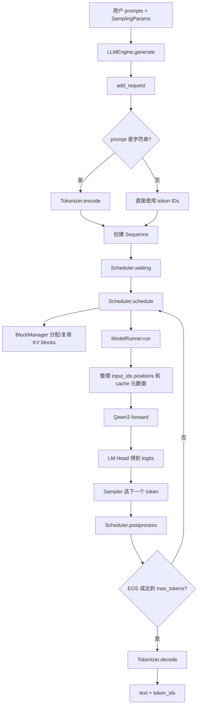
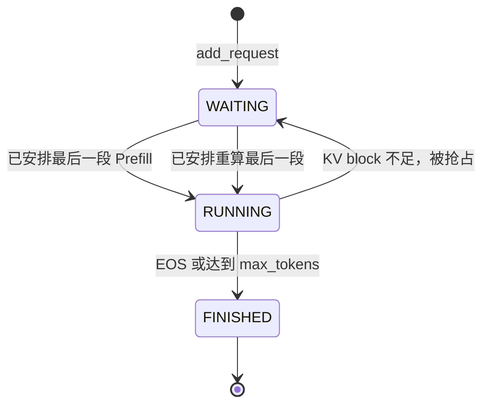
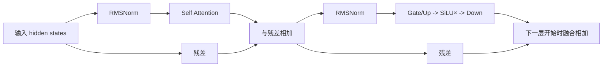

# Nano-vLLM 从 0 到 1：面向零基础的完整源码教程

> 适用代码：本仓库 `nano-vllm 0.2.0`，教程依据当前工作区源码编写。
> 适合读者：会一点点 Python 更好；完全不了解大语言模型、PyTorch、CUDA 或 vLLM 也可以从头读。
> 学习目标：不仅会运行示例，还能说清一次文本生成怎样经过调度器、模型、KV Cache 和采样器，最终变成输出文字。
> 本次修订：2026-10-09。在源码调用链基础上，给全部 Python 代码块补充逐行解释，并增加参数、变量、函数和常用操作查阅。
> 源码基线：修订开始时的提交 `2a8302a`；本次只修改教学文档，不修改推理代码。
> 补充修订：2026-10-10。扩写 16.3 节 RMSNorm，新增 19.9 节 NCCL，并在 20.3 节补充 torch.compile 入门解释。

## 怎样使用这份笔记

这不是只背术语的笔记。阅读一个对象时，请连续回答五个问题：**在哪里定义？在哪里创建？谁持有它？谁读取或修改它？最后返回什么？**

文中的代码分成两种：

- **源码节选**：上方注明仓库文件和类/方法。需要在原文件中结合缩进和上下文阅读，通常不能单独复制运行；标有“省略”的地方不是完整实现。
- **教学示例**：使用假设 token、假设采样结果或简化形状，帮助你手算状态。它不代表真实 tokenizer 编号、模型权重或随机输出。

代码块中的 `#` 行是本教程添加的解释，不一定存在于项目原文件中。注释不会执行：它解释紧接着的代码做什么、名字从哪来、结果到哪里去；其余原语句保持原样。

若遇到一个不认识的参数或变量，先看旁边的注释，再查第 **2.14 节和第 28 章**。参数指函数定义括号里的接收名字，变量指程序运行中绑定的数据，成员属性指 `self.xxx`；这三者可能名字相同，但所属对象和作用范围不同。

文件链接都相对于项目根目录。可以点击链接，也可以在 VS Code 按 `Ctrl + P` 输入文件路径，再按 `Ctrl + F` 搜索文中指定的 `def` 或 `class`。方法名比固定行号更稳定；你增加注释以后仍然能找到对应代码。

如果现在最困惑的是“Sequence 到底被谁调用”，先读第 **8、11、12、14、21** 章，再返回其余章节。第 11 章有从创建到回收的完整源码追踪。

---

## 目录

- [1. 先用一句话认识项目](#1-先用一句话认识项目)
- [2. 阅读前必须知道的基础概念与源码语法](#2-阅读前必须知道的基础概念与源码语法)
- [3. 这个项目能做什么、不能做什么](#3-这个项目能做什么不能做什么)
- [4. 环境要求：为什么不能直接在普通 Windows 或 CPU 上运行](#4-环境要求为什么不能直接在普通-windows-或-cpu-上运行)
- [5. 从零安装与运行](#5-从零安装与运行)
- [6. 第一个例子逐行讲解](#6-第一个例子逐行讲解)
- [7. 项目目录地图](#7-项目目录地图)
- [8. 全局架构：一次 generate 调用经过了什么](#8-全局架构一次-generate-调用经过了什么)
- [9. 两阶段生成：Prefill 与 Decode](#9-两阶段生成prefill-与-decode)
- [10. 配置系统 Config](#10-配置系统-config)
- [11. 请求的最小单位 Sequence](#11-请求的最小单位-sequence)
- [12. 调度器 Scheduler 与连续批处理](#12-调度器-scheduler-与连续批处理)
- [13. Paged KV Cache、BlockManager 与前缀缓存](#13-paged-kv-cacheblockmanager-与前缀缓存)
- [14. ModelRunner：CPU 调度与 GPU 执行的桥梁](#14-modelrunnercpu-调度与-gpu-执行的桥梁)
- [15. Qwen3 模型结构](#15-qwen3-模型结构)
- [16. Attention、RoPE、RMSNorm、SwiGLU](#16-attentionropermsnormswiglu)
- [17. 从隐藏状态到下一个 token：LM Head 与采样](#17-从隐藏状态到下一个-tokenlm-head-与采样)
- [18. 权重加载](#18-权重加载)
- [19. 张量并行 Tensor Parallelism](#19-张量并行-tensor-parallelism)
  - [19.9 NCCL：多张 GPU 怎样交换和合并结果](#199-nccl多张-gpu-怎样交换和合并结果)
- [20. CUDA Graph 与 torch.compile](#20-cuda-graph-与-torchcompile)
- [21. 一次请求的完整时序复盘](#21-一次请求的完整时序复盘)
- [22. Benchmark 怎么读、怎么测](#22-benchmark-怎么读怎么测)
- [23. 推荐的源码阅读和调试路线](#23-推荐的源码阅读和调试路线)
- [24. 常见报错与排查](#24-常见报错与排查)
- [25. 当前实现的边界与容易忽略的行为](#25-当前实现的边界与容易忽略的行为)
- [26. 从简单到进阶的练习](#26-从简单到进阶的练习)
- [27. 术语表与速查表](#27-术语表与速查表)
- [28. 源码参数、变量和函数逐项查阅](#28-源码参数变量和函数逐项查阅)

---

## 1. 先用一句话认识项目

Nano-vLLM 是一个用约一千多行 Python 代码实现的、只做离线文本生成的轻量级 LLM 推理引擎。

它不是从零训练模型，而是：

1. 读取 Hugging Face 格式的 Qwen3 配置、分词器和 `safetensors` 权重；
2. 把许多生成请求动态组成批次；
3. 在 NVIDIA GPU 上执行 Qwen3 前向计算；
4. 用 Paged KV Cache、前缀缓存、FlashAttention、张量并行和 CUDA Graph 加速；
5. 每轮采样一个新 token，循环到遇到 EOS 或达到长度上限；
6. 把 token 解码成文字返回。

这个项目最大的学习价值不是支持很多模型或功能，而是用很少的代码展示了 vLLM 类推理引擎的骨架。

可以先记住下面这个关系：

```text
Transformers 风格模型：重点是“神经网络怎样算”
Nano-vLLM 推理引擎：重点是“怎样高效组织很多次模型计算”
```

---

## 2. 阅读前必须知道的基础概念与源码语法

### 2.1 模型、训练与推理

- **模型**：大量参数组成的数学函数。
- **训练**：用数据调整参数；成本很高，本项目不负责。
- **推理**：加载已经训练好的参数，输入文字并得到输出；本项目只负责推理。

### 2.2 Token

模型不直接阅读字符串，而是阅读整数编号。

```text
"Hello, world" -> tokenizer -> [9707, 11, 1879]（仅为示意）
```

每个整数叫一个 token ID。token 可能是一个字、半个单词、一个完整单词或标点。

### 2.3 Tokenizer

分词器负责两个方向：

```text
encode：文字 -> token IDs
decode：token IDs -> 文字
```

分词器和模型必须配套。不能随意拿另一个模型的 tokenizer 来编码。

### 2.4 自回归生成

Qwen3 这类 Causal Language Model 一次只决定“下一个 token”。要生成多个 token，必须循环：

```text
输入：今天天气
第 1 轮预测：很
第 2 轮输入相当于：今天天气很       -> 预测：好
第 3 轮输入相当于：今天天气很好     -> 预测：。
```

这就是自回归：新输出会成为下一轮的输入。

### 2.5 Tensor（张量）

Tensor 可以先理解为“多维数组”。常见形状：

```text
[token 数, hidden_size]
[token 数, attention head 数, head_dim]
[batch_size, vocab_size]
```

神经网络的绝大部分工作就是矩阵乘法和逐元素运算。

### 2.6 Hidden state 与 Logits

- **hidden state**：模型内部对每个 token 的向量表示。
- **logits**：词表中每个候选 token 的未归一化分数。
- **probability**：对 logits 做 softmax 后得到的概率。

假设词表只有三个 token：

```text
logits       = [2.0, 1.0, 0.1]
softmax 后   = [0.659, 0.242, 0.099]
```

采样器会根据这些概率选出一个 token。

### 2.7 Attention

Attention 让当前位置根据上下文中其他 token 的信息更新自己。简化公式为：

```text
Attention(Q, K, V) = softmax(QKᵀ / √d) V
```

- Q（Query）：当前位置想找什么；
- K（Key）：每个历史位置提供什么索引；
- V（Value）：每个历史位置真正携带的信息。

### 2.8 KV Cache

生成第 100 个 token 时，前 99 个 token 的 K、V 已经算过。把它们保存起来，下轮只算新 token 的 K、V，就叫 KV Cache。

没有 KV Cache 时，生成越长，重复计算越多；有 KV Cache 后，Decode 每轮通常只向模型送入一个新 token。

### 2.9 GPU、CUDA、Triton 与 FlashAttention

- **GPU**：擅长大规模并行计算的硬件；
- **CUDA**：NVIDIA GPU 的计算平台；
- **Triton**：用接近 Python 的方式编写 GPU kernel；
- **FlashAttention**：高效实现 Attention 的库。

本项目直接依赖这几项，不提供 CPU 后备路径。

### 2.10 EOS

EOS 是 End Of Sequence，即“文本结束”特殊 token。默认情况下，模型生成 EOS 后请求完成；设置 `ignore_eos=True` 可以忽略它，强制生成到 `max_tokens`。

### 2.11 Python 源码语法速成

如果你还没有系统学过 Python，先掌握下面这些写法就足以继续阅读。它们不是 nano-vllm 的特殊语法。

导入：

```python
# 从nanovllm.engine.llm_engine导入名字LLMEngine；定义公开生成接口和主循环LLMEngine。导入名字不等于构造对象
# 。
from nanovllm.engine.llm_engine import LLMEngine
```

表示从某个模块中取出 `LLMEngine` 这个名字。

类与继承：

```python
# 定义类LLM，继承LLMEngine的行为；这里只声明对象结构，执行类名(...)才创建实例。
class LLM(LLMEngine):
    # 空语句占位；LLM 在这里不重写父类行为，因此沿用 LLMEngine 的构造函数和方法。
    pass
```

表示 `LLM` 继承 `LLMEngine` 的全部行为。`pass` 表示这里不额外添加内容，所以本项目的 `LLM` 本质上就是一个更简短、对外更友好的类名。

构造函数与 `self`：

```python
# 定义类Sequence；这里只声明对象结构，执行类名(...)才创建实例。
class Sequence:
    # 定义构造函数：self 是正在创建的实例，后续参数由类名(...)调用提供；构造函数初始化字段，通常不返回业务结果。
    def __init__(self, token_ids):
        # 基础语法简化例子：保存传入列表引用；真实项目构造函数使用 copy(token_ids)，两者不能混为一谈。
        self.token_ids = token_ids
```

调用 `Sequence(ids)` 时，Python 自动运行 `__init__`。`self` 就是正在创建的对象；`self.token_ids` 是该对象自己的字段。

类型标注：

```python
# 类型标注示意：prompt 可以是字符串或整数列表；竖线表示联合类型，不是按位运算，也不自动校验数据。
prompt: str | list[int]
```

表示 `prompt` 可以是字符串，也可以是整数列表。类型标注主要帮助阅读器和检查工具，Python 运行时通常不会自动强制检查。

列表推导式：

```python
# seqs 是本轮请求列表；逐个读取 seq.temperature，得到与请求顺序相同的 Python 温度列表。
temperatures = [seq.temperature for seq in seqs]
```

表示遍历 `seqs`，取出每个对象的温度，组成新列表。

切片：

```python
# start 是起始下标，end 是停止下标且不包含它；结果是原 token 列表的一段，不会修改原列表。
token_ids[start:end]
```

取从 `start` 开始、到 `end` 之前结束的部分，包含 start，不包含 end。

字典：

```python
# outputs 在这里是结果字典；用请求编号 seq_id 作为键，保存该请求完整的 completion token 列表。
outputs[seq_id] = token_ids
```

把 `seq_id` 当作 key 保存结果，之后可按 ID 找回。

特殊方法（dunder method）：

```python
# 特殊方法名字，Python 执行 len(seq) 时自动调用，项目返回 num_tokens。
__len__       # len(seq) 时调用
# 特殊方法名字，seq[i] 或 seq[start:end] 时自动调用，项目访问 token_ids。
__getitem__   # seq[i] 或 seq[a:b] 时调用
# pickle 保存对象时使用的状态导出方法，不是每轮推理都会手动调用。
__getstate__  # pickle 序列化时调用
# pickle 恢复对象时使用的方法，与 __getstate__ 返回状态格式配套。
__setstate__  # pickle 反序列化时调用
```

下面详细展开装饰器、dataclass、上下文管理器与断言。普通 Python 示例可以分别保存成小脚本运行；标注为“项目源码”的片段需要结合所在类和模块阅读。

#### 2.11.1 装饰器：把函数或类交给另一个对象处理

先理解一个前提：Python 中的函数也是对象，可以保存到变量中，也可以作为参数传给其他函数。

```python
# 定义问候函数：name 是接收的名字字符串，返回一份格式化问候字符串。
def say_hello(name):
    # 执行返回表达式f"你好，{name}！"并结束当前函数，将结果交给调用者；return不同于print。
    return f"你好，{name}！"

# 不带括号，保存函数对象到另一个名字；此行不执行 say_hello，也不会立即生成问候。
greet = say_hello          # 保存函数对象，此时没有执行函数
# 将括号内表达式的当前结果显示到终端；多个值默认用空格分隔，print本身不修改请求状态，返回None。
print(greet("小明"))      # 调用函数，输出：你好，小明！
```

`say_hello` 是函数对象，`say_hello("小明")` 才是执行函数得到的返回值。后面阅读 `return wrapper` 时，这个区别特别重要。

**① `@` 写法实际做了什么？**

假设 `decorate` 是一个接收函数并返回处理后对象的装饰器：

```python
# 把原函数交给名为decorate的装饰器，返回的对象再绑定到原函数名。
@decorate
# 定义无参数教学函数，演示装饰器如何处理函数对象；省略号表示暂不提供具体业务逻辑。
def work():
    # 省略业务实现或参数的教学占位Ellipsis；不是已实现的完整功能，不可据此直接运行实际推理。
    ...
```

从理解机制的角度，它相当于：

```python
# 定义无参数教学函数，演示装饰器如何处理函数对象；省略号表示暂不提供具体业务逻辑。
def work():
    # 省略业务实现或参数的教学占位Ellipsis；不是已实现的完整功能，不可据此直接运行实际推理。
    ...

# 定义后把原函数交给装饰器，返回的包装对象重新绑定为 work；等价于上方 @decorate 的机制。
work = decorate(work)
```

也就是：创建原函数，把它交给 `decorate`，再把处理后的对象绑定到原来的名字 `work`。常见装饰器返回一个包装函数，但也可以返回其他对象；后面介绍的 `@property` 就会生成属性描述对象。

因此装饰器不是给函数加一条注释，而是确实会影响程序行为。[Python 官方函数定义说明](https://docs.python.org/3/reference/compound_stmts.html#function-definitions)

**② 自己写一个装饰器，观察执行顺序**

下面的例子不依赖 PyTorch，可以直接运行：

```python
# 从functools导入名字wraps；提供wraps等函数工具，帮助装饰器保留原函数信息。导入名字不等于构造对象。
from functools import wraps

# 定义装饰器：func 是被装饰的原函数对象，返回 wrapper 包装函数；装饰发生在函数定义时。
def trace(func):
    # 将括号内表达式的当前结果显示到终端；多个值默认用空格分隔，print本身不修改请求状态，返回None。
    print("正在装饰：", func.__name__)

    # 复制原func的名称/文档等元数据到包装函数，方便调试；不负责调用原函数。
    @wraps(func)
    # 定义内部包装函数：*args收集位置参数tuple，**kwargs收集关键字dict；闭包保存外层原函数及配置。
    def wrapper(*args, **kwargs):
        # 将括号内表达式的当前结果显示到终端；多个值默认用空格分隔，print本身不修改请求状态，返回None。
        print("进入函数：", func.__name__)
        # 进入可能抛异常的操作块；异常时寻找except，退出时仍执行对应finally。
        try:
            # 调用保存的原函数并把业务返回值传回外部，位置/关键字参数原样展开。
            return func(*args, **kwargs)
        # 无论try正常返回还是抛异常，离开时都执行此清理块；不是只在失败时执行。
        finally:
            # 将括号内表达式的当前结果显示到终端；多个值默认用空格分隔，print本身不修改请求状态，返回None。
            print("离开函数：", func.__name__)

    # 返回包装函数对象，不执行它；之后通过被装饰的名字调用才会进入wrapper。
    return wrapper

# 将下方原函数交给trace装饰，之后名字指向返回的wrapper；定义时和调用时行为不同。
@trace
# 定义教学加法函数，a/b是输入数，返回相加结果；外层@trace会增加调用日志。
def add(a, b):
    # 将括号内表达式的当前结果显示到终端；多个值默认用空格分隔，print本身不修改请求状态，返回None。
    print("原函数正在计算")
    # 计算两个数的和并返回；离开with/finally时仍会先执行正常退出清理。
    return a + b

# 将括号内表达式的当前结果显示到终端；多个值默认用空格分隔，print本身不修改请求状态，返回None。
print("开始调用")
# 将括号内表达式的当前结果显示到终端；多个值默认用空格分隔，print本身不修改请求状态，返回None。
print("结果：", add(2, b=3))
```

输出：

```text
正在装饰： add
开始调用
进入函数： add
原函数正在计算
离开函数： add
结果： 5
```

逐步理解：

1. 执行到 `def add` 的定义时，就调用 `trace(add)`，所以“正在装饰”先打印；这里还没有计算 `2 + 3`。
2. `trace` 返回 `wrapper`，之后名字 `add` 指向包装函数。
3. 调用 `add(2, b=3)`，实际先进入 `wrapper`。
4. `wrapper` 通过保存的 `func` 调用原来的 `add`，拿到结果 `5`。
5. `finally` 在退出 `try` 时执行，所以先打印“离开函数”，再把结果返回给外层 `print`。

这里的几个新写法：

- `*args`：收集位置参数，例如调用中的 `2`；`args` 是一个 tuple（元组）。
- `**kwargs`：收集关键字参数，例如 `b=3`；`kwargs` 是一个 dict（字典）。
- `func(*args, **kwargs)`：把收集到的参数展开，再传给原函数。
- 内层 `wrapper` 能继续访问外层的 `func`，这种保留外层变量的机制叫“闭包”。
- `return wrapper` 返回函数对象；写成 `return wrapper()` 就会当场调用它，含义完全不同。
- `@wraps(func)` 保留原函数的名称、文档字符串等信息，让调试时仍能知道它是 `add`。[functools.wraps 官方说明](https://docs.python.org/3/library/functools.html#functools.wraps)

这个装饰器可以反复用于其他函数。日志、计时、结果缓存和访问控制都可以用类似结构实现。

**③ 为什么有些装饰器带括号，有些不带？**

```python
# 将下方原函数交给trace装饰，之后名字指向返回的wrapper；定义时和调用时行为不同。
@trace                  # 直接把原函数交给 trace
# 无参数教学函数，直接使用@trace装饰；名字不是项目中的引擎方法。
def first():
    # 省略业务实现或参数的教学占位Ellipsis；不是已实现的完整功能，不可据此直接运行实际推理。
    ...

# 先用次数3创建装饰器，再处理下方函数；真正调用函数时才重复执行原业务。
@repeat(3)              # 先调用 repeat(3)，取得装饰器，再装饰原函数
# 无参数教学函数，演示带参数装饰器；repeat(3)先生成真正的装饰器。
def second():
    # 省略业务实现或参数的教学占位Ellipsis；不是已实现的完整功能，不可据此直接运行实际推理。
    ...
```

带参数的完整例子：

```python
# 从functools导入名字wraps；提供wraps等函数工具，帮助装饰器保留原函数信息。导入名字不等于构造对象。
from functools import wraps

# 定义装饰器工厂：times是重复次数，返回decorate，后者再接收真正的函数。
def repeat(times):
    # 定义实际装饰器：func是待处理函数，内部wrapper使用外层的times/func；返回包装函数。
    def decorate(func):
        # 复制原func的名称/文档等元数据到包装函数，方便调试；不负责调用原函数。
        @wraps(func)
        # 定义内部包装函数：*args收集位置参数tuple，**kwargs收集关键字dict；闭包保存外层原函数及配置。
        def wrapper(*args, **kwargs):
            # times 是重复次数；range产生times次循环，_ 接收循环编号但示例不使用它。
            for _ in range(times):
                # func 是保存的原函数；*展开位置参数tuple，**展开关键字dict，包装器将参数原样转交。
                func(*args, **kwargs)
        # 返回包装函数对象，不执行它；之后通过被装饰的名字调用才会进入wrapper。
        return wrapper
    # 返回装饰器对象，此时尚未接收被装饰函数；repeat(times)先产生这一对象。
    return decorate

# 先用次数3创建装饰器，再处理下方函数；真正调用函数时才重复执行原业务。
@repeat(3)
# 定义问候教学函数：name是名字；当前示例装饰器重复调用它，但不汇总返回值。
def greet(name):
    # 将括号内表达式的当前结果显示到终端；多个值默认用空格分隔，print本身不修改请求状态，返回None。
    print(f"你好，{name}")

# 调用被装饰后的函数，"小明" 作为 name；repeat(3) 会执行原函数三次。
greet("小明")            # 打印三次：你好，小明
```

可以分成三层看：`repeat(3)` 保存次数并返回 `decorate`；`decorate(greet)` 保存原函数并返回 `wrapper`；`greet("小明")` 才执行包装后的逻辑。

`@repeat(3)` 在这个例子中相当于 `greet = repeat(3)(greet)`。这个包装函数只重复执行，不汇总返回值，因此 `greet(...)` 最后返回 `None`。

**④ 多个装饰器叠加时，顺序是什么？**

下面的 `outer` 和 `inner` 是用于解释顺序的示意名字：

```python
# 装饰器示意：位于外层，定义时最终得到outer(inner(work))；这里不是项目实际函数名。
@outer
# 装饰器示意：先处理原函数，然后结果交给外层outer；顺序可能影响运行行为。
@inner
# 定义无参数教学函数，演示装饰器如何处理函数对象；省略号表示暂不提供具体业务逻辑。
def work():
    # 省略业务实现或参数的教学占位Ellipsis；不是已实现的完整功能，不可据此直接运行实际推理。
    ...
```

应用装饰器的顺序是从靠近函数的一层开始：`work = outer(inner(work))`。如果两层都是前后加逻辑的包装函数，调用通常沿着“外层进入 → 内层进入 → 原函数 → 内层退出 → 外层退出”的顺序执行。换顺序可能改变效果，所以不能随意调整源码中 `@` 的位置。

**⑤ 在 Nano-vLLM 中怎样读这些装饰器？**

| 写法 | 项目位置 | 阅读时可以理解为 |
|---|---|---|
| `@property` | `engine/sequence.py` | 把计算结果当作属性读取 |
| `@classmethod` | `engine/block_manager.py` | 调用时自动提供当前类 `cls` |
| `@dataclass(slots=True)` | `sampling_params.py`、`config.py` | 自动生成保存配置字段的常用方法 |
| `@lru_cache(1)` | `layers/rotary_embedding.py` | 最多保留一组参数对应的返回结果 |
| `@torch.inference_mode()` | `engine/model_runner.py` | 调用时进入推理模式，退出时恢复之前的模式 |
| `@torch.compile` | Norm、RoPE、激活、Sampler | 为函数建立编译执行路径，可能在调用时触发编译 |
| `@triton.jit` | `layers/attention.py` | 把函数作为 Triton GPU kernel 定义，按 Triton 方式启动 |

它们都有 `@`，但具体行为由装饰器实现决定。不要理解成“所有装饰器都会加速”。

`@property` 的独立例子：

```python
# 定义类Task；这里只声明对象结构，执行类名(...)才创建实例。
class Task:
    # 定义构造函数：self 是正在创建的实例，后续参数由类名(...)调用提供；构造函数初始化字段，通常不返回业务结果。
    def __init__(self):
        # Task 教学对象初始未完成；前导下划线是约定为内部字段，不是 Python 自动限制访问。
        self._finished = False

    # 把下方方法变成属性getter，用obj.name读取就执行；通常不写obj.name()，不自动缓存结果。
    @property
    # 定义property的getter：self是当前Task示例，读取内部_finished字段并返回布尔值。
    def is_finished(self):
        # 返回Task教学对象当前布尔完成标志，property每次读取都会重新执行此行。
        return self._finished

# 创建独立教学实例，进入 Task.__init__；不是 nano-vllm 的真实请求类。
task = Task()
# 将括号内表达式的当前结果显示到终端；多个值默认用空格分隔，print本身不修改请求状态，返回None。
print(task.is_finished)       # False，访问时执行属性的 getter
# 修改底层普通字段，下次读取 is_finished property 就会重新得到 True。
task._finished = True
# 将括号内表达式的当前结果显示到终端；多个值默认用空格分隔，print本身不修改请求状态，返回None。
print(task.is_finished)       # True，再次读取时重新计算
```

有了 `@property`，这里应写 `task.is_finished`，而不是 `task.is_finished()`。后者会试图把返回的布尔值当作函数调用。

项目中的 `seq.num_completion_tokens` 同样是计算属性：它每次读取 `num_tokens - num_prompt_tokens`，不是另存一份可能过期的计数。普通 `property` 不会自动缓存结果；这里也没有 setter，所以不能直接给 `seq.num_completion_tokens` 赋值。

`@classmethod` 方法的第一个参数通常叫 `cls`，表示当前类；普通实例方法的 `self` 表示当前对象。例如项目用 `BlockManager.compute_hash(...)` 调用类方法，不必先创建 BlockManager 实例。

`@lru_cache(1)` 则不同：相同参数再次调用时可以直接返回之前保存的结果。这里最多保存一组参数组合，而不是“只能调用一次”；参数变化可能淘汰旧结果。它缓存的是返回对象的引用，所以共享可变对象时要注意修改会影响其他使用者。

`@torch.inference_mode()` 关闭梯度记录，并减少部分额外追踪开销，适合此处的推理计算。它不会自动加载权重，也不会自动把模型切换成 `model.eval()`。推理模式产生的 Tensor 后续参与需要梯度的计算还有限制。[PyTorch inference_mode 官方说明](https://docs.pytorch.org/docs/stable/generated/torch.autograd.grad_mode.inference_mode.html)

#### 2.11.2 dataclass：为什么配置类只有字段，也能创建对象？

`dataclass` 是“装饰类”的例子。下面是项目 `SamplingParams` 的字段结构：

```python
# 从dataclasses导入名字dataclass；提供dataclass/fields，自动构造配置对象并查询声明字段。导入名字不等于构造对象。
from dataclasses import dataclass

# 装饰下方配置类并生成构造等方法；slots=True限制未声明字段，不会冻结已声明字段。
@dataclass(slots=True)
# 定义类SamplingParams；这里只声明对象结构，执行类名(...)才创建实例。
class SamplingParams:
    # dataclass 字段：温度期望为浮点，未传参时默认1.0；类型标注本身不做数值校验。
    temperature: float = 1.0
    # 字段类型为整数，默认最多新增64个token；不包含输入prompt。
    max_tokens: int = 64
    # 布尔字段默认不忽略结束符；False和True不是文字字符串。
    ignore_eos: bool = False

# 用关键字设置温度与新输出上限，ignore_eos 使用默认False；生成构造函数会调用 __post_init__。
params = SamplingParams(temperature=0.6, max_tokens=256)
# 将括号内表达式的当前结果显示到终端；多个值默认用空格分隔，print本身不修改请求状态，返回None。
print(params.temperature)     # 0.6
# 将括号内表达式的当前结果显示到终端；多个值默认用空格分隔，print本身不修改请求状态，返回None。
print(params.ignore_eos)      # False，使用默认值
# 将括号内表达式的当前结果显示到终端；多个值默认用空格分隔，print本身不修改请求状态，返回None。
print(params)                # 显示类名和字段值，方便调试
```

你没有手写 `__init__`，但 dataclass 会根据字段生成构造函数，并默认生成 `__repr__` 和 `__eq__` 等方法。所以这些字段可以被构造、打印和比较。

`slots=True` 减少实例保存字段的开销，并在这个简单类中阻止任意新增属性，例如 `params.unknown = 123` 会报 `AttributeError`。它不意味着字段不可修改；`params.max_tokens = 128` 仍然可以执行。

项目还定义了 `__post_init__`。dataclass 生成的构造函数会在字段赋值后调用它，因此可以检查温度是否合法。`temperature: float` 只是类型标注，dataclass 不会因此自动检查所有输入类型或数值范围。

#### 2.11.3 上下文管理器：进入一段操作，再可靠地退出

“上下文”可以理解为执行一段代码期间临时使用的资源或状态。例如打开文件后进行读取，或暂时进入 GPU Graph 捕获模式。

上下文管理器负责定义进入和退出行为；`with` 是使用它的语法。

**① 从读取文件理解 `with`**

在项目目录运行：

```python
# 文件名相对当前工作目录，r表示只读，encoding指定文字解码；f是进入上下文后取得的文件对象。
with open("README.md", "r", encoding="utf-8") as f:
    # 读取一行文字保存为str，通常包含末尾换行；不是读取整个文件。
    first_line = f.readline()
    # 将括号内表达式的当前结果显示到终端；多个值默认用空格分隔，print本身不修改请求状态，返回None。
    print(first_line.strip())
    # 将括号内表达式的当前结果显示到终端；多个值默认用空格分隔，print本身不修改请求状态，返回None。
    print(f.closed)           # False：文件还在使用

# 将括号内表达式的当前结果显示到终端；多个值默认用空格分隔，print本身不修改请求状态，返回None。
print(f.closed)               # True：离开 with 后文件已关闭
```

执行顺序：

1. `open(...)` 打开文件并取得文件对象；
2. 进入文件对象的上下文，把进入结果绑定到 `f`；
3. 执行缩进块中的读取逻辑；
4. 离开缩进块时，文件上下文管理器关闭文件。

`as f` 得到的是上下文管理器 `__enter__()` 的返回值，未必就是管理器对象本身；文件对象只是通常返回自己。

`with` 不会创建一个新的变量作用域，所以例子中块外仍然可以访问 `f`，只是文件已经关闭，不能继续正常读取。

**② 为什么不能只在最后写 `close()`？**

普通写法：

```python
# 手动打开文件取得对象，此写法需要自行确保关闭；发生异常时后面的close可能没机会执行。
f = open("README.md", "r", encoding="utf-8")
# 从当前位置读取剩余文件内容，结果是字符串content；大小取决于文件，不是按行列表。
content = f.read()
# 关闭文件资源；已读出的content字符串仍然存在，不能继续用已关闭对象读取。
f.close()
```

如果 `f.read()` 抛出异常，最后一行可能来不及执行。用 `try/finally` 可以明确安排清理：

```python
# 手动打开文件取得对象，此写法需要自行确保关闭；发生异常时后面的close可能没机会执行。
f = open("README.md", "r", encoding="utf-8")
# 进入可能抛异常的操作块；异常时寻找except，退出时仍执行对应finally。
try:
    # 从当前位置读取剩余文件内容，结果是字符串content；大小取决于文件，不是按行列表。
    content = f.read()
# 无论try正常返回还是抛异常，离开时都执行此清理块；不是只在失败时执行。
finally:
    # 关闭文件资源；已读出的content字符串仍然存在，不能继续用已关闭对象读取。
    f.close()
```

对文件读取来说，`with` 把这种配对操作封装起来，避免到处重复写清理逻辑。一般的上下文管理器还可以处理异常，不能把所有 `with` 都简单等同于文件的 `close()`。

**③ `__enter__` 与 `__exit__` 分别做什么？**

可以自己写一个只打印过程的管理器：

```python
# 定义类StudyContext；这里只声明对象结构，执行类名(...)才创建实例。
class StudyContext:
    # 定义进入上下文的方法：self是StudyContext实例；返回值将交给with语句的as变量。
    def __enter__(self):
        # 将括号内表达式的当前结果显示到终端；多个值默认用空格分隔，print本身不修改请求状态，返回None。
        print("进入上下文")
        # 把此字符串交给with的as变量；返回值不一定是管理器self。
        return "提供给代码块的值"

    # 定义退出方法：exc_type是异常类型，exc_value是异常对象，traceback是调用链；返回假值让异常继续传播。
    def __exit__(self, exc_type, exc_value, traceback):
        # 将括号内表达式的当前结果显示到终端；多个值默认用空格分隔，print本身不修改请求状态，返回None。
        print("退出上下文")
        # __exit__收到的异常类型不为None，表示with块内异常退出；正常退出时三个异常参数都是None。
        if exc_type is not None:
            # 将括号内表达式的当前结果显示到终端；多个值默认用空格分隔，print本身不修改请求状态，返回None。
            print("发现异常：", exc_type.__name__)
        # 告诉上下文协议不要吞掉异常，异常继续向外传播；正常退出时同样结束此方法。
        return False         # 不吞掉异常，让它继续向外传播

# 创建管理器并执行 __enter__；其返回值绑定到value，不保证value就是管理器自身。
with StudyContext() as value:
    # 将括号内表达式的当前结果显示到终端；多个值默认用空格分隔，print本身不修改请求状态，返回None。
    print(value)
    # 将括号内表达式的当前结果显示到终端；多个值默认用空格分隔，print本身不修改请求状态，返回None。
    print("执行代码块")
```

输出：

```text
进入上下文
提供给代码块的值
执行代码块
退出上下文
```

`__exit__` 的三个参数用于描述块内异常：正常退出时都是 `None`；异常退出时分别是异常类型、异常对象和 traceback（错误发生的调用链信息）。

再运行下面的异常示例，沿用上面定义的 `StudyContext`：

```python
# 进入可能抛异常的操作块；异常时寻找except，退出时仍执行对应finally。
try:
    # 创建管理器并执行 __enter__；其返回值绑定到value，不保证value就是管理器自身。
    with StudyContext() as value:
        # 将括号内表达式的当前结果显示到终端；多个值默认用空格分隔，print本身不修改请求状态，返回None。
        print("准备触发异常")
        # 主动抛出带说明的异常，中断当前块；先执行with退出协议，再寻找外层except。
        raise ValueError("示例错误")
# 捕获指定类型异常；as后的error是异常对象，不是错误文字常量，处理后可继续执行后续语句。
except ValueError as error:
    # 将括号内表达式的当前结果显示到终端；多个值默认用空格分隔，print本身不修改请求状态，返回None。
    print("外层捕获：", error)
```

输出：

```text
进入上下文
准备触发异常
退出上下文
发现异常： ValueError
外层捕获： 示例错误
```

异常发生后先退出上下文，再由外层 `except` 处理。`__exit__` 返回假值（例如 `False` 或 `None`）时，异常继续传播；如果返回真值，块内异常会被抑制，执行会继续到 `with` 后面。[Python 官方 with 说明](https://docs.python.org/3/reference/compound_stmts.html#the-with-statement)

这里要记住边界：正常返回、`return`、`break` 或块内异常都会触发正常的退出协议；前提是 `__enter__` 已成功。如果进入阶段就失败，Python 不会再自动调用这个管理器的 `__exit__`。强制终止进程时也不能依赖 Python 清理逻辑完成。

**④ 在 Nano-vLLM 中对应哪些操作？**

项目源码 `utils/loader.py`：

```python
# file 是权重文件路径，"pt" 表示 PyTorch Tensor，"cpu" 表示先读到 CPU；f 是提供 keys/get_tensor
# 的读取对象。
with safe_open(file, "pt", "cpu") as f:
    # keys 返回文件中参数名字；weight_name 是如 model.layers.0.self_attn.q_proj.weight 的字符串，
    # 不是 Tensor。
    for weight_name in f.keys():
        # 按完整参数名字读取训练权重 Tensor，存为 loaded_weight；之后还需复制到实际模型参数。
        loaded_weight = f.get_tensor(weight_name)
```

`safe_open` 提供读取 Safetensors 文件的上下文。代码块通过 `f` 列出权重名称、读取 Tensor；退出时由库完成相应资源的退出处理。`with` 不表示 Tensor 自动复制到 GPU，也不表示块外所有读出的 Tensor 都被删除；权重如何使用仍由 loader 决定。

项目源码 `ModelRunner.capture_cudagraph` 中还有：

```python
# 进入CUDA Graph捕获环境；graph接收记录，graph_pool用于复用图内存池，首次可以为None。
with torch.cuda.graph(graph, self.graph_pool):
    # 用固定输入/位置缓冲区执行Qwen3，输出复制到固定hidden-state缓冲区；位于with内时被捕获，外部时用于预热。
    outputs[:bs] = self.model(input_ids[:bs], positions[:bs])
```

这次进入的是 CUDA Graph 捕获环境。块内的 CUDA 工作被记录到 Graph，退出时结束捕获，之后通过 `graph.replay()` 重放。`with` 管理的可以是执行状态，不一定是文件。

`torch.inference_mode()` 也既能写成装饰器，也能写成上下文管理器：

```python
# 示意：model、input_ids、positions 需先创建
# 只在此缩进块启用推理模式，关闭梯度记录并减少追踪开销；不自动加载模型或切换eval。
with torch.inference_mode():
    # 示意调用：model及两个输入需先创建，返回隐藏状态；不是一个可独立运行的完整脚本。
    hidden_states = model(input_ids, positions)
```

装饰器形式作用于整个函数调用，上下文形式作用于缩进块；它们控制推理模式的目的相同。

还要与本项目的 `utils/context.py` 区分：里面的 `Context` 是保存 Attention 元数据的 dataclass，靠 `set_context()` 和 `reset_context()` 更新。名字含有 Context 不等于实现了上下文管理器，也不能因此直接写 `with Context():`。

#### 2.11.4 断言：检查“这里应当成立的条件”

**① 基本语法与执行结果**

```python
# 语法示意：普通模式下条件为假就抛AssertionError；“条件”不是项目中已定义的变量。
assert 条件
# 逗号后是失败说明，不是第二个检查条件；-O优化模式会移除assert。
assert 条件, "失败时的说明"
```

正常 Python 运行模式下，条件为真就继续执行，条件为假就抛出 `AssertionError`：

```python
# 教学普通变量，不属于某个SamplingParams实例；用它演示数值检查。
temperature = 0.6
# 1e-10是10的负10次方；条件失败会抛异常，不会自动调整temperature。
assert temperature > 1e-10, "temperature 必须大于 1e-10"
# 将括号内表达式的当前结果显示到终端；多个值默认用空格分隔，print本身不修改请求状态，返回None。
print("检查通过")             # 会执行
```

换成 `temperature = 0.0` 后，会在断言位置抛出异常，后面的 `print` 不会执行，除非外层代码捕获了异常。

从理解普通模式行为的角度，断言类似：

```python
# 普通条件分支写法，not反转布尔结果；不像assert，会在优化模式下仍然执行。
if not (temperature > 1e-10):
    # 主动创建断言异常，与普通模式assert失败相似，但这行不会因为-O自动消失。
    raise AssertionError("temperature 必须大于 1e-10")
```

它不是帮助程序自动纠错，也不会把 `0.0` 调整为一个合法温度。

**② 结合项目理解它在检查什么**

| 项目断言 | 条件成立时的意义 | 不满足时应检查 |
|---|---|---|
| `assert os.path.isdir(self.model)` | 模型路径是现有目录 | 路径拼写、目录是否下载完成 |
| `assert self.kvcache_block_size % 256 == 0` | KV block size 是 256 的倍数 | backend 限制与 block 配置 |
| `assert 1 <= self.tensor_parallel_size <= 8` | TP 数量在实现允许范围内 | GPU 数量与 TP 设置 |
| `assert self.temperature > 1e-10` | 当前采样实现允许这个温度 | 本项目当前没有 greedy 分支 |
| `assert 0 <= i < self.num_blocks` | `Sequence.block(i)` 的逻辑块编号有效 | 调用者是否给错块索引 |
| `assert block.ref_count == 0` | 待分配/回收的 block 没有活跃引用 | 引用计数和共享 block 生命周期 |

这里既有配置检查，也有“不变量”检查。不变量指算法过程中应始终保持的关系，例如正在被其他请求引用的 KV block 不能被重置给新请求。理解断言经常能直接看出作者对代码的假设。

**③ 断言和异常处理有什么关系？**

`assert` 是产生异常的一种方式；`raise` 可以主动抛出指定异常；`try/except` 则负责在异常发生后处理它：

```python
# value是调用者输入的数，先检查为正，再原样返回；这个教学函数用assert展示失败。
def require_positive(value):
    # require_positive函数检查传入value为正；失败会进入外层捕获逻辑。
    assert value > 0, "value 应当为正数"
    # 通过校验后将原value交给调用者，并结束当前函数。
    return value

# 进入可能抛异常的操作块；异常时寻找except，退出时仍执行对应finally。
try:
    # 传入非法示例值0，故意触发AssertionError，让你观察异常传播。
    require_positive(0)
# 捕获指定类型异常；as后的error是异常对象，不是错误文字常量，处理后可继续执行后续语句。
except AssertionError as error:
    # 将括号内表达式的当前结果显示到终端；多个值默认用空格分隔，print本身不修改请求状态，返回None。
    print("断言失败：", error)

# 将括号内表达式的当前结果显示到终端；多个值默认用空格分隔，print本身不修改请求状态，返回None。
print("异常已被处理，继续执行")
```

输出：

```text
断言失败： value 应当为正数
异常已被处理，继续执行
```

如果没有对应 `except`，异常会继续向调用者传播；传播到程序顶层仍未处理时，脚本通常以错误退出，并显示 traceback。

在真实 KV Cache 错误中，不能只捕获异常然后继续跑，必须先确认状态能否恢复。例如 ref_count 错误可能说明 block 管理已经不一致。

**④ 为什么用户输入校验更适合 `if + raise`？**

Python 可以以优化模式运行：

```bash
python -O your_script.py
```

这时普通 Python `assert` 会被移除，条件也不再求值；设置相应的 `PYTHONOPTIMIZE` 环境变量也会影响断言。因此关键输入校验不应只依赖 `assert`。[Python 官方 assert 说明](https://docs.python.org/3/reference/simple_stmts.html#the-assert-statement)

例如用户传入非法温度，应当明确检查：

```python
# temperature是待校验温度，非法时抛ValueError，合法时返回原数值；使用普通if而不是可被-O移除的assert。
def validate_temperature(temperature):
    # 用普通分支检查不允许的温度，检查逻辑在优化模式仍保留。
    if temperature <= 1e-10:
        # 将非法参数明确报告为ValueError；调用者可捕获并给用户反馈。
        raise ValueError("temperature 必须大于 1e-10")
    # 通过校验后返回原温度，不调整输入或生成随机数。
    return temperature
```

这只是改进方式示例，当前项目源码仍然使用断言。可以按用途理解：内部算法不变量常用 `assert`；用户输入、文件路径、权限等必须执行的检查用普通条件判断和明确异常更可靠。

不要把必要操作藏在断言里，例如：

```python
# 反例：把有副作用的分配动作藏在assert里，-O会连分配函数调用一起删除。
assert allocate_block()       # 反例：-O 模式下连分配操作都不执行
```

需要执行的操作应该独立完成，再判断结果。

**⑤ 一个容易写错的形式**

```python
# 反例：括号和逗号构成非空tuple，tuple本身为真，不能正确检查condition。
assert (condition, "说明")    # 错误：检查的是非空 tuple
# 正确assert形式，真正检查condition，失败时附带说明字符串。
assert condition, "说明"      # 正确：检查 condition
```

非空 tuple 即使包含 `False`，整体仍为真。第一种写法不能达到预期检查效果，Python 通常还会给出警告。若条件复杂，可以只给条件加括号：`assert (a > 0 and b > 0), "说明"`。

#### 2.11.5 把三种概念一起放进执行流程

| 概念 | 典型写法 | 在执行流程中的位置 |
|---|---|---|
| 装饰器 | `@trace`、`@property` | 定义时处理函数/类；之后调用或访问使用处理后的对象 |
| 上下文管理器 | `with manager as value:` | 进入块前准备，离开块时清理或恢复状态 |
| 断言 | `assert condition, message` | 在当前执行点检查假设，失败时抛异常 |

沿用上面已定义的 `trace` 和 `StudyContext`，可以把它们组合起来：

```python
# 将下方原函数交给trace装饰，之后名字指向返回的wrapper；定义时和调用时行为不同。
@trace
# a、b是加法输入；函数演示装饰器、with和assert配合，非负校验后返回和。
def checked_add(a, b):
    # 此处不需要__enter__的返回值，省略as；依然会进入并在退出时执行管理器协议。
    with StudyContext():
        # 两个输入都必须非负；and要求两条件都成立，失败仍会触发with退出和finally。
        assert a >= 0 and b >= 0, "示例只接受非负数"
        # 计算两个数的和并返回；离开with/finally时仍会先执行正常退出清理。
        return a + b

# 将括号内表达式的当前结果显示到终端；多个值默认用空格分隔，print本身不修改请求状态，返回None。
print(checked_add(2, 3))
```

调用时会先进入装饰器的 `wrapper`，再进入上下文，接着检查断言并计算结果。`return` 离开 `with` 时先执行 `__exit__`，离开包装函数时再执行它的 `finally`，最后把 `5` 返回给最外面的 `print`。

如果改为 `checked_add(-1, 3)`，断言失败后仍会执行上下文的退出操作和包装函数的 `finally`，随后 `AssertionError` 继续向外传播。这解释了为什么“增加函数行为”“管理执行环境”“检查运行假设”可以配合使用。

建议做三个小练习：

1. 给 `add` 再加一次调用，观察“正在装饰”与“进入函数”分别出现几次。
2. 把 `StudyContext.__exit__` 的返回值暂时改为 `True`，观察异常是否还能到达外层 `except`，然后改回 `False`。
3. 把断言示例放进脚本，分别用 `python script.py` 和 `python -O script.py` 执行，比较结果；再将断言改为 `if + raise`，观察优化模式下是否仍然检查。

### 2.12 PyTorch 源码语法速成

模型类通常继承 `nn.Module`：

```python
# 定义类Sampler，继承nn.Module的行为；这里只声明对象结构，执行类名(...)才创建实例。
class Sampler(nn.Module):
    # 定义Sampler前向：logits为[B,V]词表分数，temperatures为[B]逐请求温度；返回[B]整数采样ID，self是Sample
    # r实例。
    def forward(self, logits, temperatures):
        # 省略业务实现或参数的教学占位Ellipsis；不是已实现的完整功能，不可据此直接运行实际推理。
        ...
```

调用 `sampler(logits, temperatures)` 时，`nn.Module.__call__` 会进一步调用 `forward`。不要把它误解成 Sampler 没有 `__call__` 就不能调用。

`nn.Parameter` 表示模型参数：

```python
# output_size是输出宽度，input_size是输入宽度；empty只分配未初始化存储，Parameter把它登记为模型参数。
self.weight = nn.Parameter(torch.empty(output_size, input_size))
```

训练框架会追踪 Parameter；本项目不训练它，而是从 checkpoint 把已有权重复制进去。

设备与数据类型：

```python
# 把x转到当前CUDA GPU并返回Tensor；表达式未赋值时不会自动重绑定变量x。
x.cuda()            # 把 Tensor 放到当前 CUDA GPU
# 返回float32工作Tensor；不是移动到CPU，也不是Python内置float(x)。
x.float()           # 转成 float32
# 将Tensor转换回先前保存的数据类型；设备不因只传dtype而被改成CPU。
x.to(orig_dtype)    # 转回原数据类型
```

常见 dtype 包括 FP32、FP16 和 BF16。精度越低通常越省显存、吞吐越高，但硬件支持和数值稳定性也不同。本项目采用模型配置中的 dtype。

形状变换：

```python
# 重解释为token数、头数、头维三个维度；这里-1表示自动推断长度，元素总数必须一致。
x.view(-1, num_heads, head_dim)
# 合并第1维到最后一维；这里-1表示最后一个维度下标，不是推断维度长度。
x.flatten(1, -1)
# 沿最后一维拆成2份并返回tuple；这里2是份数，-1是维度，不是每份的元素数。
x.chunk(2, -1)
```

- `-1` 表示让 PyTorch 自动推断这一维；
- `view` 改变观察形状，不改变元素总数；
- `flatten` 合并若干维；
- `chunk` 沿某一维切成多份。

`F.linear(x, weight, bias)` 做线性变换，数学上近似：

```text
y = x Wᵀ + b
```

`torch.distributed` 中：

- `all_reduce(y)`：把各 rank 的 y 相加，并让每个 rank 都拿到结果；
- `gather(...)`：把各 rank 结果收集到指定 rank；
- `barrier()`：所有 rank 到齐后才继续。

最后，`@torch.compile` 表示让 PyTorch 尝试编译和融合函数。它不改变函数想表达的数学逻辑，但会影响首次运行耗时、调试方法与最终性能。

### 2.13 把“语法认识”变成“看得懂项目调用”

看代码时，先区别这四种写法：

| 项目实际写法 | 属于什么 | 进入哪里 |
|---|---|---|
| `Sequence(prompt, sampling_params)` | 类的构造调用 | `Sequence.__init__()` |
| `seq.append_token(token_id)` | 普通实例方法调用 | `Sequence.append_token()` |
| `seq.completion_token_ids` | property 读取 | `completion_token_ids` 的 getter |
| `self.sampler(logits, temperatures)` | `nn.Module` 对象调用 | `Sampler.forward()` |

前面三项对应 [sequence.py](nanovllm/engine/sequence.py)，最后一项的调用在 [model_runner.py](nanovllm/engine/model_runner.py)，定义在 [sampler.py](nanovllm/layers/sampler.py)。一个“看起来没有函数名的括号调用”并不意味着没有函数执行。

另一个常见困惑是 `self`：在 `LLMEngine.step()` 中，`self` 是引擎；在 `Sequence.append_token()` 中，它是某一条请求；在 `Attention.forward()` 中，它是模型某一层的 Attention 模块。`self` 不是全项目共享的一个万能对象。

阅读每个类时，可以在纸上写下三列：构造函数创建的成员、当前函数接收的参数、当前函数返回的结果。随后用第 7.1 节的表找到上游和下游，避免只盯着一个文件猜它如何运行。

### 2.14 不要被名字和小符号卡住：源码操作查阅

#### 2.14.1 形参、实参、局部变量、成员属性

以 `seq.append_token(40)` 为例：

- `40` 是调用时给出的**实参**。
- 定义 `def append_token(self, token_id)` 中的 `token_id` 是接收实参的**形参**；这次等于 40。
- `self` 是当前调用对象 `seq`，Python 调用实例方法时自动提供。你不需要写 `seq.append_token(seq, 40)`。
- `self.last_token` 是这条 Sequence 的**成员属性**，不同请求各有一份。
- `Sequence.block_size` 是**类属性**，当前进程内的 Sequence 实例共享这个配置，除非实例另行覆盖。
- `token_id` 这个参数名字只在当前函数中使用；返回函数后，并不会自动变成外部同名变量。

同名 `self.model` 在 `Config` 中是路径字符串，在 `ModelRunner` 中是 Qwen3 网络，在 `Qwen3ForCausalLM` 中是内部 Qwen3Model。不要仅凭名字猜类型，要回到当前类的构造函数看赋值来源。

#### 2.14.2 Python 内置函数、容器方法和运算符

| 写法 | 参数/符号是什么意思 | 返回什么或改变什么 | 项目例子 |
|---|---|---|---|
| `len(x)` | x 是列表、队列或定义了 `__len__` 的对象 | 返回整数长度，不修改 x | `len(seq)` 返回 `num_tokens` |
| `range(start, end)` | 左端包含，右端不包含；单参数从 0 开始 | 可迭代整数范围，不直接创建列表 | `range(0, 3)` 遍历 0、1、2 |
| `list(range(300))` | 把范围展开成列表 | `[0,1,...,299]` | CPU 教学请求 |
| `next(counter)` | counter 是迭代器 | 取下一个编号并推进它 | 为新 Sequence 分配 ID |
| `isinstance(x, T)` | 检查 x 是否是类型 T 的实例 | bool，不进行类型转换 | 区分文字和 token 列表 |
| `getattr(obj, name, default)` | 按字符串 name 查对象属性 | 属性值；没有时用 default | 用 `'run'` 找方法对象 |
| `hasattr(obj, name)` | name 是属性名字符串 | bool | 查找带缓存字段的模块 |
| `zip(a, b)` | 按位置配对两份可迭代数据 | 每次产出二元组，按较短一侧停止 | 请求和对应采样 token |
| `print(*values, sep=' ', end='\n')` | values是要显示的值；sep分隔多个值，end指定末尾 | 默认输出到终端并换行，返回None | 教学日志，不修改seq |
| `sum(values)` | 累加整数/浮点值 | 总和 | 统计本轮 Prefill token |
| `min(a,b)` / `max(a,b)` | 比较两个数 | 取较小/较大数 | 预算裁剪、最大序列长度 |
| `sorted(d.keys())` | 获取字典键并排序 | 新列表，不重排原字典 | 恢复请求提交顺序 |
| `d.get(key, -1)` | 字典查询，-1 是未命中默认值 | 对应值或 -1，不添加键 | 查前缀哈希 |
| `d.items()` | 遍历字典 | 每次产出 `(key,value)` | 过滤引擎 kwargs |
| `append(x)` / `extend(xs)` | 前者加入一个元素，后者加入一批元素 | 原地修改列表，通常返回 None | 单个 Decode ID / Prefill 片段 |
| `popleft()` / `pop()` | deque 左端取出 / 默认右端取出 | 返回并删除一个对象引用 | 等待顺序、抢占尾部请求 |
| `appendleft(x)` | deque 左端加入对象 | 修改队列，返回 None | 抢占请求等待重算 |
| `remove(x)` / `clear()` | 删除指定对象 / 清空容器 | 原地修改，不产生新请求 | 完成请求退队、清空块表 |
| `x is None` | 判断是否就是 None 这个对象 | bool | 首层是否有 residual |
| `selected is record` | 判断是否同一个对象 | bool；不同于内容相等 | 验证引用传递 |
| `a and b` / `a or b` | 逻辑组合并短路；容器也可当条件 | 依条件结果判断流程 | 空队列、EOS 判停 |
| `n // b` / `n % b` | 整除 / 余数 | 整数商 / 余数 | 块数和块内边界 |
| `seq[-1]` / `seq[a:b]` | 最后一项 / 左闭右开切片 | 一个 ID / ID 列表 | 末 token、Prefill 片段 |
| `*args` / `**kwargs` | 定义处收集参数，调用处展开参数 | tuple / dict 或转交实参 | 动态方法与装饰器 |
| `float`、`int`、`bool` | 类型名字，不是当前变量值 | 用于标注或显式转换 | 温度、长度、开关 |

方法返回 None 的时候，不能写 `seq.block_table = seq.block_table.clear()`：那会把块表变量改成 None，而不是保留一个空列表。项目使用单独的 `.clear()` 调用。

`print` 的 `file` 参数可以指定输出流，默认是标准输出；`flush=True` 请求立即刷新，而不是等待缓冲。模型源码中的print只用于观察，不能替代return给调用者传值。[Python print 官方说明](https://docs.python.org/3/library/functions.html#print)

#### 2.14.3 张量方法的每个参数都在控制什么

本表中的 T 为本轮输入 token 数，B 为请求数，H 为隐藏维，V 为词表大小。表中操作需要真实 Tensor，不是普通 Python 整数列表。

| 调用 | 参数含义 | 对形状、数据或设备的作用 |
|---|---|---|
| `torch.empty(a,b,...)` | 各参数是维度长度 | 分配未初始化 Tensor；不能假设值为 0 |
| `torch.zeros(a,b,...)` | 维度长度 | 分配并填 0，图缓冲区使用它 |
| `torch.tensor(values, dtype=..., pin_memory=True)` | values 是 CPU 数据，dtype 是元素类型 | 创建固定类型的 Tensor；锁页内存支持高效 CPU→GPU 传输 |
| `.cuda(non_blocking=True)` | 使用当前 CUDA GPU，允许非阻塞传输 | 返回 GPU Tensor；“允许”不等于完全没有同步开销 |
| `.float()` / `.to(orig_dtype)` | FP32 / 指定保存的精度 | 转换数据类型，不改变所表达的形状 |
| `.size(0)` / `.shape` | 第 0 维 / 所有维度 | 返回长度 / 形状元组，不是读取全部数值 |
| `.numel()` | 无参数 | 总元素数；空缓存为 0 |
| `.stride(i)` | 第 i 维 | 相邻元素沿该维前进时的存储元素距离，不是该维长度 |
| `.view(-1,heads,d)` | -1 自动推断 T；其余指定长度 | 重解释成 `[T,heads,d]`；要求元素总数及存储布局兼容 |
| `.flatten(1,-1)` | 从第 1 维到最后一维 | 合并 head 相关维，保留 token 维 |
| `.chunk(2,dim=-1)` | 沿最后维切成 2 份 | 返回 Tensor 的 tuple，通常用 `x,y` 接收 |
| `.split([q,k,v],dim=-1)` | 按三个明确宽度切最后维 | 返回 3 份，允许宽度不同 |
| `.unsqueeze(dim=1)` | 在索引 1 处插入长度 1 的维度 | `[B]` 变 `[B,1]`，便于温度广播 |
| `.pow(2)` | 指数 2 | 逐元素平方，不改变形状 |
| `.mean(dim=-1,keepdim=True)` | 最后维求均值并保留该维 | `[T,H]` 变 `[T,1]`，与 x 广播计算 |
| `torch.rsqrt(x)` | 输入数值 | 逐元素计算 `1/sqrt(x)` |
| `torch.softmax(x,dim=-1)` | 沿最后维归一化 | logits→概率，形状仍为 `[B,V]` |
| `.argmax(dim=-1)` | 沿最后维选最大位置 | `[B,V]`→`[B]` 的下标 Tensor |
| `torch.cat(xs,dim=-1)` | xs 是 Tensor 序列，沿最后维拼接 | 合并 RoPE 两半或不同 rank 的词表分数 |
| `.contiguous()` | 无参数 | 返回连续布局，可能复制数据，不改变数值意义 |
| `.tolist()` | 无参数 | Tensor→Python 标量/嵌套列表，GPU 情况需读取结果到 CPU |
| `.copy_(src)` | src 是数据来源 | 复制数值到当前 Tensor 存储，不重新创建模型参数 |
| `.mul_(y)` / `.div_(y)` | 乘数 / 除数，可广播 | 原地修改当前 Tensor 数值；结尾下划线不是减号 |
| `.fill_(-1)` / `.zero_()` | 填充值 -1 / 0 | 原地重置图缓冲区，防止残留旧数据 |
| `.exponential_(1)` | 指数分布的 rate 为 1 | 用随机数原地填充 Tensor，不是对原值取指数 |
| `.clamp_min_(1e-10)` | 最小允许值 | 原地将过小值截到下限，避免采样分母太小 |
| `F.linear(x,weight,bias)` | 输入、权重、可选偏置 | `x @ weight.T + bias`；无 bias 时省略它 |
| `F.embedding(ids,weight)` | 整数ID、词表权重 | 按ID查权重行，得到隐藏向量 |
| `F.silu(x)` | 输入向量 | 逐元素计算 `x*sigmoid(x)`，用于门控 MLP |

**同一个 `-1`，不同函数里含义不同**：在 `view` 里是推断维度，在 `dim=-1` 里是最后一维，在 `slot_mapping` 数值里是无效位置，在哈希查询里是未命中哨兵。不要把它们当成同一个概念。

Sampler的 `.exponential_(1)` 使用指数分布的速率参数，不是概率温度，也不是对现有数值执行 `exp()`。[PyTorch 2.8 exponential_ 官方说明](https://docs.pytorch.org/docs/2.8/generated/torch.Tensor.exponential_.html)

---

#### 2.14.4 常见模块名和缩写不是函数参数

| 名字 | 代表什么 | 如何理解源码里的点号 |
|---|---|---|
| `torch` | PyTorch模块 | `torch.tensor`调用模块函数，不是在某个Sequence上调用方法 |
| `nn` | `torch.nn`模块的简称 | `nn.Module`是网络基类，`nn.Parameter`是登记的模型参数对象 |
| `F` | `torch.nn.functional`的简称 | `F.linear/F.silu`是函数式计算，权重或输入由实参提供 |
| `dist` | `torch.distributed`的简称 | `dist.all_reduce`等是多GPU通信函数，不是地理距离 |
| `mp` | `torch.multiprocessing`的简称 | `mp.get_context`创建进程上下文，与Attention元数据Context不同 |
| `np` | NumPy的简称 | `np.array`在CPU创建数组，供哈希处理；不是GPU模型Tensor |
| `tl` | `triton.language`的简称 | `tl.load/store/arange`用于GPU kernel里的指针与向量操作 |
| `triton` | Triton模块 | `triton.jit`装饰kernel，使其可以按GPU启动网格执行 |
| `os` | Python操作系统模块 | `os.path`提供目录、路径拼接与用户目录展开 |
| `pickle` | Python对象序列化模块 | `dumps`产生bytes，`loads`恢复对象；不是保存训练权重的safetensors |
| `safe_open` | safetensors提供的读取入口 | 通过with读取文件中的参数名字和Tensor |
| `tqdm` | 进度条工具 | 显示请求完成数，不参与Qwen3数学计算 |
| `AutoConfig/AutoTokenizer` | Transformers工具类 | from_pretrained读取配置/分词器，不把整个nano-vllm变成通用模型框架 |

点号既能访问模块函数，也能访问对象的方法/属性。先确认左边是谁：`torch.softmax`、`seq.append_token`、`seq.temperature`分别是模块函数、实例方法和普通属性。

#### 2.14.5 字符串、分词器与其他小操作

| 写法 | 参数/结果解释 |
|---|---|
| `f"你好，{name}"` | f前缀让花括号中的表达式求值并嵌入字符串；name必须事先定义 |
| `f"{output['text']!r}"` | 先取字典中的text，!r再用repr展示，便于看见换行/特殊标记 |
| `func.__name__` | 读取函数对象的名字字符串，例如'add'；不是调用func |
| `first_line.strip()` | 返回去掉两端空白/换行后的新字符串，不修改原first_line |
| `f.closed` | 文件对象当前是否已关闭的bool属性；不是检查读取内容是否为空 |
| `tokenizer.encode(text)` | str→整数ID列表，不负责应用聊天模板 |
| `tokenizer.decode(ids)` | 整数ID列表→文字；当前项目未显式要求跳过特殊token |
| `tokenizer.convert_ids_to_tokens(ids)` | 把每个ID转换成词表里的token表示，返回字符串列表；不等同于连成自然文本 |
| `os.path.expanduser(path)` | 把~展开为运行系统当前用户目录，返回新路径字符串 |
| `os.path.join(path, pattern)` | 拼接目录和文件名/匹配模式，不实际读取文件 |
| `os.path.isdir(path)` | 检查现有目录，返回bool，不创建目录 |
| `fields(Config)` | 读取dataclass字段描述序列，`.name`取得允许的关键字名字 |
| `copy(token_ids)` | 复制整数列表容器；不会复制词表或模型，不需要对整数深拷贝 |
| `count()` / `auto()` | 前者创建可不断next的计数迭代器，后者为枚举项产生自动值 |
| `1e-10` / `2**20` | 前者是10的负10次方，后者是2的20次方；不是字符串 |
| `a == b` / `a != b` | 比较值相等/不等；不是赋值运算符= |
| `n += 1` / `n -= 1` | 读取当前数值，加/减1后重新写入；用于长度或引用计数 |
| `[params] * B` | 重复B次同一个对象引用，不构造B个独立参数对象 |
| `x[start:end]` 与 `narrow(dim,start,length)` | 前者第三个位置是右开边界，后者第三个参数是长度；不要混用 |

示例中的 `print` 是“观察”，`return` 是“给调用者返回”，`assert` 是“检查关系”，这三种动作不能互相代替。

---

## 3. 这个项目能做什么、不能做什么

### 3.1 已实现的能力

- 加载 Hugging Face 目录中的 Qwen3 模型；
- 同时处理多个离线生成请求；
- 输入可以是字符串，也可以是 token ID 列表；
- 支持每个请求独立的温度、最大生成长度和 EOS 策略；
- chunked prefill（把太长的提示切块计算）；
- Paged KV Cache；
- 完整块级别的前缀缓存；
- 显存不足时通过 recompute 方式抢占请求；
- 1～8 张 NVIDIA GPU 的张量并行；
- `torch.compile`、Triton KV 写入 kernel、FlashAttention；
- Decode 阶段 CUDA Graph；
- 简单吞吐量 benchmark。

### 3.2 没有实现的能力

- 不训练、不微调模型；
- 没有 HTTP/OpenAI 兼容 API Server；
- 没有流式逐 token 返回接口；
- 没有 CPU、Apple Silicon、AMD GPU 后端；
- 当前模型代码只实现 Qwen3，不是通用 Transformers 模型运行器；
- 没有 beam search、top-k、top-p、重复惩罚、stop strings；
- 不允许 `temperature=0` 的 greedy decoding；
- 没有 LoRA、量化、投机解码、分布式多机；
- 没有生产级鉴权、监控、请求取消、容错和测试套件。

因此，最合适的定位是“高性能推理原理的可读实现”，不是功能齐全的生产服务。

### 3.3 怎样从源码确认能力，而不是从名字猜

| 能力/限制 | 可以检查的源码证据 |
|---|---|
| 支持文字和整数 token 列表 | [llm_engine.py](nanovllm/engine/llm_engine.py) 的 `add_request()` 检查 `isinstance(prompt, str)` |
| 不是流式接口 | 同一文件的 `generate()` 循环等待全部结束，最后统一 return |
| 固定 Qwen3 模型实现 | [model_runner.py](nanovllm/engine/model_runner.py) 直接构造 `Qwen3ForCausalLM` |
| 支持 chunked prefill | [scheduler.py](nanovllm/engine/scheduler.py) 用 `min(num_tokens, remaining)` 分配本轮计划 |
| 不支持 greedy 参数 | [sampling_params.py](nanovllm/sampling_params.py) 断言温度大于 `1e-10` |

`AutoConfig/AutoTokenizer` 中的 Auto 表示这些工具能选择配置/分词器类型，不代表这个引擎能够自动执行所有 Hugging Face 模型。网络结构仍由项目自己的源码决定。

---

## 4. 环境要求：为什么不能直接在普通 Windows 或 CPU 上运行

### 4.1 硬性要求

从源码可以直接看到：

- `ModelRunner` 固定调用 `torch.cuda.set_device(...)`；
- 分布式后端固定为 `nccl`；
- Attention 固定导入 `flash_attn`；
- KV Cache 写入使用 Triton kernel；
- 多处直接调用 `.cuda()`。

所以运行条件是：

- Python `>=3.10,<3.13`；
- NVIDIA CUDA GPU；
- 可工作的 CUDA 版 PyTorch；
- NCCL、Triton、FlashAttention 可用；
- 模型目录中有配置、tokenizer 和 `*.safetensors` 权重。

### 4.2 操作系统结论

直接证据位于 [model_runner.py](nanovllm/engine/model_runner.py) 的 `ModelRunner.__init__()`：

```python
# nccl是GPU通信后端，tcp地址用于初始化会合，world_size是进程总数，rank是当前编号；不是HTTP服务端口。
dist.init_process_group("nccl", "tcp://localhost:2333", world_size=self.world_size, rank=rank)
# 将当前进程的默认GPU设为对应rank编号；本项目默认一进程一GPU。
torch.cuda.set_device(rank)
```

即使只设置单卡，也会执行这两行，代码没有“CPU 时切换到另一个后端”的分支。

推荐顺序：

1. 原生 Linux；
2. Windows 11 + WSL2 Ubuntu；
3. 不推荐 Windows 原生 Python。

即使 Windows 上能安装 CUDA 版 PyTorch，本项目的 NCCL 和 FlashAttention 路径通常仍要求 Linux 环境。因此 Windows 用户应在 WSL2 中运行项目，而不是直接在 PowerShell 的 Windows Python 中运行。

### 4.3 显存需求

显存主要由四部分组成：

```text
模型权重 + 模型运行时临时张量 + CUDA Graph + KV Cache
```

Qwen3-0.6B 是合适的入门模型。默认 `gpu_memory_utilization=0.9` 表示引擎尝试把约 90% 的显存预算用于整体运行并把剩余空间计算成 KV Cache block 数量。它不是说“KV Cache 独占 90%”。

如果初始化时 OOM，可以优先：

- 使用更小模型；
- 设置 `enforce_eager=True`，暂时关闭 CUDA Graph；
- 降低 `max_num_batched_tokens`；
- 降低 `max_num_seqs`；
- 降低 `max_model_len`；
- 适当降低 `gpu_memory_utilization`，给其他进程或临时工作区留空间。

---

## 5. 从零安装与运行

> 以下命令以 Ubuntu/WSL2 为例。包版本和 CUDA 版本必须匹配本机驱动；PyTorch 安装命令应以 PyTorch 官方安装选择器为准，不要盲目复制另一台机器的 CUDA 版本。

### 5.1 Windows 用户先准备 WSL2

在管理员 PowerShell 中执行：

```powershell
wsl --install -d Ubuntu
```

重启并进入 Ubuntu 后检查 GPU 是否透传：

```bash
nvidia-smi
```

如果看不到 GPU，应先处理 WSL2 和 NVIDIA 驱动问题，不要急着安装 Python 包。

### 5.2 安装基础工具

```bash
sudo apt update
sudo apt install -y python3 python3-venv python3-dev build-essential git
```

进入本项目。当前仓库位于 Windows E 盘时，WSL2 中通常对应：

```bash
cd "/mnt/e/AI infra/nano_vllm/nano-vllm"
```

频繁编译时，把仓库放在 WSL2 自己的 Linux 文件系统中通常体验更好，例如 `~/projects/nano-vllm`。

### 5.3 创建虚拟环境

先看 [pyproject.toml](pyproject.toml) 中的真实约束：

```toml
requires-python = ">=3.10,<3.13"
```

因此不能只凭命令叫 `python3` 就认为版本合适：新 Ubuntu 的默认 Python 可能超出这个范围。先执行 `python3 --version`。本项目学习环境使用 **Python 3.12，目录名 `venv`**。

如果已经创建好 `venv`，跳过创建步骤，只激活它。以下两种创建方式任选一种，不要反复对已有环境执行创建：

已安装 uv 时：

```bash
uv venv --python 3.12 --seed venv
```

已安装独立的 `python3.12` 及其 venv 支持时：

```bash
python3.12 -m venv venv
```

随后在 Ubuntu/WSL 终端执行：

```bash
source venv/bin/activate
python --version
python -c "import sys; print(sys.executable)"
python -m pip install --upgrade pip setuptools wheel packaging ninja
```

Python 路径应指向项目的 `venv/bin/python`。以后每次打开新终端，只需要激活，不需要重新创建环境或重新安装 torch：

```bash
cd "/mnt/e/AI infra/nano_vllm/nano-vllm"
source venv/bin/activate
```

`venv` 和 `.venv` 只是目录名，没有谁自动继承谁的关系。创建两个目录就得到两个独立环境；下载缓存可以复用，但包需要安装到实际使用的环境。退出激活状态用 `deactivate`。[uv 官方环境说明](https://docs.astral.sh/uv/pip/environments/)

### 5.4 安装 PyTorch 与项目

先根据本机环境安装兼容的 CUDA 版 PyTorch，再以 editable 模式安装项目：

```bash
# 先执行 PyTorch 官方安装选择器为你的 CUDA 环境给出的命令
python -m pip install -e . "transformers>=4.51,<5"
```

`-e` 表示 editable。修改 `nanovllm/` 下的 Python 文件后，无需反复重新安装。

`pyproject.toml` 声明的直接依赖为：

```text
torch >= 2.4.0
triton >= 3.0.0
transformers >= 4.51.0
flash-attn
xxhash
```

FlashAttention 需要本地编译时，可以尝试在已经安装 PyTorch 后单独执行：

```bash
python -m pip install --no-build-isolation flash-attn
python -m pip install -e . "transformers>=4.51,<5"
```

这里加上 Transformers `<5` 是本教程的兼容性选择，不是修改了项目原本的依赖声明。FlashAttention 从源码构建还需要匹配的 CUDA toolkit、编译器等；`--no-build-isolation` 只关闭隔离构建环境，不会替你安装 torch 或 CUDA 编译器。如果使用官方预编译 wheel，需要同时匹配 Python、PyTorch、CUDA 和 C++ ABI，不能只看文件名中有 `cu12`。

### 5.5 检查环境

```bash
python - <<'PY'
import torch
import transformers
import triton
import flash_attn
import xxhash

print("torch:", torch.__version__)
print("transformers:", transformers.__version__)
print("CUDA available:", torch.cuda.is_available())
print("GPU count:", torch.cuda.device_count())
if torch.cuda.is_available():
    print("GPU 0:", torch.cuda.get_device_name(0))
PY
```

至少要确认：

```text
CUDA available: True
GPU count: 1 或更多
```

### 5.6 下载模型

安装与上述 Transformers 4.x 学习环境相容的 Hugging Face 工具：

```bash
python -m pip install "huggingface-hub>=0.34,<1.0"
python -m pip check
```

不要无条件把 `huggingface_hub` 升级到最新大版本。以 `transformers==4.57.6` 为例，它明确要求 `huggingface-hub>=0.34.0,<1.0`；装成 `2.x` 以后，包虽然出现在 `pip show` 中，实际 `import transformers` 仍会失败。[对应版本的官方依赖表](https://github.com/huggingface/transformers/blob/v4.57.6/src/transformers/dependency_versions_table.py)

下载示例模型：

```bash
hf download Qwen/Qwen3-0.6B \
  --local-dir "$HOME/huggingface/Qwen3-0.6B"
```

旧版 Hugging Face CLI 也可能使用仓库 README 中的形式：

```bash
huggingface-cli download --resume-download Qwen/Qwen3-0.6B \
  --local-dir "$HOME/huggingface/Qwen3-0.6B" \
  --local-dir-use-symlinks False
```

模型目录至少应能看到类似内容：

```text
config.json
tokenizer.json 或其他 tokenizer 文件
tokenizer_config.json
model.safetensors 或 model-00001-of-....safetensors
model.safetensors.index.json（分片权重通常有）
```

### 5.7 运行自带示例

`example.py` 默认路径正是：

```python
# 展开当前运行系统的~用户目录；在WSL中指Linux用户目录，不是Windows用户目录。
path = os.path.expanduser("~/huggingface/Qwen3-0.6B/")
```

模型放在其他位置时，先修改这一行，然后运行：

```bash
python example.py
```

第一次启动可能明显较慢，因为要加载权重、预热模型、分配 KV Cache，并触发 `torch.compile`。示例使用 `enforce_eager=True`，不会捕获 CUDA Graph，更适合首次验证。

### 5.8 最小测试脚本

```python
# 从nanovllm导入名字LLM, SamplingParams；项目公共API，导出LLM和SamplingParams。导入名字不等于构造对象。
from nanovllm import LLM, SamplingParams

# 占位路径，请替换成实际现有模型目录；不是可以照抄运行的真实路径。
model_path = "/绝对路径/Qwen3-0.6B"

# 开始构造推理引擎，后续多行是它的实参；创建时就加载权重、预热和分配缓存，并非轻量记录。
llm = LLM(
    # 第一个位置参数是本地模型目录字符串；下面关键字参数分别控制引擎行为。
    model_path,
    # 请求禁用Decode CUDA Graph，便于入门调试；各层torch.compile装饰器仍然存在。
    enforce_eager=True,
    # 设置单GPU/单rank；不是同时处理请求的数量，也不是模型层数。
    tensor_parallel_size=1,
    # 设置引擎位置/缓存相关上限为2048；当前代码没有在add_request严格检查prompt+输出长度。
    max_model_len=2048,
)

# 开始创建单条请求的采样参数；下面关键字是生成策略，不是GPU引擎资源设置。
params = SamplingParams(
    # 对每条请求的词表logits除以0.6，让概率分布更集中；仍然是随机采样。
    temperature=0.6,
    # 最多新生成64个token，达到EOS可能提前结束；不是字符数。
    max_tokens=64,
)

# prompts使用一个字符串的列表，params用于该请求；函数阻塞到结束，返回一项字典列表。
outputs = llm.generate(["请用一句话介绍你自己。"], params)
# 将括号内表达式的当前结果显示到终端；多个值默认用空格分隔，print本身不修改请求状态，返回None。
print(outputs[0]["text"])
# 将括号内表达式的当前结果显示到终端；多个值默认用空格分隔，print本身不修改请求状态，返回None。
print(outputs[0]["token_ids"])
```

注意：传入普通字符串不等于使用聊天模板。对 instruct/chat 模型，更推荐像 `example.py` 一样先调用 `tokenizer.apply_chat_template(...)`。

### 5.9 VS Code、WSL 和虚拟环境是三个不同层次

```text
VS Code 窗口连接 WSL: Ubuntu
  └─ Python 扩展选择项目 venv/bin/python
      └─ 终端激活同一个 venv 后运行 python example.py
```

在 Windows 上打开编辑器没有问题，但项目的 Python 和依赖运行在 WSL。仅把终端切成 Ubuntu，不等于编辑器的 Python 检查器也运行在 WSL。

1. 安装微软 WSL 扩展；通过命令面板执行 `WSL: Reopen Folder in WSL`。
2. 确认左下角显示 `WSL: Ubuntu`，并按需将 Python/Pylance 扩展安装到 WSL。
3. 执行 `Python: Select Interpreter`，选择 `/mnt/e/AI infra/nano_vllm/nano-vllm/venv/bin/python`。
4. 在终端执行 `source venv/bin/activate`；再用 `python -c "import sys; print(sys.executable)"` 检查实际运行路径。

这两个路径应指向同一个环境。编辑器环境选择和终端激活是分别设置的，不要只看终端前面的 `(venv)` 就认定检查器也选对了。[VS Code 官方 WSL 说明](https://code.visualstudio.com/docs/remote/wsl)

---

## 6. 第一个例子逐行讲解

自带的 `example.py` 是公开 API 的最佳入口。

### 6.1 导入

```python
# 从nanovllm导入名字LLM, SamplingParams；项目公共API，导出LLM和SamplingParams。导入名字不等于构造对象。
from nanovllm import LLM, SamplingParams
# 从transformers导入名字AutoTokenizer；读取模型配套配置/分词器，实际网络计算仍由本项目源码实现。导入名字不等于构造对象。
from transformers import AutoTokenizer
```

- `LLM`：整个推理引擎；
- `SamplingParams`：控制每个请求如何生成；
- `AutoTokenizer`：读取模型配套分词器。

`nanovllm/__init__.py` 只做了两次重新导出，所以用户不必写很长的模块路径。

### 6.2 创建 tokenizer 和引擎

```python
# 从path读取配套tokenizer文件；示例用它构造聊天模板，引擎内部还会创建自己的tokenizer。
tokenizer = AutoTokenizer.from_pretrained(path)
# path传到继承的LLMEngine构造函数；单卡且不使用Decode图，初始化后保存为llm反复使用。
llm = LLM(path, enforce_eager=True, tensor_parallel_size=1)
```

`LLM` 自己也会创建一个 tokenizer。示例额外创建 tokenizer，是为了在调用 `generate` 前套用聊天模板。

创建 `LLM` 不是一个轻量操作，它会立即：

1. 读取模型配置；
2. 建立 NCCL process group；
3. 在 GPU 上构造 Qwen3；
4. 加载全部权重；
5. 预热一次；
6. 根据剩余显存创建 KV Cache；
7. 如果 `enforce_eager=False`，再捕获 CUDA Graph。

所以应该复用一个 `LLM` 实例，不要每个 prompt 都重新创建。

### 6.3 设置采样参数

```python
# 本例所有请求共享这一参数对象；Sequence创建时会复制温度和上限等字段值。
sampling_params = SamplingParams(temperature=0.6, max_tokens=256)
```

本项目只有三个参数：

| 参数 | 默认值 | 含义 |
|---|---:|---|
| `temperature` | `1.0` | 越低越偏向高概率 token；必须大于约 `1e-10` |
| `max_tokens` | `64` | 最多新生成多少 token，不包含 prompt |
| `ignore_eos` | `False` | 是否忽略模型生成的 EOS |

### 6.4 应用聊天模板

```python
# 调用模型tokenizer的聊天格式模板，后续实参决定角色、是否立即编码及生成提示。
tokenizer.apply_chat_template(
    # 一条消息的列表：role指定用户角色，content放实际问题；列表支持多轮对话格式。
    [{"role": "user", "content": prompt}],
    # 返回带角色标记的字符串而不是整数ID；LLMEngine.add_request之后再encode。
    tokenize=False,
    # 在模板末尾加入让模型开始assistant回答的提示标记，具体文字由模型模板决定。
    add_generation_prompt=True,
)
```

聊天模型训练时看到的输入通常包含角色标记。聊天模板把普通问题转换成模型熟悉的格式。这里 `tokenize=False` 表示先得到字符串，之后由 `LLM.add_request` 内部编码。

### 6.5 批量生成

```python
# prompts是问题列表，sampling_params是统一参数；输出是按提交顺序排列的字典列表，不是一个字符串。
outputs = llm.generate(prompts, sampling_params)
```

同一个 `SamplingParams` 对象会被复用于所有 prompt。也可以为每个 prompt 传不同参数：

```python
# 构造逐请求参数列表，列表的第i项与prompts第i项配对，应该保持等长。
params = [
    # 第一条请求低温、最多输出32token；参数对象与第二条独立。
    SamplingParams(temperature=0.2, max_tokens=32),
    # 第二条请求使用另一温度和上限，允许同一个GPU batch内不同生成策略。
    SamplingParams(temperature=0.9, max_tokens=128),
]
# 这里params是参数列表，generate不会把它重复扩展；zip按对应位置提交。
outputs = llm.generate(prompts, params)
```

返回值实际是：

```python
[
    {
        # 返回结构示意：字典键text对应解码后的字符串，实际内容来自模型生成ID。
        "text": "生成的文字",
        # 返回结构示意：这里应是如[40,50]的整数列表；“若干整数”是说明占位，不是有效变量。
        "token_ids": [若干整数],
    },
    # 省略业务实现或参数的教学占位Ellipsis；不是已实现的完整功能，不可据此直接运行实际推理。
    ...
]
```

虽然 `generate` 源码的返回类型标注写成了 `list[str]`，真实返回值是字典列表，应以实现为准。

### 6.6 为什么 example.py 没写 Sequence，却创建了它？

源码位置：[nanovllm/__init__.py](nanovllm/__init__.py)。完整文件只有：

```python
# 从nanovllm.llm导入名字LLM；定义LLM薄包装类，实际行为继承LLMEngine。导入名字不等于构造对象。
from nanovllm.llm import LLM
# 从nanovllm.sampling_params导入名字SamplingParams；定义每条请求的SamplingParams。导入名字不等于构
# 造对象。
from nanovllm.sampling_params import SamplingParams
```

它把两个名字暴露给使用者。接着打开 [nanovllm/llm.py](nanovllm/llm.py)：

```python
# 从nanovllm.engine.llm_engine导入名字LLMEngine；定义公开生成接口和主循环LLMEngine。导入名字不等于构造对象
# 。
from nanovllm.engine.llm_engine import LLMEngine


# 定义类LLM，继承LLMEngine的行为；这里只声明对象结构，执行类名(...)才创建实例。
class LLM(LLMEngine):
    # 空语句占位；LLM 在这里不重写父类行为，因此沿用 LLMEngine 的构造函数和方法。
    pass
```

`LLM` 没有自己的 `generate()`，所以 `llm.generate(...)` 实际执行继承来的 `LLMEngine.generate()`。`LLM(path, ...)` 同样执行继承来的 `LLMEngine.__init__()`。

现在沿着函数调用进入 [nanovllm/engine/llm_engine.py](nanovllm/engine/llm_engine.py)，在 `generate()` 中找到：

```python
# isinstance 检查类型；单个参数对象要扩展成逐请求列表，已有列表则保持不变。
if not isinstance(sampling_params, list):
    # 列表乘法重复引用同一个参数对象 len(prompts) 次，不是调用构造函数复制多个对象。
    sampling_params = [sampling_params] * len(prompts)
# zip 配对输入和参数；prompt 是一个问题，sp 是它的 SamplingParams，长度不等时按较短列表停止。
for prompt, sp in zip(prompts, sampling_params):
    # self 是引擎；add_request 编码这一条输入、创建 Sequence 并放进 waiting，尚不执行模型。
    self.add_request(prompt, sp)
```

逐行看：

1. 单个参数对象扩展成与 prompt 数量相同的列表；这不是创建许多独立参数对象，而是重复引用同一个对象。
2. `zip` 每次取出一个 prompt 和对应的参数 `sp`。
3. `self.add_request(...)` 接收这一对值，并在内部创建一个 `Sequence`。第 11 章会展开这段源码。

所以“两条 prompt”通常意味着“两条真实请求 Sequence”，而不是把整个 prompts 列表塞入一个 Sequence。模型预热还会创建临时 Sequence，不要把它们算作用户请求。

### 6.7 怎样读成功输出，而不是只看有没有文字

`Generating: 2/2` 表示两条请求都已经结束。输出文本由 `output['text']` 取得，它是 tokenizer 对生成 token IDs 的解码结果，并不是引擎自己拼出来的答案。

如果回答还在 `<think>` 中就截断，检查 `SamplingParams(max_tokens=256)`：上限统计所有新生成 token，思考文本和特殊 token 也会占用额度。可以在教学实验中增加 `max_tokens`，但“程序成功运行”不等于“模型答案一定完整、正确”。

---

## 7. 项目目录地图

```text
nano-vllm/
├── README.md                     项目简介、安装和 benchmark
├── pyproject.toml                包信息与依赖
├── example.py                    最小生成示例
├── bench.py                      吞吐量测试
└── nanovllm/
    ├── __init__.py               导出 LLM 与 SamplingParams
    ├── config.py                 引擎配置
    ├── sampling_params.py        采样配置
    ├── llm.py                    LLM = LLMEngine 的薄包装
    ├── engine/
    │   ├── llm_engine.py         用户 API、主循环、进程启动
    │   ├── sequence.py           单个请求的状态与 token
    │   ├── scheduler.py          Prefill/Decode 调度与抢占
    │   ├── block_manager.py      KV block 分配、引用计数、前缀缓存
    │   └── model_runner.py       输入整理、GPU 执行、KV Cache、CUDA Graph
    ├── models/
    │   └── qwen3.py              Qwen3 Transformer 模型
    ├── layers/
    │   ├── attention.py          FlashAttention 与 KV 写入 kernel
    │   ├── linear.py             张量并行线性层
    │   ├── embed_head.py         词嵌入与 LM Head
    │   ├── rotary_embedding.py   RoPE 位置编码
    │   ├── layernorm.py          RMSNorm 与残差融合
    │   ├── activation.py         SiLU 门控激活
    │   └── sampler.py            温度采样
    └── utils/
        ├── context.py            一次 forward 所需的全局上下文
        └── loader.py             safetensors 权重加载
```

可以把代码分成四层：

```text
API 层       LLM / LLMEngine
管理层       Scheduler / Sequence / BlockManager
执行层       ModelRunner / Context
计算层       Qwen3 / Attention / Linear / Sampler
```

### 7.1 对象定义与调用位置速查

| 想找的对象 | 定义文件 | 创建或主要调用位置 |
|---|---|---|
| `LLM` | [llm.py](nanovllm/llm.py) | [example.py](example.py) 的 `main()` |
| `Config` | [config.py](nanovllm/config.py) | `LLMEngine.__init__()` |
| `SamplingParams` | [sampling_params.py](nanovllm/sampling_params.py) | `example.main()`；字段被 `Sequence.__init__()` 复制 |
| `Sequence` | [sequence.py](nanovllm/engine/sequence.py) | `LLMEngine.add_request()`；预热在 `ModelRunner.warmup_model()` |
| `Scheduler` | [scheduler.py](nanovllm/engine/scheduler.py) | `LLMEngine.__init__()` 创建，`step()` 调用 |
| `BlockManager` | [block_manager.py](nanovllm/engine/block_manager.py) | `Scheduler.__init__()` 创建，`schedule()/postprocess()/preempt()` 调用 |
| `ModelRunner` | [model_runner.py](nanovllm/engine/model_runner.py) | `LLMEngine.__init__()` 创建；`step()` 通过 `call('run', ...)` 调用 |
| `Qwen3ForCausalLM` | [qwen3.py](nanovllm/models/qwen3.py) | `ModelRunner.__init__()` 创建，`run_model()` 调用 |
| `Attention` | [attention.py](nanovllm/layers/attention.py) | `Qwen3Attention.__init__()` 创建，`Qwen3Attention.forward()` 调用 |
| `Context` | [context.py](nanovllm/utils/context.py) | `prepare_prefill/decode()` 设置，Attention/LM Head 读取 |
| `ParallelLMHead` | [embed_head.py](nanovllm/layers/embed_head.py) | `Qwen3ForCausalLM.__init__()` 创建，`compute_logits()` 调用 |
| `Sampler` | [sampler.py](nanovllm/layers/sampler.py) | `ModelRunner.__init__()` 创建，`run()` 调用 |
| `load_model` | [loader.py](nanovllm/utils/loader.py) | `ModelRunner.__init__()` 调用 |

### 7.2 怎样在 VS Code 找到“谁使用了这个对象”

以 `Sequence` 为例：

1. `Ctrl + P` 打开 `nanovllm/engine/sequence.py`，找到 `class Sequence`，这是定义。
2. `Ctrl + Shift + F` 全局搜索 `Sequence(`，这是查找显式创建位置，主要命中 `add_request()` 和 `warmup_model()`。
3. 再搜索 `append_token(`、`num_cached_tokens`、`block_table`，找到具体方法调用和字段读写。
4. 在 Python 扩展正常工作的环境中，可以使用“转到定义”和“查找所有引用”。动态调用 `getattr(self, method_name)` 有时无法被静态工具完全追踪，需要手工查看 `ModelRunner.call()`。

不要只搜索 `Sequence(` 就认为找到了全部使用者：后续函数收到的是变量 `seq` 或列表 `seqs`，通常不会再次出现构造类名。

---

## 8. 全局架构：一次 generate 调用经过了什么


```mermaid
flowchart TD
    U[用户 prompts + SamplingParams] --> G[LLMEngine.generate]
    G --> A[add_request]
    A --> T{prompt 是字符串?}
    T -- 是 --> TOK[Tokenizer.encode]
    T -- 否 --> IDS[直接使用 token IDs]
    TOK --> S[创建 Sequence]
    IDS --> S
    S --> W[Scheduler.waiting]
    W --> SCH[Scheduler.schedule]
    SCH --> BM[BlockManager 分配/复用 KV blocks]
    SCH --> MR[ModelRunner.run]
    MR --> PREP[整理 input_ids positions 和 cache 元数据]
    PREP --> MODEL[Qwen3 forward]
    MODEL --> HEAD[LM Head 得到 logits]
    HEAD --> SAMPLE[Sampler 选下一个 token]
    SAMPLE --> POST[Scheduler.postprocess]
    POST --> DONE{EOS 或达到 max_tokens?}
    DONE -- 否 --> SCH
    DONE -- 是 --> DEC[Tokenizer.decode]
    DEC --> OUT[text + token_ids]
```

最核心的循环就在 `LLMEngine.generate`：

```python
# self 在此处是 LLMEngine；只要调度器的 waiting/running 尚未都为空，就继续执行一个生成 step。
while not self.is_finished():
    # output 是本轮已完成请求的 (seq_id, token_ids) 列表；num_tokens 带正负号，用于区分 Prefill/Decod
    # e 的吞吐统计。
    output, num_tokens = self.step()
```

而一次 `step()` 做四件事：

下面先用教学伪代码概括；最后一行是中文说明，不是可执行 Python：

```python
# 调度器返回本轮请求对象列表 seqs 和批次模式布尔值 is_prefill；不是创建新的请求副本。
seqs, is_prefill = self.scheduler.schedule()
# call 接收方法名字字符串及两个参数；最终执行 ModelRunner.run，返回每条请求一个新整数 token。
token_ids = self.model_runner.call("run", seqs, is_prefill)
# 把请求列表、对应采样结果和批次模式交给调度器；它更新缓存计数、追加输出并判断结束。
self.scheduler.postprocess(seqs, token_ids, is_prefill)
# 中文教学伪代码；真实实现是下面step中的outputs列表推导式，不能直接复制执行。
收集已完成序列
```

理解这四步，就抓住了整个推理引擎的控制骨架。

### 8.1 初始化路径和生成路径不能混为一谈

```text
创建引擎，只做一次：
example.main -> LLMEngine.__init__
  -> Config -> ModelRunner -> Qwen3 + 权重 + 预热 + KV Cache
  -> tokenizer -> Scheduler

提交并运行请求，可调用多次：
example.main -> LLMEngine.generate
  -> add_request -> Sequence -> Scheduler.add
  -> 循环 step -> schedule -> ModelRunner.run -> postprocess
  -> decode -> 返回字典列表
```

第一条路径中的 `warmup_model()` 也执行模型，但输入是假的 token，不是用户的 prompt。不要在初始化断点里等真正的用户问题出现。

### 8.2 真正的 step 源码：输入和返回值是什么

源码位置：[llm_engine.py](nanovllm/engine/llm_engine.py)，`LLMEngine.step()`：

```python
# 定义引擎单轮执行：self是LLMEngine；无其他入参，返回(本轮完成结果列表,带模式标记的token统计数)。
def step(self):
    # 调度器返回本轮请求对象列表 seqs 和批次模式布尔值 is_prefill；不是创建新的请求副本。
    seqs, is_prefill = self.scheduler.schedule()
    # Prefill 统计本轮计划 token 总数；Decode 每条请求算一个，用负的请求数标记统计类型，不是负长度。
    num_tokens = sum(seq.num_scheduled_tokens for seq in seqs) if is_prefill else -len(seqs)
    # call 接收方法名字字符串及两个参数；最终执行 ModelRunner.run，返回每条请求一个新整数 token。
    token_ids = self.model_runner.call("run", seqs, is_prefill)
    # 把请求列表、对应采样结果和批次模式交给调度器；它更新缓存计数、追加输出并判断结束。
    self.scheduler.postprocess(seqs, token_ids, is_prefill)
    # 只选已结束请求，组成二元组列表；未完成请求不会在这个 step 的 outputs 中返回。
    outputs = [(seq.seq_id, seq.completion_token_ids) for seq in seqs if seq.is_finished]
    # 返回两个值，Python 实际打包为 tuple；generate 用两个变量接收。
    return outputs, num_tokens
```

- `seqs` 是本轮被选中的请求对象列表，不一定包含所有请求。
- `is_prefill` 是这个批次的执行模式。一个 step 不混合 Prefill 和 Decode。
- `num_tokens` 用于进度条吞吐统计：Prefill 用正数，Decode 用负数。这是统计约定，不是“负数个 token”。
- `call('run', ...)` 最终进入 `ModelRunner.run()`；调用桥梁详见第 14 章。
- `postprocess()` 修改这些请求的状态并追加生成 token。
- `outputs` 只收集本轮已完成的请求；一个未完成的 step 可能返回空列表，不是推理失败，也不是流式输出接口。

### 8.3 请求已经结束，结果怎样回到 example.py？

源码位置：同一文件的 `LLMEngine.generate()`，先看 while 循环内部的结果收集：

```python
# output 是 step 返回的完成列表；循环每次拆出一个请求编号和它的生成 token 列表。
for seq_id, token_ids in output:
    # outputs 在这里是结果字典；用请求编号 seq_id 作为键，保存该请求完整的 completion token 列表。
    outputs[seq_id] = token_ids
    # pbar 是 tqdm 进度条对象；每完成一个请求，计数增加 1，不是每生成一个 token 增加 1。
    pbar.update(1)
```

循环全部结束后，继续执行方法尾部：

```python
# 所有请求结束后关闭进度条显示；不会删除模型或关闭 Python 进程。
pbar.close()
# 此行右边的 outputs 仍是字典；按编号排序取值，再把变量改为列表，恢复原请求顺序。
outputs = [outputs[seq_id] for seq_id in sorted(outputs.keys())]
# 把每份生成 ID 解码为 text，保留原 token_ids；这次赋值后 outputs 成为字典列表。
outputs = [{"text": self.tokenizer.decode(token_ids), "token_ids": token_ids} for token_ids in outputs]
# 返回当前结果列表；这里是完成请求的字典列表，而不是只返回一段文字。
return outputs
```

完成时间可能不同，所以先按 `seq_id` 保存，再排序恢复提交顺序。最后才把 token IDs 解码成文字，返回给 `example.py` 的 `outputs` 变量。这里分两块展示，是为了保留“循环内部”和“循环之后”不同的缩进关系。

---

## 9. 两阶段生成：Prefill 与 Decode

### 9.1 Prefill

Prefill 是第一次处理 prompt。例如 prompt 有 100 个 token，模型通常会一次处理这 100 个 token：

```text
[t0, t1, ..., t99] -> 模型 -> 第一个生成 token t100
```

同时，每一层都会把这 100 个 token 的 K、V 写入 KV Cache。

特点：

- 一次处理很多 token；
- 矩阵乘法规模大，较容易把 GPU 算力用满；
- 更偏 compute-bound；
- 最终只需要 prompt 最后一个位置的 logits 来采样。

### 9.2 Decode

随后每一轮只输入上轮新生成的一个 token：

```text
t100 + 历史 KV Cache -> t101
t101 + 历史 KV Cache -> t102
```

特点：

- 每个请求每轮只计算一个新 token；
- Attention 要读取大量历史 KV；
- 通常更偏 memory-bandwidth-bound；
- 把许多请求合批能明显提高 GPU 利用率。

### 9.3 为什么代码必须区分两者

`ModelRunner` 分别实现：

```python
# 方法名示意：真实调用为 self.prepare_prefill(seqs)，把 Prefill 请求打包成模型输入和 Context。
prepare_prefill(seqs)
# 方法名示意：真实调用为 self.prepare_decode(seqs)，每条请求只打包 last_token，并提供历史缓存长度。
prepare_decode(seqs)
```

Prefill 使用 `flash_attn_varlen_func`，支持一个批次内不同长度的序列；Decode 使用 `flash_attn_with_kvcache`，直接读取分页 KV Cache。

### 9.4 一个容易困惑的细节：缓存总是“落后一个新 token”

采样出的新 token 先被追加到 `Sequence.token_ids`，但它的 K、V 要等下一轮作为模型输入时才会产生。

例如 prompt 长度 3：

```text
Prefill 输入 token 0,1,2：缓存已有 0,1,2；采样 token 3
Decode  输入 token 3：    缓存新增 3；    采样 token 4
Decode  输入 token 4：    缓存新增 4；    采样 token 5
```

所以 `last_token` 正是“已经采样，但下一次需要送进模型的 token”。

### 9.5 这个区别在源码中具体体现在哪里

源码位置：[model_runner.py](nanovllm/engine/model_runner.py)，`ModelRunner.prepare_prefill()` 循环内的连续节选：

```python
# start 是本条请求已缓存的 token 数，等于本轮新计算片段的起始逻辑位置。
start = seq.num_cached_tokens
# seqlen_q 是本轮实际输入的 query token 数；由 Scheduler 设置，不一定等于完整 prompt 长度。
seqlen_q = seq.num_scheduled_tokens
# end 是当前片段的右开边界；本轮输入包含 start 到 end-1。
end = start + seqlen_q
# Attention 可见 K 的总长度包括已缓存前缀和本轮输入，因此是 end，不只是 seqlen_q。
seqlen_k = end
# input_ids 是打包中的 Python 列表；extend 逐个加入这一片段的 ID，seq 切片通过 __getitem__ 取得。
input_ids.extend(seq[start:end])
# positions 保存这些 token 在自身请求中的逻辑位置；不同请求各自计数，不是批次扁平数组下标。
positions.extend(range(start, end))
```

这里的输入是切片：只计算从已缓存位置开始、本轮被调度的部分。无缓存且预算够时，它恰好是完整 prompt；命中前缀或使用 chunked prefill 时，不是完整 prompt。

同一文件的 `prepare_decode()` 循环内则是：

```python
# Decode 时每条请求只添加上轮新采样的那个 ID；该 token 的 KV 尚需本轮计算。
input_ids.append(seq.last_token)
# len(seq) 通过 __len__ 取得当前总 token 数；最后一个位置使用从 0 开始的下标。
positions.append(len(seq) - 1)
# context_lens 记录历史加当前 token 的可见长度，给 FlashAttention 读取缓存边界。
context_lens.append(len(seq))
# 最后物理块 ID 乘块容量，再加从 0 开始的块内末位置，得到当前 token 的 KV 写入 slot。
slot_mapping.append(seq.block_table[-1] * self.block_size + seq.last_block_num_tokens  - 1)
```

这里每条序列只添加一个输入 token，但 `context_lens` 告诉 Attention 它可以读取多长的历史缓存。**少输入 token 不等于看不到历史**。

---

## 10. 配置系统 Config

`nanovllm/config.py` 中的 `Config` 是引擎级配置。

| 字段 | 默认值 | 作用 |
|---|---:|---|
| `model` | 必填 | 本地模型目录 |
| `max_num_batched_tokens` | `16384` | 一次 Prefill 最多调度多少 token |
| `max_num_seqs` | `512` | 一次最多调度多少条序列 |
| `max_model_len` | `4096` | 引擎允许的最大上下文长度 |
| `gpu_memory_utilization` | `0.9` | 计算 KV Cache 容量时的显存预算比例 |
| `tensor_parallel_size` | `1` | 张量并行 GPU 数 |
| `enforce_eager` | `False` | `True` 时 Decode 不使用 CUDA Graph |
| `hf_config` | 自动读取 | Hugging Face 模型配置 |
| `eos` | 自动设置 | tokenizer 的 EOS token ID |
| `kvcache_block_size` | `256` | 每个 KV block 容纳的 token 数 |
| `num_kvcache_blocks` | 自动计算 | 可用 KV block 数量 |

初始化后会执行：

```python
# self 此处是 Config；isdir 检查模型路径是否为现有目录，失败时抛 AssertionError。
assert os.path.isdir(self.model)
# % 是取余；每块 token 容量必须能被 256 整除，这是当前缓存后端限制。
assert self.kvcache_block_size % 256 == 0
# 要求配置的并行 GPU 数在 1 到 8；这条断言本身不检查机器实际有几张 GPU。
assert 1 <= self.tensor_parallel_size <= 8
# 读取模型目录配置为 hf_config，包含层数、隐藏维和 dtype 等；不在这一行加载完整权重。
self.hf_config = AutoConfig.from_pretrained(self.model)
# 引擎配置上限和模型位置上限取较小值；它不是对每个实际输入请求的长度校验。
self.max_model_len = min(self.max_model_len, self.hf_config.max_position_embeddings)
```

这表示：

- `model` 必须是本地目录，不支持直接传 Hugging Face repo ID；
- block size 必须是 256 的倍数；
- 模型自己的位置上限会覆盖过大的 `max_model_len`；
- GPU 数最多允许 8，但还必须满足 attention head 和词表可整除等条件。

`LLMEngine.__init__` 会先用 dataclass 字段名过滤 `kwargs`。拼错参数名不会报“未知参数”，而是可能被静默忽略，例如误写 `max_model_length` 不会生效。这是调试配置时必须注意的行为。

### 10.1 谁创建 Config，谁接收它？

源码位置：[llm_engine.py](nanovllm/engine/llm_engine.py)，`LLMEngine.__init__()` 开头：

```python
# fields 读取 dataclass 字段；field 是一个字段描述，name 是字段名；花括号推导式构造集合。
config_fields = {field.name for field in fields(Config)}
# kwargs 是引擎收到的关键字字典；k/v 是名字/值；只保留 Config 声明过的名字。
config_kwargs = {k: v for k, v in kwargs.items() if k in config_fields}
# model 是目录字符串；** 展开字典为关键字参数；构造 Config 后自动运行 __post_init__。
config = Config(model, **config_kwargs)
# 更新类属性，让本进程所有 Sequence 用同一块容量计算逻辑块数量；单位是 token，不是字节。
Sequence.block_size = config.kvcache_block_size
```

`LLM(path, enforce_eager=True, ...)` 的 `path` 进入 `model`，其他关键字进入 `kwargs`。`fields(Config)` 得到允许的字段名集合，字典推导式保留合法名字，再交给 dataclass 生成的构造函数。构造完成时自动执行 `Config.__post_init__()`，读取模型配置。

这个同一个 `config` 在 rank 0 的初始化路径中被传给 `ModelRunner`，随后传给 `Scheduler`。多进程启动时其他 rank 接收的是序列化后的配置副本，不是跨进程共享一个 Python 对象。

### 10.2 为什么 Config 中两个字段最初是 -1，后来又能使用？

| 字段 | 初始值 | 写入位置 | 使用位置 |
|---|---|---|---|
| `num_kvcache_blocks` | `-1` | `ModelRunner.allocate_kv_cache()` 根据显存计算 | `Scheduler.__init__()` 创建 BlockManager |
| `eos` | `-1` | `LLMEngine.__init__()` 从 tokenizer 读取 | `Scheduler.postprocess()` 判断结束 |

所以初始化顺序很重要：不能先按默认 `-1` 创建缓存管理器，再期待它自动变成正确容量。

另外，`Config` 是引擎级配置，`SamplingParams` 是请求级配置。例如整个引擎只有一个 `max_num_seqs`，但每个请求可以有自己的 `max_tokens`。不要把“单次最多生成多少 token”传成引擎批处理预算。

---

## 11. 请求的最小单位 Sequence

每个 prompt 会变成一个 `Sequence` 对象。它同时保存“用户输入”“已经生成的 token”“运行状态”和“KV block 映射”。但这句话只是概念，下面先找它真正的定义和使用位置。

本章要跟踪的是 **rank 0 中某一条真实请求的同一个 Sequence 对象**。它不是 Qwen3 模型，也不负责矩阵运算；它是让多个管理模块协作的“请求记录”。

### 11.0 先回答：到底在哪个文件、哪段代码使用它？

| 生命周期步骤 | 文件 | 精确到类/方法的位置 | 对 Sequence 做什么 |
|---|---|---|---|
| 定义对象 | [sequence.py](nanovllm/engine/sequence.py) | `class Sequence`、`__init__()` | 定义字段和辅助方法 |
| 创建真实请求 | [llm_engine.py](nanovllm/engine/llm_engine.py) | `LLMEngine.add_request()` | `seq = Sequence(prompt, sampling_params)` |
| 进入等待队列 | [scheduler.py](nanovllm/engine/scheduler.py) | `Scheduler.add()` | `self.waiting.append(seq)` |
| 选择本轮请求 | 同上 | `Scheduler.schedule()` | 读长度，写 `num_scheduled_tokens` 和 `status` |
| 分配缓存 | [block_manager.py](nanovllm/engine/block_manager.py) | `allocate()/may_append()` | 填充 `seq.block_table` |
| 交给执行器 | [llm_engine.py](nanovllm/engine/llm_engine.py) | `LLMEngine.step()` | 把 `seqs` 传给 `call('run', ...)` |
| 准备模型输入 | [model_runner.py](nanovllm/engine/model_runner.py) | `prepare_prefill()/prepare_decode()` | 读 token、长度、块表，转换为 Tensor |
| 准备温度 | 同上 | `prepare_sample()` | 读取 `seq.temperature` |
| 写回生成结果 | [scheduler.py](nanovllm/engine/scheduler.py) | `postprocess()` | 调用 `seq.append_token(token_id)` |
| 判断结束、回收 | 同上及 block_manager.py | `postprocess()`、`deallocate()` | 标记 FINISHED，释放 KV block 引用 |
| 输出到用户 | [llm_engine.py](nanovllm/engine/llm_engine.py) | `step()`、`generate()` | 取 `completion_token_ids`，按 ID 排序并解码 |

还有一个不同用途的创建点：`ModelRunner.warmup_model()` 中的 `Sequence([0] * seq_len)`。这是模拟输入的预热对象，不经过真实请求的 waiting/running 生命周期，不会返回给用户。

### 11.1 主要字段

| 字段 | 含义 | 谁主要读取/修改 |
|---|---|---|
| `seq_id` | 当前进程内递增编号，用来恢复请求顺序 | 构造时设置；`LLMEngine.step/generate` 读取 |
| `status` | `WAITING`、`RUNNING` 或 `FINISHED` | Scheduler 修改；`is_finished` 读取 |
| `token_ids` | prompt 与 completion 的完整 token 列表 | 构造时复制；`append_token` 添加；Prefill/切片/哈希读取 |
| `last_token` | 初始为 prompt 最后一个 token，后来是最近采样 token | `append_token` 更新；`prepare_decode` 读取 |
| `num_tokens` | prompt + 已生成 token 的当前总长度 | 构造和 `append_token` 写；`len(seq)` 返回它 |
| `num_prompt_tokens` | 原始 prompt 长度，生成时不增加 | completion 切片和计数使用 |
| `num_cached_tokens` | 当前请求已计算并保留 KV 的 token 数 | BlockManager 设置/重置；Scheduler 每轮增加 |
| `num_scheduled_tokens` | 本轮准备计算的 token 数 | Scheduler 调度时写、处理完成后清零；Runner 读取 |
| `is_prefill` | 通信快照需要全 token 列表还是仅末 token | 初始 True；Decode 时 False；抢占时重新 True |
| `block_table` | 逻辑 block 到物理 KV block 的 ID 列表 | BlockManager 写；Runner 据此计算物理 slot |
| `temperature` | 当前请求的采样温度 | 构造时复制；`prepare_sample` 读取 |
| `max_tokens` | 最多新生成多少 token | 构造时复制；Scheduler 判停读取 |
| `ignore_eos` | 是否忽略 EOS | 构造时复制；Scheduler 判停读取 |

`num_cached_tokens` 不是“历史上总共算过多少 token”：抢占释放缓存后它会归零。`num_tokens` 不会因此归零，已经生成的文字仍然保留。

### 11.2 状态变化


```mermaid
stateDiagram-v2
    [*] --> WAITING: add_request
    WAITING --> RUNNING: 已安排最后一段 Prefill
    RUNNING --> FINISHED: EOS 或达到 max_tokens
    RUNNING --> WAITING: KV block 不足，被抢占
    WAITING --> RUNNING: 已安排重算最后一段
    FINISHED --> [*]
```

这里有一个很重要的实现细节：`schedule()` 在**最后一段 Prefill 被安排、尚未进入 GPU 执行之前**，就把 `status` 改成 RUNNING，并移入 running 队列。这是在同步控制流中提前安排后续状态，不表示此刻 Prefill 的 GPU 计算已经完成。

同样，首次 Prefill 调度结束时可以出现 `status=RUNNING`、`is_prefill=True`。两者不是同一个标志：前者用于请求队列生命周期，后者主要控制 Sequence 的序列化内容；本轮计算模式由 `schedule()` 返回的批次级 `is_prefill` 决定。

### 11.3 重要属性

源码位置：[sequence.py](nanovllm/engine/sequence.py)，`Sequence` 的三个 property：

```python
# 把下方方法变成属性getter，用obj.name读取就执行；通常不写obj.name()，不自动缓存结果。
@property
# 定义只读property：读取当前Sequence的总长度和prompt长度，计算新生成数量；无额外实参。
def num_completion_tokens(self):
    # 总 token 数减固定 prompt 长度，得到已生成的 completion 长度。
    return self.num_tokens - self.num_prompt_tokens

# 把下方方法变成属性getter，用obj.name读取就执行；通常不写obj.name()，不自动缓存结果。
@property
# 定义只读property：self是Sequence，返回输入部分的ID列表；访问时不要加()。
def prompt_token_ids(self):
    # 从列表开头切到原 prompt 边界之前；结果只包含输入部分。
    return self.token_ids[:self.num_prompt_tokens]

# 把下方方法变成属性getter，用obj.name读取就执行；通常不写obj.name()，不自动缓存结果。
@property
# 定义只读property：返回Sequence中prompt之后的生成ID列表；不是模型重新生成一份结果。
def completion_token_ids(self):
    # 从原 prompt 边界切到列表末尾；结果只包含已生成部分。
    return self.token_ids[self.num_prompt_tokens:]
```

这里没有手动维护第二份 completion 列表，而是按固定的 prompt 边界切片。假设 `token_ids=[10,20,30,40,50]`、`num_prompt_tokens=3`：

```text
prompt_token_ids     -> [10,20,30]
completion_token_ids -> [40,50]
num_completion_tokens -> 5 - 3 = 2
```

`@property` 让你写 `seq.completion_token_ids`，不是 `seq.completion_token_ids()`。每次读取都会执行 getter。

块相关属性的真实源码：

```python
# 把下方方法变成属性getter，用obj.name读取就执行；通常不写obj.name()，不自动缓存结果。
@property
# 定义只读property：由总长度和块容量计算逻辑块数量；不检查物理块是否已经分配。
def num_blocks(self):
    # // 是整数除法；对正长度向上取整，算当前总 token 需要几个逻辑块。
    return (self.num_tokens + self.block_size - 1) // self.block_size

# 把下方方法变成属性getter，用obj.name读取就执行；通常不写obj.name()，不自动缓存结果。
@property
# 定义只读property：计算最后逻辑块包含多少token，用来定位末token的缓存写入偏移。
def last_block_num_tokens(self):
    # 去掉前面完整块的 token 数，得到最后逻辑块里有几个 token。
    return self.num_tokens - (self.num_blocks - 1) * self.block_size

# self是Sequence，i是从0开始的逻辑块索引；返回该块的token ID切片，供BlockManager计算哈希。
def block(self, i):
    # i 是从 0 开始的逻辑块编号；断言保证后面的 token 切片编号有效。
    assert 0 <= i < self.num_blocks
    # 取第 i 个逻辑块覆盖的 token IDs；不是返回物理块编号，也不是 K/V Tensor。
    return self.token_ids[i*self.block_size: (i+1)*self.block_size]
```

`//` 是整数除法，`(n+b-1)//b` 在正整数条件下实现向上取整。`n=300,b=256` 时需要 2 个逻辑块；第二块中有 `300-256=44` 个 token。

`seq.block(0)` 取得第一个逻辑块的 **token IDs**，不是 K/V Tensor。BlockManager 用它计算哈希；真正的 K/V 数据在 GPU 的 `ModelRunner.kv_cache` 中。

同一类中还定义 `__len__()` 和 `__getitem__()`：所以 `len(seq)` 读取 `num_tokens`，`seq[start:end]` 实际对 `token_ids` 切片。Runner 中看起来像列表的写法，其实正在使用 Sequence 的特殊方法。

### 11.4 为什么实现 `__getstate__` 和 `__setstate__`

张量并行时，rank 0 会通过共享内存把 `Sequence` pickle 后发给其他进程。

- Prefill 需要发送当前 token 列表；
- Decode 每轮实际只需要 `last_token`，不必反复复制整个长序列。

`__getstate__` 因而在 Decode 只序列化最后一个 token，减少进程通信量。子进程中的 `Sequence` 是执行快照，不负责保存最终输出。

源码位置：[sequence.py](nanovllm/engine/sequence.py)，`Sequence.__getstate__()`：

```python
# 定义pickle状态导出方法：self是Sequence；返回固定格式tuple，Prefill/Decode采用不同的末项。
def __getstate__(self):
    # 序列化时，Decode 只发送末 token；Prefill/重算需要发送完整 ID 列表。
    last_state = self.last_token if not self.is_prefill else self.token_ids
    # 按固定顺序打包六项执行状态；__setstate__ 必须按同一顺序拆包，不含完整调度字段。
    return (self.num_tokens, self.num_prompt_tokens, self.num_cached_tokens, self.num_scheduled_tokens, self.block_table, last_state)
```

调用者不是 `example.py` 直接写 `seq.__getstate__()`。多卡时，[model_runner.py](nanovllm/engine/model_runner.py) 的 `write_shm()` 执行 `pickle.dumps([method_name, *args])`，pickle 遇到 Sequence 时自动使用它的序列化协议。`read_shm()` 调用 `pickle.loads(...)`，相应使用 `__setstate__()` 恢复快照。

Decode 快照把 `token_ids` 设为空列表，只保留 `last_token` 和执行需要的长度、块表。它没有完整的 `status/seq_id/temperature` 等调度字段，不能当作 rank 0 的完整请求对象使用。非零 rank 不执行采样和 Scheduler，因此也不需要这些字段。

### 11.5 创建点逐行展开：add_request → __init__

源码位置：[llm_engine.py](nanovllm/engine/llm_engine.py)，完整的 `LLMEngine.add_request()`：

```python
# self是引擎；prompt是字符串或整数列表，sampling_params是请求参数对象；副作用为创建请求并入队，隐式返回None。
def add_request(self, prompt: str | list[int], sampling_params: SamplingParams):
    # 判断传入的是文字；整数列表跳过编码分支，不能再次把它当字符串编码。
    if isinstance(prompt, str):
        # 把文字变成配套词表的整数 ID 列表；同名变量 prompt 在此改变了数据类型。
        prompt = self.tokenizer.encode(prompt)
    # 把已编码的整数列表和采样参数交给构造函数，创建一条真实请求记录。
    seq = Sequence(prompt, sampling_params)
    # 把这个对象引用交给调度器的 add 方法；不会在此复制 Sequence 或启动 GPU。
    self.scheduler.add(seq)
```

这四步是你寻找“谁创建 Sequence”时的直接答案：

1. 用户传入文字或 token IDs。
2. 文字先被 tokenizer 转成整数列表；已经是列表则不再 encode。
3. `Sequence(...)` 是类的构造调用，Python 进入 `Sequence.__init__()`。
4. `Scheduler.add(seq)` 把同一个对象加入 waiting 队列。这里没有执行模型，也没有生成答案。

打开 [sequence.py](nanovllm/engine/sequence.py)，构造函数的连续节选：

```python
# counter 是当前进程共享的迭代计数器；next 取下一个 ID，预热也可能先消耗一些编号。
self.seq_id = next(Sequence.counter)
# 给新请求设置枚举状态 WAITING；后续由 Scheduler 改为 RUNNING/FINISHED。
self.status = SequenceStatus.WAITING
# copy 复制整数列表，使给 seq 添加输出不会改变调用者原来的输入列表。
self.token_ids = copy(token_ids)
# -1 表示列表最后一项；初始化取 prompt 尾 token，空输入会在这里失败。
self.last_token = token_ids[-1]
# 保存当前总长度；后续 append_token 每次加 1，使 len(seq) 能快速返回它。
self.num_tokens = len(self.token_ids)
# 保存最初输入的固定长度；后续生成不增加它，用作 prompt/completion 分界。
self.num_prompt_tokens = len(token_ids)
# 新请求暂时没有自己的缓存；分配、计算和抢占会继续更新这一字段。
self.num_cached_tokens = 0
# 初始没有本轮计算计划，Scheduler 调度时再写入；计算结束后会清零。
self.num_scheduled_tokens = 0
# 请求初始走 Prefill，通信时需要完整 ID 列表；不是 GPU 已执行的证明。
self.is_prefill = True
# 尚未分配物理块；之后 BlockManager 按逻辑顺序填写物理 block ID。
self.block_table = []
# 从请求参数复制温度数值，供 prepare_sample 读取并传给 Sampler。
self.temperature = sampling_params.temperature
# 复制新生成 token 上限，不包括 prompt；Scheduler 追加输出后检查它。
self.max_tokens = sampling_params.max_tokens
# 复制 EOS 策略；False 时遇到 eos 结束，True 时主要依赖生成长度结束。
self.ignore_eos = sampling_params.ignore_eos
```

- `counter=count()` 是类字段，当前进程内的构造调用共享这个计数器。预热也会消耗编号，所以第一条真实请求不保证 `seq_id==0`；只要真实请求编号保持提交顺序即可。
- `copy(token_ids)` 复制列表。Sequence 添加输出 token，不会直接修改调用者传入的原列表；其中的整数无需深拷贝。
- 初始 `last_token` 是 prompt 尾 token，此刻还没有采样结果。
- `num_prompt_tokens` 固定；后续输出只让 `num_tokens` 增加。
- 初始 `block_table=[]`，说明尚未由 BlockManager 分配物理缓存块。
- 采样参数的字段值被复制到 Sequence。提交后再修改原参数对象，不会自动修改已经创建的请求。
- `token_ids[-1]` 意味着不能传空列表；当前实现没有在这里给出专门的友好报错。

### 11.6 对象怎样交给其他模块：传递的是引用

源码位置：[scheduler.py](nanovllm/engine/scheduler.py)，`Scheduler.add()`：

```python
# self是Scheduler，seq是待提交的Sequence；方法将对象引用放入waiting，隐式返回None。
def add(self, seq: Sequence):
    # waiting 是 deque；把同一个请求引用追加到右端，保留提交顺序。
    self.waiting.append(seq)
```

在 rank 0 的同一个 Python 进程里，列表或队列保存的是对象引用。`waiting[0]`、`scheduled_seqs` 中的一个元素、Runner 收到的一个 `seq`，可以指向同一个对象；并不是每传一次函数参数就重新创建一个请求。

独立教学示例，不需要安装模型：

```python
# 从types导入名字SimpleNamespace；提供SimpleNamespace，创建教学实验的轻量属性对象。导入名字不等于构造对象。
from types import SimpleNamespace

# SimpleNamespace创建带属性的轻量教学对象，只有num_tokens=3，不是完整Sequence。
record = SimpleNamespace(num_tokens=3)
# 普通列表保存record引用；本示例演示引用传递，不是Scheduler的deque实现。
waiting = [record]
# 从列表取出的仍是同一对象，赋值并不复制对象内容。
selected = waiting[0]
# 经另一个名字修改共享对象字段，record.num_tokens也变成4。
selected.num_tokens += 1
# 将括号内表达式的当前结果显示到终端；多个值默认用空格分隔，print本身不修改请求状态，返回None。
print(record.num_tokens)       # 4
# 将括号内表达式的当前结果显示到终端；多个值默认用空格分隔，print本身不修改请求状态，返回None。
print(selected is record)      # True
```

这解释了为什么 `Scheduler.postprocess()` 修改 `seq` 后，`LLMEngine.step()` 立刻可以从相同对象上读到新状态。跨进程 pickle 则创建执行快照，不属于这种共享引用关系。

### 11.7 谁把生成 token 写进去：postprocess → append_token

源码位置：[scheduler.py](nanovllm/engine/scheduler.py)，完整 `postprocess()`：

```python
# self是Scheduler；seqs是本轮对象列表，token_ids是对应采样整数列表，is_prefill是批次模式；修改对象与队列，返回No
# ne。
def postprocess(self, seqs: list[Sequence], token_ids: list[int], is_prefill: bool):
    # seqs 与采样整数列表按相同批次位置配对；一次处理一条请求及一个预测 token。
    for seq, token_id in zip(seqs, token_ids):
        # 对本轮刚算完的完整缓存块登记链式哈希；不是给未计算的输出 token 建缓存。
        self.block_manager.hash_blocks(seq)
        # += 把本轮真正处理的 token 数加入已缓存计数；此时还没有追加新预测 token。
        seq.num_cached_tokens += seq.num_scheduled_tokens
        # 计划已执行，清零后等待下一轮调度重新设置。
        seq.num_scheduled_tokens = 0
        # Prefill 还有未处理的 token 时，当前 chunk 的末尾不是完整输入末尾，不能追加 completion。
        if is_prefill and seq.num_cached_tokens < seq.num_tokens:
            # 跳过当前 for 循环这一条请求的剩余处理，转去下一条；不是退出整个函数。
            continue
        # 将模型预测 ID 记录进 Sequence；只更新列表和长度，不会在此执行该 token 的 KV 计算。
        seq.append_token(token_id)
        # 不忽略 EOS 且生成结束符，或 completion 数达到上限，任一条件成立就结束这条请求。
        if (not seq.ignore_eos and token_id == self.eos) or seq.num_completion_tokens == seq.max_tokens:
            # 把这条请求标为已完成；LLMEngine.step 随后通过 is_finished property 收集结果。
            seq.status = SequenceStatus.FINISHED
            # 释放该请求的缓存块引用，必要时归还 free 队列；同时清空块表和已缓存计数。
            self.block_manager.deallocate(seq)
            # 从活跃 Decode 队列删除已完成请求；不会删除 seq 中已生成的 token 列表。
            self.running.remove(seq)
```

逐行追踪：

1. `zip(seqs, token_ids)` 将批次中每条请求与相同位置的采样结果配对。
2. 先登记本轮真正算出的完整缓存块，再更新已缓存数量。
3. 清零本轮计划数，下一轮由 schedule 重写。
4. 如果这只是未完成的 Prefill 分段，忽略本轮临时采样结果，不追加输出。
5. 否则调用 `append_token()`，更新请求中的 token 列表。
6. 追加以后判断 EOS 和生成长度，因此 EOS 本身也可能出现在 completion 中。
7. 请求结束则归还缓存引用，并从 running 队列移除。

打开 [sequence.py](nanovllm/engine/sequence.py)，完整的被调用方法：

```python
# self是Sequence，token_id是一个新整数ID；修改列表、last_token和num_tokens，隐式返回None。
def append_token(self, token_id: int):
    # append 在整数列表末尾添加一个采样 token；原 prompt 部分保持不变。
    self.token_ids.append(token_id)
    # 更新末 token，下一轮 prepare_decode 从这里取得输入。
    self.last_token = token_id
    # 当前总长度增加 1；num_prompt_tokens 不变，所以 completion 长度也增加 1。
    self.num_tokens += 1
```

它不计算 K/V，也不把新 token 立即写入 GPU cache。新 token 下一轮作为模型输入，才会产生自己的 K/V。这就是第 9 章“缓存落后一个新 token”的源码原因。

### 11.8 手算一次生命周期：字段到底怎样变化

假设输入 `[10,20,30]`，`max_tokens=2`，不命中前缀，假设两次采样为 `40`、`50`，都不是 EOS；物理块 ID 假设为 7。

| 观察时刻 | `token_ids` | `num_tokens` | `num_cached_tokens` | `num_scheduled_tokens` | `status` | `block_table` |
|---|---|---:|---:|---:|---|---|
| `add_request()` 之后 | `[10,20,30]` | 3 | 0 | 0 | WAITING | `[]` |
| 首轮 `schedule()` 之后 | `[10,20,30]` | 3 | 0 | 3 | RUNNING | `[7]` |
| Prefill 的 `postprocess()` 之后 | `[10,20,30,40]` | 4 | 3 | 0 | RUNNING | `[7]` |
| Decode 的 `schedule()` 之后 | `[10,20,30,40]` | 4 | 3 | 1 | RUNNING | `[7]` |
| 第二轮 `postprocess()` 内、追加 50 后且回收前 | `[10,20,30,40,50]` | 5 | 4 | 0 | RUNNING | `[7]` |
| 第二轮 `postprocess()` 返回之后 | `[10,20,30,40,50]` | 5 | 0 | 0 | FINISHED | `[]` |

最后一行的缓存数量是 **0**，不是 4：`BlockManager.deallocate()` 重置计数并清空块表。token 列表仍在，所以引擎可以提取 `[40,50]` 作为结果。若在断点里看到已完成请求的空块表，不要误以为没有分配过缓存。

### 11.9 直接观察 Sequence，不运行完整模型

在已经装好项目依赖的 WSL 环境中，可以把下面教学脚本保存为临时学习脚本执行；它不创建 LLM、不加载权重、不执行 GPU forward：

```python
# 从nanovllm.engine.sequence导入名字Sequence；定义CPU请求记录Sequence。导入名字不等于构造对象。
from nanovllm.engine.sequence import Sequence
# 从nanovllm.sampling_params导入名字SamplingParams；定义每条请求的SamplingParams。导入名字不等于构
# 造对象。
from nanovllm.sampling_params import SamplingParams

# 假设输入ID，数值只用于手算；不表示三个中文字符或真实tokenizer输出。
ids = [10, 20, 30]
# 创建长度3的请求，最多新生成2个token；这里不运行模型，状态初始WAITING。
seq = Sequence(ids, SamplingParams(max_tokens=2))
# 将括号内表达式的当前结果显示到终端；多个值默认用空格分隔，print本身不修改请求状态，返回None。
print(seq.status.name, len(seq), seq.prompt_token_ids)
# 人工模拟一次采样结果40，更新token列表和长度；不会自动改变WAITING状态。
seq.append_token(40)
# 再模拟追加50，completion长度变2；没有Scheduler参与时仍不会自动判停。
seq.append_token(50)
# 将括号内表达式的当前结果显示到终端；多个值默认用空格分隔，print本身不修改请求状态，返回None。
print(seq.completion_token_ids, seq.num_completion_tokens)
# 将括号内表达式的当前结果显示到终端；多个值默认用空格分隔，print本身不修改请求状态，返回None。
print(ids)
# 将括号内表达式的当前结果显示到终端；多个值默认用空格分隔，print本身不修改请求状态，返回None。
print(seq.status.name)
```

预期输出：

```text
WAITING 3 [10, 20, 30]
[40, 50] 2
[10, 20, 30]
WAITING
```

最后仍然是 WAITING：`append_token()` 只更新 token，没有自己判断 `max_tokens` 或改变状态。真实请求的 FINISHED 是 Scheduler 设置的。这个实验能分清对象自身的方法和外部调用者的职责。

注意，导入 `nanovllm` 子模块仍然会经过包的 `__init__.py`，因此需要完整依赖；“这个实验不执行 GPU forward”不等于“可以在完全没有 GPU 相关库的 Python 中直接导入”。

---

## 12. 调度器 Scheduler 与连续批处理

Scheduler 有两个队列：

```text
waiting：尚未完成 Prefill，或被抢占后等待重算
running：Prefill 已完成，可以逐 token Decode
```

### 12.1 每次 schedule 先尝试 Prefill

调度器先从 `waiting[0]` 开始：

1. 查询是否有可复用的完整前缀 block；
2. 检查剩余 KV block 是否够用；
3. 分配或引用物理 block；
4. 遵守 `max_num_batched_tokens` 和 `max_num_seqs`；
5. 设置本轮 `num_scheduled_tokens`；
6. 最后一段 Prefill 被安排时，将序列移入 `running`；GPU 计算随后才执行。

只要本轮安排了任意 Prefill，就直接返回 Prefill 批次，不会在同一次模型前向里混入 Decode。

### 12.2 Chunked Prefill

如果排在最前面的 prompt 比当前 token budget 更长，代码允许把它切块：

```text
prompt 10000 tokens，max_num_batched_tokens=4096
第 1 轮：4096
第 2 轮：4096
第 3 轮：1808，然后采样第一个输出 token
```

限制是：只有本轮第一个序列可以被切块。如果前面已经放入其他序列，而下一个序列放不下，调度器会等下一轮。

### 12.3 Decode 调度

没有 Prefill 批次时，调度器从 `running` 中取请求：

- 每条序列本轮只安排 1 个 token；
- 最多取 `max_num_seqs` 条；
- 若写下一个 token 需要新 block，则检查空闲 block；
- 有足够 block 就组成 Decode batch。

这就是连续批处理的核心思想：不同请求不必同时开始或同时结束；每个 step 都可以重新决定当前 batch 包含谁。

不过公开的 `generate()` 会先一次性加入传入的全部请求，然后阻塞到全部完成。引擎内部具备动态调度结构，但当前对外 API 不是一个在线服务，也没有异步请求入口。

### 12.4 抢占 Preemption

如果某条序列 Decode 时需要新 block，但没有空闲 block，Scheduler 会抢占某个 running 序列：

```python
# 抢占流程的简化写法；真实源码应使用SequenceStatus.WAITING，WAITING不是独立导入名字。
seq.status = WAITING
# 抢占后需要按完整token列表重新Prefill，不能继续依赖刚释放的旧KV。
seq.is_prefill = True
# 简化写法省略self；真实Scheduler调用self.block_manager，释放该请求缓存并重置计数。
block_manager.deallocate(seq)
# 重新放到等待队列左端优先重算；真实源码中waiting为self.waiting。
waiting.appendleft(seq)
```

这不是把 KV Cache 交换到 CPU，而是直接释放缓存。以后重新调度时，会对“prompt + 已生成 token”重新 Prefill，也叫 recompute preemption。

优点是代码简单；缺点是被抢占序列此前的计算可能要重做。

### 12.5 Postprocess

GPU 返回每条序列的一个新 token 后：

1. 对刚刚完成的完整 block 建立哈希；
2. 增加 `num_cached_tokens`；
3. chunked prefill 尚未结束时忽略这轮临时采样结果；
4. 真正到达 prompt 尾部后追加新 token；
5. 遇到 EOS 或达到 `max_tokens` 时标记完成；
6. 完成后释放 block，并从 running 删除。

### 12.6 Scheduler 在哪里创建，又从哪里被调用？

源码位置：[llm_engine.py](nanovllm/engine/llm_engine.py)，`LLMEngine.__init__()` 的连续节选：

```python
# 从模型目录加载引擎使用的分词器；use_fast=True 优先使用快速实现。
self.tokenizer = AutoTokenizer.from_pretrained(config.model, use_fast=True)
# 读取词表定义的结束符整数 ID，填入配置；不是字符串 "<eos>"。
config.eos = self.tokenizer.eos_token_id
# 根据已补全的缓存容量和 EOS 配置创建调度器，并保存在引擎成员中。
self.scheduler = Scheduler(config)
```

引擎创建后，`self.scheduler` 就一直持有这个调度器。`add_request()` 调它的 `add()`，`step()` 调它的 `schedule()` 和 `postprocess()`，`is_finished()` 调它的同名方法。这些调用都在 rank 0 的 CPU 管理路径上，Scheduler 本身不执行神经网络。

源码位置：[scheduler.py](nanovllm/engine/scheduler.py)，`Scheduler.__init__()` 尾部：

```python
# 按物理块数和每块 token 数创建 CPU 元数据管理器；它本身不分配 GPU K/V Tensor。
self.block_manager = BlockManager(config.num_kvcache_blocks, config.kvcache_block_size)
# 创建等待队列；冒号后的类型标注表示里面预期存 Sequence，运行时不会自动逐项强制检查。
self.waiting: deque[Sequence] = deque()
# 创建可 Decode 的活跃队列；不是保存模型 Tensor 的 GPU batch。
self.running: deque[Sequence] = deque()
```

`deque` 是适合两端添加/删除的队列；`append()` 加到右端，`popleft()` 从左端取出。waiting 和 running 存储的是 Sequence 引用，BlockManager 是调度器内部的资源管理对象。

### 12.7 Prefill 分支：每一行在决定什么

源码位置：同一文件的 `Scheduler.schedule()`，以下是设置本轮预算和转移队列的连续节选：

```python
# num_tokens 是这条请求仍需处理量，remaining 是本轮剩余 token 预算；取较小值支持分段 Prefill。
seq.num_scheduled_tokens = min(num_tokens, remaining)
# 增加本轮 Prefill 批次的累计计划数，后续请求只能使用剩余预算。
num_batched_tokens += seq.num_scheduled_tokens
# 检查这次计划能否覆盖当前请求全部未计算 token；此刻只是安排，还没执行 GPU。
if seq.num_cached_tokens + seq.num_scheduled_tokens == seq.num_tokens:
    # 将最后一段 Prefill 的请求提前标为 RUNNING，方便同步执行之后进入 Decode。
    seq.status = SequenceStatus.RUNNING
    # popleft 删除并取出等待队列左端；该请求此后不再留在 waiting。
    self.waiting.popleft()
    # 把已安排最后一段 Prefill 的同一个对象加入 running，供后续 Decode 调度。
    self.running.append(seq)
# 将请求加入本轮执行列表，Runner 按列表顺序构造 Tensor 和返回采样结果。
scheduled_seqs.append(seq)
```

此前代码已算好 `num_tokens`（仍需计算的 token 数）和 `remaining`（本轮剩余预算）：

- 两者取小值，确定这一请求本轮真正计算多少 token。
- 加入批次总数，防止后续请求重复使用预算。
- 如果“已经缓存 + 这次计划”恰好覆盖当前总长度，把它转入 running。
- 无论这次能否全部算完，被安排的对象都会加入 `scheduled_seqs`，交给 Runner。

教学例子：长度 600、预算 256、无缓存。各轮计划分别为 256、256、88。前两轮结束后 `postprocess()` 的 `continue` 忽略采样，最后一轮才追加第一个 completion token。

`schedule()` 中 `if scheduled_seqs: return scheduled_seqs, True` 是 Prefill 优先的直接证据；它让本轮不会继续进入 Decode 分支。

### 12.8 Decode 与抢占分支：Python 的 while…else 在这里做什么

源码位置：同一文件的 `schedule()`，Decode 循环内：

```python
# 取出当前活跃队列最左侧请求，准备检查它能否执行一次 Decode。
seq = self.running.popleft()
# can_append 查询是否有空间保存本轮 token 的 KV；空间不足时循环尝试抢占释放资源。
while not self.block_manager.can_append(seq):
    # 非空队列作为条件为 True；说明除了当前 seq 还有其他可被抢占的请求。
    if self.running:
        # pop 从队列右端取出另一条请求，preempt 释放它的缓存并放回 waiting。
        self.preempt(self.running.pop())
    # 与同缩进层的条件分支配对；前面条件不成立时执行这里的替代路径。
    else:
        # 没有其他请求可释放时只能抢占当前请求，使其回到等待重算状态。
        self.preempt(seq)
        # 退出最近的一层循环；在 Decode 的 while 中使用时也阻止执行该 while 的 else 分支。
        break
# 此else与while配对：循环未因break退出、条件正常变假时才执行，不是if的else。
else:
    # Decode 每条请求本轮只处理一个输入 token；不是整个批次只计算一个。
    seq.num_scheduled_tokens = 1
    # 切到 Decode 通信快照模式，后续 pickle 只需传 last_token 和缓存元数据。
    seq.is_prefill = False
    # 若当前末 token 已进入新逻辑块，则分配一个新物理块并更新 block_table。
    self.block_manager.may_append(seq)
    # 将请求加入本轮执行列表，Runner 按列表顺序构造 Tensor 和返回采样结果。
    scheduled_seqs.append(seq)
```

这里的最后一个 `else` 与 **while** 配对，不是与 `if self.running` 配对：while 条件正常结束、没有执行 break 时，才进入它。

1. 取出一条可 Decode 的请求。
2. 如果没有空间给它追加缓存，优先从 running 尾端抢占其他请求，释放空间。
3. 如果已没有其他请求可抢占，只能抢占当前请求，并 break，不能继续执行它的 Decode。
4. 获得足够空间时才设置单 token 计划、必要时追加新块、加入本轮列表。

这一轮执行后，未完成请求仍留在 running；完成请求由 `postprocess()` 删除。连续批处理就是在每轮重新选择这些对象，不是固定一个 batch 一直算到底。

### 12.9 怎么知道主循环应该停？

源码位置：同一文件的 `Scheduler.is_finished()`：

```python
# 定义调度器普通实例方法：self是Scheduler，无额外实参，返回waiting/running是否同时为空。
def is_finished(self):
    # 两条队列都空才返回 True；一条请求完成不等于整个引擎已完成。
    return not self.waiting and not self.running
```

两条队列都空才结束。不是“第一个请求完成就结束”，也不是“这一轮返回了空 outputs 就结束”。引擎的 `while not self.is_finished()` 最终读取的就是这个条件。

---

## 13. Paged KV Cache、BlockManager 与前缀缓存

这是项目中最值得反复阅读的部分。

### 13.1 为什么不用每条序列一个连续大 Tensor

不同 prompt 长度不同，输出长度也未知。如果提前为每条序列分配 `max_model_len` 大小的连续 KV Cache，会造成大量浪费；如果不断扩容和搬运，又会很慢。

Paged KV Cache 借鉴操作系统分页：

```text
逻辑序列 token     0 ... 255 | 256 ... 511 | 512 ...
逻辑 block             0     |      1      |   2
物理 block ID         17     |      3      |  29
```

序列只保存：

```python
# 教学块表：第 0/1/2 个逻辑块分别映射到物理块 17/3/29；数字不是 token ID，物理块也不必连续。
block_table = [17, 3, 29]
```

物理 block 不必连续。

### 13.2 Block 的内容

`Block` 的元数据位于 CPU：

```python
# CPU元数据字段：物理块编号，链接到GPU缓存位置，不是逻辑token下标。
block_id    # 物理块编号
# CPU元数据字段：当前活跃请求引用数量，归零才可归还空闲队列。
ref_count   # 有多少序列正在引用
# CPU元数据字段：完整前缀的链式哈希，用于缓存查询；不是Python内置hash函数的调用。
hash        # 该完整 token block 的链式哈希
# 此处是Block存的完整块内容ID列表，用于核对哈希命中；与Sequence全序列token_ids范围不同。
token_ids   # 用于防止哈希碰撞误命中
```

真正的 K/V 数值保存在 GPU 上的巨大 `kv_cache` Tensor 中。

### 13.3 GPU KV Cache 形状

`ModelRunner.allocate_kv_cache()` 创建：

```text
[2, num_layers, num_blocks, block_size, num_kv_heads_per_gpu, head_dim]
```

第一维的 `2` 分别代表 K 和 V。每个 Attention 层得到属于自己的切片：

```python
# self 是 Runner，module 是当前 Attention；第一维 0 选择 K、layer_id 选择模型层，取得共享存储切片。
module.k_cache = self.kv_cache[0, layer_id]
# 第一维 1 选择 V，绑定到同一层 Attention 的 v_cache；不是为该请求另复制一份完整缓存。
module.v_cache = self.kv_cache[1, layer_id]
```

单个 block 占用字节数：

```text
2
× num_hidden_layers
× block_size
× num_kv_heads_per_gpu
× head_dim
× dtype.itemsize
```

张量并行会减少每张卡上的 KV head 数，所以每张卡的单 block 也更小。

### 13.4 slot_mapping

模型刚算出的 K/V 是按“本次输入 token 顺序”排列的，而 KV Cache 按物理 block 排列。`slot_mapping` 告诉 Triton kernel 每个新 token 应写到哪里：

```text
物理 slot = block_id × block_size + block 内偏移
```

例如 `block_size=256`、物理 `block_id=7`、块内偏移为 10：

```text
slot = 7 × 256 + 10 = 1802
```

`store_kvcache_kernel` 为每个输入 token 启动一个 Triton program，把该 token 所有 KV heads 的数据写入对应 slot。

### 13.5 为什么在 `len(seq) % block_size == 1` 时申请新块

初看 `can_append()` 很容易觉得应该在余数为 0 时申请。关键是：刚采样的 token 已经追加到 `Sequence`，但还没有进入 KV Cache。

假设原有 256 个 token 已缓存：

1. Prefill 采样第 257 个 token 后，`len(seq) == 257`；
2. 下一轮要计算第 257 个 token 的 K/V；
3. 它是新逻辑 block 的第一个 token；
4. 所以此时 `257 % 256 == 1`，需要先申请新物理 block。

### 13.6 前缀缓存怎样命中

当前实现只复用完整的前缀 block，并且查询时**总是排除当前序列的最后一个逻辑 block，即使尾块恰好填满也排除**。这让 Prefill 至少还有尾部 token 可计算，用来取得下一个 token 的 logits。每个候选块的哈希还包含前一个 block 的哈希：

```text
h0 = hash(tokens_of_block_0)
h1 = hash(h0 + tokens_of_block_1)
h2 = hash(h1 + tokens_of_block_2)
```

因此，同一段 token 出现在不同上下文位置时不会轻易误判成同一前缀。

查询时还会比较保存的 `token_ids`，避免极小概率的哈希碰撞导致错误复用。

### 13.7 引用计数与隐式缓存

如果两个请求有相同完整前缀，它们可以把相同物理 block ID 放入各自的 `block_table`：

```text
请求 A block_table = [5, 9, 12]
请求 B block_table = [5, 9, 20]
                         ↑  ↑
                    两个完整块被共享
```

`ref_count` 记录正在使用它的序列数。序列完成时引用计数减一，归零后 block 回到 `free_block_ids`。

“free”不代表内容立刻清空：旧哈希和 token 元数据会暂时保留，所以后来相同前缀仍可能命中。只有该物理 block 被分配给新内容时，旧哈希映射才被移除。这构成了一个非常紧凑的缓存与淘汰机制。

### 13.8 一个小尺寸示例

真实 block size 至少是 256。为了便于理解，假设教学示例的 block size 是 4：

```text
请求 A tokens: [1,2,3,4, 5,6,7,8, 9]
完整块:          [1,2,3,4] [5,6,7,8]
不完整块:                              [9]

请求 B tokens: [1,2,3,4, 5,6,7,8, 10,11]
```

B 可以复用 A 的前两个完整 block，但必须为 `[10,11]` 所在的尾块分配自己的物理 block。

### 13.9 BlockManager 的 Block 和 GPU KV Cache 不是同一个东西

源码位置：[block_manager.py](nanovllm/engine/block_manager.py)，构造函数节选：

```python
# 为每个物理块 ID 建一个 CPU 元数据对象；num_blocks 是总块数量，i 从 0 开始。
self.blocks: list[Block] = [Block(i) for i in range(num_blocks)]
# 创建哈希到物理块 ID 的查询表；键和值都是整数，内容由 hash_blocks 后续填入。
self.hash_to_block_id: dict[int, int] = dict()
# 初始化空闲 ID 队列，所有物理块开始都可以分配；不是装有 KV 数值的队列。
self.free_block_ids: deque[int] = deque(range(num_blocks))
# 空集合记录当前被请求引用的物理块；set 适合快速判断某个 ID 是否正在使用。
self.used_block_ids: set[int] = set()
```

它创建的是 CPU 上的块元数据和索引，并没有创建保存 K/V 的 GPU Tensor。实际 GPU 分配在 [model_runner.py](nanovllm/engine/model_runner.py) 的 `allocate_kv_cache()`。

两边通过数字 ID 协作：BlockManager 选择物理块 7，Sequence 记录 `[7]`，Runner 计算 slot，Attention 向 GPU Tensor 对应位置写入数据。不是把 `Block` Python 对象传给 FlashAttention。

### 13.10 分配函数的调用者、参数和返回结果

调用者是 [scheduler.py](nanovllm/engine/scheduler.py) 的 `schedule()`。它先调用 `can_allocate(seq)` 查询，再调用 `allocate(seq, num_cached_blocks)` 执行。

- `can_allocate()` 返回 `-1`：空间不足。
- 返回 `0`：空间够，但没有可复用前缀。
- 返回正整数：可复用多少个完整前缀块。

这里不能写成 `if not can_allocate(seq)` 来判断失败，因为 **0 是一个合法成功结果**。

源码位置：[block_manager.py](nanovllm/engine/block_manager.py)，`allocate()` 尾部：

```python
# 跳过已经命中的前缀块，对剩余逻辑块逐一分配；范围不包含右端 seq.num_blocks。
for i in range(num_cached_blocks, seq.num_blocks):
    # _allocate_block 取空闲物理 ID 并重置元数据，再按逻辑顺序加入该请求块表。
    seq.block_table.append(self._allocate_block())
# 命中的块数乘每块 token 容量，得到已可复用的前缀 token 数，减少后续 Prefill 计算。
seq.num_cached_tokens = num_cached_blocks * self.block_size
```

此前已把共享的缓存块 ID 追加进块表，这里为剩余逻辑块分配物理 ID，并把命中的 token 数写入 Sequence。`allocate()` 不返回 KV Tensor，结果通过修改 `seq.block_table` 和 `seq.num_cached_tokens` 体现。

教学例子：prompt 长度 300，block size 256，第一个块命中，则 `num_cached_tokens=256`，本轮只需计算尾部 44 个 token。块表仍然需要两个 ID，因为历史缓存和新尾部都要有存放位置。

### 13.11 用 can_allocate 的真实循环核对缓存粒度

源码位置：同一文件的 `can_allocate()`，连续节选：

```python
# 只查询最后一个逻辑块之前的前缀；即使尾块恰好完整，也保留它用于当前预测。
for i in range(seq.num_blocks - 1):
    # 取第 i 个逻辑块的整数 ID 列表，用于哈希和碰撞校验；不是读取 GPU 缓存。
    token_ids = seq.block(i)
    # 将本块内容及此前前缀哈希计算成新哈希 h，保证缓存匹配的是整个连续前缀。
    h = self.compute_hash(token_ids, h)
    # dict.get 用 h 查询物理块编号；没找到时返回默认值 -1，而不是触发 KeyError。
    block_id = self.hash_to_block_id.get(h, -1)
    # 没有哈希匹配或实际 ID 列表不同，都不能复用；or 的短路防止用 -1 误读取末块。
    if block_id == -1 or self.blocks[block_id].token_ids != token_ids:
        # 退出最近的一层循环；在 Decode 的 while 中使用时也阻止执行该 while 的 else 分支。
        break
    # 找到一个连续匹配的完整前缀块，缓存命中计数增加 1。
    num_cached_blocks += 1
    # 判断命中块是否已由其他活跃请求引用；已使用块可共享，不再占用一个新 free ID。
    if block_id in self.used_block_ids:
        # 对正在使用的共享命中块，减少需要从 free 队列取出的块数量。
        num_new_blocks -= 1
```

`range(seq.num_blocks - 1)` 是排除最后一个逻辑块的直接证据。比如一个恰好 256 token 的请求只有一个块，循环次数是 0，不会完全复用这个尾块；512 token 的请求最多复用前一个块。

循环连续从头匹配，一旦某块不命中就 break，后面的块不继续尝试。因此这叫**前缀**缓存，不是寻找文本中任意相同片段。

`used_block_ids` 中已被其他请求占用的命中块可以直接共享，不占新的 free ID；命中但当前在 free 队列中的旧块则需要重新占用这个 ID。两种命中都可能省计算，但资源计数不同。

### 13.12 谁负责释放，释放以后数据去哪了？

源码位置：同一文件的完整 `deallocate()`：

```python
# self是BlockManager，seq是待释放请求；归还缓存引用并清空该请求映射，返回None。
def deallocate(self, seq: Sequence):
    # 从请求尾部向前遍历所引用的物理 ID；reversed 改变遍历顺序，不修改原块表。
    for block_id in reversed(seq.block_table):
        # 按物理编号取得 CPU Block 元数据，包括 ref_count/hash/token_ids。
        block = self.blocks[block_id]
        # 当前请求不再引用这个物理块，引用计数减一；其他请求仍可能使用它。
        block.ref_count -= 1
        # 只有没有活跃引用时才真正归还空闲队列，避免覆盖其他请求需要的缓存。
        if block.ref_count == 0:
            # 内部方法把 ID 从 used 集合移到 free 队列；旧完整块哈希可暂时保留以备复用。
            self._deallocate_block(block_id)
    # 当前请求已释放全部 KV 引用，所以缓存计数归零；prompt/completion token 列表仍保留。
    seq.num_cached_tokens = 0
    # clear 原地清空该请求映射；不是销毁 Runner 的整个 GPU KV 大 Tensor。
    seq.block_table.clear()
```

它有两个主要调用场景：Scheduler 在请求完成时回收，以及在抢占时回收。共享块只减引用，不会在仍有活跃使用者时归还 free 队列。

清空的是这条请求的映射，不是立刻销毁整个 `ModelRunner.kv_cache`。GPU 大 Tensor 在引擎生命周期内继续存在；不再被引用的块可以随后复用，旧完整块也可能继续作为前缀缓存命中。

---

## 14. ModelRunner：CPU 调度与 GPU 执行的桥梁

`ModelRunner` 是最长、也最关键的单个文件。

### 14.1 初始化顺序

```text
初始化 NCCL process group
-> 选择当前 rank 对应 GPU
-> 设置默认 dtype 和 device
-> 构造 Qwen3ForCausalLM
-> 加载 safetensors 权重
-> 创建 Sampler
-> warmup_model
-> allocate_kv_cache
-> 可选 capture_cudagraph
-> 多卡子进程进入消息循环
```

### 14.2 为什么先 warmup，再分配 KV Cache

预热会模拟较大的 forward，并记录模型运行的峰值显存。之后才能估算除模型与临时工作区外还有多少显存可安全分给 KV Cache。

核心计算为：

```python
# 中文公式伪代码：预算字节数除每物理块字节数并取整，得到可分配块数量，不可直接当Python运行。
num_blocks = 可用于 KV Cache 的字节数 // 单个 block 字节数
```

如果算出的 block 数不大于 0，会触发断言。这通常说明模型或预热规模对当前 GPU 太大。

### 14.3 prepare_prefill

它把多个变长序列打包成一维 token 流，同时建立边界信息：

```text
序列 A 新 token: [a0, a1, a2]
序列 B 新 token: [b0, b1]
input_ids:       [a0, a1, a2, b0, b1]
cu_seqlens_q:    [0, 3, 5]
```

主要输出或上下文字段：

- `input_ids`：本轮真正要计算的 token；
- `positions`：它们在各自序列中的绝对位置；
- `cu_seqlens_q`：每条 Q 序列在扁平数组中的累计边界；
- `cu_seqlens_k`：每条 K 序列包含缓存前缀后的累计边界；
- `max_seqlen_q/k`：本 batch 最大长度；
- `slot_mapping`：新 K/V 写入哪个物理 slot；
- `block_tables`：存在缓存前缀时，逻辑块到物理块的映射。

若 `cu_seqlens_k[-1] > cu_seqlens_q[-1]`，说明 K 包含没有出现在本次 Q 输入中的历史前缀，此时 FlashAttention 必须通过 `block_tables` 去分页 KV Cache 中读取它。

### 14.4 prepare_decode

每条序列只提供：

```text
input_ids      = [每条序列的 last_token]
positions      = [每条序列最后位置]
context_lens   = [每条序列当前总长度]
slot_mapping   = [last_token 的 KV 写入位置]
block_tables   = [每条序列的物理块表]
```

这些数据都先创建为 pinned CPU memory，再以 `non_blocking=True` 传到 GPU，以支持更高效的异步拷贝。

### 14.5 Context 的作用

`utils/context.py` 保存当前 forward 的临时元数据。这样 Qwen3 的每一层只需接收：

```python
# 参数名字示意：分别是整数ID和逻辑位置Tensor；这一行仅列名字，不执行网络。
input_ids, positions
```

Attention 和 LM Head 可以通过 `get_context()` 取得 KV Cache 映射、序列边界等信息，而不用在几十层调用中反复传递一长串参数。

它是每个进程内的全局变量，因此这种实现默认同一个进程不会并发执行两次模型 forward。

### 14.6 run

`run()` 把完整 GPU 执行串起来：

```text
prepare_prefill/decode
-> prepare_sample
-> run_model
-> compute_logits
-> sampler
-> reset_context
```

只有 rank 0 创建 temperatures、执行采样并返回 token ID；其他 rank 只参与模型计算和通信。

### 14.7 call('run', ...) 为什么能调用 run？

源码位置：[model_runner.py](nanovllm/engine/model_runner.py)，完整 `ModelRunner.call()`：

```python
# self是Runner，method_name是方法名字字符串，*args收集它的实参；找到方法并执行，返回被调用方法的结果。
def call(self, method_name, *args):
    # self为Runner，只有多卡rank0需要广播控制消息；单卡或worker不执行write_shm分支。
    if self.world_size > 1 and self.rank == 0:
        # 多卡 rank 0 把方法名和参数 pickle 到共享内存，再用 Event 通知工作进程执行。
        self.write_shm(method_name, *args)
    # 根据字符串从当前 Runner 取方法对象，例如 "run"；不存在时得到 None，当前实现没有专门错误检查。
    method = getattr(self, method_name, None)
    # *args 将收集的参数展开给被找到的方法，返回它的执行结果；不是返回函数对象本身。
    return method(*args)
```

当 `LLMEngine.step()` 传入字符串 `'run'` 时，`getattr(self, 'run', None)` 取得当前 Runner 的 `run` 方法，再用 `method(*args)` 执行它。这里的 `*args` 展开为 `seqs, is_prefill`。

单卡时直接执行本地方法。多卡 rank 0 先广播控制消息，其他 rank 在 `loop()` 中取出同名指令并执行各自的模型分片。这不是远程 HTTP 调用，而是同机多进程控制。

### 14.8 run 的完整源码：Sequence 在哪一步变成模型输入

源码位置：同一文件的 `ModelRunner.run()`：

```python
# self是Runner；seqs是本轮请求列表，is_prefill决定输入路径；rank0返回list[int]，worker实际返回None。
def run(self, seqs: list[Sequence], is_prefill: bool) -> list[int]:
    # 先按批次模式整理请求，得到两个 GPU 整数 Tensor；prepare 同时设置本轮 Context。
    input_ids, positions = self.prepare_prefill(seqs) if is_prefill else self.prepare_decode(seqs)
    # 只有 rank 0 打包每条请求的温度为 [B] Tensor，非零 rank 不采样所以使用 None。
    temperatures = self.prepare_sample(seqs) if self.rank == 0 else None
    # 执行模型和 LM Head；rank 0 得到按请求排列的词表分数 [B,V]。
    logits = self.run_model(input_ids, positions, is_prefill)
    # rank 0 抽样得到 [B] 整数 Tensor，再转成 Python 列表；这个转换需要读取 GPU 结果。
    token_ids = self.sampler(logits, temperatures).tolist() if self.rank == 0 else None
    # 清除当前进程的临时执行元数据，避免下一轮误用旧边界/模式；不是释放 KV 缓存。
    reset_context()
    # rank0返回本轮采样整数列表，非零rank为None；Runner不把ID解码成文字。
    return token_ids
```

1. 输入仍是 Python 的 Sequence 对象列表。
2. `prepare_*()` 读取对象，打包为 GPU 上的整数 Tensor，同时设置 Context。
3. `run_model()` 执行网络并计算 logits。完整 Sequence 不进入 Qwen3 forward。
4. rank 0 的 Sampler 返回整数 Tensor；`.tolist()` 将结果转换为 CPU Python 整数列表，供 Scheduler 写回。
5. 清空本次执行元数据，返回新 token IDs。非零 rank 返回 None，但它们不负责调用主调度器。

这是“CPU 管理对象 → GPU Tensor → CPU 生成结果”的边界。

### 14.9 拿两个请求手算 prepare_prefill 的打包边界

假设 A 本轮输入 3 个 token，B 本轮输入 2 个 token，没有缓存前缀：

```text
input_ids       [10,20,30, 80,90]      总形状 [5]
positions       [0, 1, 2,  0, 1]      每条序列位置重新从 0 开始
cu_seqlens_q    [0, 3, 5]             A 在 [0:3]，B 在 [3:5]
cu_seqlens_k    [0, 3, 5]             无历史缓存时与 Q 边界一致
```

连续节选，位于同一文件 `prepare_prefill()` 的循环内：

```python
# 上一个累计 Q 边界加当前输入长度，追加新的边界；例如长度 3、2 得到 [0,3,5]。
cu_seqlens_q.append(cu_seqlens_q[-1] + seqlen_q)
# 累计每条请求可见 K 长度；有缓存前缀时与 Q 边界不同，不等于当前输入 Tensor 中的旧 K/V。
cu_seqlens_k.append(cu_seqlens_k[-1] + seqlen_k)
# 更新本轮最大输入 Q 长度，FlashAttention 用它选择计算所需的长度上界。
max_seqlen_q = max(seqlen_q, max_seqlen_q)
# 更新本轮最大可见 K 长度，包含历史缓存前缀和本轮新输入。
max_seqlen_k = max(seqlen_k, max_seqlen_k)
```

`cu` 可以理解为 cumulative（累计）。A 结束累计 3，B 结束累计 5；FlashAttention 依靠边界知道两条请求不能互相 Attention。

如果 A 已有 256 个缓存 token，本轮只输入新的 44 个，B 无缓存输入 2 个，则 Q 边界是 `[0,44,46]`，K 边界是 `[0,300,302]`。这不是在当前输入 Tensor 中额外塞入旧 K/V，而是通过 `block_tables` 读取历史缓存。

### 14.10 Context 的生产者和消费者在哪里？

| 动作 | 文件与函数 | 内容 |
|---|---|---|
| 创建本轮元数据 | [model_runner.py](nanovllm/engine/model_runner.py) 的 `prepare_prefill/decode()` | 调用 `set_context(...)` |
| 保存元数据 | [context.py](nanovllm/utils/context.py) 的 `set_context()` | 更新当前进程的 `_CONTEXT` |
| 读取缓存映射和模式 | [attention.py](nanovllm/layers/attention.py) 的 `Attention.forward()` | `context = get_context()` |
| 读取 Prefill 尾位置 | [embed_head.py](nanovllm/layers/embed_head.py) 的 `ParallelLMHead.forward()` | 同样调用 `get_context()` |
| 清空元数据 | `ModelRunner.run()` | 调用 `reset_context()` |

它不是跨进程共享内存：每个 rank 的 Runner 都准备自己的 Context。它也不是第 2.11 节介绍的 `with` 上下文管理器，而是存放本轮执行参数的全局记录。

### 14.11 KV Cache 怎样绑定到每层 Attention？

源码位置：[model_runner.py](nanovllm/engine/model_runner.py)，`allocate_kv_cache()` 尾部：

```python
# 创建 [K/V,层,物理块,块内token,每卡KV头,头维度] 的大 Tensor；默认设备/精度在初始化中已设为 GPU/模型 dtype。
self.kv_cache = torch.empty(2, hf_config.num_hidden_layers, config.num_kvcache_blocks, self.block_size, num_kv_heads, head_dim)
# layer_id 是遍历 Attention 层时的缓存层索引，从 0 开始，不是 GPU rank。
layer_id = 0
# 遍历 Qwen3 及其子模块；modules() 包含多种层，不仅是 Attention。
for module in self.model.modules():
    # 找同时带有 K/V 缓存字段的模块，即本项目底层 Attention；hasattr 检查属性是否存在。
    if hasattr(module, "k_cache") and hasattr(module, "v_cache"):
        # self 是 Runner，module 是当前 Attention；第一维 0 选择 K、layer_id 选择模型层，取得共享存储切片。
        module.k_cache = self.kv_cache[0, layer_id]
        # 第一维 1 选择 V，绑定到同一层 Attention 的 v_cache；不是为该请求另复制一份完整缓存。
        module.v_cache = self.kv_cache[1, layer_id]
        # 当前 Attention 绑定好缓存后，下一 Attention 使用下一层切片。
        layer_id += 1
```

`self.model.modules()` 遍历整个模型里的子模块，找到具有两个缓存字段的 Attention。每个模块得到该层的 Tensor 切片，通常共享底层存储，不是为每个请求再复制整个缓存。

这也解释了初始化顺序：模型先创建空的 `k_cache/v_cache` 字段，预热后 Runner 分配总缓存，再把各层字段替换为正确切片。后续 `Attention.forward()` 才能向这些缓存写入 K/V。

---

## 15. Qwen3 模型结构

模型入口是 `Qwen3ForCausalLM`：

```text
input_ids
-> VocabParallelEmbedding
-> N × Qwen3DecoderLayer
-> RMSNorm
-> ParallelLMHead
-> logits
```

### 15.1 一个 Decoder Layer


```mermaid
flowchart LR
    X[输入 hidden states] --> N1[RMSNorm]
    N1 --> ATT[Self Attention]
    X --> R1[残差]
    ATT --> ADD1[与残差相加]
    R1 --> ADD1
    ADD1 --> N2[RMSNorm]
    N2 --> MLP[Gate/Up -> SiLU× -> Down]
    ADD1 --> R2[残差]
    MLP --> ADD2[下一层开始时融合相加]
    R2 --> ADD2
```

源码为了减少单独 kernel 和中间 Tensor，把 residual add 与 RMSNorm 融合在一起，所以调用结构和教科书画法略有不同，但数学含义一致。

### 15.2 Attention 投影

```python
# self 此处是 Qwen3Attention；将 [T,H] 隐藏向量一次投影为合并的 Q/K/V 特征。
qkv = self.qkv_proj(hidden_states)
# 省略参数的示意；真实代码指定Q/K/V各自宽度与dim=-1，不能用Ellipsis直接完成正确切分。
q, k, v = qkv.split(...)
```

Hugging Face 权重中独立的 `q_proj`、`k_proj`、`v_proj` 会被加载到合并的 `qkv_proj` 参数中，从而一次线性层得到 Q、K、V。

形状用符号表示：

```text
hidden_states: [T, hidden_size]
Q:             [T, num_q_heads_per_gpu, head_dim]
K, V:          [T, num_kv_heads_per_gpu, head_dim]
```

Q heads 数可以多于 KV heads 数，这叫 GQA（Grouped Query Attention）。多个 Q head 共享较少的 K/V head，可减少 KV Cache 体积和带宽。

### 15.3 MLP

Qwen3 MLP 使用门控结构：

```text
gate = x W_gate
up   = x W_up
中间结果 = SiLU(gate) × up
输出 = 中间结果 W_down
```

源码把 gate 和 up 权重合并为 `gate_up_proj`，一次矩阵乘法后再一分为二。

### 15.4 词嵌入与输出头

- `VocabParallelEmbedding`：token ID 查表得到 hidden vector；
- `ParallelLMHead`：hidden vector 与词表权重做线性变换得到 logits；
- 若配置 `tie_word_embeddings=True`，输入 embedding 和输出 head 共用权重数据。

Prefill 对每条序列只取最后一个 query token 的 hidden state：

```python
# 删除累计边界开头的 0，再逐项减 1，得到每条请求本轮最后一个 query 的扁平数组下标。
last_indices = context.cu_seqlens_q[1:] - 1
```

因为只需要预测每条序列的下一个 token，不需要为 prompt 中每个位置都生成完整词表 logits。

### 15.5 谁构造 Qwen3，谁执行它？

源码位置：[model_runner.py](nanovllm/engine/model_runner.py)，`ModelRunner.__init__()` 节选：

```python
# self 此处是 Runner；根据模型配置建立 Qwen3 网络结构与参数容器，还需要后面的权重加载。
self.model = Qwen3ForCausalLM(hf_config)
# 第一个参数是网络对象，第二个是本地权重目录；函数把 safetensors 数值复制到网络参数。
load_model(self.model, config.model)
# 创建并保存温度采样模块；之后对象调用进入 Sampler.forward，而不是构造函数。
self.sampler = Sampler()
```

这里先创建模型结构，紧接着加载权重。`hf_config` 提供层数、隐藏维度、词表大小等，不包含全部训练后的参数值。

执行入口在同一文件的 `run_model()`，正常执行分支是：

```python
# 内层先计算 hidden states，外层 LM Head 再计算 logits；此处不会直接得到文本或 token ID。
return self.model.compute_logits(self.model(input_ids, positions))
```

从里向外看：先执行 `self.model(input_ids, positions)` 得到 hidden states，再执行 `compute_logits(...)` 得到词表分数。`self.model` 是一个 `nn.Module` 对象，对象调用会进入它的 `forward()`；不是再次运行构造函数。

### 15.6 从 wrapper 一直进入每个 Decoder Layer

源码位置：[qwen3.py](nanovllm/models/qwen3.py)，`Qwen3ForCausalLM.forward()` 的函数体：

```python
# self 此处是 Qwen3ForCausalLM；内部 self.model 是 Qwen3Model，返回 Transformer 隐藏向量。
return self.model(input_ids, positions)
```

这里的 `self.model` 是内部的 `Qwen3Model`，与外层 Runner 的 `self.model` 名字相同、所属对象不同。看源码时必须先确认 `self` 指哪一个类。

继续进入同一文件的 `Qwen3Model.forward()`，连续函数体：

```python
# 对整数 ID 查 embedding 权重表，形状由 [T] 变成 [T,H]；不是进行 tokenizer 编码。
hidden_states = self.embed_tokens(input_ids)
# 第一个 Decoder Layer 尚未收到累积残差，用 None 让它选择首次处理分支。
residual = None
# layers 是 ModuleList；依次运行配置指定数量的 Decoder Layer，同一批 token 经过每一层。
for layer in self.layers:
    # 调用当前层 forward，输入位置/主分支/残差，接收更新后的两路 Tensor。
    hidden_states, residual = layer(positions, hidden_states, residual)
# 最后合并 MLP 输出与残差并归一化；第二个返回值不再需要，用变量名 _ 接收。
hidden_states, _ = self.norm(hidden_states, residual)
# 把Transformer最后的隐藏向量交给调用者，后续还需LM Head投影。
return hidden_states
```

- 输入 `input_ids` 是一维整数 Tensor `[T]`，查表后变成浮点 Tensor `[T,H]`。
- `self.layers` 是构造时建立的 `nn.ModuleList`，包含模型配置指定数量的 Decoder Layer。
- 每个 Layer 返回两路结果：本层计算输出和累积残差。
- 最后一次 Norm 合并最终残差，返回 hidden states；词表投影不在这个函数里。

假设教学模型 `T=5,H=8`，则 embedding 后以及每一层结束后的 hidden states 形状都为 `[5,8]`。这是示意尺寸，不是声称 Qwen3-0.6B 的 hidden size 为 8。

### 15.7 Decoder Layer 的真实顺序：残差为什么单独传？

源码位置：同一文件 `Qwen3DecoderLayer.forward()` 的函数体：

```python
# 首层没有旧残差时选首次路径；None 检查使用 is，不是张量数值比较。
if residual is None:
    # 同时赋值先计算右侧：归一化原输入作为主分支，并将原输入保存成 residual。
    hidden_states, residual = self.input_layernorm(hidden_states), hidden_states
# 与同缩进层的条件分支配对；前面条件不成立时执行这里的替代路径。
else:
    # 后续层调用融合版本，先将上一层输出加残差，再 RMSNorm，返回新主分支与累积残差。
    hidden_states, residual = self.input_layernorm(hidden_states, residual)
# self_attn 是 Qwen3Attention；当前归一化向量和位置进入 QKV、RoPE、缓存注意力及输出投影。
hidden_states = self.self_attn(positions, hidden_states)
# Attention 输出与残差相加并归一化，更新两路值，给 MLP 提供输入。
hidden_states, residual = self.post_attention_layernorm(hidden_states, residual)
# mlp 是 Qwen3MLP；执行 Gate/Up 合并投影、SiLU乘法和 Down 投影，残差加法留到下个 Norm。
hidden_states = self.mlp(hidden_states)
# 返回主分支和残差两个 Tensor；调用者必须继续传递 residual，不能只看主分支就判断模型少了残差。
return hidden_states, residual
```

第一次进入时 residual 为空，保存原输入，同时归一化。后续层进入时，先将上一层的 MLP 输出与 residual 相加，再一起归一化。Attention 后的 Norm 也执行“相加 + 归一化”，最后 MLP 的残差加法延迟到下一层的入口，或最后的 `self.norm`。

所以只看 `hidden_states = self.mlp(...)` 后面没有显式 `+ residual`，不能断言模型漏了残差。必须跟踪函数返回的第二个对象，并继续看下一层和最终 Norm。

---

## 16. Attention、RoPE、RMSNorm、SwiGLU

### 16.1 RoPE 旋转位置编码

纯 Attention 不知道 token 顺序。RoPE 根据 `positions` 对 Q、K 的成对维度做旋转，让点积包含相对位置信息。

源码预先计算：

```text
cos(position × frequency)
sin(position × frequency)
```

forward 时按 position 查表，再应用旋转。`get_rope` 使用 `lru_cache(1)`，相同配置的所有层可复用一个 RoPE 模块。

### 16.2 QK Norm

当模型配置没有 QKV bias 时，代码会对每个 head 的 Q、K 应用 RMSNorm。这与 Qwen3 对应配置保持一致，有助于稳定 Attention 分数。

### 16.3 RMSNorm

#### 16.3.1 先理解它在干什么：调整特征向量的整体尺度

`RMSNorm` 的全称是 **Root Mean Square Normalization**，可译为“均方根归一化”。它不是生成文字的采样器，也不是位置编码；它接收模型内部的浮点特征向量，调整数值的整体大小，再交给后续模块。

可以先记住：**对每个 token 的特征向量，先按整体大小缩放，再乘上模型学到的逐维权重。输入输出的形状不变。**

例如同一种相对比例，可以表现为 `[3, 4]`，也可以表现为 `[30, 40]`。它们整体大小相差十倍。忽略很小的 `eps` 时，RMSNorm 在乘权重前会把它们缩放成相同的结果。这样能减少整体尺度变化对后续计算的影响。归一化层用于帮助稳定网络计算，但不代表能够保证所有数值问题都消失。[RMSNorm 原论文](https://arxiv.org/abs/1910.07467)

**不是把每个数限制到 0～1，也不是把向量变成概率。** 输出可以为负，可以大于 1，而且元素之和通常不等于 1；那是它与 Softmax 的重要区别。

#### 16.3.2 “均方根”怎么计算？手算一次就能理解

名字按计算顺序拆开看：先**平方**，再求**平均**，最后**开根号**。

假设一个 token 的特征向量只有两维 `x = [3, 4]`，为了手算暂时忽略 `eps`，并假设权重为 `[1, 1]`：

```text
原向量：       x = [3, 4]
每个元素平方： x² = [9, 16]
平方的平均：   mean(x²) = (9 + 16) / 2 = 12.5
均方根：       RMS = sqrt(12.5) ≈ 3.5355
除以均方根：   [3 / 3.5355, 4 / 3.5355] ≈ [0.8485, 1.1314]
乘逐维权重：   [0.8485 × 1, 1.1314 × 1] ≈ [0.8485, 1.1314]
```

如果改为 `[30, 40]`，均方根也扩大十倍，变成约 `35.3553`，除完仍约为 `[0.8485, 1.1314]`。注意这是**对正的整体缩放、忽略 eps 后**的结果，不意味着任意两个不同向量都会变成一样。

真正用于项目的公式是：

```text
denominator = sqrt(mean(x²) + eps)
y[i] = (x[i] / denominator) × weight[i]
```

`i` 表示向量中某个维度的下标。一个向量的各维共用同一个分母，但分别乘自己的 `weight[i]`。[PyTorch RMSNorm 公式说明](https://docs.pytorch.org/docs/2.8/generated/torch.nn.RMSNorm.html)

#### 16.3.3 参数、变量和形状分别是什么意思？

源码在 [layernorm.py](nanovllm/layers/layernorm.py)。本项目自己实现了 `RMSNorm`，不是直接使用 `torch.nn.RMSNorm`；下面的默认参数和计算细节以本项目为准。

| 名字 | 含义与来源 | 形状或例子 |
|---|---|---|
| `self` | 当前 RMSNorm 实例；不同归一化层有各自的参数 | 如 `input_layernorm` 或 `q_norm` 对象 |
| `hidden_size` | 要归一化的最后一维长度；构造时传入 | hidden state 使用 `config.hidden_size`；Q/K 使用 `head_dim` |
| `eps` / `self.eps` | 加在平方均值上的小正数，避免分母为零并改善数值稳定性 | 构造默认 `1e-6`，Qwen3 调用时传入模型配置值 |
| `self.weight` | 每个特征维度的可学习缩放权重，又常写作 `gamma` | `[H]`，初始化为全 1；之后加载模型文件中的训练结果 |
| `x` | 要处理的浮点特征，不是 token ID，也不是采样概率 | hidden state 常为 `[T,H]` |
| `orig_dtype` | 输入原来的数据类型，用于计算后转回 | 如 `torch.bfloat16`、`torch.float16` |
| `var` | **平方的平均值**；注意源码变量名容易误导，它不是统计学中减去均值后计算的方差 | `[T,1]`，每个 token 一个数 |
| `residual` | 残差主干上的特征，与 x 同形状；有它时先相加，再归一化 | `[T,H]`，或不提供时为 `None` |

这里 `T` 是这次打包进模型的输入 token 数，`H` 是特征宽度。它不是固定等于请求数：Prefill 一条请求可能带入多个 token，Decode 通常每条请求带入一个 token。

例如 `x` 的形状是 `[2,4]`，表示两个 token，各有四个特征。计算时：

```text
x：                         [2,4]
x.pow(2)：                  [2,4]  每个元素平方
mean(dim=-1, keepdim=True)： [2,1]  每个 token 的四个平方值取平均
缩放系数：                  [2,1]  每个 token 一个系数
归一化后的 x：              [2,4]  系数广播到对应行的四个特征
self.weight：               [4]    同一层的逐维权重被各 token 共用
输出 y：                    [2,4]
```

**`dim=-1` 指最后一维，不是最后一个 token。** `keepdim=True` 表示求平均后保留长度为 1 的维度，方便广播相乘。每行独立计算分母，不把不同 token 混起来求一个平均值。

在 Q/K 的场景，输入形状是 `[T,heads,head_dim]`，仍只沿最后一维计算，所以得到 `[T,heads,1]` 的分母：每个 token 的每个 head 分别归一化。

#### 16.3.4 完整源码：没有 residual 时逐行看

下面是 `RMSNorm` 的完整类，增加了教学注释，未改变原实现。先读构造函数、`rms_forward()` 和底部的 `forward()`；中间的残差分支下一小节再解释。

```python
# 继承 PyTorch 的模块基类；对象调用 norm(x) 时会进入 forward。
class RMSNorm(nn.Module):

    def __init__(
        self,                     # 当前归一化模块实例
        hidden_size: int,         # 最后一维的特征数；也是 weight 的长度
        eps: float = 1e-6,        # 默认的小正数，可以用 eps=... 覆盖
    ) -> None:
        super().__init__()        # 初始化 nn.Module，之后才能正常注册参数
        self.eps = eps            # 保存数值稳定项，供各次计算使用
        # 全 1 是初始化值；nn.Parameter 让这组权重被模块识别为模型参数。
        self.weight = nn.Parameter(torch.ones(hidden_size))

    @torch.compile               # 建立编译计算路径，不改变这里的数学含义
    def rms_forward(
        self,
        x: torch.Tensor,         # 不带额外 residual 的输入浮点张量
    ) -> torch.Tensor:
        orig_dtype = x.dtype     # 先记住输入类型，以便末尾恢复
        x = x.float()            # 将中间计算转成 FP32，提高平方与求平均的稳定性
        # pow(2) 是逐元素平方；mean 沿最后一维取平均，不减去均值。
        var = x.pow(2).mean(dim=-1, keepdim=True)
        # rsqrt(a) = 1 / sqrt(a)；mul_ 原地相乘，实现除以均方根。
        x.mul_(torch.rsqrt(var + self.eps))
        # 先转回原类型，再按最后一维乘可学习权重，不是矩阵乘法。
        x = x.to(orig_dtype).mul_(self.weight)
        return x                 # 输出特征，形状与输入一致

    @torch.compile
    def add_rms_forward(
        self,
        x: torch.Tensor,         # 当前子层算出的增量特征
        residual: torch.Tensor,  # 残差主干特征，形状应与 x 对应
    ) -> tuple[torch.Tensor, torch.Tensor]:
        orig_dtype = x.dtype
        # 两个输入先转成 FP32，再逐元素相加。
        x = x.float().add_(residual.float())
        # 保存加法结果的原精度版本；这里保存的是归一化之前的主干。
        residual = x.to(orig_dtype)
        var = x.pow(2).mean(dim=-1, keepdim=True)
        x.mul_(torch.rsqrt(var + self.eps))
        x = x.to(orig_dtype).mul_(self.weight)
        # 第一个值给下一子层，第二个值沿残差主干保留。
        return x, residual

    def forward(
        self,
        x: torch.Tensor,
        residual: torch.Tensor | None = None,  # 可选；不传时默认 None
    ) -> torch.Tensor | tuple[torch.Tensor, torch.Tensor]:
        if residual is None:                  # 没有额外残差输入
            return self.rms_forward(x)        # 返回一个 Tensor
        else:                                 # 有残差输入
            return self.add_rms_forward(x, residual)  # 返回两个 Tensor
```

类型标注中的 `|` 表示“或者”，不是这里进行数值运算。`tuple[Tensor, Tensor]` 表示两个张量组成的元组，所以调用者需要相应地接收两个结果。

这里的源码节选依赖文件顶部的 `import torch`、`from torch import nn`，不应只复制类就当成无依赖的脚本。

注意另一个细节：`mul_` 和 `add_` 末尾的下划线表示**原地操作**。不能笼统认为函数永远不会影响原来的张量：如果 `x` 本来已经是 FP32，`x.float()` 可能返回同一张量，后续原地操作就可能修改它。低精度输入转 FP32 时通常会得到不同存储。阅读这段代码时，要区分“变量重新赋值”和“张量存储被修改”。

#### 16.3.5 weight 为什么不是多余的？eps 为什么不能随便删？

除以均方根，是按整条向量的尺度进行统一缩放；乘 `weight`，则允许模型对不同特征维度分别调整重要程度。举个假设例子：

```text
归一化后的向量： [0.8485, 1.1314]
某层学到的权重： [2.0,    0.5]
最终输出：       [1.6970, 0.5657]
```

因此“RMSNorm 后均方根等于 1”不是对最终输出的严格保证：乘权重之前、忽略 eps 时才有这个性质；实际还会受 eps 和数值精度影响。

`nn.Parameter(torch.ones(hidden_size))` 不是让每次推理重新学习这些权重。它先创建参数，项目的 [loader.py](nanovllm/utils/loader.py) 再把模型文件里的训练结果加载进去；当前项目执行的是推理，不在这里训练。

如果输入是全零向量，平方均值也是零。没有 `eps` 就可能除以零；加上它后分母为正，零向量仍可输出零。`eps` 是数值稳定项，不是采样温度，也不是学习率。

#### 16.3.6 为什么还要传 residual？两个返回值怎么接？

残差连接可以先理解为：**保留一条主干，把 Attention/MLP 算出的增量加回去**。这里归一化的是“增量加上主干”之后的向量，而不是让 RMSNorm 自己去计算 Attention。

`add_rms_forward()` 的逻辑顺序是：

```text
s = x + old_residual          先相加
new_residual = s              留下归一化前的主干
normalized = RMSNorm(s)       调整尺度，准备给下一子层
返回 normalized, new_residual
```

手算示例，暂时忽略 eps，权重全 1：

```text
当前增量 x：      [1, 2]
旧主干 residual：[2, 2]
相加结果 s：     [3, 4]
新主干：         [3, 4]
归一化结果：     约 [0.8485, 1.1314]
```

调用代码因此是：

```python
# 有 residual：返回两个 Tensor，分别接收归一化输入和更新后的主干。
hidden_states, residual = self.post_attention_layernorm(hidden_states, residual)
```

而没有 residual 的普通调用是：

```python
# 没有 residual：只返回一个 Tensor，不能按两个值拆包。
normalized = norm(x)
```

后一个是调用形式示意，假设 `norm` 已创建、`x` 已准备好，不是独立脚本。

**保存 residual 并不是多存一份归一化结果。** 主干的作用和送给下一子层的归一化输入不同；不能把两个返回值互换。

**精度与共享存储的边界：** 上面的“保留归一化前主干”描述对应项目常见的 FP16/BF16 输入。此时 FP32 中间结果转回低精度会创建另一份存储。但如果原输入本来就是 FP32，`residual = x.to(orig_dtype)` 可能与 x 共用存储，随后对 x 的原地归一化、乘权重也会改到 residual。因此不能把这个手算流程无条件套用到 FP32 输入；这是当前实现的边界，不是 RMSNorm 公式本身的性质，也不能把普通赋值当成自动复制张量。本次仅说明现有行为，没有修改实现。

源码把残差加法和 RMSNorm 放在一个被 `torch.compile` 装饰的函数中，给编译器提供一起优化的机会，但不能仅凭函数名字就保证它在任何环境都只生成一个 GPU kernel。

#### 16.3.7 项目中在哪些位置调用它？沿 Decoder Layer 走一遍

调用与构造位于 [qwen3.py](nanovllm/models/qwen3.py)，不是在 `Sequence` 或 Scheduler 内处理请求元数据。

| 对象 | 构造/调用位置 | 处理的数据与目的 |
|---|---|---|
| `self.input_layernorm` | `Qwen3DecoderLayer.__init__()` / `forward()` | Attention 之前处理 hidden states，最后一维为 hidden_size |
| `self.post_attention_layernorm` | 同一个 Decoder Layer | Attention 增量加回 residual，然后归一化，交给 MLP |
| `self.norm` | `Qwen3Model.__init__()` / `forward()` | 所有 Decoder Layer 之后，合并最后的残差并归一化，再交给 LM Head |
| `self.q_norm`、`self.k_norm` | `Qwen3Attention`；当前代码在没有 QKV bias 时启用 | 每个 head 的 Q/K 分别归一化，最后一维为 head_dim；之后才做 RoPE |

两个 Decoder Layer 的构造语句是：

```python
# config.hidden_size 决定逐维权重的长度；eps 使用加载的模型配置。
self.input_layernorm = RMSNorm(config.hidden_size, eps=config.rms_norm_eps)
# 创建另一套独立的 RMSNorm 参数，不是复用前一个对象。
self.post_attention_layernorm = RMSNorm(config.hidden_size, eps=config.rms_norm_eps)
```

`Qwen3DecoderLayer.forward()` 的完整方法节选如下。方法中的 `self` 是 Decoder Layer 实例，不是 RMSNorm 实例：

```python
def forward(
    self,
    positions: torch.Tensor,                 # token 位置，传给 Attention 内的 RoPE
    hidden_states: torch.Tensor,             # 输入特征或上一层 MLP 的增量
    residual: torch.Tensor | None,           # 第一层为 None，后来携带残差主干
) -> tuple[torch.Tensor, torch.Tensor]:
    if residual is None:
        # 右侧先求值：把归一化结果作为子层输入，把原输入保留为主干。
        hidden_states, residual = self.input_layernorm(hidden_states), hidden_states
    else:
        # 后续层：先合并上一层增量与主干，再得到新输入和新主干。
        hidden_states, residual = self.input_layernorm(hidden_states, residual)
    # Attention 接收归一化后的特征，返回本子层的增量。
    hidden_states = self.self_attn(positions, hidden_states)
    # Attention 增量加回主干，归一化后准备给 MLP。
    hidden_states, residual = self.post_attention_layernorm(hidden_states, residual)
    # MLP 的增量由下一层 input_layernorm 或模型末尾 norm 合并回主干。
    hidden_states = self.mlp(hidden_states)
    return hidden_states, residual
```

这就解释了：为什么本项目把 `hidden_states` 和 `residual` 分开传递，以及为什么有的 RMSNorm 调用返回一个张量，有的返回两个。归一化并没有代替 Attention/MLP，而是出现在它们的输入准备环节。

#### 16.3.8 与 LayerNorm、Softmax、RoPE 怎么区分？

| 操作 | 核心作用 | 本节要记住的区别 |
|---|---|---|
| RMSNorm | 按平方均值调整特征的整体尺度，再乘逐维权重 | 不先减均值；不是概率；本项目没有额外的偏置项 |
| LayerNorm | 先减均值，再按方差调整尺度，可带可学习缩放/偏置 | 方差计算的是偏离均值的平方平均，与源码的 var 不同 |
| Softmax | 把一组分数转换成总和约为 1 的概率 | 常用于注意力权重或采样，不是这里的尺度归一化 |
| RoPE | 根据位置旋转 Q/K，融入位置信息 | 解决位置问题，不是代替 RMSNorm |

RMSNorm 省去减均值等计算，形式比 LayerNorm 更简单，但不要在已训练模型中随意把两者替换：模型的结构、权重与训练方式是配套的，替换后不保证结果正确。原论文中的效率结果也不能直接当作本机 nano-vllm 的加速比例。

本节自测：看到 `var = x.pow(2).mean(dim=-1, keepdim=True)`，你应该能回答“沿哪一维计算、得到什么形状、为什么不是方差”；看到 `return x, residual`，你应该能回答“哪个已经归一化、哪个保存的是加法后的主干”。

### 16.4 SwiGLU 风格激活

`SiluAndMul` 做：

```python
# 沿最后一维拆成 Gate(x) 与 Up(y) 两半；多重赋值右侧使用的是拆分前的 x。
x, y = x.chunk(2, -1)
# 数学写法示意，silu 实际来自 F.silu；逐元素门控，不是矩阵乘法。
return silu(x) * y
```

它对应门控 MLP 中的激活与逐元素乘法。

### 16.5 两条 Attention 路径

Prefill：

```python
# Prefill函数名示意，省略实际Q/K/V及边界参数；causal=True禁止注意当前位置之后的token。
flash_attn_varlen_func(..., causal=True)
```

Decode：

```python
# Decode函数名示意，历史长度和块表告诉库从哪些物理缓存块读取上下文；省略值不可直接执行。
flash_attn_with_kvcache(..., cache_seqlens=..., block_table=...)
```

`causal=True` 保证当前位置不能偷看未来 token。

### 16.6 Attention：构造位置与实际调用顺序

定义与构造都在 [qwen3.py](nanovllm/models/qwen3.py) 的 `Qwen3Attention` 中；它持有投影层、RoPE、内部 `Attention` 模块。其 `forward()` 连续节选：

```python
# self 此处是 Qwen3Attention；将 [T,H] 隐藏向量一次投影为合并的 Q/K/V 特征。
qkv = self.qkv_proj(hidden_states)
# 按最后一维分成 Q、K、V 三段；Q 段宽 q_size，K/V 各宽 kv_size，GQA 下三段不一定等宽。
q, k, v = qkv.split([self.q_size, self.kv_size, self.kv_size], dim=-1)
# Q 改形状为 [T,每卡Q头数,头维度]；-1 让 PyTorch 根据元素总数推断 T。
q = q.view(-1, self.num_heads, self.head_dim)
# K 改形状为 [T,每卡KV头数,头维度]，头数可能小于 Q。
k = k.view(-1, self.num_kv_heads, self.head_dim)
# V 采用与 K 相同的 head 形状；view 不重新计算特征值。
v = v.view(-1, self.num_kv_heads, self.head_dim)
# 依据该模型实现的配置分支，未使用 QKV bias 时对 Q/K 额外做 RMSNorm。
if not self.qkv_bias:
    # q_norm 是 RMSNorm 模块对象；调用其 forward，沿每个 Q head 的最后一维归一化。
    q = self.q_norm(q)
    # 对每个 K head 做同类归一化；这里没有对 V 做这一操作。
    k = self.k_norm(k)
# positions 提供每个 token 的逻辑位置，RoPE 查 cos/sin 表并旋转 Q/K，返回两个更新后的 Tensor。
q, k = self.rotary_emb(positions, q, k)
# 进入底层 Attention.forward，先写入本轮 KV，再用 FlashAttention 计算输出 o。
o = self.attn(q, k, v)
# flatten 合并除 token 维外的 head 相关维；o_proj 将多头结果投影回 hidden_size，TP 时汇总部分和。
output = self.o_proj(o.flatten(1, -1))
# 把Attention投影后的隐藏向量返回上一层；不是用户最终Completion文字。
return output
```

按数据流看：

1. `[T,H]` 一次投影成合并 QKV。
2. `split` 按不同宽度拆开，Q 和 KV 宽度可能不同，因为 Q heads 可以更多。
3. `view` 拆出 head 维；`-1` 这里恢复本轮 token 数 T。
4. 按配置对 Q/K 做 Norm，不对 V 做这个 Norm。
5. `rotary_emb` 给 Q/K 加入位置信息，不修改 V。
6. `self.attn` 进入 [attention.py](nanovllm/layers/attention.py) 的 `Attention.forward()`，完成写缓存和注意力计算。
7. 合并 head 维，再经过 `o_proj` 返回 `[T,H]`。

`Qwen3Attention` 和 `Attention` 不是同一个类：前者包括 QKV 投影、位置编码和输出投影，后者负责底层缓存与 FlashAttention。

### 16.7 写入缓存和读取缓存，分别在哪一行发生？

源码位置：[attention.py](nanovllm/layers/attention.py)，`Attention.forward()` 开头：

```python
# 读取当前进程 Runner 设置的 Context，包含模式、长度边界和物理块映射；不是每条请求独有的新对象。
context = get_context()
# self 此处是底层 Attention；取得绑定到这一模型层的 GPU K/V 缓存切片。
k_cache, v_cache = self.k_cache, self.v_cache
# numel 返回元素总数；只有两份缓存都非空才写缓存，初始化预热时空缓存会跳过。
if k_cache.numel() and v_cache.numel():
    # 将本轮 K/V 向量按 slot_mapping 写入当前层缓存；参数分别为新K、新V、K缓存、V缓存、目标slot表。
    store_kvcache(k, v, k_cache, v_cache, context.slot_mapping)
```

这是**写入本轮新 K/V**。后面的两个 FlashAttention 分支是**读取当前可见上下文并计算输出**：

- Prefill 没有历史前缀时，直接使用本轮算出的 K/V。
- Prefill 已有前缀/早前 chunk 时，`context.block_tables is not None`，改用分页缓存作为 K/V 来源。
- Decode 使用 `flash_attn_with_kvcache` 读取历史 KV；本轮 token 的 KV 在调用它之前已写入缓存。

预热阶段缓存还是空 Tensor，因此跳过 store；这并不妨碍用本轮 Q/K/V 做 Prefill 计算。

源码位置：同一文件 `store_kvcache_kernel()` 的连续节选：

```python
# Triton 第 0 维 program 编号，本 kernel 让一个 program 处理本轮一个 token 的 KV 向量。
idx = tl.program_id(0)
# 从 GPU 指针读取第 idx 个 token 的目标物理 slot；加 idx 是地址偏移，不是 Python 列表切片。
slot = tl.load(slot_mapping_ptr + idx)
# slot 为 -1 表示 padding/无效 token，该 GPU program 立即停止，不向缓存写入。
if slot == -1: return
# key_stride 是相邻 token 起点的元素距离；加 [0,D) 得到本 token 所有 KV-head 元素的地址偏移。
key_offsets = idx * key_stride + tl.arange(0, D)
# 按 Value 的实际 token 步长形成读取偏移；不能假定它与 Key 的 stride 永远相同。
value_offsets = idx * value_stride + tl.arange(0, D)
# 从当前 token 的 K 指针位置载入 D 个元素到 kernel 的工作值。
key = tl.load(key_ptr + key_offsets)
# 同样读取本 token 的 D 个 V 元素，不是读取 token ID。
value = tl.load(value_ptr + value_offsets)
# 缓存按物理 slot 展开；一个 slot 占 D 个元素，这里形成完整向量的写入偏移。
cache_offsets = slot * D + tl.arange(0, D)
# 将 K 向量写到目标物理 slot 对应的当前层 K 缓存位置。
tl.store(k_cache_ptr + cache_offsets, key)
# 将 V 向量写入同一个 slot 的 V 缓存，保持两份缓存位置一致。
tl.store(v_cache_ptr + cache_offsets, value)
```

`idx` 表示本轮第几个输入 token，`slot` 表示它在缓存中的物理位置，`D=num_kv_heads*head_dim` 表示这个 token 的 K 或 V 有多少个元素。它复制的是向量，不是一个 token ID。

例如物理块 7、块内位置 3，slot 是 `7*256+3`；再乘 D 才得到该向量在当前层缓存存储中的元素偏移。`slot==-1` 的跳过分支用于无效位置，例如 CUDA Graph 的 padding。

### 16.8 RoPE 和 RMSNorm：把公式落到实际代码上

源码位置：[rotary_embedding.py](nanovllm/layers/rotary_embedding.py)，`apply_rotary_emb()` 函数体：

```python
# RoPE 先用 FP32 计算，再沿 head 最后一维分成两半；配对的是两半中的相同索引。
x1, x2 = torch.chunk(x.float(), 2, dim=-1)
# 旋转后第一半；cos/sin 来自位置查表，会广播到每个 attention head。
y1 = x1 * cos - x2 * sin
# 旋转后第二半，使用同一组角度，与上一行组成二维旋转。
y2 = x2 * cos + x1 * sin
# 沿最后一维重新拼成原 head 宽度，并转换回输入 x 的精度；不是改变 token 顺序。
return torch.cat((y1, y2), dim=-1).to(x.dtype)
```

它沿 head 的最后一维分成两半，配对旋转，再拼回原宽度。角度表来自 `RotaryEmbedding.forward()` 中的 `self.cos_sin_cache[positions]`。其上游调用者就是 `Qwen3Attention.forward()` 的 `self.rotary_emb(...)`。

源码位置：[layernorm.py](nanovllm/layers/layernorm.py)，`RMSNorm.rms_forward()` 函数体：

```python
# 保存输入精度，RMSNorm 的中间计算用 FP32，输出还要转换回来。
orig_dtype = x.dtype
# 将工作 Tensor 转为 float32 以提高平方均值计算稳定性；不是把它移到 CPU。
x = x.float()
# pow(2) 逐元素平方，沿最后一维求平均；keepdim 保留长度 1 的维度以便广播，var 实际是平方均值。
var = x.pow(2).mean(dim=-1, keepdim=True)
# eps 是避免零分母的微小常数；rsqrt 是平方根倒数；mul_ 原地缩放每个输入元素。
x.mul_(torch.rsqrt(var + self.eps))
# 恢复原精度再乘训练得到的 Norm 权重；to 是精度转换，mul_ 是原地乘法。
x = x.to(orig_dtype).mul_(self.weight)
# 返回当前计算Tensor，含义由所在Norm/MLP函数决定，不是将变量打印出来。
return x
```

变量虽然叫 `var`，这里计算的是平方均值，不是减去均值后的统计方差。`keepdim=True` 保留最后一维以便广播；`rsqrt` 是 `1/sqrt(...)`；带下划线的 `mul_` 表示原地乘法。最后乘的是训练得到的缩放权重，而不是固定常数。

`RMSNorm.forward()` 根据是否传入 residual，选择 `rms_forward()` 或 `add_rms_forward()`。第 15.7 节中传两个参数的 Norm 调用，就是选择融合残差路径的原因。

### 16.9 MLP 中谁调用 SiluAndMul？

源码位置：[qwen3.py](nanovllm/models/qwen3.py)，完整 `Qwen3MLP.forward()`：

```python
# 定义Qwen3MLP前向：x是[T,H]隐藏向量，self是MLP实例；返回同样[T,H]的输出Tensor。
def forward(self, x):
    # MLP 一次合并投影产生 Gate 和 Up 两路，中间形状为 [T,2I/TP]。
    gate_up = self.gate_up_proj(x)
    # act_fn 是 SiluAndMul，将合并输出分两半后执行 SiLU(gate)*up，宽度减半。
    x = self.act_fn(gate_up)
    # Down 投影从每卡中间维回到 hidden_size，多卡时 RowParallelLinear 再 all-reduce。
    x = self.down_proj(x)
    # 返回当前计算Tensor，含义由所在Norm/MLP函数决定，不是将变量打印出来。
    return x
```

`self.act_fn` 在该类构造函数中创建为 `SiluAndMul()`，所以第二行进入 [activation.py](nanovllm/layers/activation.py)：

```python
# 沿最后一维拆成 Gate(x) 与 Up(y) 两半；多重赋值右侧使用的是拆分前的 x。
x, y = x.chunk(2, -1)
# F 是 torch.nn.functional；SiLU(x)=x*sigmoid(x)，再与 Up 分支 y 逐元素相乘。
return F.silu(x) * y
```

单卡教学形状：输入 `[T,H]` → 合并投影 `[T,2I]` → 切成两个 `[T,I]` → 激活相乘 `[T,I]` → down 投影 `[T,H]`。I 是模型的 intermediate size，多卡时每张卡的中间维会按 TP 切分。

---

## 17. 从隐藏状态到下一个 token：LM Head 与采样

### 17.1 Logits

LM Head 计算：

```text
logits = hidden_states × embedding_weightᵀ
```

每行长度等于词表大小，每个值表示一个 token 的相对偏好。

### 17.2 Temperature

源码先执行：

```python
# 数学简化：用同一温度缩放分数；真实batch代码对每条请求的[B,1]温度广播。
logits = logits / temperature
# 数学简化，真实调用为torch.softmax(logits, dim=-1)，沿词表维转换为概率。
probs = softmax(logits)
```

- 温度小于 1：差异被放大，更保守；
- 温度大于 1：分布变平，更随机；
- 温度等于 1：保持原分布。

### 17.3 为什么不是 `torch.multinomial`

采样器使用 exponential race 技巧：

```python
# 开始数学采样表达式；这里省略具体Torch随机Tensor构造，不是独立完整脚本。
sample_tokens = (
    # 概念上为每个候选用独立指数随机数缩放概率；真实实现一次生成与probs同形状的随机Tensor。
    probs / Exponential(1).sample()
# 对缩放后的随机分数沿词表维取最大下标；它并非直接对原logits做greedy。
).argmax(dim=-1)
```

对每个候选概率除以独立指数随机数再取最大值，得到的类别分布等价于按 `probs` 抽样。这种写法适合编译和并行执行。

### 17.4 为什么不支持 greedy

`SamplingParams.__post_init__` 明确断言：

```python
# 布尔条件示意，真实SamplingParams.__post_init__用assert强制检查。
temperature > 1e-10
```

所以 `temperature=0` 会报错。把温度设成非常小也不是严谨的 greedy API，还可能产生极端 logits。若要扩展 greedy，应在 Sampler 中显式增加 `argmax(logits)` 分支，而不是绕过断言。

### 17.5 从每个输入 token 的 hidden state，到每个请求一个 token

源码位置：[embed_head.py](nanovllm/layers/embed_head.py)，`ParallelLMHead.forward()` 开头：

```python
# 读取当前进程 Runner 设置的 Context，包含模式、长度边界和物理块映射；不是每条请求独有的新对象。
context = get_context()
# LM Head 在 Prefill 只选每条请求的末 query；Decode 本身每条请求只有一行。
if context.is_prefill:
    # 删除累计边界开头的 0，再逐项减 1，得到每条请求本轮最后一个 query 的扁平数组下标。
    last_indices = context.cu_seqlens_q[1:] - 1
    # 根据末 token 下标取 hidden states；contiguous 使结果存储连续，便于后续线性计算。
    x = x[last_indices].contiguous()
# 计算 x乘weight转置；x=[B,H]，head权重=[V/TP,H]，每卡得 [B,V/TP] 词表分数。
logits = F.linear(x, self.weight)
```

教学例子：Prefill 输入是 A 的 3 个 token 和 B 的 2 个 token，hidden states 形状 `[5,H]`，`cu_seqlens_q=[0,3,5]`。

```text
last_indices = [3,5] - 1 = [2,4]
选择 x[2] 和 x[4] -> [2,H]
投影到词表         -> [2,V]
采样               -> [2]
```

所以模型虽然处理了 5 个 token，本轮只为 2 条请求各采样一个输出，不会生成 5 个 completion token。Decode 每条请求只有一个输入，本身已经是 `[B,H]`，不需要这次筛选。

### 17.6 Sampler 的创建、调用及逐行解释

创建点在 `ModelRunner.__init__()` 的 `self.sampler = Sampler()`。调用点在 `ModelRunner.run()` 的 `self.sampler(logits, temperatures)`，通过 `nn.Module.__call__` 进入下面的方法。

源码位置：[sampler.py](nanovllm/layers/sampler.py)，完整 `Sampler.forward()`：

```python
# 让PyTorch为下方计算建立编译路径，首次可能触发编译；与Runner的enforce_eager图开关不是同一个机制。
@torch.compile
# 定义Sampler前向：logits为[B,V]词表分数，temperatures为[B]逐请求温度；返回[B]整数采样ID，self是Sample
# r实例。
def forward(self, logits: torch.Tensor, temperatures: torch.Tensor):
    # logits 转 FP32；[B] 温度增加第1维变 [B,1]，广播到各请求的所有词表分数并原地相除。
    logits = logits.float().div_(temperatures.unsqueeze(dim=1))
    # 在最后的词表维归一化为概率，每条请求的一行概率和约为 1。
    probs = torch.softmax(logits, dim=-1)
    # 创建同形状指数随机数，限制极小分母，再用概率除以随机数并沿词表取最大位置；得到 [B] 随机采样 ID。
    sample_tokens = probs.div_(torch.empty_like(probs).exponential_(1).clamp_min_(1e-10)).argmax(dim=-1)
    # 返回每条请求一个整数ID的Tensor；Runner下一步调用tolist转成Python列表。
    return sample_tokens
```

- `logits` 形状 `[B,V]`，temperatures 形状 `[B]`。
- `unsqueeze(1)` 把温度变成 `[B,1]`，广播到这一请求的 V 个候选分数；不同请求可以使用不同温度。
- `.float()` 用 FP32 进行概率相关计算；`softmax(dim=-1)` 沿词表维归一化。
- `.exponential_(1)` 为每个候选生成指数随机数，`clamp_min_` 避免极小分母。
- 最后的 `argmax` 选择的是“概率除以随机数”的最大值，**不是直接取原 logits 最大值**，因此仍然是随机采样。
- 返回 `[B]` 整数 Tensor，Runner 转成列表，Scheduler 按批次顺序写回各 Sequence。

完整回路是：`seq.temperature` → `prepare_sample()` → Sampler → token ID → `Scheduler.postprocess()` → `Sequence.append_token()`。生成结果不是 Sampler 直接输出中文字符串。

---

## 18. 权重加载

`utils/loader.py` 遍历模型目录下所有 `*.safetensors`：

```python
# path 是模型目录；join 构造文件匹配模式，glob 找到该目录顶层所有 safetensors 文件，逐文件读取。
for file in glob(os.path.join(path, "*.safetensors")):
    # file 是权重文件路径，"pt" 表示 PyTorch Tensor，"cpu" 表示先读到 CPU；f 是提供 keys/get_tensor
    # 的读取对象。
    with safe_open(file, "pt", "cpu") as f:
        # 省略业务实现或参数的教学占位Ellipsis；不是已实现的完整功能，不可据此直接运行实际推理。
        ...
```

权重先从文件读取到 CPU，再交给各参数自己的 `weight_loader` 切片或复制。

### 18.1 合并权重映射

Qwen3 声明：

```python
# 映射表把 checkpoint 的独立权重名对应到运行时合并模块名，并提供写入哪一段的 shard_id。
packed_modules_mapping = {
    # checkpoint 的 Q 投影写入运行时 qkv_proj 的 Q 段；"q" 是分段标签，不是实际 Query Tensor。
    "q_proj": ("qkv_proj", "q"),
    # 独立 K 投影写入同一 qkv_proj 的 K 段，保持模型计算的合并布局。
    "k_proj": ("qkv_proj", "k"),
    # 独立 V 投影写入 qkv_proj 的 V 段，与 Q/K 放在同一参数容器中。
    "v_proj": ("qkv_proj", "v"),
    # Gate 权重写入合并 Gate-Up 参数的第 0 段；0 是分段编号，不是 GPU rank。
    "gate_proj": ("gate_up_proj", 0),
    # Up 权重写入 Gate-Up 参数第 1 段，与 Gate 区分目标区间。
    "up_proj": ("gate_up_proj", 1),
}
```

例如 checkpoint 中：

```text
model.layers.0.self_attn.q_proj.weight
```

会找到运行时模型中的：

```text
model.layers.0.self_attn.qkv_proj.weight
```

再写入 q 对应区域。

### 18.2 参数自己的 loader

- 普通参数：完整复制；
- Column Parallel 权重：沿输出维度取本 rank 分片；
- Row Parallel 权重：沿输入维度取本 rank 分片；
- Vocab Embedding：沿词表维度取分片；
- Packed QKV/Gate-Up：先定位合并区间，再取 TP 分片。

这让 checkpoint 保持 Hugging Face 原格式，无需提前离线转换为每卡权重。

### 18.3 调用链：加载动作发生在第一次 generate 之前

```text
LLMEngine.__init__
  -> ModelRunner.__init__
      -> Qwen3ForCausalLM(hf_config)       建立参数容器
      -> load_model(model, config.model)  把文件里的训练参数写进容器
      -> warmup_model()                  使用已加载的权重计算
```

`nn.Parameter(torch.empty(...))` 只是分配存储，不是初始化成训练好的模型。不加载权重就运行，不能得到有意义的结果。

源码位置：[loader.py](nanovllm/utils/loader.py)，`load_model()` 中处理合并权重的连续节选：

```python
# k 是匹配到的权重名片段；v 在这里是目标模块名字字符串，shard_id 是分段标签，别与 Attention 的 Value Tensor 混淆
# 。
v, shard_id = packed_modules_mapping[k]
# 将 checkpoint 名字中的原模块片段替换成合并模块名，得到运行时参数的完整路径。
param_name = weight_name.replace(k, v)
# 沿模型属性路径取得已构造好的 nn.Parameter；找不到表示命名/模型架构不匹配。
param = model.get_parameter(param_name)
# 取挂在目标 Parameter 上的自定义加载方法；这个变量保存的是可调用方法对象，不是权重数值。
weight_loader = getattr(param, "weight_loader")
# 参数依次是目标Parameter、文件里的原权重Tensor、合并分段标签；loader 切出本 rank 分片并复制到正确区间。
weight_loader(param, f.get_tensor(weight_name), shard_id)
```

假设文件键名是 `model.layers.0.self_attn.q_proj.weight`：

1. 在 Qwen3 的映射表中找到 `q_proj -> ('qkv_proj', 'q')`。
2. 把名字改成运行时存在的 `...qkv_proj.weight`。
3. `get_parameter()` 找到已经构造好的目标参数对象。
4. 取这个参数自己的加载函数。
5. 读取文件中的 Q 权重，并带上 `'q'`，告诉加载函数写入合并参数的 Q 区间。

不是把三个权重随意按文件遍历顺序拼接；目标位置由 shard_id 和模型结构决定。

### 18.4 weight_loader 为什么能挂在一个 Parameter 上？

源码位置：[linear.py](nanovllm/layers/linear.py)，`LinearBase.__init__()` 中：

```python
# output_size是输出宽度，input_size是输入宽度；empty只分配未初始化存储，Parameter把它登记为模型参数。
self.weight = nn.Parameter(torch.empty(output_size, input_size))
# self 是线性层；把该层的加载方法挂到 weight 参数上，让通用 loader 能动态调用正确分片规则。
self.weight.weight_loader = self.weight_loader
```

这里把当前层的加载方法作为额外属性挂到 Parameter 对象上。loader 拿到参数以后，可以用统一方式调用各类层自己的切片规则，而无需在一个函数里写很多 `if isinstance(layer, ...)`。

普通没有自定义 loader 的参数走 [loader.py](nanovllm/utils/loader.py) 的默认函数：

```python
# param是目标nn.Parameter，loaded_weight是文件读出的Tensor；把训练数值复制进目标，隐式返回None。
def default_weight_loader(param: nn.Parameter, loaded_weight: torch.Tensor):
    # 将训练好的数值原地复制进已有参数存储，目标设备可能是 GPU；不是创建新模型层。
    param.data.copy_(loaded_weight)
```

`copy_` 是将读取的数值复制进现有参数存储，不是重新创建一个同名模型层。这个过程发生在推理前，不是训练时的反向传播或优化器更新。

---

## 19. 张量并行 Tensor Parallelism

当 `tensor_parallel_size=N` 时，rank 0 会额外启动 `N-1` 个 Python 进程，每个 rank 绑定一张 GPU。

### 19.1 进程分工

```text
rank 0：调度 + GPU 0 模型分片 + 汇总 logits + 采样
rank 1：GPU 1 模型分片 + 通信
rank 2：GPU 2 模型分片 + 通信
...
```

控制消息通过固定名称的共享内存 `nanovllm` 和 Event 发送，张量结果的合并通过 `torch.distributed` + NCCL 完成。

如果你第一次遇到 NCCL，可以先读 [19.9 节](#199-nccl多张-gpu-怎样交换和合并结果)，再回来读下面的分片与通信代码。

### 19.2 Column Parallel Linear

权重按输出维度切分：

```text
完整 W: [output_size, input_size]
GPU 0:  前一部分 output rows
GPU 1:  后一部分 output rows
```

各 GPU 直接得到不同输出列，不立即通信。QKV 投影、Gate-Up 投影适合这样切。

### 19.3 Row Parallel Linear

权重按输入维度切分。每张 GPU 计算一部分贡献，然后：

```python
# 默认在所有 rank 间对部分输出 y 求和，并让每卡都得到完整结果；会更新传入的 Tensor。
dist.all_reduce(y)
```

把各卡部分和相加，得到每张卡一致的完整输出。Attention 的 `o_proj` 和 MLP 的 `down_proj` 使用这种方式。

### 19.4 Vocab Parallel

Embedding 词表按 rank 切分：

- 不属于本 rank 范围的 token 被 mask；
- 每张卡只查自己的词表片段；
- `all_reduce` 合并后得到完整 embedding。

LM Head 每张卡只算一段词表 logits，最后 `gather` 到 rank 0 并拼接，只有 rank 0 采样。

### 19.5 多卡约束与注意事项

- `tensor_parallel_size` 不能大于可见 GPU 数；
- Q head 数、KV head 数必须能被 TP size 整除；
- vocab size 也必须能被 TP size 整除；
- 所有参与 GPU 应可由同一 NCCL 进程组访问；
- 使用固定 `tcp://localhost:2333`，端口被占用时初始化会失败；
- 共享内存固定为 1 MiB，极大控制消息可能超过容量；
- 多个 nano-vllm 实例同时运行可能发生固定端口或共享内存名称冲突。

### 19.6 启动其他 rank 的源码在哪里？

源码位置：[llm_engine.py](nanovllm/engine/llm_engine.py)，`LLMEngine.__init__()`：

```python
# mp 是 torch.multiprocessing；ctx 是采用 spawn 方式创建进程/Event 的上下文，不是 Attention 的
# Context。
ctx = mp.get_context("spawn")
# i 是非零 GPU rank，从 1 到 TP-1；rank 0 在当前进程创建，单卡时这里没有循环。
for i in range(1, config.tensor_parallel_size):
    # 创建跨进程同步通知对象，rank 0 写好共享消息后用它唤醒该 worker。
    event = ctx.Event()
    # 创建子进程配置；target 是要调用的类，args 是传给 ModelRunner 构造函数的配置、rank、Event。
    process = ctx.Process(target=ModelRunner, args=(config, i, event))
    # 真正启动新 Python 进程，开始构造该 rank 的 Runner；上一行仅创建进程控制对象。
    process.start()
    # 保存子进程控制对象，退出时可逐个 join 等待结束；ps 不存模型层参数。
    self.ps.append(process)
    # 保存给各 worker 的通知对象列表，rank 0 广播控制消息时逐个 set。
    self.events.append(event)
# 在当前进程创建 rank 0 的模型执行器；第三个参数是通知其他 rank 的 Event 列表。
self.model_runner = ModelRunner(config, 0, self.events)
```

`tensor_parallel_size=1` 时 range 为空，不创建子进程；rank 0 仍构造 ModelRunner，并初始化大小为 1 的 NCCL 进程组。多卡时，rank 1…N-1 分别在子进程里构造 Runner，rank 0 在当前进程构造。

`spawn` 会启动新解释器并导入代码，所以示例入口的 `if __name__ == '__main__': main()` 很重要，避免子进程导入时重复执行启动逻辑。

### 19.7 分片和通信：拿一个小矩阵手算

PyTorch Linear 权重存储为 `[out,in]`。假设一个输入向量有 4 维、输出也有 4 维，用两卡演示：

- Column Parallel：每卡存 2 行完整权重 `[2,4]`，都接收相同的 4 维输入，分别得到 2 维输出。逻辑上是完整结果的不同片段。
- Row Parallel：每卡存权重的一半输入维 `[4,2]`，各接收对应的 2 维输入，分别得到 4 维“部分贡献”，相加才是完整结果。

源码位置：[linear.py](nanovllm/layers/linear.py)，完整 `RowParallelLinear.forward()`：

```python
# 定义RowParallelLinear前向：x为本卡分片输入Tensor，self是线性层；返回跨rank求和后的完整输出Tensor。
def forward(self, x: torch.Tensor) -> torch.Tensor:
    # RowParallelLinear 用本卡输入和权重计算部分贡献；bias 仅由 rank 0 加一次，避免 all-reduce 重复累加。
    y = F.linear(x, self.weight, self.bias if self.tp_rank == 0 else None)
    # tp_size 是分布式进程/GPU 数；只有多卡才需要合并各卡部分结果。
    if self.tp_size > 1:
        # 默认在所有 rank 间对部分输出 y 求和，并让每卡都得到完整结果；会更新传入的 Tensor。
        dist.all_reduce(y)
    # 返回线性层的完整输出Tensor；多卡时已完成部分和的all-reduce。
    return y
```

`all_reduce` 默认求和，把各卡部分贡献加起来。bias 若存在只在 rank 0 加一次，否则每卡都加再求和会把 bias 重复 N 次。

本项目里 `qkv_proj/gate_up_proj` 用输出切分，`o_proj/down_proj` 用输入切分和 all-reduce，所以多卡不只是“每张卡独立生成不同请求”。每张卡都参与同一个批次的每一层计算。

### 19.8 控制消息和模型 Tensor 为什么走两条通道？

源码位置：[model_runner.py](nanovllm/engine/model_runner.py)，`write_shm()` 的连续节选：

```python
# 将方法名与展开的请求参数列表序列化成 bytes；其中 Sequence 会使用 __getstate__ 精简快照。
data = pickle.dumps([method_name, *args])
# n 是序列化消息的字节数，不是 token 数、batch size 或模型层数。
n = len(data)
# 共享内存前4字节保存长度；to_bytes 把整数编码为小端字节，worker 据此知道读取多少消息。
self.shm.buf[0:4] = n.to_bytes(4, "little")
# 从第4字节起复制 n 字节消息，右端 n+4 不包含在切片内；不是写 GPU KV 缓存。
self.shm.buf[4:n+4] = data
# rank 0 的 self.event 是通知对象列表；逐个通知非零 rank，本地模型计算随后也会执行。
for event in self.event:
    # 把同步信号置为已通知，解除 worker 的 wait；不是更改 Sequence 的状态枚举。
    event.set()
```

共享内存存的是“执行哪个方法、有哪些 Sequence 元数据”，Event 通知工作进程来读。权重和大规模 hidden states 不靠这个 1 MiB Python 消息反复传输；GPU 层的部分结果使用 NCCL 的 all-reduce/gather 合并。

读消息后，非零 rank 用自身模型权重分片计算；LM Head gather 到 rank 0，rank 0 才有完整词表 logits 并采样。这也解释了第 11 章中非零 rank 的 Sequence 快照可以省略调度和采样字段。

### 19.9 NCCL：多张 GPU 怎样交换和合并结果

#### 19.9.1 一句话理解：GPU 之间传递计算结果的通信库

**NCCL** 的全称是 **NVIDIA Collective Communications Library**，中文可理解为“NVIDIA 集合通信库”，常读作 “Nickel”。它负责 GPU 之间的数据通信，包括把多张卡的结果求和、收集到某张卡等，不负责理解提示词或生成文字。[NVIDIA 官方介绍](https://docs.nvidia.com/deeplearning/nccl/user-guide/docs/overview.html)

可以用分工合作来理解：张量并行让不同 GPU 各算一部分；NCCL 帮它们交换或合并结果，使后面的计算能够继续。**不是每张卡各自回答一次，再把几段文字拼起来。**

“集合通信”的“集合”不是 Python 的 `set`，而是**同一个通信组的多个参与者共同完成一项通信操作**。例如 `all_reduce` 默认把所有参与者的对应元素相加，并让每个参与者都得到结果。

注意区分几个层次：

| 名字 | 在项目里的职责 | 不要混淆成 |
|---|---|---|
| 张量并行 TP | 决定权重怎样分片、各卡算什么、何处合并结果 | NCCL 自动把模型切成多份 |
| `torch.multiprocessing` | 启动多个 Python 进程 | GPU 张量通信库 |
| `torch.distributed`，代码简称 `dist` | 提供进程组及通信的 Python 接口 | 只能用于训练 |
| NCCL，后端名 `"nccl"` | 执行 NVIDIA GPU 间的通信 | 启动进程的工具或模型层 |
| CUDA | GPU 计算与执行相关的基础设施 | NCCL 的同义词 |
| 共享内存 + Event | 本项目传递方法名、Sequence 元数据并通知 worker | NCCL 的 GPU 张量传输通道 |

项目代码主要调用 `dist.xxx()`，不是直接调用 NCCL 的底层 C 接口；选择 `"nccl"` 后端后，GPU 通信由 PyTorch 接到 NCCL。

#### 19.9.2 进程组、rank、world_size 是什么？初始化参数逐个看

**进程组（process group）**可以理解为“一起参加通信的进程名单”。本项目每个 rank 是一个 Python 进程，并对应一张 GPU。

假设 `tensor_parallel_size=2`：

```text
world_size = 2       通信组有两个进程
rank 0 → 可见 GPU 0  当前主进程，负责调度、采样，也参与模型计算
rank 1 → 可见 GPU 1  子进程，负责模型分片计算和通信
```

`rank` 从 0 开始，是通信参与者编号；`world_size` 是总数，不是模型层数、请求数或 token 数。“rank 0”也不是“性能排名第一的 GPU”。GPU 编号是当前进程可见的编号，不应直接等同于机器标签上的物理编号。

源码位置：[model_runner.py](nanovllm/engine/model_runner.py)，`ModelRunner.__init__()` 中的连续节选：

```python
# 从配置读取参加本次张量并行的进程/GPU 总数。
self.world_size = config.tensor_parallel_size
# rank 是构造 Runner 时传入的当前进程编号。
self.rank = rank
# rank 0 保存 Event 列表，worker 保存自己的 Event；它用于控制通知，不是 NCCL 参数。
self.event = event

# 初始化默认通信组；所有参与进程使用相同后端、地址和总数，各自使用不同 rank。
dist.init_process_group("nccl", "tcp://localhost:2333", world_size=self.world_size, rank=rank)
# 设定当前进程使用哪张可见 GPU；保持项目原来的调用顺序。
torch.cuda.set_device(rank)
```

| 参数或调用 | 本项目的值 | 意思 |
|---|---|---|
| `backend`，第一个位置参数 | `"nccl"` | 选择 GPU 通信后端 |
| `init_method`，第二个位置参数 | `"tcp://localhost:2333"` | 初始化时让进程在同一地址会合、建立通信组 |
| `world_size` | `self.world_size` | 预期参与的总进程数 |
| `rank` | 当前进程的编号 | 各进程分别为 0、1、…、N−1 |
| `torch.cuda.set_device(rank)` | 当前可见 GPU 编号 | 将本进程后续 CUDA 工作指向对应 GPU |

`localhost` 指本机，`2333` 是会合端口，不是 HTTP 接口，也不是 GitHub 地址。**不要因此认为全部 GPU 张量都经由这个端口传输**：它用于初始化会合，实际 GPU 通信路径由后端及硬件条件决定。NCCL 可利用 PCIe、NVLink 或网络互连；这份项目代码用本机地址启动的是单机多进程流程，不能只改一个 TP 数值就当作已有完整多机部署方案。

初始化的是默认组，所以后面的 `dist.get_rank()`、`dist.get_world_size()` 和未显式传入 `group` 的通信调用都使用这组。项目中的 `self.tp_rank`、`self.tp_size` 就是读取该组的编号和大小；先建组再构造并行模型层，这个顺序有意义。[PyTorch 进程组说明](https://docs.pytorch.org/docs/2.8/distributed.html#torch.distributed.init_process_group)

#### 19.9.3 all_reduce：把部分贡献求和，每张卡都得到完整结果

源码位置：[linear.py](nanovllm/layers/linear.py)，`RowParallelLinear.forward()` 中的连续节选：

```python
# 每张卡用自己那一份输入和权重，计算同一输出的部分贡献。
# bias 若存在只在 rank 0 加一次，防止后面求和时重复计入。
y = F.linear(x, self.weight, self.bias if self.tp_rank == 0 else None)
if self.tp_size > 1:
    # 默认操作为 SUM：逐元素相加，原地更新每个参与 rank 的 y。
    dist.all_reduce(y)
return y
```

这里 `x` 是本卡的分片输入，`self.weight` 是本卡权重；`y` 是同一输出的部分贡献，而不是某条独立请求的最终答案。

手算两卡例子，假设各卡此时的 y 是：

```text
通信前：rank 0 的 y = [1, 2]
        rank 1 的 y = [10, 20]

逐元素求和：[1 + 10, 2 + 20] = [11, 22]

通信后：rank 0 的 y = [11, 22]
        rank 1 的 y = [11, 22]
```

**不是拼接成 `[1,2,10,20]`，也不是默认取平均。** `all_reduce` 的 `all` 表示所有参与者都取得归约结果。本项目没有传入别的 `op`，所以按默认 SUM 求和。

调用 `dist.all_reduce(y)` 会更新传入张量；不要误写成 `y = dist.all_reduce(y)`，因为默认调用不返回结果张量。项目因此先调用通信，再 `return y`。

同样的通信也在 [embed_head.py](nanovllm/layers/embed_head.py) 的 `VocabParallelEmbedding.forward()` 出现：一个 token 只由拥有该词表片段的 rank 提供有效 embedding，其他 rank 的对应结果被 mask 成零，求和后每张卡都拿到完整向量。

接口默认没有启用 `async_op=True`。不过 GPU 按 CUDA 流执行，不能简单把“Python 函数返回”理解为“所有 GPU 工作都已在物理上执行完”；当前代码按正常执行流接着使用结果。跨 CUDA 流的高级同步问题不是本节教学例子的前提。

#### 19.9.4 gather：把词表分片收集到 rank 0，再拼成完整 logits

`gather` 和 `all_reduce` 的用途不同：这里**不对词表分数求和，而是把不同词表片段收集起来**。

源码位置：[embed_head.py](nanovllm/layers/embed_head.py)，`ParallelLMHead.forward()` 的连续节选：

```python
# x 已是每条请求用于预测的 hidden state；本卡只算自己负责的词表分片。
logits = F.linear(x, self.weight)
if self.tp_size > 1:
    # rank 0 为每个 rank 准备一个同形状 GPU 接收张量；其他 rank 不准备接收列表。
    all_logits = [torch.empty_like(logits) for _ in range(self.tp_size)] if self.tp_rank == 0 else None
    # 第1个参数是本卡发送的张量；第2个是目标 rank 的接收列表；第3个 0 表示目标 rank。
    # 每个 rank 都必须调用它，不能只让 rank 0 调用。
    dist.gather(logits, all_logits, 0)
    # 只有 rank 0 把接收列表沿词表维拼接；其他 rank 的 logits 在这里变成 None。
    logits = torch.cat(all_logits, -1) if self.tp_rank == 0 else None
return logits
```

关键变量：

- `logits`：通信前是本卡的 `[B,V/TP]` 词表分数；`B` 是本轮请求数，`V` 是完整词表大小，`TP` 是参与 GPU 数。当前实现要求 V 能被 TP 整除。
- `all_logits`：rank 0 的 Python 列表，长度为 TP，**每个元素是 GPU 张量**，不是一张 CPU 数值表；其他 rank 传入 `None`。
- `0`：`gather` 的目标进程编号 `dst`，不是 GPU 上的 token ID。
- `torch.cat(..., -1)`：沿最后的词表维拼接，是收集完成后的本地张量操作，不是另一种 NCCL 集合通信。

假设一条请求、六个候选 token，用两张卡：

```text
B = 1，V = 6，TP = 2

rank 0：负责 token 0～2，logits = [[1, 2, 3]]，形状 [1,3]
rank 1：负责 token 3～5，logits = [[4, 5, 6]]，形状 [1,3]

gather 后，rank 0 的 all_logits：
    [张量 [[1, 2, 3]], 张量 [[4, 5, 6]]]

torch.cat 后，rank 0 的完整 logits：
    [[1, 2, 3, 4, 5, 6]]，形状 [1,6]
```

这个例子的分数是为了观察形状而假设的，不代表真实模型输出。最终只有 rank 0 持有供采样使用的完整词表分数，再进入第 17 章的 Sampler；非零 rank 不采样，但**依然必须参加 gather**。

一句话对比：**all_reduce 合并“同一输出的部分贡献”，gather 收集“不同输出片段”，本项目再用 cat 把片段拼起来。** gather 并不会自动替你执行 cat。[PyTorch gather 接口](https://docs.pytorch.org/docs/2.8/distributed.html#torch.distributed.gather)

#### 19.9.5 barrier：等大家到达同一个同步点

`dist.barrier()` 可以理解为“集合，等所有参加的进程都到这里”。它不是对某个输入向量求和，也不会生成 token。

源码位置：[model_runner.py](nanovllm/engine/model_runner.py)，初始化末尾的连续节选：

```python
if self.world_size > 1:
    if rank == 0:
        # 主进程先创建控制消息用的共享内存。
        self.shm = SharedMemory(name="nanovllm", create=True, size=2**20)
        # 创建完成后到达同步点，等待 worker。
        dist.barrier()
    else:
        # worker 先到同步点，等 rank 0 完成共享内存创建。
        dist.barrier()
        # 之后按相同名称连接已经存在的共享内存。
        self.shm = SharedMemory(name="nanovllm")
        # 进入等待命令的工作循环，不是每一轮重新创建进程组。
        self.loop()
```

两个分支都有一次对应的 barrier：rank 0 在创建之后到达，worker 在打开之前到达。这样避免 worker 过早去打开尚不存在的共享内存。

退出时 `ModelRunner.exit()` 也使用 barrier 协调共享内存清理，最后调用 `dist.destroy_process_group()` 清理通信组。**销毁进程组不是关闭显卡，更不是卸载 CUDA/NCCL。**

#### 19.9.6 为什么会卡住？集合通信要所有 rank 配合

通信不是 rank 0 单方面“打个电话”就完成。对应的集合操作需要各 rank 按匹配的顺序参与，且发送的数据类型、数量等满足相应操作要求；否则可能等待、报错或产生未定义行为。[NVIDIA 集合通信要求](https://docs.nvidia.com/deeplearning/nccl/user-guide/docs/usage/collectives.html)

例如下面是**不要运行的错误流程示意**：

```text
rank 0：执行第一个 all_reduce → 执行第二个 all_reduce
rank 1：执行第一个 all_reduce → 因某个分支直接返回

第二个 all_reduce 缺少 rank 1 的对应调用，rank 0 可能一直等到超时。
```

这也是为什么只在一个 rank 打断点时，其他 rank 可能看起来“卡死”：它们正等待被你暂停的进程。不能看到通信超时就断定 NCCL 安装坏了，还要检查其他进程是否更早发生了显存不足、异常或退出。

| 现象 | 优先检查 |
|---|---|
| 初始化会合等待或超时 | 预期 rank 是否全部启动、world_size 是否一致、端口是否可用 |
| all_reduce/gather 附近等待或超时 | 其他 rank 是否已异常、各 rank 是否执行相同通信顺序、张量形状/类型是否匹配 |
| GPU 编号错误或使用不可见设备 | TP 是否超过可见 GPU 数、rank 与当前可见设备是否对应 |
| `Distributed package doesn't have NCCL built in` | 是否误用 Windows 原生 Python，当前 PyTorch 构建是否支持 NCCL |
| 多卡能运行但比单卡慢 | 模型/批次是否太小、通信开销、GPU 间互连与负载；卡数增加不保证线性提速 |

如需日志，在已经激活项目环境的 WSL/Linux 终端执行：

```bash
# 只给这次 Python 进程及其子进程设置 INFO 级 NCCL 日志，不修改源码。
NCCL_DEBUG=INFO python example.py
```

`NCCL_DEBUG` 是环境变量，`INFO` 是日志等级；它不是修复开关，也不会让单卡示例自动变成多卡。是否使用多卡仍由 `tensor_parallel_size` 决定。不要直接把这个 Bash 写法照搬到 PowerShell，也不要为看到一个 warning 就随意关闭 NCCL 的传输能力。[NVIDIA 日志变量说明](https://docs.nvidia.com/deeplearning/nccl/user-guide/docs/env.html#nccl-debug)

本项目即使设置 `tensor_parallel_size=1`，仍初始化大小为 1 的 NCCL 进程组，只是上述跨 rank 的 all_reduce/gather 分支不会执行。所以“只有一张卡”不等于“当前源码不依赖 NCCL”。PyTorch 2.8 的后端支持说明也区分 Windows 原生与 Linux；这与第 4 章推荐本项目在 Linux/WSL2 中运行相呼应。[PyTorch 后端支持说明](https://docs.pytorch.org/docs/2.8/distributed.html#backends-that-come-with-pytorch)

#### 19.9.7 本节小结：沿项目调用链再读一遍

```text
LLMEngine 启动各 rank
    → 每个 ModelRunner 初始化同一个默认进程组，选择 nccl 后端
    → 各 GPU 用自己的权重分片计算
    → Embedding / RowParallelLinear 使用 all_reduce 合并部分贡献
    → ParallelLMHead 使用 gather 收集词表分数到 rank 0
    → rank 0 使用 cat 拼成完整 logits，再由 Sampler 选 token
    → 结束时各 rank 清理进程组
```

你现在应能区分：**TP 决定怎么分工，NCCL 执行 GPU 通信，all_reduce 求和，gather 收集，barrier 同步。** 控制命令仍由共享内存和 Event 传递，不是每个 Python 对象都走 NCCL。

---

## 20. CUDA Graph 与 torch.compile

### 20.1 `enforce_eager=True` 是什么

这里的 eager 主要指关闭 Runner 的 Decode CUDA Graph 路径。设置为 `True`：

- 启动更简单；
- 更容易调试；
- 不捕获 Decode CUDA Graph；
- 性能可能较低。

初次运行和源码调试建议使用 `True`。

但它**不会自动移除各层的 `@torch.compile` 装饰器**。因此 `enforce_eager=True` 时首次调用仍可能编译 Norm、RoPE、激活或采样函数，不应理解成“所有计算都完全不编译”。

### 20.2 CUDA Graph 解决什么

Decode 每轮计算量不大，却要重复发起许多相同形状的 CUDA kernel。CPU launch overhead 可能变得明显。CUDA Graph 先记录整段 GPU 工作，后续只更新输入并 `replay()`。

项目为这些 batch size 捕获图：

```text
1, 2, 4, 8, 16, 32, 48, ...，直到 max_num_seqs 或 512
```

在默认配置的图集合中，实际 batch size 若为 13，会选择不小于它的最小已捕获尺寸 16，并对剩余位置使用 padding/无效 slot。自定义较小 `max_num_seqs` 时要检查图集合，见第 20.7 节。

Prefill 形状变化大，仍走 eager；Decode batch 超过 512 也走 eager。

### 20.3 哪些部分使用 `torch.compile`

**`torch.compile` 是 PyTorch 提供的计算优化工具：把函数或模型中的张量计算交给编译器分析，尝试生成更高效的执行代码。** 可以理解为“计算目标不变，优化完成计算的方式”，不是重新训练模型，也不是把 Python 源文件编译成一个独立应用。

例如本项目的 [activation.py](nanovllm/layers/activation.py)，`SiluAndMul.forward()` 完整方法如下：

```python
# 装饰器：让下面这个方法通过 torch.compile 的优化路径执行。
@torch.compile
def forward(self, x: torch.Tensor) -> torch.Tensor:
    # 将输入张量沿最后一维分成两半；x、y 分别保存两部分。
    x, y = x.chunk(2, -1)
    # 对第一部分做 SiLU 激活，再与第二部分逐元素相乘。
    return F.silu(x) * y
```

这里 `self` 是 `SiluAndMul` 实例，`F` 是 `torch.nn.functional` 的简称。`@torch.compile` 是装饰器写法；编译器可能将激活、乘法等操作融合，减少中间数据读写和执行开销，但**不保证每次都能融合，也不保证所有场景都更快**。

在这个项目中，使用它的主要是以下小计算模块，而不是给整个 LLMEngine 加一个编译开关：

- RoPE forward；
- RMSNorm；
- residual add + RMSNorm；
- SiLU + multiply；
- Sampler。

首次调用可能需要分析、生成代码和编译，因此通常比后续调用慢；后续条件适用时可以复用编译结果。输入形状、类型等条件改变时，也可能重新编译，不是“启动时编译一次后永远不再编译”。[PyTorch 2.8 官方说明](https://docs.pytorch.org/docs/2.8/generated/torch.compile.html)

与本项目手动使用的 **CUDA Graph** 相比，`torch.compile` 主要优化“计算怎么执行”，CUDA Graph 主要记录并重放 GPU 操作，减少重复提交开销。两者可以一起使用，并非互相替代；编译器内部也可能利用 CUDA Graph。项目的 `enforce_eager=True` 关闭 Runner 的手动 CUDA Graph 路径，**不会移除这些 `@torch.compile` 装饰器**。

### 20.4 CUDA Graph 中包含什么

捕获的是 `self.model(...)`，也就是 embedding、Transformer layers 和 final norm。LM Head 的 `compute_logits(...)` 在 graph replay 之后执行，不包含在捕获图中。

### 20.5 哪个分支选择 eager，哪个分支选择 replay？

先简单理解这两个词：

- **eager（普通执行）**：正常调用模型，由程序按代码组织并执行本轮计算。可以理解为“每次现场安排 GPU 要做的工作”。
- **replay（重放）**：先更新输入数据，再重放之前记录好的 CUDA Graph，减少每轮重复安排 GPU 工作的开销。

打个比方：eager 像每次做菜都逐条下达操作指令；replay 像提前记录好操作流程，换上新食材后按流程执行。

**replay 重用的是计算流程，不是上一次的答案。** 每次仍会根据新输入重新计算。这里的 eager 也不代表完全没有编译优化：模块中的 `@torch.compile` 仍然可以生效。

源码位置：[model_runner.py](nanovllm/engine/model_runner.py)，`run_model()` 开头：

```python
# Prefill、强制普通执行或 Decode 请求数大于512时走正常模型调用；否则尝试已捕获 CUDA Graph。
if is_prefill or self.enforce_eager or input_ids.size(0) > 512:
    # 内层先计算 hidden states，外层 LM Head 再计算 logits；此处不会直接得到文本或 token ID。
    return self.model.compute_logits(self.model(input_ids, positions))
# 与同缩进层的条件分支配对；前面条件不成立时执行这里的替代路径。
else:
    # 这里是 Decode 的 batch size，每条请求只有一个输入ID，因此 input_ids 第0维长度等于请求数。
    bs = input_ids.size(0)
    # 读取当前进程 Runner 设置的 Context，包含模式、长度边界和物理块映射；不是每条请求独有的新对象。
    context = get_context()
    # 从按大小排列的捕获尺寸中找第一个不小于真实bs的尺寸，再取得对应 CUDAGraph。
    graph = self.graphs[next(x for x in self.graph_bs if x >= bs)]
```

满足三个条件之一就走正常模型调用。否则是小批次 Decode，选择第一个容量不小于真实 batch 的已捕获图。默认捕获集合包含 16 时，实际 batch 13 会选择 16，后面只取前 13 条真实输出。

这是调用选择，不是“模型权重被换成另一个模型”。两种路径使用的是同一个 Qwen3 实例及其参数。

### 20.6 为什么不能每轮创建新输入，然后直接 replay？

同一方法中，更新固定缓冲区的连续源码：

```python
# graph_vars 是固定缓冲区字典；把真实ID复制进前bs个位置，保持捕获图使用的存储地址不变。
graph_vars["input_ids"][:bs] = input_ids
# 更新固定位置缓冲区的真实请求部分；不是重新捕获位置编码运算。
graph_vars["positions"][:bs] = positions
# 先将全部目标slot原地置为无效 -1，padding 程序将跳过缓存写入。
graph_vars["slot_mapping"].fill_(-1)
# 再把本轮真实请求的KV写入位置复制进前bs项，其他 padding 保持 -1。
graph_vars["slot_mapping"][:bs] = context.slot_mapping
# 原地清零全部可见历史长度，避免padding误读取上轮请求的上下文。
graph_vars["context_lens"].zero_()
# 填入真实请求长度，供本轮 FlashAttention 访问有效缓存。
graph_vars["context_lens"][:bs] = context.context_lens
# 复制当前 [真实请求数,本轮最大块数] 区域；两个切片分别限制行和列，不要求每轮块表宽度一致。
graph_vars["block_tables"][:bs, :context.block_tables.size(1)] = context.block_tables
# 重放捕获的模型GPU操作，读取刚更新的固定缓冲区并写入固定输出；不会自动执行Python主调度循环。
graph.replay()
# 只取真实请求的隐藏向量并在图外执行LM Head，返回logits，padding输出被丢弃。
return self.model.compute_logits(graph_vars["outputs"][:bs])
```

捕获图使用的 Tensor 存储地址需要保持稳定，所以先把本轮数据复制进固定缓冲区，再 replay。不是将某个 Python 变量重新绑定到新 Tensor，图就会自动跟随它。

`slot_mapping` 先填 `-1`，让 padding 位置不写缓存；`context_lens` 清零，让 padding 没有有效上下文。计算结束后按真实 bs 截取 hidden states，再在图外计算 LM Head。

### 20.7 捕获发生在初始化，重放发生在生成循环

源码位置：同一文件 `capture_cudagraph()` 中：

```python
# 用固定输入/位置缓冲区执行Qwen3，输出复制到固定hidden-state缓冲区；位于with内时被捕获，外部时用于预热。
outputs[:bs] = self.model(input_ids[:bs], positions[:bs])    # warmup
# 进入CUDA Graph捕获环境；graph接收记录，graph_pool用于复用图内存池，首次可以为None。
with torch.cuda.graph(graph, self.graph_pool):
    # 用固定输入/位置缓冲区执行Qwen3，输出复制到固定hidden-state缓冲区；位于with内时被捕获，外部时用于预热。
    outputs[:bs] = self.model(input_ids[:bs], positions[:bs])    # capture
```

初始化时，对多个 bs 分别预热并捕获。以后每个 Decode step 在 `run_model()` 里重放合适的图。不要在 `generate()` 每轮重新 capture，否则无法获得复用意义。

当前 `graph_bs` 的构造是 `[1,2,4,8] + list(range(16, max_bs+1, 16))`。它不是覆盖任意自定义 `max_num_seqs` 的完善算法：例如设成 13，没有 16 的图，实际批次大于 8 时可能找不到合适项；设得小于 8 也存在固定尺寸与缓冲区容量不匹配的风险。入门先使用 `enforce_eager=True`，研究图路径时再核对捕获集合与缓冲区形状，不要把默认示例推广成任意配置都安全。

---

## 21. 一次请求的完整时序复盘

本章把前面各模块串成一次真实调用路径。请一边看以下步骤，一边在对应文件中搜索方法名：

| 步骤 | 实际执行位置 |
|---|---|
| 创建请求 | [llm_engine.py](nanovllm/engine/llm_engine.py) 的 `add_request()` → [sequence.py](nanovllm/engine/sequence.py) 的 `__init__()` |
| 调度并分配块 | [scheduler.py](nanovllm/engine/scheduler.py) 的 `schedule()` → [block_manager.py](nanovllm/engine/block_manager.py) 的 `allocate()` |
| 打包 Prefill | [model_runner.py](nanovllm/engine/model_runner.py) 的 `run()` → `prepare_prefill()` |
| 网络前向、写入 KV | `run_model()` → [qwen3.py](nanovllm/models/qwen3.py) 的模型层 → [attention.py](nanovllm/layers/attention.py) |
| 采样并写回请求 | [sampler.py](nanovllm/layers/sampler.py) → `Scheduler.postprocess()` → `Sequence.append_token()` |
| 下一轮 Decode | `schedule()` → `prepare_decode()` → 网络前向 |
| 完成和返回文字 | `postprocess()` → `deallocate()` → `LLMEngine.step()` → `generate()` 解码 |

假设：

```text
prompt token IDs = [10, 20, 30]
max_tokens = 2
无前缀缓存命中
```

### Step 1：创建请求

```text
token_ids = [10,20,30]
num_prompt_tokens = 3
status = WAITING
block_table = []
```

### Step 2：Prefill 调度

BlockManager 分配物理 block，例如：

```text
block_table = [7]
num_scheduled_tokens = 3
status = RUNNING
```

### Step 3：准备 Prefill 输入

```text
input_ids = [10,20,30]
positions = [0,1,2]
slot_mapping = [7×256+0, 7×256+1, 7×256+2]
```

### Step 4：模型前向

```text
Embedding -> 多层 Attention/MLP -> final RMSNorm -> LM Head
```

Attention 同时把 token 10、20、30 的 K/V 写入物理 block 7。

### Step 5：第一次采样

假设采样出 token `40`：

```text
token_ids = [10,20,30,40]
completion = [40]
num_cached_tokens = 3
last_token = 40
```

### Step 6：Decode 调度与执行

只输入 token `40`：

```text
input_ids = [40]
positions = [3]
context_lens = [4]
slot_mapping = [7×256+3]
```

FlashAttention 读取 block 7 中历史 10、20、30 的 KV，并加入 40 的 KV。

### Step 7：第二次采样并结束

假设采样出 `50`：

```text
completion = [40,50]
num_completion_tokens == max_tokens == 2
status = FINISHED
```

BlockManager 释放请求对 block 7 的引用。`generate()` 按 `seq_id` 恢复原输入顺序，解码 `[40,50]` 并返回。

注意这是“在 postprocess 内刚达到结束条件”的观察；方法返回时已执行回收，`num_cached_tokens=0`、`block_table=[]`，而 `[40,50]` 仍保留在 token 列表中。

### 21.1 同样的请求，怎样在源码中一步步看到它？

把 `example.py` 的请求暂时缩减到一个，`max_tokens=2`，保持 `enforce_eager=True` 和单卡。以下是**学习时可自行做的调试实验，不是本次修改引擎源码**。

1. 在 `add_request()` 的 `seq = Sequence(...)` 下一行断点，观察编码后的 prompt 和 seq 初始字段。
2. 在 `LLMEngine.step()` 的 `schedule()` 返回后断点，观察本轮 `seqs`、`is_prefill`、块表与计划数。
3. 进入 `prepare_prefill()`，观察 `start/end/input_ids/positions`，确认本轮处理哪段 token。
4. 在 `postprocess()` 的 `seq.append_token(token_id)` 后断点，观察 `num_tokens` 比 `num_cached_tokens` 多一个。
5. 下一轮进入 `prepare_decode()`，确认输入来自上轮的 `seq.last_token`。
6. 在 `postprocess()` 回收之后观察 FINISHED 与空块表；回到 `step()` 看输出只包含 completion。
7. 最后在 `generate()` 返回前观察字典列表，再回到 `example.main()` 的 `output['text']`。

实际 tokenizer 长度和采样 token 不保证是手算中的 `[10,20,30,40,50]`；应该比较字段之间的关系，而不是要求真实数字完全相同。

### 21.2 数据类型在调用链上怎样变化

```text
用户问题                         str
聊天模板后的 prompt              str（含角色标记）
tokenizer.encode                 list[int]
Sequence                        CPU 上的请求状态对象
prepare_prefill/decode           GPU 上的 input_ids/positions Tensor
Qwen3 forward                   浮点 hidden states Tensor
LM Head                         浮点 logits Tensor
Sampler                         整数 token IDs Tensor
Runner 的 .tolist()             list[int]
Sequence.completion_token_ids   list[int]
tokenizer.decode                str
generate 的返回值                list[dict]，每条包含 text/token_ids
```

“对象状态”和“模型数值计算”在这里有明确边界。调试时先确认所在步骤的数据类型，再判断是不是传错了内容。

---

## 22. Benchmark 怎么读、怎么测

`bench.py` 创建 256 个随机 token 请求：

```python
# 创建基准输入的二维Python列表，外层每项是一个请求的ID序列，不是一次模型调用。
prompt_token_ids = [
    # 先随机选100到1024的长度，再生成该数量0到10000的教学ID；randint两端都可取到。
    [randint(0, 10000) for _ in range(randint(100, 1024))]
    # 外层推导式重复256次，所以创建256条请求；_表示不使用循环编号。
    for _ in range(256)
]
```

每个请求随机生成 100～1024 个 token，并设置 `ignore_eos=True`，所以最终输出 token 总数可准确预知。

### 22.1 为什么先 warm up

```python
# 正式计时前运行一次短请求，默认采样参数用于吸收首次调用开销；这不是计入吞吐的请求批次。
llm.generate(["Benchmark: "], SamplingParams())
```

这次调用不计时，用来吸收首次编译、缓存和初始化开销。否则 benchmark 主要测到的可能是启动时间。

### 22.2 吞吐量公式

```text
throughput = 所有请求实际要求的输出 token 总数 / 总生成秒数
```

单位是 output tokens/s。

### 22.3 公平比较注意事项

- 使用相同模型和 dtype；
- 使用同一组 input token IDs 和 output lengths；
- 两边都预热；
- 明确 eager/CUDA Graph 设置；
- 保证 GPU 没有其他负载；
- 重复多轮，报告均值和波动；
- 同时报告首 token 延迟、总延迟和吞吐，不要只看一个数字；
- 随机 token 可能不是自然语言的真实分布，结果主要代表合成吞吐测试。

### 22.4 注意随机 token 合法范围

脚本用 `0..10000`，对 Qwen3 词表是有效子范围。换成词表更小的模型时可能越界。不过本项目本身也只实现了 Qwen3，不能只改模型路径就假定兼容其他架构。

### 22.5 对照 bench.py：计时到底包住了哪一段？

源码位置：[bench.py](bench.py)，`main()` 的连续节选：

```python
# 正式计时前运行一次短请求，默认采样参数用于吸收首次调用开销；这不是计入吞吐的请求批次。
llm.generate(["Benchmark: "], SamplingParams())
# 保存当前墙钟秒数作为开始时刻，变量t此时是时间点。
t = time.time()
# 运行基准批次，输入直接是整数列表；每条请求有自己的参数，关闭进度条显示。
llm.generate(prompt_token_ids, sampling_params, use_tqdm=False)
# 当前时刻减开始时刻得到耗时秒数；同名变量t现在由时间点变为持续时间。
t = (time.time() - t)
# 把每条请求计划生成上限相加；基准设ignore_eos=True才可按该总量统计预期输出。
total_tokens = sum(sp.max_tokens for sp in sampling_params)
# 生成总token除以整次调用耗时秒数，单位为 output tokens/s，不是输入prompt吞吐。
throughput = total_tokens / t
```

构造 LLM、加载权重、引擎自身预热和第一次 generate 都在计时前。计时包括第二次 generate 内的调度、前向、采样、写回及末尾解码，并不是只测某一个 CUDA kernel。

每个请求设置 `ignore_eos=True`，所以用 `sum(sp.max_tokens)` 计算计划生成总量；若修改为遇到 EOS 就停，就不能继续把计划最大长度当成实际生成量。

引擎进度条中的 Prefill/Decode 是按对应 step 更新的速率估计，`bench.py` 的 Throughput 是整次调用的输出 token 总量除以耗时，两者口径不同。不要直接把它们当成同一个性能指标。

---

## 23. 推荐的源码阅读和调试路线

### 23.1 第一遍：只看控制流

按以下顺序：

1. `example.py`；
2. `nanovllm/llm.py`；
3. `engine/llm_engine.py`；
4. `engine/sequence.py`；
5. `engine/scheduler.py`。

目标：能讲出 prompt 如何变成 Sequence，以及主循环何时结束。先不要深究矩阵公式。

### 23.2 第二遍：理解 KV Cache

1. `engine/block_manager.py`；
2. `ModelRunner.allocate_kv_cache`；
3. `prepare_prefill`；
4. `prepare_decode`；
5. `layers/attention.py`。

目标：能从 `block_table` 算出一个 token 的物理 slot。

### 23.3 第三遍：理解模型

1. `models/qwen3.py`；
2. `layers/linear.py`；
3. `layers/embed_head.py`；
4. `rotary_embedding.py`；
5. `layernorm.py`、`activation.py`、`sampler.py`。

目标：能画出一个 Qwen3DecoderLayer，知道 logits 从哪里来。

### 23.4 第四遍：性能优化

再看：

- `capture_cudagraph`；
- Triton `store_kvcache_kernel`；
- pinned memory/non-blocking copy；
- QKV 和 Gate-Up 权重合并；
- TP 的 all-reduce/gather；
- Sequence 的精简 pickle。

### 23.5 建议先做 CPU 侧单步观察

完整模型必须用 GPU，但 `Sequence` 和 `BlockManager` 的大部分逻辑是纯 CPU 的。可以单独写小脚本，用假的小 block 数测试：

```python
# 从nanovllm.engine.sequence导入名字Sequence；定义CPU请求记录Sequence。导入名字不等于构造对象。
from nanovllm.engine.sequence import Sequence
# 从nanovllm.engine.block_manager导入名字BlockManager；定义CPU缓存块管理器BlockManager。导入名
# 字不等于构造对象。
from nanovllm.engine.block_manager import BlockManager

# 学习实验显式设置类级逻辑块容量为256，确保手算与 BlockManager 的 block_size 一致。
Sequence.block_size = 256
# range生成0到299，list转成300个教学ID；构造请求但不执行真实模型。
seq = Sequence(list(range(300)))
# 实验仅有8个物理块，每块256个token；创建的是CPU元数据，不会申请GPU缓存。
manager = BlockManager(num_blocks=8, block_size=256)

# cached 的单位是命中的块数，0也表示空间足够且无命中；-1才表示无法分配。
cached = manager.can_allocate(seq)
# 按查询得到的命中块数执行分配，并修改seq.block_table；当前实验空间足够。
manager.allocate(seq, cached)

# 将括号内表达式的当前结果显示到终端；多个值默认用空格分隔，print本身不修改请求状态，返回None。
print("num_blocks:", seq.num_blocks)
# 将括号内表达式的当前结果显示到终端；多个值默认用空格分隔，print本身不修改请求状态，返回None。
print("block_table:", seq.block_table)
# 将括号内表达式的当前结果显示到终端；多个值默认用空格分隔，print本身不修改请求状态，返回None。
print("free blocks:", list(manager.free_block_ids))
```

注意：直接 import `nanovllm.engine...` 时，Python 仍会先执行包的 `nanovllm/__init__.py`，进而导入 GPU 相关模块。在没有安装完整依赖的环境里，最好先完成依赖安装，或把管理逻辑复制到临时学习脚本中观察。

### 23.6 推荐加入的临时日志

学习时可以在以下位置打印，理解后再删除：

```text
LLMEngine.step：       seq_id、is_prefill、num_tokens
Scheduler.schedule：  waiting/running 数量
BlockManager.allocate：num_cached_blocks、block_table
prepare_prefill：     input_ids.shape、cu_seqlens_q/k、slot_mapping
prepare_decode：      context_lens、block_tables
Sampler：             logits.shape、采样 token
```

不要在 `torch.compile` 函数、CUDA Graph 捕获区域或 Triton kernel 中随意加 Python `print`。调试时先使用 `enforce_eager=True`。

### 23.7 建议设置的源码断点及应该看到的内容

先使用单卡、一个短 prompt、很小的 `max_tokens`；确认 VS Code 使用 WSL 中的 venv，再用 Python 调试器启动 `example.py`。

| 断点位置 | 建议停在哪条语句之后 | 重点观察 |
|---|---|---|
| `LLMEngine.add_request()` | `seq = Sequence(...)` | prompt 已变成整数，status=WAITING |
| `LLMEngine.step()` | `seqs, is_prefill = ...` | 本轮选中的列表，不是全部队列 |
| `Scheduler.schedule()` | 写 `num_scheduled_tokens` | 本轮预算如何扣减 |
| `BlockManager.allocate()` | 写 `seq.num_cached_tokens` | 命中数量、物理块表、引用计数 |
| `prepare_prefill()` | `return input_ids, positions` 前 | Tensor 形状和 Context 边界 |
| `prepare_decode()` | `return input_ids, positions` 前 | 每条请求一个输入 token |
| `Scheduler.postprocess()` | `seq.append_token(token_id)` 后 | 总长度比缓存长度多一个 |
| `LLMEngine.generate()` | 最终 `return outputs` 前 | 字典列表已恢复提交顺序 |

函数中的“当前行”通常表示**下一条将执行的语句**。如果停在赋值这一行，赋值可能尚未发生；要观察结果，应单步执行后再看变量。

观察 GPU Tensor 时，优先查看 `.shape/.dtype/.device`。将大型 Tensor 转成 `.tolist()` 或打印全部内容会产生额外传输与同步，调试时的耗时不应当作真实 benchmark。

### 23.8 不运行 GPU，也能模拟调度与 Sequence 的协作

下面是完整教学脚本，用两个假设 token 代替 GPU/Sampler 返回值。它只验证 CPU 管理逻辑，**不验证模型计算、FlashAttention 或 CUDA 是否正常**。仍需先装好项目依赖，因为包导入会加载相关模块。

```python
# 从types导入名字SimpleNamespace；提供SimpleNamespace，创建教学实验的轻量属性对象。导入名字不等于构造对象。
from types import SimpleNamespace

# 从nanovllm.engine.scheduler导入名字Scheduler；定义等待/运行队列与调度器Scheduler。导入名字不等于构造对象
# 。
from nanovllm.engine.scheduler import Scheduler
# 从nanovllm.engine.sequence导入名字Sequence；定义CPU请求记录Sequence。导入名字不等于构造对象。
from nanovllm.engine.sequence import Sequence
# 从nanovllm.sampling_params导入名字SamplingParams；定义每条请求的SamplingParams。导入名字不等于构
# 造对象。
from nanovllm.sampling_params import SamplingParams

# 教学替身只提供Scheduler需要的字段，不读取真实模型目录；不是生产环境Config创建方式。
config = SimpleNamespace(
    # CPU实验本轮最多选4条请求，方便观察；与token预算是不同限制。
    max_num_seqs=4,
    # CPU实验单轮Prefill最多安排256token，长输入可被分段。
    max_num_batched_tokens=256,
    # 假设结束符ID设为9999，故人工采样40/50不会触发EOS；真实引擎从tokenizer读取。
    eos=9999,
    # CPU实验每个逻辑/物理块容量设为256token，和Sequence.block_size保持一致。
    kvcache_block_size=256,
    # CPU实验允许8个物理块；真实引擎的这个数由显存预算计算。
    num_kvcache_blocks=8,
)
# 创建一条手算请求，输入3token、最多输出2token，供后续模拟调度。
seq = Sequence([10, 20, 30], SamplingParams(max_tokens=2))
# 根据教学配置创建waiting/running和BlockManager；并未构造GPU模型。
scheduler = Scheduler(config)
# 提交该对象到waiting队列，还没有采样或缓存计算。
scheduler.add(seq)

# 依次用40、50代替两轮GPU返回值，模拟Prefill产出和下一轮Decode产出。
for fake_token in [40, 50]:
    # 此次为直接调用教学调度器；首轮True，次轮False，同时更新计划数和块表。
    seqs, is_prefill = scheduler.schedule()
    # 将括号内表达式的当前结果显示到终端；多个值默认用空格分隔，print本身不修改请求状态，返回None。
    print("计划:", is_prefill, seq.num_scheduled_tokens, seq.block_table)
    # 用长度1的假采样列表匹配长度1的seqs；管理逻辑按真实流程更新状态和回收缓存。
    scheduler.postprocess(seqs, [fake_token], is_prefill)
    # 将括号内表达式的当前结果显示到终端；多个值默认用空格分隔，print本身不修改请求状态，返回None。
    print("结果:", seq.status.name, seq.token_ids, seq.num_cached_tokens)

# 验证两队列都空，说明模拟请求已按长度上限结束。
assert scheduler.is_finished()
# 验证只输出人工追加部分，未把prompt算作completion。
assert seq.completion_token_ids == [40, 50]
# 验证结束回收清空请求块表；不意味着token列表也被清空。
assert seq.block_table == []
# 将括号内表达式的当前结果显示到终端；多个值默认用空格分隔，print本身不修改请求状态，返回None。
print("完成:", seq.completion_token_ids)
```

独立执行且默认 block size 为 256 时，预期输出：

```text
计划: True 3 [0]
结果: RUNNING [10, 20, 30, 40] 3
计划: False 1 [0]
结果: FINISHED [10, 20, 30, 40, 50] 0
完成: [40, 50]
```

这里用 SimpleNamespace 提供 Scheduler 所需字段，避免真实 Config 去读取模型目录。这是教学替身，不是生产配置推荐。它没有改变项目源文件。

---

## 24. 常见报错与排查

| 现象 | 常见原因 | 排查/解决 |
|---|---|---|
| `Distributed package doesn't have NCCL built in` | Windows 原生或 PyTorch 构建不含 NCCL | 使用 Linux/WSL2 与 CUDA 版 PyTorch |
| `No module named flash_attn` | FlashAttention 未安装 | 先确认 CUDA/PyTorch 匹配，再安装 `flash-attn` |
| FlashAttention 编译失败 | 编译工具、CUDA toolkit、PyTorch ABI/版本不匹配 | 检查编译器、CUDA 与 PyTorch 对应关系；先装 torch 再构建 |
| `torch.cuda.is_available() == False` | 驱动、WSL GPU 透传或 PyTorch 版本问题 | 先让最小 PyTorch CUDA 测试通过 |
| 初始化时 OOM | 模型、预热或 CUDA Graph 太大 | `enforce_eager=True`，降低 batch token/seq/model len |
| `assert config.num_kvcache_blocks > 0` | 没有剩余显存可分 KV Cache | 关闭其他 GPU 程序，降低配置或换小模型 |
| 模型目录断言失败 | 路径不是本地目录或 `~` 未展开 | 用 `os.path.expanduser` 或绝对路径 |
| `get_parameter` 找不到名称 | 模型架构/权重命名不兼容 Qwen3 实现 | 使用匹配版本的 Qwen3 Hugging Face 权重 |
| head/vocab 整除断言失败 | TP size 不适配模型结构 | 改为能整除 head 数和 vocab size 的 GPU 数 |
| 地址/端口已占用 | `localhost:2333` 被占用 | 结束冲突实例，或修改源码中的 init method 端口 |
| shared memory 已存在 | 上次多卡进程异常退出或多实例冲突 | 确认旧进程已结束，再清理对应共享内存或更换名称 |
| 首次生成很慢 | 权重加载、torch.compile、CUDA Graph 捕获 | 先预热；正式计时不要包含初始化 |
| 输出像乱码/格式奇怪 | 未应用 chat template 或 tokenizer 不匹配 | 使用模型自带 tokenizer 和 `apply_chat_template` |
| 输出中出现特殊 token | `tokenizer.decode` 默认没有显式跳过特殊 token | 根据需求改为 `decode(..., skip_special_tokens=True)` |
| 传 `temperature=0` 报错 | 项目禁止 greedy | 使用正温度，或显式实现 greedy 分支 |
| 进度条总数不对/输出数量少 | `sampling_params` 列表和 prompts 数量不一致 | 确保两者等长 |

### 24.1 最小分层排查法

按顺序验证，前一步没过就不要跑下一步：

```text
nvidia-smi
-> import torch 且 cuda.is_available
-> import triton / flash_attn
-> AutoConfig/AutoTokenizer 能读模型目录
-> LLM(..., enforce_eager=True, tensor_parallel_size=1)
-> 一个短 prompt、max_tokens=8
-> 多 prompt
-> enforce_eager=False
-> tensor_parallel_size>1
-> benchmark
```

### 24.2 编辑器黄线：先读提示文字，不要一律重装包

| 提示 | 说明 | 首先做什么 |
|---|---|---|
| `Import block is un-sorted or un-formatted` | 导入排序/分组不符合 Ruff 的规则 | 光标放到提示处，`Ctrl + .` 选择 Organize imports |
| `Import could not be resolved` / 无法解析导入 | 检查器选用的环境里找不到模块，或配置不正确 | 核对 WSL 窗口与 Python 解释器路径 |
| `imported but unused` | 导入后没有使用 | 确认是否确实需要该名字 |

例如 [config.py](nanovllm/config.py) 的导入应把标准库与第三方库分开：

```python
# 导入模块os；处理路径和操作系统接口，此项目用expanduser/isdir/path.join。
import os
# 从dataclasses导入名字dataclass；提供dataclass/fields，自动构造配置对象并查询声明字段。导入名字不等于构造对象。
from dataclasses import dataclass

# 从transformers导入名字AutoConfig；读取模型配套配置/分词器，实际网络计算仍由本项目源码实现。导入名字不等于构造对象。
from transformers import AutoConfig
```

第一条警告可能给整个 import 块都画黄线，不代表 `os/dataclasses/transformers` 三个模块都缺失。`os` 和 `dataclasses` 本身就是 Python 标准库。[Ruff I001 官方规则](https://docs.astral.sh/ruff/rules/unsorted-imports/)

### 24.3 pip show 能看到包，为什么 import 仍然失败？

`pip show` 表示安装元数据存在；不保证实际导入及所有传递依赖都兼容。排查命令应明确使用正在运行项目的解释器：

```bash
source venv/bin/activate
python -c "import sys; print(sys.executable)"
python -m pip check
python -c "import transformers; print(transformers.__version__)"
```

若错误明确说 Transformers 4.57.6 要求 `huggingface-hub>=0.34,<1.0`，但安装了 hub 2.x，就按该版本要求修复，而不是反复在 Windows 或另一个 venv 中安装：

```bash
python -m pip install "huggingface-hub>=0.34,<1.0"
python -m pip check
```

如果以后换成别的 Transformers 版本，重新核对它的依赖要求，不要把这一条范围当成所有版本的永久规则。

### 24.4 编译 warning 与请求失败怎么区分

例如 Triton launcher 编译时打印 `_POSIX_C_SOURCE redefined` 的 `warning`，随后仍显示 `Generating: 100%` 并返回 Completion，说明该警告没有阻止这次推理。不要仅根据黄色文本就断定运行失败。

真正需要检查的是：有没有异常 traceback、进程是否错误退出、请求是否完成，以及返回内容是否被 `max_tokens` 截断。达到长度上限属于正常结束条件，不会自动产生异常。

---

## 25. 当前实现的边界与容易忽略的行为

这些不一定都是 bug，但使用和二次开发时必须知道。

1. **只支持本地模型目录。** `Config` 用 `os.path.isdir` 检查路径。
2. **实际上只实现 Qwen3。** `AutoConfig` 虽然能读取其他配置，但 `ModelRunner` 固定实例化 `Qwen3ForCausalLM`。
3. **只加载顶层 `*.safetensors`。** 不读取 PyTorch `.bin` 权重。
4. **空 token 列表会失败。** `Sequence` 初始化会访问 `token_ids[-1]`。
5. **未知 LLM 配置项可能被静默忽略。** kwargs 会按 Config 字段过滤。
6. **参数列表长度没有显式验证。** `zip(prompts, sampling_params)` 会按较短一侧停止。
7. **生成结果包含的只有 completion token。** 不包含 prompt token。
8. **达到 EOS 时，该 EOS token 已经被追加到 completion。** 解码是否显示取决于 tokenizer 行为。
9. **`max_model_len` 没有在 Sequence 入口做明确长度报错。** prompt + completion 应由调用者合理限制；超长可能在位置编码或缓存路径失败。
10. **Prefill 优先于 Decode。** 只要 waiting 中能调度 Prefill，本轮就不会 Decode；持续在线加入请求时需要更成熟的公平策略。
11. **chunked prefill 的非最后 chunk 仍会算 LM Head 和采样。** Scheduler 会忽略这次临时 token，属于简化实现带来的额外工作。
12. **抢占是重算，不是 CPU swap。** 长序列被抢占可能付出较大重复计算成本。
13. **前缀缓存粒度是完整 block。** 默认 block size 256，短于一个完整块的共同前缀不会复用。
14. **全局 Context 不适合同进程并发 forward。** 当前同步控制流没有问题，扩展线程/异步执行时需重构。
15. **固定 NCCL 地址和共享内存名限制多实例。** 生产化需要动态 rendezvous 与唯一 IPC 名称。
16. **退出主要依赖 `atexit`。** 异常终止时子进程或共享内存可能需要额外清理。
17. **接口返回标注不准确。** `generate` 标为 `list[str]`，实现返回 `list[dict]`。
18. **没有随机种子 API。** 结果默认带随机性；需要复现实验时要在适当进程/GPU 上管理 RNG 状态。

### 25.1 把这些边界对应到真正的源码

| 容易忽略的行为 | 可以核对的代码 |
|---|---|
| 参数名字拼错被忽略 | `LLMEngine.__init__()` 的 `if k in config_fields` |
| prompt/参数列表不等长时少提交请求 | `LLMEngine.generate()` 的 `zip(prompts, sampling_params)` |
| EOS 也被保存到 completion | `Scheduler.postprocess()` 先 `append_token()`，再检查 EOS |
| chunk 非最后一段采样被丢弃 | 同一方法的 `if is_prefill ...: continue` |
| 抢占需要重新计算 | `Scheduler.preempt()` 调 `deallocate()`，但保留 token_ids |
| 最后逻辑块不参与前缀查询 | `BlockManager.can_allocate()` 的 `range(seq.num_blocks - 1)` |
| `max_model_len` 不是入口强制校验 | `Config.__post_init__()` 只裁剪配置；`add_request()` 没有检查请求总长度 |
| FINISHED 后缓存计数归零 | `BlockManager.deallocate()` 的最后两行 |
| 自定义小 batch 上限可能不适配图集合 | `ModelRunner.capture_cudagraph()` 的固定 `[1,2,4,8]` 和 16 步长 |

上表中的引擎函数位于 [llm_engine.py](nanovllm/engine/llm_engine.py)，其余对应 [scheduler.py](nanovllm/engine/scheduler.py)、[block_manager.py](nanovllm/engine/block_manager.py)、[config.py](nanovllm/config.py) 和 [model_runner.py](nanovllm/engine/model_runner.py)。

当前生成长度判定用 `num_completion_tokens == max_tokens`，且没有校验 `max_tokens` 必须为正。入门实验传正整数，不要把 `max_tokens=0` 当作“自动不生成”；扩展 API 时应先补明确的参数校验。

---

## 26. 从简单到进阶的练习

本章使用 `tokenizer` 或 `llm` 的练习，都假设你已经按第 6 章创建好这两个对象。第 11.9、23.8 节则是可独立运行的 CPU 管理实验，不需要创建 LLM。不要把依赖前文变量的局部片段直接当成完整脚本。

### 练习 1：观察 tokenizer

目标：建立“文字不是模型输入”的直觉。

```python
# tokenizer练习的普通字符串输入，先观察怎样被切成不同大小的token。
text = "你好，Nano-vLLM!"
# encode把普通文字变成整数列表；需要事先创建配套tokenizer。
ids = tokenizer.encode(text)
# 将括号内表达式的当前结果显示到终端；多个值默认用空格分隔，print本身不修改请求状态，返回None。
print(ids)
# 将括号内表达式的当前结果显示到终端；多个值默认用空格分隔，print本身不修改请求状态，返回None。
print(tokenizer.convert_ids_to_tokens(ids))
# 将括号内表达式的当前结果显示到终端；多个值默认用空格分隔，print本身不修改请求状态，返回None。
print(tokenizer.decode(ids))
```

思考：中文字、英文和标点各用了几个 token？

### 练习 2：比较温度

对同一 prompt 分别用 `0.2`、`0.8`、`1.5` 多运行几次。观察低温是否更稳定，高温是否更多样。

### 练习 3：直接传 token IDs

```python
# 先在调用者侧编码问题，下一行将直接传这些ID，add_request不再重复encode。
ids = tokenizer.encode("解释一下 KV Cache。")
# 外层[ids]表示一条请求；不是把ID列表中的每个整数当成一个独立prompt。
outputs = llm.generate([ids], SamplingParams(max_tokens=32))
```

验证 `add_request` 不会再次 encode 整数列表。

### 练习 4：画出 Sequence 状态

在 `Scheduler.schedule` 和 `postprocess` 临时打印：

```text
seq_id, status, num_tokens, num_cached_tokens,
num_scheduled_tokens, block_table
```

用一个短 prompt 和 `max_tokens=3`，手工记录每一步。

### 练习 5：验证前缀缓存

构造两个至少共享 256 token 前缀的 token ID 请求。打印 `num_cached_blocks` 和各自 `block_table`，观察共享 block ID 和 `ref_count`。

不要只用两句很短的相同开头，因为默认缓存粒度是 256 token。

### 练习 6：触发 chunked prefill

把 `max_num_batched_tokens` 设小，例如 256，并输入超过 256 token 的 prompt。打印每轮 `num_scheduled_tokens`，观察多轮 Prefill。

### 练习 7：计算 KV Cache 大小

从模型 `config.json` 读取：

```text
num_hidden_layers
num_key_value_heads
head_dim（没有时用 hidden_size / num_attention_heads）
torch_dtype
```

代入本教程的 block 字节公式，估算 100 个 block 的显存，再与程序实际分配量比较。

### 练习 8：增加 greedy sampling

设计要求：

- `temperature=0` 时直接 `argmax(logits)`；
- 正温度保持现有采样；
- 修改 `SamplingParams` 校验；
- 写最小测试验证 greedy 同一输入多次一致。

先画出接口和分支再改代码。

### 练习 9：增加 top-k

在 softmax 前仅保留最大 k 个 logits，其他设为负无穷。思考每条序列 k 不同时，怎样保持批处理和 `torch.compile` 友好。

### 练习 10：做一个流式接口

当前 `step()` 已能返回刚完成的序列，但不是每轮新 token。尝试设计 generator：

```python
# 未来接口设计示意，当前项目没有stream_generate；需要先实现流式API，不能直接运行此练习片段。
for update in llm.stream_generate(...):
    # 将括号内表达式的当前结果显示到终端；多个值默认用空格分隔，print本身不修改请求状态，返回None。
    print(update)
```

需要考虑：每轮增量、多个 seq_id、tokenizer 增量解码、请求完成和异常清理。

### 练习 11：调度公平性

为 Scheduler 设计一种策略，在不断有新 Prefill 请求时仍保证 running 请求得到 Decode 机会。比较吞吐、首 token 延迟和 token 间延迟。

### 练习 12：生产化差距分析

列出把项目做成在线服务仍需增加的能力，例如：

```text
异步队列、取消、超时、流式输出、限流、指标、健康检查、
动态端口、进程容错、输入校验、模型兼容、量化、单元测试
```

这项练习能帮助你区分“算法原型”和“生产系统”。

### 练习对应的源码与验收标准

| 练习 | 对照源码 | 怎样判断理解了 |
|---|---|---|
| 1、3：tokenizer 与直接 token 输入 | `LLMEngine.add_request()` | 能解释文字分支 encode，整数列表分支不 encode |
| 2：温度 | `prepare_sample()`、`Sampler.forward()` | 能追踪每条请求温度到 `[B,1]` 广播，不把低温等同于 greedy |
| 4：请求状态 | `Sequence`、`Scheduler.postprocess()` | 能重现第 11.8 节关系，并解释结束后缓存清零 |
| 5：前缀复用 | `can_allocate()/hash_blocks()/allocate()` | 共享完整前缀块 ID，理解最后逻辑块排除规则 |
| 6：chunked prefill | `Scheduler.schedule()/postprocess()` | 记录多轮预算，非最后 chunk 不追加 completion |
| 7：缓存大小 | `ModelRunner.allocate_kv_cache()` | 区分 token 容量、block 数量、字节数以及每卡 KV heads |
| 8、9：greedy/top-k 扩展 | `sampling_params.py`、`sampler.py` | 新分支有输入校验与测试，不只删除现有断言 |
| 10、11：流式/公平性 | `LLMEngine.step/generate()`、`Scheduler.schedule()` | 先写清接口行为和调度策略，再修改实现 |

前缀实验建议先顺序执行两次 generate，检查第一次释放后保留的完整块是否被第二次复用；再研究并发引用。不要用短于 256 token 的相同开头期待块级命中。

---

## 27. 术语表与速查表

### 27.1 术语表

| 术语 | 一句话解释 |
|---|---|
| LLM | 大语言模型 |
| Inference | 用训练好的模型计算输出 |
| Token | 模型处理文字时使用的离散编号 |
| Tokenizer | 字符串与 token IDs 的转换器 |
| Prompt | 用户提供的输入 token |
| Completion | 模型新生成的 token |
| Autoregressive | 每次生成一个 token，并把它用于下一轮 |
| Hidden state | 模型内部的向量表示 |
| Logits | 对词表每个 token 的未归一化分数 |
| Softmax | 把 logits 转成概率分布 |
| Temperature | 控制采样分布尖锐或平坦 |
| Prefill | 一次处理 prompt 并建立 KV Cache |
| Decode | 利用缓存逐 token 生成 |
| KV Cache | 保存历史 token 每层的 Key/Value |
| Paged KV Cache | 把 KV Cache 按固定块离散分配 |
| Block table | 逻辑 KV 块到物理块 ID 的映射 |
| Prefix caching | 复用相同完整前缀已有的 KV |
| Chunked prefill | 把超长 prompt 分多轮处理 |
| Continuous batching | 每轮动态重组活跃请求批次 |
| Preemption | 资源不足时暂停并释放某请求缓存 |
| Recompute | 以后重新计算被释放的 KV |
| Tensor Parallel | 把同一层权重/计算切到多 GPU |
| NCCL | NVIDIA GPU 间集合通信库 |
| FlashAttention | 高效、低显存 Attention 实现 |
| Triton | 编写 GPU kernel 的语言和编译器 |
| CUDA Graph | 记录并重放一组 CUDA 操作，降低 launch 开销 |
| Rank | 分布式中的进程编号 |
| World size | 参与分布式计算的进程/GPU 总数 |
| EOS | 序列结束 token |

### 27.2 配置速查

首次跑通：

```python
# 配置速查的引擎构造片段，path必须先设为真实模型目录；每执行一次都会新建引擎及GPU资源。
LLM(
    # 将模型目录作为第一个位置参数传入构造函数；不是Hugging Face仓库ID或Git路径。
    path,
    # 请求禁用Decode CUDA Graph，便于入门调试；各层torch.compile装饰器仍然存在。
    enforce_eager=True,
    # 设置单GPU/单rank；不是同时处理请求的数量，也不是模型层数。
    tensor_parallel_size=1,
    # 设置引擎位置/缓存相关上限为2048；当前代码没有在add_request严格检查prompt+输出长度。
    max_model_len=2048,
)
```

追求吞吐：

```python
# 配置速查的引擎构造片段，path必须先设为真实模型目录；每执行一次都会新建引擎及GPU资源。
LLM(
    # 将模型目录作为第一个位置参数传入构造函数；不是Hugging Face仓库ID或Git路径。
    path,
    # 允许Runner初始化时捕获Decode CUDA Graph，运行时选择对应图重放。
    enforce_eager=False,
    # 设置单GPU/单rank；不是同时处理请求的数量，也不是模型层数。
    tensor_parallel_size=1,  # 多卡时改成合适的 GPU 数
    # Prefill一轮总token预算16384；不是每条请求的最大输出长度。
    max_num_batched_tokens=16384,
    # 一轮最多调度512条请求；实际数量还受队列和可用KV资源限制。
    max_num_seqs=512,
)
```

显存不足时优先尝试：

```python
# 配置速查的引擎构造片段，path必须先设为真实模型目录；每执行一次都会新建引擎及GPU资源。
LLM(
    # 将模型目录作为第一个位置参数传入构造函数；不是Hugging Face仓库ID或Git路径。
    path,
    # 请求禁用Decode CUDA Graph，便于入门调试；各层torch.compile装饰器仍然存在。
    enforce_eager=True,
    # 学习配置把位置/缓存相关上限降为1024；调用者仍需控制实际prompt加输出长度。
    max_model_len=1024,
    # 将Prefill总预算降为2048，主要降低初始化预热和每批运行规模。
    max_num_batched_tokens=2048,
    # 将每轮请求数上限降为64；减少预热/图等批量资源需求，具体显存仍需实测。
    max_num_seqs=64,
    # KV容量计算使用整体显存80%的预算；不是单独给KV Cache分配80%显存。
    gpu_memory_utilization=0.8,
)
```

具体数值需要根据模型、GPU 和请求长度实测，不存在适用于所有机器的唯一最佳配置。

### 27.3 核心调用链速查

```text
LLM.generate
└─ add_request
   └─ Sequence -> Scheduler.waiting

循环：
LLMEngine.step
├─ Scheduler.schedule
│  └─ BlockManager.allocate/may_append
├─ ModelRunner.run
│  ├─ prepare_prefill/decode
│  ├─ Qwen3ForCausalLM.forward
│  │  ├─ Embedding
│  │  ├─ DecoderLayers
│  │  │  ├─ RMSNorm
│  │  │  ├─ QKV + RoPE + FlashAttention + O projection
│  │  │  └─ Gate-Up + SiLU× + Down projection
│  │  └─ final RMSNorm
│  ├─ ParallelLMHead
│  └─ Sampler
└─ Scheduler.postprocess
   ├─ append_token
   ├─ 判断 EOS/max_tokens
   └─ 完成后释放 KV blocks
```

### 27.4 真正读懂项目的自测问题

如果你能独立回答下面问题，就已经掌握了项目主体：

1. 为什么 Prefill 输入很多 token，Decode 每条序列只输入一个？
2. 新采样 token 为什么要到下一轮才进入 KV Cache？
3. `block_table=[7,2]` 表示什么？
4. `slot_mapping` 为什么不能直接用 token 的逻辑位置？
5. 为什么前缀缓存只复用完整块？
6. KV block 的引用计数何时增加、何时减少？
7. 没有空闲 KV block 时 Scheduler 做什么？
8. 为什么 Prefill 与 Decode 使用不同 FlashAttention API？
9. Column Parallel 和 Row Parallel 分别在哪里通信？
10. rank 0 与其他 rank 的职责有什么区别？
11. CUDA Graph 为什么只用于 Decode？
12. `temperature` 怎样影响 logits 和输出随机性？
13. 为什么 `generate()` 的输出顺序不会被动态调度打乱？
14. 这个项目为什么不能直接加载任意 Hugging Face 模型？
15. 从离线 demo 到生产 API 还缺哪些系统能力？

---

## 28. 源码参数、变量和函数逐项查阅

本章不是让你一次背完，而是解决“源码里这个名字从哪来、什么类型、什么单位、谁用它”的问题。`self` 已在第 2.14 节解释，以下表格主要展开其他名字；源码文件链接指向定义位置，函数签名中的类型标注不是运行时自动校验器。

### 28.1 先认清这一轮的数据，不要把列表和 Tensor 混在一起

| 名字 | 典型类型/形状 | 来源与用途 |
|---|---|---|
| `prompts` | `list[str]` 或 `list[list[int]]` | 用户提交的所有输入，外层一项是一条请求 |
| `prompt` | `str`，随后可能变 `list[int]` | generate 遍历的一条输入；add_request 编码后复用这个变量名 |
| `sampling_params` / `sp` | 参数对象或对象列表 / 单对象 | 前者是公开 API 实参；sp 是 zip 拆出的一条参数 |
| `seq` | `Sequence` | 一条 CPU 请求记录，不是输入 Tensor |
| `seqs` / `scheduled_seqs` | `list[Sequence]` | 本轮被调度的对象列表，决定打包顺序 |
| `input_ids` | 先 `list[int]`，后 GPU `[T]` Tensor | Runner 汇集本轮实际计算的输入 token，不是所有历史 token |
| `positions` | 先 `list[int]`，后 GPU `[T]` Tensor | 每个输入 token 在自己的请求中的逻辑位置，供 RoPE 使用 |
| `hidden_states` | 浮点 `[T,H]` Tensor | Embedding/Transformer 的向量结果，不可直接当文字解码 |
| `logits` | rank 0 上 `[B,V]` Tensor | 每条请求对词表的原始分数，多卡先汇总词表分片 |
| `temperatures` | 先浮点列表，后 `[B]` Tensor | 从本轮各 Sequence 取温度，顺序与 logits 行一致 |
| `sample_tokens` | 整数 `[B]` Tensor | Sampler 的返回值，每个整数对应一个请求的预测 ID |
| `token_ids` | 因函数不同而不同，详见 28.15 | 可能是整条序列、当前块或本轮预测，不能仅凭名字判断 |
| `outputs` | 字典→ID列表→字典列表 | generate 分阶段复用此名字，最终返回 text/token_ids |

T 是本轮实际输入 token 总数，B 是本轮请求数。Prefill 通常 T 大于 B；Decode 每条请求一个 token，因此 T 等于 B。H/V 是模型配置的隐藏维/词表大小，不是请求长度。

### 28.2 example.py：公开接口的每个实参

定义/使用位置：[example.py](example.py)、[llm_engine.py](nanovllm/engine/llm_engine.py)、[sampling_params.py](nanovllm/sampling_params.py)。

| 调用位置 | 实参 | 含义与注意点 |
|---|---|---|
| `LLM(path, ...)` | `path` / 构造函数的 `model` | 本地模型目录；在 Config 中检查目录存在 |
| 同上 | `enforce_eager` | Runner 是否禁用 Decode CUDA Graph；不是整体关闭 torch.compile |
| 同上 | `tensor_parallel_size` | 参与计算的 GPU/rank 数；不是请求 batch 数 |
| 同上 | 其他 `**kwargs` | 经 Config 字段集合过滤后用于构造引擎配置；字段表见第 10 章 |
| `SamplingParams(...)` | `temperature` | 采样温度，必须为大于约 1e-10 的正数 |
| 同上 | `max_tokens` | 新生成 token 数上限，不含 prompt，思考及特殊 token 也计数 |
| 同上 | `ignore_eos` | False 时遇到 EOS 可以提前停，True 时忽略 EOS |
| `generate(...)` | `prompts` | 必须用外层列表区分请求；一条已编码请求写 `[ids]` |
| 同上 | `sampling_params` | 单对象供全部请求使用，或等长逐请求参数列表 |
| 同上 | `use_tqdm=True` | 是否显示生成进度条，不影响模型数学结果 |
| `apply_chat_template(...)` | 消息列表 | 每项是 role/content 字典，示例只有一条 user 消息 |
| 同上 | `tokenize=False` | 先返回格式化字符串，后续 add_request 再 encode |
| 同上 | `add_generation_prompt=True` | 按模型模板加入开始 assistant 回答的提示 |
| `print(f"...{value!r}")` | `!r` | 使用 repr 展示字符串，换行常显示为 `\n`；不是模型多生成了反斜杠 |

`LLM(...)` 返回一个引擎对象；`generate(...)` 返回实际为 `list[dict]` 的结果；`SamplingParams(...)` 返回配置对象；聊天模板返回字符串；不要把这些不同类型互换。

### 28.3 LLMEngine：函数接收什么，输出什么

源码：[nanovllm/engine/llm_engine.py](nanovllm/engine/llm_engine.py)。

| 方法 | 参数逐项解释 | 返回/副作用 |
|---|---|---|
| `__init__(model, **kwargs)` | model 为目录；kwargs 为引擎资源设置字典 | 完成配置、进程、Runner、tokenizer、Scheduler 初始化；构造得到引擎 |
| `add_request(prompt, sampling_params)` | 一条文字/整数列表；一个采样参数对象 | 创建一条 Sequence，放入 waiting；返回 None |
| `step()` | 无额外参数，使用引擎内部队列 | `(完成请求列表, num_tokens统计值)` |
| `is_finished()` | 无额外参数 | 代理 Scheduler，返回所有队列是否为空 |
| `generate(prompts, sampling_params, use_tqdm)` | 批量输入、单/逐请求参数、进度条开关 | 阻塞直到所有已提交请求结束，返回结果字典列表 |
| `exit()` | 无额外参数 | 通知 Runner 退出，等待子进程完成；由 atexit 注册 |

初始化变量补充：

- `config_fields`：允许的字段名集合；`field` 是 dataclass 字段描述对象，不是用户请求。
- `config_kwargs`：从 kwargs 筛选出的合法配置字典；`k/v` 在这里是字典键/值，不是 Attention 的 Key/Value。
- `ctx`：spawn 多进程上下文；`self.ps`：子进程控制对象列表；`self.events`：各 worker 的通知对象列表。
- `pbar`：tqdm 进度条对象；`t`：某一轮 step 的起始时间；`prefill_throughput/decode_throughput`：对应模式最近更新的 token/s 估计。
- `output`（单数）：一个 step 返回的已完成列表；`outputs`（复数）：整个 generate 的结果收集容器。

### 28.4 Sequence：构造参数和每个辅助方法

源码：[nanovllm/engine/sequence.py](nanovllm/engine/sequence.py)。全部成员字段、读写者和生命周期见第 11 章，此处补函数参数。

| 方法 | 参数含义 | 实际返回/影响 |
|---|---|---|
| `__init__(token_ids, sampling_params)` | 非空整数输入列表；请求采样参数，默认一个 SamplingParams | 复制输入列表并初始化计数、策略、状态、空块表 |
| `__len__()` | 无额外参数 | 返回 `num_tokens`，使 `len(seq)` 可用 |
| `__getitem__(key)` | key 可以是整数下标或 Python slice 对象 | 返回 token_ids 的一个整数或切片 |
| `block(i)` | i 为从 0 开始的逻辑块编号 | 该逻辑块的 token ID 列表，不是 GPU K/V |
| `append_token(token_id)` | 一个预测整数 ID | 更新列表、last_token、总长度；返回 None，不判停 |
| `__getstate__()` | pickle 自动调用 | 返回六项执行状态 tuple |
| `__setstate__(state)` | state 是与导出顺序相同的六项 tuple | 恢复执行快照；Decode 不保留完整 ID 列表 |

序列化 tuple 的位置必须固定：`(num_tokens, num_prompt_tokens, num_cached_tokens, num_scheduled_tokens, block_table, last_state)`。`last_state` 在 Prefill 是列表，Decode 是末 token 整数；`isinstance(last_state, list)` 决定恢复路径。worker 快照不是完整主调度对象，不能期待所有 property 都有完整所需字段。

`counter=count()` 提供递增 ID，`SequenceStatus` 是枚举类，`auto()` 自动为枚举项生成值；程序应比较命名状态而不是依赖其具体整数值。`is_finished` 等 property 没有调用参数，读取时不写括号。

### 28.5 Scheduler：请求、预算和队列变量

源码：[nanovllm/engine/scheduler.py](nanovllm/engine/scheduler.py)。

| 方法 | 参数/结果 |
|---|---|
| `__init__(config)` | 从 Config 接收请求数上限、Prefill token 预算、EOS、块数/容量；创建队列与 BlockManager |
| `add(seq)` | 把这个对象加入 waiting，返回 None |
| `schedule()` | 返回 `(list[Sequence], bool)`；bool 表示整个批次是否 Prefill，同时修改请求计划/队列 |
| `preempt(seq)` | 对当前请求释放 KV、标 WAITING、放回左端；保留 token_ids，返回 None |
| `postprocess(seqs, token_ids, is_prefill)` | 列表位置配对；计数和追加、判停、回收，返回 None |
| `is_finished()` | 无参数，两个队列都空时 True |

| 局部/成员名字 | 类型与单位 | 解释 |
|---|---|---|
| `waiting/running` | `deque[Sequence]` | 等待 Prefill/可 Decode 的请求队列，不是待复制的 Tensor |
| `scheduled_seqs` | 请求列表 | 本轮执行顺序，返回后 Runner 沿同顺序打包 |
| `num_batched_tokens` | token 数 | 本轮已经安排的 Prefill 总量，不是所有请求总长 |
| `remaining` | token 数 | Prefill 预算减已安排量，剩余可以分配多少 |
| `num_tokens` | token 数 | 当前 seq 尚需执行的 Prefill 量，已扣掉缓存 |
| `num_cached_blocks` | 块数，失败时 -1 | 前缀查询结果，乘 block_size 才能变成 token 数 |
| `self.eos` | 一个整数 ID | 比较采样 token 是否结束，不是结束文本字符串 |

### 28.6 Block 与 BlockManager：元数据函数

源码：[nanovllm/engine/block_manager.py](nanovllm/engine/block_manager.py)。

| 方法 | 参数 | 返回或修改 |
|---|---|---|
| `Block(block_id)` | 一个物理编号 | 构造含 ref_count/hash/token_ids 的 CPU 元数据对象 |
| `Block.update(hash, token_ids)` | 完整前缀哈希；本块整数内容 | 保存可复用内容，返回 None；hash 参数不是内置函数调用 |
| `Block.reset()` | 无参数 | 新使用时 ref_count=1，清除旧哈希/内容，返回 None |
| `BlockManager(num_blocks, block_size)` | 物理块总数；每块 token 容量 | 创建CPU索引/队列，没有GPU Tensor分配 |
| `compute_hash(token_ids, prefix=-1)` | 当前完整块ID列表；此前前缀哈希，-1表示无前缀 | xxhash 的整数摘要；classmethod 自动提供 cls |
| `can_allocate(seq)` | 一条请求对象 | 可匹配前缀块数；-1表示容量不足，0不是失败 |
| `allocate(seq, num_cached_blocks)` | 请求、已确认命中数量 | 引用匹配块并分配剩余块，写块表/缓存数，返回 None |
| `_allocate_block()` | 无参数，内部操作 | 取空闲ID、删除旧映射并重置元数据，返回物理 ID |
| `deallocate(seq)` | 待回收请求 | 减引用，归还无引用块，清空请求映射，返回 None |
| `_deallocate_block(block_id)` | 已无活跃引用的物理 ID | used→free，返回 None |
| `can_append(seq)` | 当前 Decode 请求 | bool，判断新增块需求与 free 数量 |
| `may_append(seq)` | 当前 Decode 请求 | 必要时追加一个物理块ID，返回 None |
| `hash_blocks(seq)` | 当前已执行但尚未更新计数的请求 | 为本轮新完成完整块登记哈希，返回 None |

哈希路径中的变量：`h` 为截至当前完整块的链式哈希；`prefix` 为前一个哈希；`token_ids` 在这里仅是一个块的内容；`num_new_blocks` 为仍需占用的空闲 ID 数。

`np.array(token_ids).tobytes()` 把 ID 列表变成 NumPy 数组并取其字节表示，供 xxhash 处理；`prefix.to_bytes(8, 'little')` 用 8 字节小端编码前一个哈希。这里的 `8` 是字节数，不是 block size 或 TP 数。

`hash_blocks()` 的 `start/end` 是**逻辑块边界**，来自缓存/计划 token 数除以 block_size；Runner 的 `prepare_prefill()` 中 start/end 则是 **token 位置**。同名不代表同一单位。

### 28.7 ModelRunner：执行函数实参与返回值

源码：[nanovllm/engine/model_runner.py](nanovllm/engine/model_runner.py)。

| 方法 | 参数逐项说明 | 结果 |
|---|---|---|
| `__init__(config, rank, event)` | Config；当前 GPU 进程编号；rank0使用Event列表、worker使用单Event | 构建模型分片、权重、采样器、缓存、可选图和IPC |
| `call(method_name, *args)` | 方法名字符串；该方法的实参tuple | 多卡通知worker并执行本地方法，返回被调用方法的结果 |
| `write_shm(method_name, *args)` | 同上，只有多卡rank0执行 | 序列化消息并通知，返回 None |
| `read_shm()` | worker等待通知，没有显式输入 | `(方法名,参数列表)`，取得共享内存快照 |
| `loop()` | 无参数 | worker不断读消息并调用，直到收到exit |
| `warmup_model()` | 使用已有config/模型 | 构造假输入、执行Prefill并统计显存，不返回用户结果 |
| `allocate_kv_cache()` | 使用配置及显存统计 | 分配大Tensor并绑定各层，更新num_kvcache_blocks，返回 None |
| `prepare_block_tables(seqs)` | 本轮Sequence列表 | `[B,最大块表长度]` 的GPU int32 Tensor |
| `prepare_prefill(seqs)` | 本轮Prefill请求列表 | `(input_ids,positions)`，并设置Prefill Context |
| `prepare_decode(seqs)` | 本轮Decode请求列表 | 同类二元组，但每条请求只有一个ID，设置Decode Context |
| `prepare_sample(seqs)` | 本轮请求列表，rank0使用 | GPU float32 的 `[B]` 温度Tensor |
| `run_model(input_ids, positions, is_prefill)` | GPU整数ID、逻辑位置、批次模式 | 正常路径或图重放后的logits；非零rank汇总后无完整词表返回 |
| `run(seqs, is_prefill)` | 请求对象、批次模式 | rank0为采样ID列表，非零rank为None；最后reset_context |
| `capture_cudagraph()` | 使用模型、配置和固定缓冲区 | 建立图集合与graph_vars，返回 None |
| `exit()` | 无参数 | 关闭IPC、同步GPU并销毁通信组 |

显存与预热变量：

| 名字 | 单位/含义 |
|---|---|
| `world_size/rank` | 进程总数/当前编号；本项目分别对应TP GPU数/设备编号 |
| `hf_config` | 模型配置对象，提供层数、维度、dtype，不是全部权重 |
| `default_dtype` | 临时切换前的PyTorch默认精度，用于初始化末尾恢复 |
| `seq_len` | 预热每条假请求长度，取Prefill预算与模型长度较小值 |
| `num_seqs` | 预热假请求数量，根据预算、长度和请求上限计算 |
| `free/total/used` | GPU字节数；free和total来自mem_get_info，used=total-free |
| `peak/current` | PyTorch分配器峰值/当前已分配字节统计，用于估计运行余量 |
| `num_kv_heads` | 当前GPU分片上的KV head数，模型总数除world_size |
| `head_dim` | 一个Attention head的向量宽度，不是token个数 |
| `block_bytes` | 一个物理块跨所有层的K/V占用字节数 |
| `hf_config.dtype.itemsize` | 每个模型数值占用字节数；乘元素数量才能得到显存字节数 |
| `config.num_kvcache_blocks` | 预算可容纳的物理块数量，整除block_bytes得到 |

### 28.8 Prefill/Decode 打包与 Context 的参数

定义：[context.py](nanovllm/utils/context.py)；设置：[model_runner.py](nanovllm/engine/model_runner.py)；读取：[attention.py](nanovllm/layers/attention.py)、[embed_head.py](nanovllm/layers/embed_head.py)。

| 参数/变量 | 类型与形状 | 精确含义 |
|---|---|---|
| `is_prefill` | bool | 本次前向路径，不是“这一GPU永远只做Prefill” |
| `cu_seqlens_q` | int32 `[B+1]` | 本轮输入Q的累计边界，从0开始 |
| `cu_seqlens_k` | int32 `[B+1]` | 每条可见K长度累计值，包含历史缓存 |
| `max_seqlen_q/max_seqlen_k` | 整数token数 | 本轮最长Q/可见K长度，传给FlashAttention |
| `slot_mapping` | int32 `[T]` | 每个本轮输入token的物理写入位置，-1表示无效 |
| `context_lens` | int32 `[B]` | Decode每条可见上下文长度，包括本轮输入 |
| `block_tables` | int32 `[B,M]` | 各条请求的物理块表，M是本批最大表长；不同表长用填充值补齐 |
| `start/end` | token逻辑位置 | Prefill当前片段左闭右开区间 |
| `seqlen_q/seqlen_k` | token数 | 当前请求本轮输入数 / 历史加输入的可见数 |
| `start_block/end_block` | 逻辑块边界 | 当前片段会写入哪些块，end_block不包含 |
| `slot_start/slot_end` | 物理slot边界 | 当前逻辑块内实际需要写入的物理位置范围 |
| `max_len` | 块数 | prepare_block_tables中本轮最长块表宽度 |

`set_context(...)` 的参数就是表格前八项；调用时未提供的字段采用默认值。`get_context()` 返回当前进程保存的Context，`reset_context()` 用一个默认Context替换它。它们不复制或销毁历史KV大Tensor。

示例：物理块ID=7、block_size=256、块内位置=3，则slot=1795。逻辑位置3不等于物理slot1795，FlashAttention/Triton需要不同信息，不能把两个参数互换。

### 28.9 Qwen3 与投影：各类 forward 的输入

源码：[nanovllm/models/qwen3.py](nanovllm/models/qwen3.py)。

| 类/方法 | 参数 | 返回 |
|---|---|---|
| `Qwen3ForCausalLM(config)` | Hugging Face模型配置 | 外层网络，持有Qwen3Model和LM Head |
| `Qwen3ForCausalLM.forward(input_ids, positions)` | 整数ID、逻辑位置Tensor | `[T,H]` hidden states，不是logits |
| `compute_logits(hidden_states)` | Transformer的隐藏向量 | 逐请求词表分数，由LM Head处理Prefill尾索引 |
| `Qwen3Model.forward(input_ids, positions)` | 与外层相同 | Embedding→多层Decoder→最终Norm的隐藏向量 |
| `Qwen3DecoderLayer.forward(positions, hidden_states, residual)` | 位置、主分支 `[T,H]`、残差或None | `(hidden_states,residual)`，两路必须继续传递 |
| `Qwen3Attention.forward(positions, hidden_states)` | 位置、归一化后的 `[T,H]` | QKV→RoPE→Attention→输出投影的 `[T,H]` |
| `Qwen3MLP.forward(x)` | `[T,H]` | 合并Gate-Up→门控激活→Down的 `[T,H]` |

构造参数与中间变量：

| 名字 | 从哪来/是什么意思 |
|---|---|
| `hidden_size` | H，模型每token的隐藏向量维度 |
| `intermediate_size` | I，MLP中间宽度，通常不同于H |
| `num_heads/total_num_heads` | 输入配置的总Q头数 / 保留下来的总Q头字段；self.num_heads后来是每卡数量 |
| `num_kv_heads/total_num_kv_heads` | 总KV头数 / 相应总数字段；self.num_kv_heads是每卡KV数量 |
| `head_dim` | 每head维度，优先显式配置，否则按hidden_size/总Q头数推导 |
| `q_size/kv_size` | 每卡Q宽度 / 每卡K或V宽度；用于split合并QKV |
| `scaling` | `head_dim ** -0.5`，传入Attention的分数缩放系数 |
| `qkv_bias` | 是否使用QKV偏置，也影响此实现的QK Norm分支 |
| `rms_norm_eps` | Norm分母中的微小稳定常数 |
| `max_position` | 可建立RoPE位置表的长度，来自模型位置配置 |
| `rope_theta` / `base` | RoPE频率基数，同一值在不同函数中的名字 |
| `rope_scaling` | 可选配置字典，本实现从中读取可能覆盖的rope_theta，不代表完整实现所有缩放策略 |
| `hidden_act` | 激活名字字符串，本项目断言为'silu' |
| `qkv` | 合并投影结果，随后拆成三个Tensor |
| `q/k/v` | 查询/键/值Tensor；不是config_kwargs循环中的字典键值 |
| `o/output` | Attention多头结果 / 输出投影后的隐藏向量 |
| `gate_up` | 合并的Gate与Up分支，最后维随后一分为二 |
| `residual` | 累积残差Tensor；首次为None，后面单独传递并在Norm融合 |

### 28.10 Attention 与 Triton：指针参数也要分清

源码：[nanovllm/layers/attention.py](nanovllm/layers/attention.py)。

`Attention(num_heads, head_dim, scale, num_kv_heads)` 的四个构造参数分别是每卡Q头数、每头宽度、缩放系数、每卡KV头数。`forward(q,k,v)` 接收本轮新算出的三个Tensor；历史缓存来自成员属性，长度/映射来自Context，不是额外塞在q参数里。

`store_kvcache(key, value, k_cache, v_cache, slot_mapping)` 的前两个实参是本轮 `[T,KVheads,d]`，中间两个是本层分页缓存，最后是 `[T]` 目标slot。该函数检查stride并启动kernel，返回None。

| kernel 参数/局部变量 | 解释 |
|---|---|
| `key_ptr/value_ptr` | 本轮K/V的GPU存储指针；传入Tensor时Triton使用底层地址 |
| `key_stride/value_stride` | 相邻token起点在各自Tensor中的元素距离，不是字节长度 |
| `k_cache_ptr/v_cache_ptr` | 当前模型层的K/V缓存指针 |
| `slot_mapping_ptr` | 本轮目标slot数组指针，每项为一个整数 |
| `D: tl.constexpr` | 每token的KV元素数=KVheads*head_dim；编译时常量供kernel生成使用 |
| `idx` | 当前program负责本轮第几个token，来自 `tl.program_id(0)` |
| `slot` | 从映射表读出的物理token存储位置，-1则跳过 |
| `key_offsets/value_offsets` | 本轮新K/V向量读取元素偏移 |
| `cache_offsets` | 目标缓存向量写入元素偏移，slot乘D加向量内索引 |
| `key/value` | kernel加载的D个工作元素，不是Sequence的整数ID列表 |
| `N` | Python启动函数中本轮输入token数，决定启动多少个program |

`store_kvcache_kernel[(N,)](...)` 中方括号指定启动网格 `(N,)`，圆括号才是实参；这不是普通Python列表索引。`tl.arange(0,D)` 构造向量内偏移，`tl.load` 从GPU地址读，`tl.store` 写。kernel负责数据写入，Python调用没有业务返回值。

FlashAttention 实参读法：

- `q/k/v`：本轮查询与键值，存在前缀时K/V可改为分页缓存。
- `cu_seqlens_q/k`：每请求的累计边界，避免不同请求相互Attention。
- `max_seqlen_q/k`：本批最大长度。
- `block_table`：库调用的参数名，对应Context中的复数 `block_tables`。
- `cache_seqlens`：Decode参数名，对应 `context_lens`，单位为token。
- `softmax_scale`：传入head_dim倒数平方根。
- `causal=True`：使用因果限制，不能看见当前位置之后的token。
- `q.unsqueeze(1)`：Decode从 `[B,Qheads,d]` 加一维成为 `[B,1,Qheads,d]`，1表示每请求一个query。

### 28.11 RoPE、RMSNorm 与门控激活

源码：[rotary_embedding.py](nanovllm/layers/rotary_embedding.py)、[layernorm.py](nanovllm/layers/layernorm.py)、[activation.py](nanovllm/layers/activation.py)。

| 函数/方法 | 参数与结果 |
|---|---|
| `get_rope(head_size, rotary_dim, max_position, base)` | 每head宽度、旋转宽度、位置表长度、频率基数；返回共享缓存的RoPE模块 |
| `RotaryEmbedding(...)` | 对应构造字段；当前断言rotary_dim=head_size，不支持仅旋转部分head维 |
| `RotaryEmbedding.forward(positions, query, key)` | 按逻辑位置查角度并旋转Q/K，返回两个Tensor，不旋转V |
| `apply_rotary_emb(x, cos, sin)` | 待旋转向量、位置对应余弦/正弦表；分两半旋转再拼回，返回同宽度Tensor |
| `RMSNorm(hidden_size, eps)` | 最后向量宽度、分母稳定常数；创建可训练缩放weight，推理只读取 |
| `rms_forward(x)` | 没有residual的基础Norm，返回Tensor |
| `add_rms_forward(x, residual)` | 先相加再Norm，返回 `(归一化值,合并残差)` |
| `RMSNorm.forward(x, residual=None)` | 根据残差是否None选择上面两种路径，因此返回类型也不同 |
| `SiluAndMul.forward(x)` | x最后一维含Gate/Up两段，返回 `SiLU(Gate)*Up`，最后维减半 |

RoPE变量：`inv_freq` 是各旋转维的频率，`t` 是位置索引Tensor，`freqs` 是位置乘频率的角度表，`cos/sin` 是其余弦/正弦，`cos_sin_cache` 合并保存两者。`register_buffer(..., persistent=False)` 注册非参数状态，让其随模块设备移动，但不作为需要保存到state_dict的持久状态。[PyTorch register_buffer 官方说明](https://docs.pytorch.org/docs/2.8/generated/torch.nn.Module.html#torch.nn.Module.register_buffer)

Norm变量：`orig_dtype` 保存输入精度；`var` 虽名为var，实际是平方均值而非减均值后的方差；`eps` 保证零附近稳定；`weight` 是每特征缩放参数。`x/y` 在SiluAndMul里分别代表Gate/Up，在其他函数中不是这个含义。

### 28.12 Embedding、LM Head 与 Sampler

源码：[embed_head.py](nanovllm/layers/embed_head.py)、[sampler.py](nanovllm/layers/sampler.py)。

| 方法/字段 | 参数/类型与含义 |
|---|---|
| `VocabParallelEmbedding(num_embeddings, embedding_dim)` | 总词表V、隐藏宽H；每卡存 `[V/TP,H]` 权重 |
| `forward(x)`（Embedding） | x是整数ID，不是hidden states；返回查表结果，多卡mask后求和 |
| `vocab_start_idx/vocab_end_idx` | 当前rank负责词表ID的左闭右开范围 |
| `mask` | bool Tensor，输入ID是否属于当前卡；不属于本卡的输出置零 |
| `ParallelLMHead(..., bias=False)` | 使用同类词表分片权重，当前实现禁止bias |
| `forward(x)`（Head） | x是浮点hidden states；Prefill先选末query，再投影词表 |
| `last_indices` | `[B]` 的末query行下标，不是每条请求的末token ID |
| `all_logits` | rank0接收的各卡词表分片列表，最后沿V维拼接 |
| `Sampler.forward(logits, temperatures)` | `[B,V]` 和 `[B]` 输入；返回 `[B]` 整数ID |
| `probs` | softmax后的概率；实际代码随后原地除以随机数，不能在那之后仍把它当原始概率 |

输入Embedding与输出LM Head可以共享权重存储，由 `config.tie_word_embeddings` 决定。这是权重共享，不表示两者的输入/输出类型相同：前者输入整数查表，后者输入向量算词表分数。

### 28.13 loader 与并行 Linear：参数对象、权重文件和分片

源码：[loader.py](nanovllm/utils/loader.py)、[linear.py](nanovllm/layers/linear.py)。

| 函数/参数/变量 | 含义 |
|---|---|
| `load_model(model, path)` | 接收已构造网络和目录，遍历safetensors，副作用是写入参数，返回None |
| `default_weight_loader(param, loaded_weight)` | 目标Parameter与完整文件Tensor，普通参数直接copy |
| `file/f/weight_name` | 文件路径/读取上下文对象/参数名字字符串，分别不同类型 |
| `param_name/param` | 运行时完整参数名 / get_parameter找到的对象 |
| `packed_modules_mapping` | 文件模块名到合并模块名、分段标签的映射字典 |
| `k/v`（loader循环） | 原名字片段/目标名字片段，都是字符串，不是Attention的K/V |
| `shard_id/loaded_shard_id` | 合并区间标签，QKV为q/k/v，Gate-Up为0/1，不是rank编号 |
| `weight_loader` | 保存在变量或Parameter属性上的可调用方法；名字不代表Tensor |
| `param_data` | 目标参数底层Tensor，后续narrow可能取得待写入区间的view |
| `input_size/output_size` | 线性层输入/输出宽度，权重在PyTorch里布局 `[out,in]` |
| `bias` | 是否创建偏置/实际偏置Tensor；RowParallel只在rank0加一次 |
| `tp_dim` | 权重切分维：0为输出行，1为输入列；不是Tensor的设备编号 |
| `tp_rank/tp_size` | 当前卡编号/总卡数，来自分布式进程组 |
| `shard_size/start_idx` | 本卡沿切分维的长度 / 在完整权重的起始位置 |
| `shard_offset` | 合并参数里某段的起点，先选Q/K/V或Gate/Up区域 |
| `output_sizes` | Gate-Up等合并层的原始输出宽度列表 |

`divide(numerator, denominator)` 先断言能整除，再返回整数商。`loaded_weight.narrow(dim,start,length)` 沿dim选连续区间，参数第三项是**长度**，不是右端下标；`chunk(tp_size,dim)[tp_rank]` 则选当前rank的分片。

加载函数的职责是“选本rank及对应合并段的数值并写入Parameter”，forward职责是“使用参数进行矩阵运算”。同一个层同时有这两个方法，不代表每轮forward都从磁盘重读权重。

### 28.14 CUDA Graph 与 IPC 的参数和单位

源码：[nanovllm/engine/model_runner.py](nanovllm/engine/model_runner.py)。

| 名字 | 类型/单位 | 解释 |
|---|---|---|
| `max_bs/bs` | 请求数 | 捕获缓冲区最大容量 / 当前实际Decode batch |
| `max_num_blocks` | 块数 | 一个请求按max_model_len估算的最大块表宽度 |
| `graph_bs` | 整数列表 | 已准备的图尺寸，例如默认含1/2/4/8/16… |
| `graphs` | 尺寸→CUDAGraph字典 | 运行时按bs找到图，不是模型参数字典 |
| `graph_pool` | 图内存池标识或None | 捕获图共享内存池；不是waiting请求队列 |
| `graph_vars` | 字符串→Tensor字典 | 固定输入、位置、slot、长度、块表和隐藏输出缓冲区 |
| `outputs`（图缓冲区） | `[max_bs,H]` 浮点Tensor | 此处是隐藏向量，不是generate的返回字典列表 |
| `method_name/args` | str / 实参集合 | 控制消息如'run'及seqs/is_prefill，发送到worker |
| `data/n` | bytes / 字节数 | pickle消息及其长度，不能用n代替token数 |
| `self.shm.buf` | 共享内存字节视图 | 前4字节为长度，随后为消息；不是GPU显存 |
| `event` | 进程同步对象 | set通知、wait等待、clear复位；不保存采样结果 |

固定图缓冲区赋值是复制数据到旧存储；给Python变量重新赋一个新Tensor，是重新绑定引用。Graph使用捕获时的存储地址，二者不能互换。第20章展示的 `.replay()` 不重新运行Python循环，也不自动重新准备Context。

### 28.15 最容易误认的同名变量和不同编号

| 名字/编号 | 在哪一处 | 真正含义 |
|---|---|---|
| `token_ids` | Sequence | prompt+completion完整列表 |
| 同名 | Block/BlockManager | 一块的内容，用于哈希 |
| 同名 | Runner.run、Scheduler.postprocess | 本轮每请求一个预测ID的列表 |
| 同名 | generate结果字典 | 当前请求全部completion IDs，不含prompt |
| `num_tokens` | Sequence | 当前总长度 |
| 同名 | Scheduler.schedule局部 | 当前请求待算的Prefill量 |
| 同名 | LLMEngine.step局部 | 正负号标记模式的吞吐统计值 |
| `t` | bench.py/引擎计时 | 开始时间或随后变成耗时 |
| 同名 | RoPE构造 | 位置索引Tensor，不是时间 |
| `seq_id` | 主调度Sequence | 真实请求编号，用于输出排序 |
| `rank` | 多GPU进程 | 当前参与计算的进程/GPU编号 |
| `block_id` | 缓存管理 | 一个物理块编号 |
| `i`（seq.block） | 序列逻辑块 | 从0开始的逻辑块索引，须查block_table变成物理ID |
| `slot` | K/V写入 | 物理token位置=block_id*block_size+块内偏移 |
| `token_id` | 词表与生成 | 模型词表里的整数编号，完全不同于物理slot |

遇到“看起来认识这个名字，却读不懂这一行”，请先确认**当前文件、当前类、当前函数、赋值来源、单位和形状**。这些信息比变量拼写更可靠。

---

## 结语

学习 Nano-vLLM 时，不要试图第一遍就理解每个 CUDA 和数学细节。最有效的顺序是：

```text
先理解一次请求的状态变化
-> 再理解 Prefill/Decode
-> 再理解逻辑 block 到物理 KV Cache 的映射
-> 再理解 Qwen3 单层计算
-> 最后研究 TP、Triton、torch.compile 和 CUDA Graph
```

这个项目真正想表达的核心是：高性能 LLM 推理不只是“调用模型”，而是围绕显存、批处理、缓存、通信和 kernel 启动成本，持续安排每一个待计算 token。
