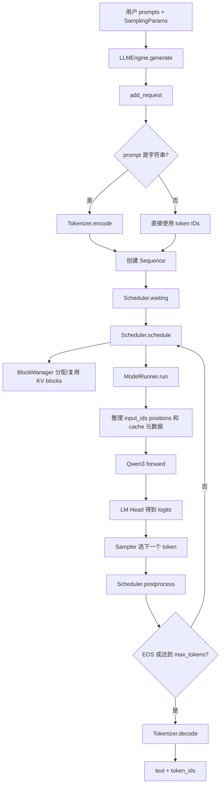
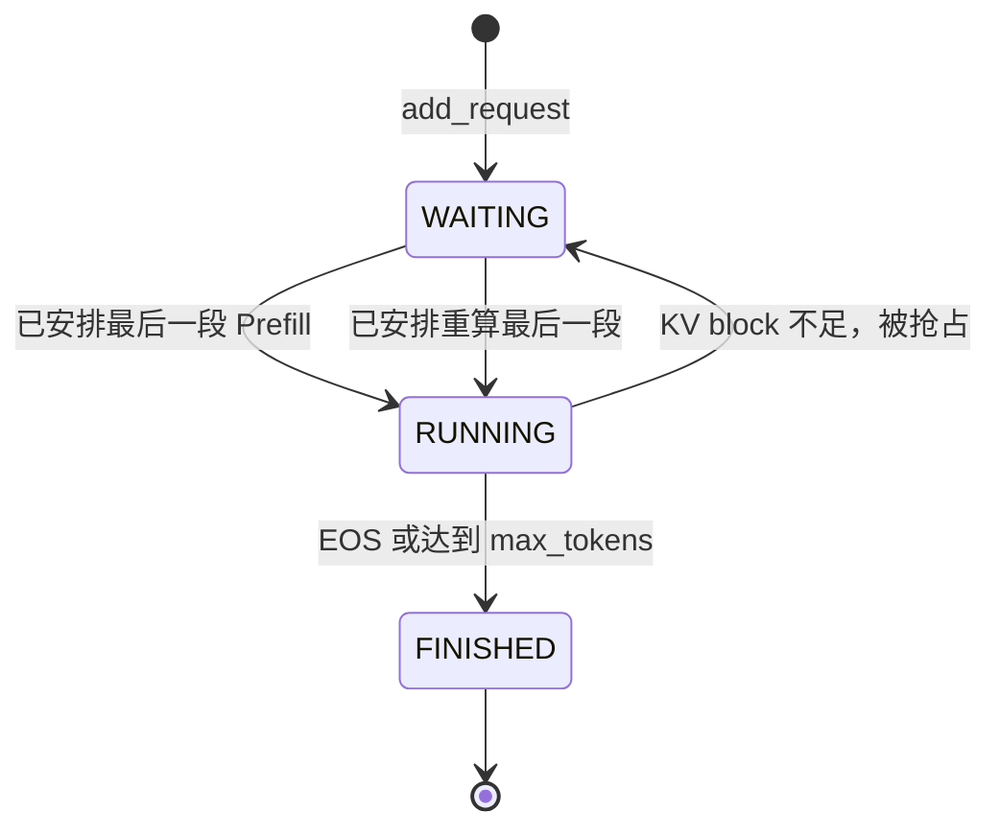
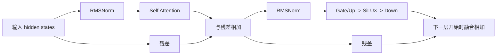

# Nano-vLLM 从 0 到 1：面向零基础的完整源码教程

> 适用代码：本仓库 `nano-vllm 0.2.0`，教程依据当前工作区源码编写。
> 适合读者：会一点点 Python 更好；完全不了解大语言模型、PyTorch、CUDA 或 vLLM 也可以从头读。
> 学习目标：不仅会运行示例，还能说清一次文本生成怎样经过调度器、模型、KV Cache 和采样器，最终变成输出文字。
> 本次修订：2026-10-08。按仓库源码逐一核对对象的创建点、调用者、字段读写和返回路径；保留原有基础章节，补充源码伴读。
> 源码基线：修订开始时的提交 `44cdb1b`；本次只修改教学文档，不修改推理代码。

## 怎样使用这份笔记

这不是只背术语的笔记。阅读一个对象时，请连续回答五个问题：**在哪里定义？在哪里创建？谁持有它？谁读取或修改它？最后返回什么？**

文中的代码分成两种：

- **源码节选**：上方注明仓库文件和类/方法。需要在原文件中结合缩进和上下文阅读，通常不能单独复制运行；标有“省略”的地方不是完整实现。
- **教学示例**：使用假设 token、假设采样结果或简化形状，帮助你手算状态。它不代表真实 tokenizer 编号、模型权重或随机输出。

文件链接都相对于项目根目录。可以点击链接，也可以在 VS Code 按 `Ctrl + P` 输入文件路径，再按 `Ctrl + F` 搜索文中指定的 `def` 或 `class`。方法名比固定行号更稳定；你增加注释以后仍然能找到对应代码。

如果现在最困惑的是“Sequence 到底被谁调用”，先读第 **8、11、12、14、21** 章，再返回其余章节。第 11 章有从创建到回收的完整源码追踪。

---

## 目录

- [1. 先用一句话认识项目](#1-先用一句话认识项目)
- [2. 阅读前必须知道的基础概念与源码语法](#2-阅读前必须知道的基础概念与源码语法)
- [3. 这个项目能做什么、不能做什么](#3-这个项目能做什么不能做什么)
- [4. 环境要求：为什么不能直接在普通 Windows 或 CPU 上运行](#4-环境要求为什么不能直接在普通-windows-或-cpu-上运行)
- [5. 从零安装与运行](#5-从零安装与运行)
- [6. 第一个例子逐行讲解](#6-第一个例子逐行讲解)
- [7. 项目目录地图](#7-项目目录地图)
- [8. 全局架构：一次 generate 调用经过了什么](#8-全局架构一次-generate-调用经过了什么)
- [9. 两阶段生成：Prefill 与 Decode](#9-两阶段生成prefill-与-decode)
- [10. 配置系统 Config](#10-配置系统-config)
- [11. 请求的最小单位 Sequence](#11-请求的最小单位-sequence)
- [12. 调度器 Scheduler 与连续批处理](#12-调度器-scheduler-与连续批处理)
- [13. Paged KV Cache、BlockManager 与前缀缓存](#13-paged-kv-cacheblockmanager-与前缀缓存)
- [14. ModelRunner：CPU 调度与 GPU 执行的桥梁](#14-modelrunnercpu-调度与-gpu-执行的桥梁)
- [15. Qwen3 模型结构](#15-qwen3-模型结构)
- [16. Attention、RoPE、RMSNorm、SwiGLU](#16-attentionropermsnormswiglu)
- [17. 从隐藏状态到下一个 token：LM Head 与采样](#17-从隐藏状态到下一个-tokenlm-head-与采样)
- [18. 权重加载](#18-权重加载)
- [19. 张量并行 Tensor Parallelism](#19-张量并行-tensor-parallelism)
- [20. CUDA Graph 与 torch.compile](#20-cuda-graph-与-torchcompile)
- [21. 一次请求的完整时序复盘](#21-一次请求的完整时序复盘)
- [22. Benchmark 怎么读、怎么测](#22-benchmark-怎么读怎么测)
- [23. 推荐的源码阅读和调试路线](#23-推荐的源码阅读和调试路线)
- [24. 常见报错与排查](#24-常见报错与排查)
- [25. 当前实现的边界与容易忽略的行为](#25-当前实现的边界与容易忽略的行为)
- [26. 从简单到进阶的练习](#26-从简单到进阶的练习)
- [27. 术语表与速查表](#27-术语表与速查表)

---

## 1. 先用一句话认识项目

Nano-vLLM 是一个用约一千多行 Python 代码实现的、只做离线文本生成的轻量级 LLM 推理引擎。

它不是从零训练模型，而是：

1. 读取 Hugging Face 格式的 Qwen3 配置、分词器和 `safetensors` 权重；
2. 把许多生成请求动态组成批次；
3. 在 NVIDIA GPU 上执行 Qwen3 前向计算；
4. 用 Paged KV Cache、前缀缓存、FlashAttention、张量并行和 CUDA Graph 加速；
5. 每轮采样一个新 token，循环到遇到 EOS 或达到长度上限；
6. 把 token 解码成文字返回。

这个项目最大的学习价值不是支持很多模型或功能，而是用很少的代码展示了 vLLM 类推理引擎的骨架。

可以先记住下面这个关系：

```text
Transformers 风格模型：重点是“神经网络怎样算”
Nano-vLLM 推理引擎：重点是“怎样高效组织很多次模型计算”
```

---

## 2. 阅读前必须知道的基础概念与源码语法

### 2.1 模型、训练与推理

- **模型**：大量参数组成的数学函数。
- **训练**：用数据调整参数；成本很高，本项目不负责。
- **推理**：加载已经训练好的参数，输入文字并得到输出；本项目只负责推理。

### 2.2 Token

模型不直接阅读字符串，而是阅读整数编号。

```text
"Hello, world" -> tokenizer -> [9707, 11, 1879]（仅为示意）
```

每个整数叫一个 token ID。token 可能是一个字、半个单词、一个完整单词或标点。

### 2.3 Tokenizer

分词器负责两个方向：

```text
encode：文字 -> token IDs
decode：token IDs -> 文字
```

分词器和模型必须配套。不能随意拿另一个模型的 tokenizer 来编码。

### 2.4 自回归生成

Qwen3 这类 Causal Language Model 一次只决定“下一个 token”。要生成多个 token，必须循环：

```text
输入：今天天气
第 1 轮预测：很
第 2 轮输入相当于：今天天气很       -> 预测：好
第 3 轮输入相当于：今天天气很好     -> 预测：。
```

这就是自回归：新输出会成为下一轮的输入。

### 2.5 Tensor（张量）

Tensor 可以先理解为“多维数组”。常见形状：

```text
[token 数, hidden_size]
[token 数, attention head 数, head_dim]
[batch_size, vocab_size]
```

神经网络的绝大部分工作就是矩阵乘法和逐元素运算。

### 2.6 Hidden state 与 Logits

- **hidden state**：模型内部对每个 token 的向量表示。
- **logits**：词表中每个候选 token 的未归一化分数。
- **probability**：对 logits 做 softmax 后得到的概率。

假设词表只有三个 token：

```text
logits       = [2.0, 1.0, 0.1]
softmax 后   = [0.659, 0.242, 0.099]
```

采样器会根据这些概率选出一个 token。

### 2.7 Attention

Attention 让当前位置根据上下文中其他 token 的信息更新自己。简化公式为：

```text
Attention(Q, K, V) = softmax(QKᵀ / √d) V
```

- Q（Query）：当前位置想找什么；
- K（Key）：每个历史位置提供什么索引；
- V（Value）：每个历史位置真正携带的信息。

### 2.8 KV Cache

生成第 100 个 token 时，前 99 个 token 的 K、V 已经算过。把它们保存起来，下轮只算新 token 的 K、V，就叫 KV Cache。

没有 KV Cache 时，生成越长，重复计算越多；有 KV Cache 后，Decode 每轮通常只向模型送入一个新 token。

### 2.9 GPU、CUDA、Triton 与 FlashAttention

- **GPU**：擅长大规模并行计算的硬件；
- **CUDA**：NVIDIA GPU 的计算平台；
- **Triton**：用接近 Python 的方式编写 GPU kernel；
- **FlashAttention**：高效实现 Attention 的库。

本项目直接依赖这几项，不提供 CPU 后备路径。

### 2.10 EOS

EOS 是 End Of Sequence，即“文本结束”特殊 token。默认情况下，模型生成 EOS 后请求完成；设置 `ignore_eos=True` 可以忽略它，强制生成到 `max_tokens`。

### 2.11 Python 源码语法速成

如果你还没有系统学过 Python，先掌握下面这些写法就足以继续阅读。它们不是 nano-vllm 的特殊语法。

导入：

```python
from nanovllm.engine.llm_engine import LLMEngine
```

表示从某个模块中取出 `LLMEngine` 这个名字。

类与继承：

```python
class LLM(LLMEngine):
    pass
```

表示 `LLM` 继承 `LLMEngine` 的全部行为。`pass` 表示这里不额外添加内容，所以本项目的 `LLM` 本质上就是一个更简短、对外更友好的类名。

构造函数与 `self`：

```python
class Sequence:
    def __init__(self, token_ids):
        self.token_ids = token_ids
```

调用 `Sequence(ids)` 时，Python 自动运行 `__init__`。`self` 就是正在创建的对象；`self.token_ids` 是该对象自己的字段。

类型标注：

```python
prompt: str | list[int]
```

表示 `prompt` 可以是字符串，也可以是整数列表。类型标注主要帮助阅读器和检查工具，Python 运行时通常不会自动强制检查。

列表推导式：

```python
temperatures = [seq.temperature for seq in seqs]
```

表示遍历 `seqs`，取出每个对象的温度，组成新列表。

切片：

```python
token_ids[start:end]
```

取从 `start` 开始、到 `end` 之前结束的部分，包含 start，不包含 end。

字典：

```python
outputs[seq_id] = token_ids
```

把 `seq_id` 当作 key 保存结果，之后可按 ID 找回。

特殊方法（dunder method）：

```python
__len__       # len(seq) 时调用
__getitem__   # seq[i] 或 seq[a:b] 时调用
__getstate__  # pickle 序列化时调用
__setstate__  # pickle 反序列化时调用
```

下面详细展开装饰器、dataclass、上下文管理器与断言。普通 Python 示例可以分别保存成小脚本运行；标注为“项目源码”的片段需要结合所在类和模块阅读。

#### 2.11.1 装饰器：把函数或类交给另一个对象处理

先理解一个前提：Python 中的函数也是对象，可以保存到变量中，也可以作为参数传给其他函数。

```python
def say_hello(name):
    return f"你好，{name}！"

greet = say_hello          # 保存函数对象，此时没有执行函数
print(greet("小明"))      # 调用函数，输出：你好，小明！
```

`say_hello` 是函数对象，`say_hello("小明")` 才是执行函数得到的返回值。后面阅读 `return wrapper` 时，这个区别特别重要。

**① `@` 写法实际做了什么？**

假设 `decorate` 是一个接收函数并返回处理后对象的装饰器：

```python
@decorate
def work():
    ...
```

从理解机制的角度，它相当于：

```python
def work():
    ...

work = decorate(work)
```

也就是：创建原函数，把它交给 `decorate`，再把处理后的对象绑定到原来的名字 `work`。常见装饰器返回一个包装函数，但也可以返回其他对象；后面介绍的 `@property` 就会生成属性描述对象。

因此装饰器不是给函数加一条注释，而是确实会影响程序行为。[Python 官方函数定义说明](https://docs.python.org/3/reference/compound_stmts.html#function-definitions)

**② 自己写一个装饰器，观察执行顺序**

下面的例子不依赖 PyTorch，可以直接运行：

```python
from functools import wraps

def trace(func):
    print("正在装饰：", func.__name__)

    @wraps(func)
    def wrapper(*args, **kwargs):
        print("进入函数：", func.__name__)
        try:
            return func(*args, **kwargs)
        finally:
            print("离开函数：", func.__name__)

    return wrapper

@trace
def add(a, b):
    print("原函数正在计算")
    return a + b

print("开始调用")
print("结果：", add(2, b=3))
```

输出：

```text
正在装饰： add
开始调用
进入函数： add
原函数正在计算
离开函数： add
结果： 5
```

逐步理解：

1. 执行到 `def add` 的定义时，就调用 `trace(add)`，所以“正在装饰”先打印；这里还没有计算 `2 + 3`。
2. `trace` 返回 `wrapper`，之后名字 `add` 指向包装函数。
3. 调用 `add(2, b=3)`，实际先进入 `wrapper`。
4. `wrapper` 通过保存的 `func` 调用原来的 `add`，拿到结果 `5`。
5. `finally` 在退出 `try` 时执行，所以先打印“离开函数”，再把结果返回给外层 `print`。

这里的几个新写法：

- `*args`：收集位置参数，例如调用中的 `2`；`args` 是一个 tuple（元组）。
- `**kwargs`：收集关键字参数，例如 `b=3`；`kwargs` 是一个 dict（字典）。
- `func(*args, **kwargs)`：把收集到的参数展开，再传给原函数。
- 内层 `wrapper` 能继续访问外层的 `func`，这种保留外层变量的机制叫“闭包”。
- `return wrapper` 返回函数对象；写成 `return wrapper()` 就会当场调用它，含义完全不同。
- `@wraps(func)` 保留原函数的名称、文档字符串等信息，让调试时仍能知道它是 `add`。[functools.wraps 官方说明](https://docs.python.org/3/library/functools.html#functools.wraps)

这个装饰器可以反复用于其他函数。日志、计时、结果缓存和访问控制都可以用类似结构实现。

**③ 为什么有些装饰器带括号，有些不带？**

```python
@trace                  # 直接把原函数交给 trace
def first():
    ...

@repeat(3)              # 先调用 repeat(3)，取得装饰器，再装饰原函数
def second():
    ...
```

带参数的完整例子：

```python
from functools import wraps

def repeat(times):
    def decorate(func):
        @wraps(func)
        def wrapper(*args, **kwargs):
            for _ in range(times):
                func(*args, **kwargs)
        return wrapper
    return decorate

@repeat(3)
def greet(name):
    print(f"你好，{name}")

greet("小明")            # 打印三次：你好，小明
```

可以分成三层看：`repeat(3)` 保存次数并返回 `decorate`；`decorate(greet)` 保存原函数并返回 `wrapper`；`greet("小明")` 才执行包装后的逻辑。

`@repeat(3)` 在这个例子中相当于 `greet = repeat(3)(greet)`。这个包装函数只重复执行，不汇总返回值，因此 `greet(...)` 最后返回 `None`。

**④ 多个装饰器叠加时，顺序是什么？**

下面的 `outer` 和 `inner` 是用于解释顺序的示意名字：

```python
@outer
@inner
def work():
    ...
```

应用装饰器的顺序是从靠近函数的一层开始：`work = outer(inner(work))`。如果两层都是前后加逻辑的包装函数，调用通常沿着“外层进入 → 内层进入 → 原函数 → 内层退出 → 外层退出”的顺序执行。换顺序可能改变效果，所以不能随意调整源码中 `@` 的位置。

**⑤ 在 Nano-vLLM 中怎样读这些装饰器？**

| 写法 | 项目位置 | 阅读时可以理解为 |
|---|---|---|
| `@property` | `engine/sequence.py` | 把计算结果当作属性读取 |
| `@classmethod` | `engine/block_manager.py` | 调用时自动提供当前类 `cls` |
| `@dataclass(slots=True)` | `sampling_params.py`、`config.py` | 自动生成保存配置字段的常用方法 |
| `@lru_cache(1)` | `layers/rotary_embedding.py` | 最多保留一组参数对应的返回结果 |
| `@torch.inference_mode()` | `engine/model_runner.py` | 调用时进入推理模式，退出时恢复之前的模式 |
| `@torch.compile` | Norm、RoPE、激活、Sampler | 为函数建立编译执行路径，可能在调用时触发编译 |
| `@triton.jit` | `layers/attention.py` | 把函数作为 Triton GPU kernel 定义，按 Triton 方式启动 |

它们都有 `@`，但具体行为由装饰器实现决定。不要理解成“所有装饰器都会加速”。

`@property` 的独立例子：

```python
class Task:
    def __init__(self):
        self._finished = False

    @property
    def is_finished(self):
        return self._finished

task = Task()
print(task.is_finished)       # False，访问时执行属性的 getter
task._finished = True
print(task.is_finished)       # True，再次读取时重新计算
```

有了 `@property`，这里应写 `task.is_finished`，而不是 `task.is_finished()`。后者会试图把返回的布尔值当作函数调用。

项目中的 `seq.num_completion_tokens` 同样是计算属性：它每次读取 `num_tokens - num_prompt_tokens`，不是另存一份可能过期的计数。普通 `property` 不会自动缓存结果；这里也没有 setter，所以不能直接给 `seq.num_completion_tokens` 赋值。

`@classmethod` 方法的第一个参数通常叫 `cls`，表示当前类；普通实例方法的 `self` 表示当前对象。例如项目用 `BlockManager.compute_hash(...)` 调用类方法，不必先创建 BlockManager 实例。

`@lru_cache(1)` 则不同：相同参数再次调用时可以直接返回之前保存的结果。这里最多保存一组参数组合，而不是“只能调用一次”；参数变化可能淘汰旧结果。它缓存的是返回对象的引用，所以共享可变对象时要注意修改会影响其他使用者。

`@torch.inference_mode()` 关闭梯度记录，并减少部分额外追踪开销，适合此处的推理计算。它不会自动加载权重，也不会自动把模型切换成 `model.eval()`。推理模式产生的 Tensor 后续参与需要梯度的计算还有限制。[PyTorch inference_mode 官方说明](https://docs.pytorch.org/docs/stable/generated/torch.autograd.grad_mode.inference_mode.html)

#### 2.11.2 dataclass：为什么配置类只有字段，也能创建对象？

`dataclass` 是“装饰类”的例子。下面是项目 `SamplingParams` 的字段结构：

```python
from dataclasses import dataclass

@dataclass(slots=True)
class SamplingParams:
    temperature: float = 1.0
    max_tokens: int = 64
    ignore_eos: bool = False

params = SamplingParams(temperature=0.6, max_tokens=256)
print(params.temperature)     # 0.6
print(params.ignore_eos)      # False，使用默认值
print(params)                # 显示类名和字段值，方便调试
```

你没有手写 `__init__`，但 dataclass 会根据字段生成构造函数，并默认生成 `__repr__` 和 `__eq__` 等方法。所以这些字段可以被构造、打印和比较。

`slots=True` 减少实例保存字段的开销，并在这个简单类中阻止任意新增属性，例如 `params.unknown = 123` 会报 `AttributeError`。它不意味着字段不可修改；`params.max_tokens = 128` 仍然可以执行。

项目还定义了 `__post_init__`。dataclass 生成的构造函数会在字段赋值后调用它，因此可以检查温度是否合法。`temperature: float` 只是类型标注，dataclass 不会因此自动检查所有输入类型或数值范围。

#### 2.11.3 上下文管理器：进入一段操作，再可靠地退出

“上下文”可以理解为执行一段代码期间临时使用的资源或状态。例如打开文件后进行读取，或暂时进入 GPU Graph 捕获模式。

上下文管理器负责定义进入和退出行为；`with` 是使用它的语法。

**① 从读取文件理解 `with`**

在项目目录运行：

```python
with open("README.md", "r", encoding="utf-8") as f:
    first_line = f.readline()
    print(first_line.strip())
    print(f.closed)           # False：文件还在使用

print(f.closed)               # True：离开 with 后文件已关闭
```

执行顺序：

1. `open(...)` 打开文件并取得文件对象；
2. 进入文件对象的上下文，把进入结果绑定到 `f`；
3. 执行缩进块中的读取逻辑；
4. 离开缩进块时，文件上下文管理器关闭文件。

`as f` 得到的是上下文管理器 `__enter__()` 的返回值，未必就是管理器对象本身；文件对象只是通常返回自己。

`with` 不会创建一个新的变量作用域，所以例子中块外仍然可以访问 `f`，只是文件已经关闭，不能继续正常读取。

**② 为什么不能只在最后写 `close()`？**

普通写法：

```python
f = open("README.md", "r", encoding="utf-8")
content = f.read()
f.close()
```

如果 `f.read()` 抛出异常，最后一行可能来不及执行。用 `try/finally` 可以明确安排清理：

```python
f = open("README.md", "r", encoding="utf-8")
try:
    content = f.read()
finally:
    f.close()
```

对文件读取来说，`with` 把这种配对操作封装起来，避免到处重复写清理逻辑。一般的上下文管理器还可以处理异常，不能把所有 `with` 都简单等同于文件的 `close()`。

**③ `__enter__` 与 `__exit__` 分别做什么？**

可以自己写一个只打印过程的管理器：

```python
class StudyContext:
    def __enter__(self):
        print("进入上下文")
        return "提供给代码块的值"

    def __exit__(self, exc_type, exc_value, traceback):
        print("退出上下文")
        if exc_type is not None:
            print("发现异常：", exc_type.__name__)
        return False         # 不吞掉异常，让它继续向外传播

with StudyContext() as value:
    print(value)
    print("执行代码块")
```

输出：

```text
进入上下文
提供给代码块的值
执行代码块
退出上下文
```

`__exit__` 的三个参数用于描述块内异常：正常退出时都是 `None`；异常退出时分别是异常类型、异常对象和 traceback（错误发生的调用链信息）。

再运行下面的异常示例，沿用上面定义的 `StudyContext`：

```python
try:
    with StudyContext() as value:
        print("准备触发异常")
        raise ValueError("示例错误")
except ValueError as error:
    print("外层捕获：", error)
```

输出：

```text
进入上下文
准备触发异常
退出上下文
发现异常： ValueError
外层捕获： 示例错误
```

异常发生后先退出上下文，再由外层 `except` 处理。`__exit__` 返回假值（例如 `False` 或 `None`）时，异常继续传播；如果返回真值，块内异常会被抑制，执行会继续到 `with` 后面。[Python 官方 with 说明](https://docs.python.org/3/reference/compound_stmts.html#the-with-statement)

这里要记住边界：正常返回、`return`、`break` 或块内异常都会触发正常的退出协议；前提是 `__enter__` 已成功。如果进入阶段就失败，Python 不会再自动调用这个管理器的 `__exit__`。强制终止进程时也不能依赖 Python 清理逻辑完成。

**④ 在 Nano-vLLM 中对应哪些操作？**

项目源码 `utils/loader.py`：

```python
with safe_open(file, "pt", "cpu") as f:
    for weight_name in f.keys():
        loaded_weight = f.get_tensor(weight_name)
```

`safe_open` 提供读取 Safetensors 文件的上下文。代码块通过 `f` 列出权重名称、读取 Tensor；退出时由库完成相应资源的退出处理。`with` 不表示 Tensor 自动复制到 GPU，也不表示块外所有读出的 Tensor 都被删除；权重如何使用仍由 loader 决定。

项目源码 `ModelRunner.capture_cudagraph` 中还有：

```python
with torch.cuda.graph(graph, self.graph_pool):
    outputs[:bs] = self.model(input_ids[:bs], positions[:bs])
```

这次进入的是 CUDA Graph 捕获环境。块内的 CUDA 工作被记录到 Graph，退出时结束捕获，之后通过 `graph.replay()` 重放。`with` 管理的可以是执行状态，不一定是文件。

`torch.inference_mode()` 也既能写成装饰器，也能写成上下文管理器：

```python
# 示意：model、input_ids、positions 需先创建
with torch.inference_mode():
    hidden_states = model(input_ids, positions)
```

装饰器形式作用于整个函数调用，上下文形式作用于缩进块；它们控制推理模式的目的相同。

还要与本项目的 `utils/context.py` 区分：里面的 `Context` 是保存 Attention 元数据的 dataclass，靠 `set_context()` 和 `reset_context()` 更新。名字含有 Context 不等于实现了上下文管理器，也不能因此直接写 `with Context():`。

#### 2.11.4 断言：检查“这里应当成立的条件”

**① 基本语法与执行结果**

```python
assert 条件
assert 条件, "失败时的说明"
```

正常 Python 运行模式下，条件为真就继续执行，条件为假就抛出 `AssertionError`：

```python
temperature = 0.6
assert temperature > 1e-10, "temperature 必须大于 1e-10"
print("检查通过")             # 会执行
```

换成 `temperature = 0.0` 后，会在断言位置抛出异常，后面的 `print` 不会执行，除非外层代码捕获了异常。

从理解普通模式行为的角度，断言类似：

```python
if not (temperature > 1e-10):
    raise AssertionError("temperature 必须大于 1e-10")
```

它不是帮助程序自动纠错，也不会把 `0.0` 调整为一个合法温度。

**② 结合项目理解它在检查什么**

| 项目断言 | 条件成立时的意义 | 不满足时应检查 |
|---|---|---|
| `assert os.path.isdir(self.model)` | 模型路径是现有目录 | 路径拼写、目录是否下载完成 |
| `assert self.kvcache_block_size % 256 == 0` | KV block size 是 256 的倍数 | backend 限制与 block 配置 |
| `assert 1 <= self.tensor_parallel_size <= 8` | TP 数量在实现允许范围内 | GPU 数量与 TP 设置 |
| `assert self.temperature > 1e-10` | 当前采样实现允许这个温度 | 本项目当前没有 greedy 分支 |
| `assert 0 <= i < self.num_blocks` | `Sequence.block(i)` 的逻辑块编号有效 | 调用者是否给错块索引 |
| `assert block.ref_count == 0` | 待分配/回收的 block 没有活跃引用 | 引用计数和共享 block 生命周期 |

这里既有配置检查，也有“不变量”检查。不变量指算法过程中应始终保持的关系，例如正在被其他请求引用的 KV block 不能被重置给新请求。理解断言经常能直接看出作者对代码的假设。

**③ 断言和异常处理有什么关系？**

`assert` 是产生异常的一种方式；`raise` 可以主动抛出指定异常；`try/except` 则负责在异常发生后处理它：

```python
def require_positive(value):
    assert value > 0, "value 应当为正数"
    return value

try:
    require_positive(0)
except AssertionError as error:
    print("断言失败：", error)

print("异常已被处理，继续执行")
```

输出：

```text
断言失败： value 应当为正数
异常已被处理，继续执行
```

如果没有对应 `except`，异常会继续向调用者传播；传播到程序顶层仍未处理时，脚本通常以错误退出，并显示 traceback。

在真实 KV Cache 错误中，不能只捕获异常然后继续跑，必须先确认状态能否恢复。例如 ref_count 错误可能说明 block 管理已经不一致。

**④ 为什么用户输入校验更适合 `if + raise`？**

Python 可以以优化模式运行：

```bash
python -O your_script.py
```

这时普通 Python `assert` 会被移除，条件也不再求值；设置相应的 `PYTHONOPTIMIZE` 环境变量也会影响断言。因此关键输入校验不应只依赖 `assert`。[Python 官方 assert 说明](https://docs.python.org/3/reference/simple_stmts.html#the-assert-statement)

例如用户传入非法温度，应当明确检查：

```python
def validate_temperature(temperature):
    if temperature <= 1e-10:
        raise ValueError("temperature 必须大于 1e-10")
    return temperature
```

这只是改进方式示例，当前项目源码仍然使用断言。可以按用途理解：内部算法不变量常用 `assert`；用户输入、文件路径、权限等必须执行的检查用普通条件判断和明确异常更可靠。

不要把必要操作藏在断言里，例如：

```python
assert allocate_block()       # 反例：-O 模式下连分配操作都不执行
```

需要执行的操作应该独立完成，再判断结果。

**⑤ 一个容易写错的形式**

```python
assert (condition, "说明")    # 错误：检查的是非空 tuple
assert condition, "说明"      # 正确：检查 condition
```

非空 tuple 即使包含 `False`，整体仍为真。第一种写法不能达到预期检查效果，Python 通常还会给出警告。若条件复杂，可以只给条件加括号：`assert (a > 0 and b > 0), "说明"`。

#### 2.11.5 把三种概念一起放进执行流程

| 概念 | 典型写法 | 在执行流程中的位置 |
|---|---|---|
| 装饰器 | `@trace`、`@property` | 定义时处理函数/类；之后调用或访问使用处理后的对象 |
| 上下文管理器 | `with manager as value:` | 进入块前准备，离开块时清理或恢复状态 |
| 断言 | `assert condition, message` | 在当前执行点检查假设，失败时抛异常 |

沿用上面已定义的 `trace` 和 `StudyContext`，可以把它们组合起来：

```python
@trace
def checked_add(a, b):
    with StudyContext():
        assert a >= 0 and b >= 0, "示例只接受非负数"
        return a + b

print(checked_add(2, 3))
```

调用时会先进入装饰器的 `wrapper`，再进入上下文，接着检查断言并计算结果。`return` 离开 `with` 时先执行 `__exit__`，离开包装函数时再执行它的 `finally`，最后把 `5` 返回给最外面的 `print`。

如果改为 `checked_add(-1, 3)`，断言失败后仍会执行上下文的退出操作和包装函数的 `finally`，随后 `AssertionError` 继续向外传播。这解释了为什么“增加函数行为”“管理执行环境”“检查运行假设”可以配合使用。

建议做三个小练习：

1. 给 `add` 再加一次调用，观察“正在装饰”与“进入函数”分别出现几次。
2. 把 `StudyContext.__exit__` 的返回值暂时改为 `True`，观察异常是否还能到达外层 `except`，然后改回 `False`。
3. 把断言示例放进脚本，分别用 `python script.py` 和 `python -O script.py` 执行，比较结果；再将断言改为 `if + raise`，观察优化模式下是否仍然检查。

### 2.12 PyTorch 源码语法速成

模型类通常继承 `nn.Module`：

```python
class Sampler(nn.Module):
    def forward(self, logits, temperatures):
        ...
```

调用 `sampler(logits, temperatures)` 时，`nn.Module.__call__` 会进一步调用 `forward`。不要把它误解成 Sampler 没有 `__call__` 就不能调用。

`nn.Parameter` 表示模型参数：

```python
self.weight = nn.Parameter(torch.empty(output_size, input_size))
```

训练框架会追踪 Parameter；本项目不训练它，而是从 checkpoint 把已有权重复制进去。

设备与数据类型：

```python
x.cuda()            # 把 Tensor 放到当前 CUDA GPU
x.float()           # 转成 float32
x.to(orig_dtype)    # 转回原数据类型
```

常见 dtype 包括 FP32、FP16 和 BF16。精度越低通常越省显存、吞吐越高，但硬件支持和数值稳定性也不同。本项目采用模型配置中的 dtype。

形状变换：

```python
x.view(-1, num_heads, head_dim)
x.flatten(1, -1)
x.chunk(2, -1)
```

- `-1` 表示让 PyTorch 自动推断这一维；
- `view` 改变观察形状，不改变元素总数；
- `flatten` 合并若干维；
- `chunk` 沿某一维切成多份。

`F.linear(x, weight, bias)` 做线性变换，数学上近似：

```text
y = x Wᵀ + b
```

`torch.distributed` 中：

- `all_reduce(y)`：把各 rank 的 y 相加，并让每个 rank 都拿到结果；
- `gather(...)`：把各 rank 结果收集到指定 rank；
- `barrier()`：所有 rank 到齐后才继续。

最后，`@torch.compile` 表示让 PyTorch 尝试编译和融合函数。它不改变函数想表达的数学逻辑，但会影响首次运行耗时、调试方法与最终性能。

### 2.13 把“语法认识”变成“看得懂项目调用”

看代码时，先区别这四种写法：

| 项目实际写法 | 属于什么 | 进入哪里 |
|---|---|---|
| `Sequence(prompt, sampling_params)` | 类的构造调用 | `Sequence.__init__()` |
| `seq.append_token(token_id)` | 普通实例方法调用 | `Sequence.append_token()` |
| `seq.completion_token_ids` | property 读取 | `completion_token_ids` 的 getter |
| `self.sampler(logits, temperatures)` | `nn.Module` 对象调用 | `Sampler.forward()` |

前面三项对应 [sequence.py](nanovllm/engine/sequence.py)，最后一项的调用在 [model_runner.py](nanovllm/engine/model_runner.py)，定义在 [sampler.py](nanovllm/layers/sampler.py)。一个“看起来没有函数名的括号调用”并不意味着没有函数执行。

另一个常见困惑是 `self`：在 `LLMEngine.step()` 中，`self` 是引擎；在 `Sequence.append_token()` 中，它是某一条请求；在 `Attention.forward()` 中，它是模型某一层的 Attention 模块。`self` 不是全项目共享的一个万能对象。

阅读每个类时，可以在纸上写下三列：构造函数创建的成员、当前函数接收的参数、当前函数返回的结果。随后用第 7.1 节的表找到上游和下游，避免只盯着一个文件猜它如何运行。

---

## 3. 这个项目能做什么、不能做什么

### 3.1 已实现的能力

- 加载 Hugging Face 目录中的 Qwen3 模型；
- 同时处理多个离线生成请求；
- 输入可以是字符串，也可以是 token ID 列表；
- 支持每个请求独立的温度、最大生成长度和 EOS 策略；
- chunked prefill（把太长的提示切块计算）；
- Paged KV Cache；
- 完整块级别的前缀缓存；
- 显存不足时通过 recompute 方式抢占请求；
- 1～8 张 NVIDIA GPU 的张量并行；
- `torch.compile`、Triton KV 写入 kernel、FlashAttention；
- Decode 阶段 CUDA Graph；
- 简单吞吐量 benchmark。

### 3.2 没有实现的能力

- 不训练、不微调模型；
- 没有 HTTP/OpenAI 兼容 API Server；
- 没有流式逐 token 返回接口；
- 没有 CPU、Apple Silicon、AMD GPU 后端；
- 当前模型代码只实现 Qwen3，不是通用 Transformers 模型运行器；
- 没有 beam search、top-k、top-p、重复惩罚、stop strings；
- 不允许 `temperature=0` 的 greedy decoding；
- 没有 LoRA、量化、投机解码、分布式多机；
- 没有生产级鉴权、监控、请求取消、容错和测试套件。

因此，最合适的定位是“高性能推理原理的可读实现”，不是功能齐全的生产服务。

### 3.3 怎样从源码确认能力，而不是从名字猜

| 能力/限制 | 可以检查的源码证据 |
|---|---|
| 支持文字和整数 token 列表 | [llm_engine.py](nanovllm/engine/llm_engine.py) 的 `add_request()` 检查 `isinstance(prompt, str)` |
| 不是流式接口 | 同一文件的 `generate()` 循环等待全部结束，最后统一 return |
| 固定 Qwen3 模型实现 | [model_runner.py](nanovllm/engine/model_runner.py) 直接构造 `Qwen3ForCausalLM` |
| 支持 chunked prefill | [scheduler.py](nanovllm/engine/scheduler.py) 用 `min(num_tokens, remaining)` 分配本轮计划 |
| 不支持 greedy 参数 | [sampling_params.py](nanovllm/sampling_params.py) 断言温度大于 `1e-10` |

`AutoConfig/AutoTokenizer` 中的 Auto 表示这些工具能选择配置/分词器类型，不代表这个引擎能够自动执行所有 Hugging Face 模型。网络结构仍由项目自己的源码决定。

---

## 4. 环境要求：为什么不能直接在普通 Windows 或 CPU 上运行

### 4.1 硬性要求

从源码可以直接看到：

- `ModelRunner` 固定调用 `torch.cuda.set_device(...)`；
- 分布式后端固定为 `nccl`；
- Attention 固定导入 `flash_attn`；
- KV Cache 写入使用 Triton kernel；
- 多处直接调用 `.cuda()`。

所以运行条件是：

- Python `>=3.10,<3.13`；
- NVIDIA CUDA GPU；
- 可工作的 CUDA 版 PyTorch；
- NCCL、Triton、FlashAttention 可用；
- 模型目录中有配置、tokenizer 和 `*.safetensors` 权重。

### 4.2 操作系统结论

直接证据位于 [model_runner.py](nanovllm/engine/model_runner.py) 的 `ModelRunner.__init__()`：

```python
dist.init_process_group("nccl", "tcp://localhost:2333", world_size=self.world_size, rank=rank)
torch.cuda.set_device(rank)
```

即使只设置单卡，也会执行这两行，代码没有“CPU 时切换到另一个后端”的分支。

推荐顺序：

1. 原生 Linux；
2. Windows 11 + WSL2 Ubuntu；
3. 不推荐 Windows 原生 Python。

即使 Windows 上能安装 CUDA 版 PyTorch，本项目的 NCCL 和 FlashAttention 路径通常仍要求 Linux 环境。因此 Windows 用户应在 WSL2 中运行项目，而不是直接在 PowerShell 的 Windows Python 中运行。

### 4.3 显存需求

显存主要由四部分组成：

```text
模型权重 + 模型运行时临时张量 + CUDA Graph + KV Cache
```

Qwen3-0.6B 是合适的入门模型。默认 `gpu_memory_utilization=0.9` 表示引擎尝试把约 90% 的显存预算用于整体运行并把剩余空间计算成 KV Cache block 数量。它不是说“KV Cache 独占 90%”。

如果初始化时 OOM，可以优先：

- 使用更小模型；
- 设置 `enforce_eager=True`，暂时关闭 CUDA Graph；
- 降低 `max_num_batched_tokens`；
- 降低 `max_num_seqs`；
- 降低 `max_model_len`；
- 适当降低 `gpu_memory_utilization`，给其他进程或临时工作区留空间。

---

## 5. 从零安装与运行

> 以下命令以 Ubuntu/WSL2 为例。包版本和 CUDA 版本必须匹配本机驱动；PyTorch 安装命令应以 PyTorch 官方安装选择器为准，不要盲目复制另一台机器的 CUDA 版本。

### 5.1 Windows 用户先准备 WSL2

在管理员 PowerShell 中执行：

```powershell
wsl --install -d Ubuntu
```

重启并进入 Ubuntu 后检查 GPU 是否透传：

```bash
nvidia-smi
```

如果看不到 GPU，应先处理 WSL2 和 NVIDIA 驱动问题，不要急着安装 Python 包。

### 5.2 安装基础工具

```bash
sudo apt update
sudo apt install -y python3 python3-venv python3-dev build-essential git
```

进入本项目。当前仓库位于 Windows E 盘时，WSL2 中通常对应：

```bash
cd "/mnt/e/AI infra/nano_vllm/nano-vllm"
```

频繁编译时，把仓库放在 WSL2 自己的 Linux 文件系统中通常体验更好，例如 `~/projects/nano-vllm`。

### 5.3 创建虚拟环境

先看 [pyproject.toml](pyproject.toml) 中的真实约束：

```toml
requires-python = ">=3.10,<3.13"
```

因此不能只凭命令叫 `python3` 就认为版本合适：新 Ubuntu 的默认 Python 可能超出这个范围。先执行 `python3 --version`。本项目学习环境使用 **Python 3.12，目录名 `venv`**。

如果已经创建好 `venv`，跳过创建步骤，只激活它。以下两种创建方式任选一种，不要反复对已有环境执行创建：

已安装 uv 时：

```bash
uv venv --python 3.12 --seed venv
```

已安装独立的 `python3.12` 及其 venv 支持时：

```bash
python3.12 -m venv venv
```

随后在 Ubuntu/WSL 终端执行：

```bash
source venv/bin/activate
python --version
python -c "import sys; print(sys.executable)"
python -m pip install --upgrade pip setuptools wheel packaging ninja
```

Python 路径应指向项目的 `venv/bin/python`。以后每次打开新终端，只需要激活，不需要重新创建环境或重新安装 torch：

```bash
cd "/mnt/e/AI infra/nano_vllm/nano-vllm"
source venv/bin/activate
```

`venv` 和 `.venv` 只是目录名，没有谁自动继承谁的关系。创建两个目录就得到两个独立环境；下载缓存可以复用，但包需要安装到实际使用的环境。退出激活状态用 `deactivate`。[uv 官方环境说明](https://docs.astral.sh/uv/pip/environments/)

### 5.4 安装 PyTorch 与项目

先根据本机环境安装兼容的 CUDA 版 PyTorch，再以 editable 模式安装项目：

```bash
# 先执行 PyTorch 官方安装选择器为你的 CUDA 环境给出的命令
python -m pip install -e . "transformers>=4.51,<5"
```

`-e` 表示 editable。修改 `nanovllm/` 下的 Python 文件后，无需反复重新安装。

`pyproject.toml` 声明的直接依赖为：

```text
torch >= 2.4.0
triton >= 3.0.0
transformers >= 4.51.0
flash-attn
xxhash
```

FlashAttention 需要本地编译时，可以尝试在已经安装 PyTorch 后单独执行：

```bash
python -m pip install --no-build-isolation flash-attn
python -m pip install -e . "transformers>=4.51,<5"
```

这里加上 Transformers `<5` 是本教程的兼容性选择，不是修改了项目原本的依赖声明。FlashAttention 从源码构建还需要匹配的 CUDA toolkit、编译器等；`--no-build-isolation` 只关闭隔离构建环境，不会替你安装 torch 或 CUDA 编译器。如果使用官方预编译 wheel，需要同时匹配 Python、PyTorch、CUDA 和 C++ ABI，不能只看文件名中有 `cu12`。

### 5.5 检查环境

```bash
python - <<'PY'
import torch
import transformers
import triton
import flash_attn
import xxhash

print("torch:", torch.__version__)
print("transformers:", transformers.__version__)
print("CUDA available:", torch.cuda.is_available())
print("GPU count:", torch.cuda.device_count())
if torch.cuda.is_available():
    print("GPU 0:", torch.cuda.get_device_name(0))
PY
```

至少要确认：

```text
CUDA available: True
GPU count: 1 或更多
```

### 5.6 下载模型

安装与上述 Transformers 4.x 学习环境相容的 Hugging Face 工具：

```bash
python -m pip install "huggingface-hub>=0.34,<1.0"
python -m pip check
```

不要无条件把 `huggingface_hub` 升级到最新大版本。以 `transformers==4.57.6` 为例，它明确要求 `huggingface-hub>=0.34.0,<1.0`；装成 `2.x` 以后，包虽然出现在 `pip show` 中，实际 `import transformers` 仍会失败。[对应版本的官方依赖表](https://github.com/huggingface/transformers/blob/v4.57.6/src/transformers/dependency_versions_table.py)

下载示例模型：

```bash
hf download Qwen/Qwen3-0.6B \
  --local-dir "$HOME/huggingface/Qwen3-0.6B"
```

旧版 Hugging Face CLI 也可能使用仓库 README 中的形式：

```bash
huggingface-cli download --resume-download Qwen/Qwen3-0.6B \
  --local-dir "$HOME/huggingface/Qwen3-0.6B" \
  --local-dir-use-symlinks False
```

模型目录至少应能看到类似内容：

```text
config.json
tokenizer.json 或其他 tokenizer 文件
tokenizer_config.json
model.safetensors 或 model-00001-of-....safetensors
model.safetensors.index.json（分片权重通常有）
```

### 5.7 运行自带示例

`example.py` 默认路径正是：

```python
path = os.path.expanduser("~/huggingface/Qwen3-0.6B/")
```

模型放在其他位置时，先修改这一行，然后运行：

```bash
python example.py
```

第一次启动可能明显较慢，因为要加载权重、预热模型、分配 KV Cache，并触发 `torch.compile`。示例使用 `enforce_eager=True`，不会捕获 CUDA Graph，更适合首次验证。

### 5.8 最小测试脚本

```python
from nanovllm import LLM, SamplingParams

model_path = "/绝对路径/Qwen3-0.6B"

llm = LLM(
    model_path,
    enforce_eager=True,
    tensor_parallel_size=1,
    max_model_len=2048,
)

params = SamplingParams(
    temperature=0.6,
    max_tokens=64,
)

outputs = llm.generate(["请用一句话介绍你自己。"], params)
print(outputs[0]["text"])
print(outputs[0]["token_ids"])
```

注意：传入普通字符串不等于使用聊天模板。对 instruct/chat 模型，更推荐像 `example.py` 一样先调用 `tokenizer.apply_chat_template(...)`。

### 5.9 VS Code、WSL 和虚拟环境是三个不同层次

```text
VS Code 窗口连接 WSL: Ubuntu
  └─ Python 扩展选择项目 venv/bin/python
      └─ 终端激活同一个 venv 后运行 python example.py
```

在 Windows 上打开编辑器没有问题，但项目的 Python 和依赖运行在 WSL。仅把终端切成 Ubuntu，不等于编辑器的 Python 检查器也运行在 WSL。

1. 安装微软 WSL 扩展；通过命令面板执行 `WSL: Reopen Folder in WSL`。
2. 确认左下角显示 `WSL: Ubuntu`，并按需将 Python/Pylance 扩展安装到 WSL。
3. 执行 `Python: Select Interpreter`，选择 `/mnt/e/AI infra/nano_vllm/nano-vllm/venv/bin/python`。
4. 在终端执行 `source venv/bin/activate`；再用 `python -c "import sys; print(sys.executable)"` 检查实际运行路径。

这两个路径应指向同一个环境。编辑器环境选择和终端激活是分别设置的，不要只看终端前面的 `(venv)` 就认定检查器也选对了。[VS Code 官方 WSL 说明](https://code.visualstudio.com/docs/remote/wsl)

---

## 6. 第一个例子逐行讲解

自带的 `example.py` 是公开 API 的最佳入口。

### 6.1 导入

```python
from nanovllm import LLM, SamplingParams
from transformers import AutoTokenizer
```

- `LLM`：整个推理引擎；
- `SamplingParams`：控制每个请求如何生成；
- `AutoTokenizer`：读取模型配套分词器。

`nanovllm/__init__.py` 只做了两次重新导出，所以用户不必写很长的模块路径。

### 6.2 创建 tokenizer 和引擎

```python
tokenizer = AutoTokenizer.from_pretrained(path)
llm = LLM(path, enforce_eager=True, tensor_parallel_size=1)
```

`LLM` 自己也会创建一个 tokenizer。示例额外创建 tokenizer，是为了在调用 `generate` 前套用聊天模板。

创建 `LLM` 不是一个轻量操作，它会立即：

1. 读取模型配置；
2. 建立 NCCL process group；
3. 在 GPU 上构造 Qwen3；
4. 加载全部权重；
5. 预热一次；
6. 根据剩余显存创建 KV Cache；
7. 如果 `enforce_eager=False`，再捕获 CUDA Graph。

所以应该复用一个 `LLM` 实例，不要每个 prompt 都重新创建。

### 6.3 设置采样参数

```python
sampling_params = SamplingParams(temperature=0.6, max_tokens=256)
```

本项目只有三个参数：

| 参数 | 默认值 | 含义 |
|---|---:|---|
| `temperature` | `1.0` | 越低越偏向高概率 token；必须大于约 `1e-10` |
| `max_tokens` | `64` | 最多新生成多少 token，不包含 prompt |
| `ignore_eos` | `False` | 是否忽略模型生成的 EOS |

### 6.4 应用聊天模板

```python
tokenizer.apply_chat_template(
    [{"role": "user", "content": prompt}],
    tokenize=False,
    add_generation_prompt=True,
)
```

聊天模型训练时看到的输入通常包含角色标记。聊天模板把普通问题转换成模型熟悉的格式。这里 `tokenize=False` 表示先得到字符串，之后由 `LLM.add_request` 内部编码。

### 6.5 批量生成

```python
outputs = llm.generate(prompts, sampling_params)
```

同一个 `SamplingParams` 对象会被复用于所有 prompt。也可以为每个 prompt 传不同参数：

```python
params = [
    SamplingParams(temperature=0.2, max_tokens=32),
    SamplingParams(temperature=0.9, max_tokens=128),
]
outputs = llm.generate(prompts, params)
```

返回值实际是：

```python
[
    {
        "text": "生成的文字",
        "token_ids": [若干整数],
    },
    ...
]
```

虽然 `generate` 源码的返回类型标注写成了 `list[str]`，真实返回值是字典列表，应以实现为准。

### 6.6 为什么 example.py 没写 Sequence，却创建了它？

源码位置：[nanovllm/__init__.py](nanovllm/__init__.py)。完整文件只有：

```python
from nanovllm.llm import LLM
from nanovllm.sampling_params import SamplingParams
```

它把两个名字暴露给使用者。接着打开 [nanovllm/llm.py](nanovllm/llm.py)：

```python
from nanovllm.engine.llm_engine import LLMEngine


class LLM(LLMEngine):
    pass
```

`LLM` 没有自己的 `generate()`，所以 `llm.generate(...)` 实际执行继承来的 `LLMEngine.generate()`。`LLM(path, ...)` 同样执行继承来的 `LLMEngine.__init__()`。

现在沿着函数调用进入 [nanovllm/engine/llm_engine.py](nanovllm/engine/llm_engine.py)，在 `generate()` 中找到：

```python
if not isinstance(sampling_params, list):
    sampling_params = [sampling_params] * len(prompts)
for prompt, sp in zip(prompts, sampling_params):
    self.add_request(prompt, sp)
```

逐行看：

1. 单个参数对象扩展成与 prompt 数量相同的列表；这不是创建许多独立参数对象，而是重复引用同一个对象。
2. `zip` 每次取出一个 prompt 和对应的参数 `sp`。
3. `self.add_request(...)` 接收这一对值，并在内部创建一个 `Sequence`。第 11 章会展开这段源码。

所以“两条 prompt”通常意味着“两条真实请求 Sequence”，而不是把整个 prompts 列表塞入一个 Sequence。模型预热还会创建临时 Sequence，不要把它们算作用户请求。

### 6.7 怎样读成功输出，而不是只看有没有文字

`Generating: 2/2` 表示两条请求都已经结束。输出文本由 `output['text']` 取得，它是 tokenizer 对生成 token IDs 的解码结果，并不是引擎自己拼出来的答案。

如果回答还在 `<think>` 中就截断，检查 `SamplingParams(max_tokens=256)`：上限统计所有新生成 token，思考文本和特殊 token 也会占用额度。可以在教学实验中增加 `max_tokens`，但“程序成功运行”不等于“模型答案一定完整、正确”。

---

## 7. 项目目录地图

```text
nano-vllm/
├── README.md                     项目简介、安装和 benchmark
├── pyproject.toml                包信息与依赖
├── example.py                    最小生成示例
├── bench.py                      吞吐量测试
└── nanovllm/
    ├── __init__.py               导出 LLM 与 SamplingParams
    ├── config.py                 引擎配置
    ├── sampling_params.py        采样配置
    ├── llm.py                    LLM = LLMEngine 的薄包装
    ├── engine/
    │   ├── llm_engine.py         用户 API、主循环、进程启动
    │   ├── sequence.py           单个请求的状态与 token
    │   ├── scheduler.py          Prefill/Decode 调度与抢占
    │   ├── block_manager.py      KV block 分配、引用计数、前缀缓存
    │   └── model_runner.py       输入整理、GPU 执行、KV Cache、CUDA Graph
    ├── models/
    │   └── qwen3.py              Qwen3 Transformer 模型
    ├── layers/
    │   ├── attention.py          FlashAttention 与 KV 写入 kernel
    │   ├── linear.py             张量并行线性层
    │   ├── embed_head.py         词嵌入与 LM Head
    │   ├── rotary_embedding.py   RoPE 位置编码
    │   ├── layernorm.py          RMSNorm 与残差融合
    │   ├── activation.py         SiLU 门控激活
    │   └── sampler.py            温度采样
    └── utils/
        ├── context.py            一次 forward 所需的全局上下文
        └── loader.py             safetensors 权重加载
```

可以把代码分成四层：

```text
API 层       LLM / LLMEngine
管理层       Scheduler / Sequence / BlockManager
执行层       ModelRunner / Context
计算层       Qwen3 / Attention / Linear / Sampler
```

### 7.1 对象定义与调用位置速查

| 想找的对象 | 定义文件 | 创建或主要调用位置 |
|---|---|---|
| `LLM` | [llm.py](nanovllm/llm.py) | [example.py](example.py) 的 `main()` |
| `Config` | [config.py](nanovllm/config.py) | `LLMEngine.__init__()` |
| `SamplingParams` | [sampling_params.py](nanovllm/sampling_params.py) | `example.main()`；字段被 `Sequence.__init__()` 复制 |
| `Sequence` | [sequence.py](nanovllm/engine/sequence.py) | `LLMEngine.add_request()`；预热在 `ModelRunner.warmup_model()` |
| `Scheduler` | [scheduler.py](nanovllm/engine/scheduler.py) | `LLMEngine.__init__()` 创建，`step()` 调用 |
| `BlockManager` | [block_manager.py](nanovllm/engine/block_manager.py) | `Scheduler.__init__()` 创建，`schedule()/postprocess()/preempt()` 调用 |
| `ModelRunner` | [model_runner.py](nanovllm/engine/model_runner.py) | `LLMEngine.__init__()` 创建；`step()` 通过 `call('run', ...)` 调用 |
| `Qwen3ForCausalLM` | [qwen3.py](nanovllm/models/qwen3.py) | `ModelRunner.__init__()` 创建，`run_model()` 调用 |
| `Attention` | [attention.py](nanovllm/layers/attention.py) | `Qwen3Attention.__init__()` 创建，`Qwen3Attention.forward()` 调用 |
| `Context` | [context.py](nanovllm/utils/context.py) | `prepare_prefill/decode()` 设置，Attention/LM Head 读取 |
| `ParallelLMHead` | [embed_head.py](nanovllm/layers/embed_head.py) | `Qwen3ForCausalLM.__init__()` 创建，`compute_logits()` 调用 |
| `Sampler` | [sampler.py](nanovllm/layers/sampler.py) | `ModelRunner.__init__()` 创建，`run()` 调用 |
| `load_model` | [loader.py](nanovllm/utils/loader.py) | `ModelRunner.__init__()` 调用 |

### 7.2 怎样在 VS Code 找到“谁使用了这个对象”

以 `Sequence` 为例：

1. `Ctrl + P` 打开 `nanovllm/engine/sequence.py`，找到 `class Sequence`，这是定义。
2. `Ctrl + Shift + F` 全局搜索 `Sequence(`，这是查找显式创建位置，主要命中 `add_request()` 和 `warmup_model()`。
3. 再搜索 `append_token(`、`num_cached_tokens`、`block_table`，找到具体方法调用和字段读写。
4. 在 Python 扩展正常工作的环境中，可以使用“转到定义”和“查找所有引用”。动态调用 `getattr(self, method_name)` 有时无法被静态工具完全追踪，需要手工查看 `ModelRunner.call()`。

不要只搜索 `Sequence(` 就认为找到了全部使用者：后续函数收到的是变量 `seq` 或列表 `seqs`，通常不会再次出现构造类名。

---

## 8. 全局架构：一次 generate 调用经过了什么


```mermaid
flowchart TD
    U[用户 prompts + SamplingParams] --> G[LLMEngine.generate]
    G --> A[add_request]
    A --> T{prompt 是字符串?}
    T -- 是 --> TOK[Tokenizer.encode]
    T -- 否 --> IDS[直接使用 token IDs]
    TOK --> S[创建 Sequence]
    IDS --> S
    S --> W[Scheduler.waiting]
    W --> SCH[Scheduler.schedule]
    SCH --> BM[BlockManager 分配/复用 KV blocks]
    SCH --> MR[ModelRunner.run]
    MR --> PREP[整理 input_ids positions 和 cache 元数据]
    PREP --> MODEL[Qwen3 forward]
    MODEL --> HEAD[LM Head 得到 logits]
    HEAD --> SAMPLE[Sampler 选下一个 token]
    SAMPLE --> POST[Scheduler.postprocess]
    POST --> DONE{EOS 或达到 max_tokens?}
    DONE -- 否 --> SCH
    DONE -- 是 --> DEC[Tokenizer.decode]
    DEC --> OUT[text + token_ids]
```

最核心的循环就在 `LLMEngine.generate`：

```python
while not self.is_finished():
    output, num_tokens = self.step()
```

而一次 `step()` 做四件事：

下面先用教学伪代码概括；最后一行是中文说明，不是可执行 Python：

```python
seqs, is_prefill = self.scheduler.schedule()
token_ids = self.model_runner.call("run", seqs, is_prefill)
self.scheduler.postprocess(seqs, token_ids, is_prefill)
收集已完成序列
```

理解这四步，就抓住了整个推理引擎的控制骨架。

### 8.1 初始化路径和生成路径不能混为一谈

```text
创建引擎，只做一次：
example.main -> LLMEngine.__init__
  -> Config -> ModelRunner -> Qwen3 + 权重 + 预热 + KV Cache
  -> tokenizer -> Scheduler

提交并运行请求，可调用多次：
example.main -> LLMEngine.generate
  -> add_request -> Sequence -> Scheduler.add
  -> 循环 step -> schedule -> ModelRunner.run -> postprocess
  -> decode -> 返回字典列表
```

第一条路径中的 `warmup_model()` 也执行模型，但输入是假的 token，不是用户的 prompt。不要在初始化断点里等真正的用户问题出现。

### 8.2 真正的 step 源码：输入和返回值是什么

源码位置：[llm_engine.py](nanovllm/engine/llm_engine.py)，`LLMEngine.step()`：

```python
def step(self):
    seqs, is_prefill = self.scheduler.schedule()
    num_tokens = sum(seq.num_scheduled_tokens for seq in seqs) if is_prefill else -len(seqs)
    token_ids = self.model_runner.call("run", seqs, is_prefill)
    self.scheduler.postprocess(seqs, token_ids, is_prefill)
    outputs = [(seq.seq_id, seq.completion_token_ids) for seq in seqs if seq.is_finished]
    return outputs, num_tokens
```

- `seqs` 是本轮被选中的请求对象列表，不一定包含所有请求。
- `is_prefill` 是这个批次的执行模式。一个 step 不混合 Prefill 和 Decode。
- `num_tokens` 用于进度条吞吐统计：Prefill 用正数，Decode 用负数。这是统计约定，不是“负数个 token”。
- `call('run', ...)` 最终进入 `ModelRunner.run()`；调用桥梁详见第 14 章。
- `postprocess()` 修改这些请求的状态并追加生成 token。
- `outputs` 只收集本轮已完成的请求；一个未完成的 step 可能返回空列表，不是推理失败，也不是流式输出接口。

### 8.3 请求已经结束，结果怎样回到 example.py？

源码位置：同一文件的 `LLMEngine.generate()`，先看 while 循环内部的结果收集：

```python
for seq_id, token_ids in output:
    outputs[seq_id] = token_ids
    pbar.update(1)
```

循环全部结束后，继续执行方法尾部：

```python
pbar.close()
outputs = [outputs[seq_id] for seq_id in sorted(outputs.keys())]
outputs = [{"text": self.tokenizer.decode(token_ids), "token_ids": token_ids} for token_ids in outputs]
return outputs
```

完成时间可能不同，所以先按 `seq_id` 保存，再排序恢复提交顺序。最后才把 token IDs 解码成文字，返回给 `example.py` 的 `outputs` 变量。这里分两块展示，是为了保留“循环内部”和“循环之后”不同的缩进关系。

---

## 9. 两阶段生成：Prefill 与 Decode

### 9.1 Prefill

Prefill 是第一次处理 prompt。例如 prompt 有 100 个 token，模型通常会一次处理这 100 个 token：

```text
[t0, t1, ..., t99] -> 模型 -> 第一个生成 token t100
```

同时，每一层都会把这 100 个 token 的 K、V 写入 KV Cache。

特点：

- 一次处理很多 token；
- 矩阵乘法规模大，较容易把 GPU 算力用满；
- 更偏 compute-bound；
- 最终只需要 prompt 最后一个位置的 logits 来采样。

### 9.2 Decode

随后每一轮只输入上轮新生成的一个 token：

```text
t100 + 历史 KV Cache -> t101
t101 + 历史 KV Cache -> t102
```

特点：

- 每个请求每轮只计算一个新 token；
- Attention 要读取大量历史 KV；
- 通常更偏 memory-bandwidth-bound；
- 把许多请求合批能明显提高 GPU 利用率。

### 9.3 为什么代码必须区分两者

`ModelRunner` 分别实现：

```python
prepare_prefill(seqs)
prepare_decode(seqs)
```

Prefill 使用 `flash_attn_varlen_func`，支持一个批次内不同长度的序列；Decode 使用 `flash_attn_with_kvcache`，直接读取分页 KV Cache。

### 9.4 一个容易困惑的细节：缓存总是“落后一个新 token”

采样出的新 token 先被追加到 `Sequence.token_ids`，但它的 K、V 要等下一轮作为模型输入时才会产生。

例如 prompt 长度 3：

```text
Prefill 输入 token 0,1,2：缓存已有 0,1,2；采样 token 3
Decode  输入 token 3：    缓存新增 3；    采样 token 4
Decode  输入 token 4：    缓存新增 4；    采样 token 5
```

所以 `last_token` 正是“已经采样，但下一次需要送进模型的 token”。

### 9.5 这个区别在源码中具体体现在哪里

源码位置：[model_runner.py](nanovllm/engine/model_runner.py)，`ModelRunner.prepare_prefill()` 循环内的连续节选：

```python
start = seq.num_cached_tokens
seqlen_q = seq.num_scheduled_tokens
end = start + seqlen_q
seqlen_k = end
input_ids.extend(seq[start:end])
positions.extend(range(start, end))
```

这里的输入是切片：只计算从已缓存位置开始、本轮被调度的部分。无缓存且预算够时，它恰好是完整 prompt；命中前缀或使用 chunked prefill 时，不是完整 prompt。

同一文件的 `prepare_decode()` 循环内则是：

```python
input_ids.append(seq.last_token)
positions.append(len(seq) - 1)
context_lens.append(len(seq))
slot_mapping.append(seq.block_table[-1] * self.block_size + seq.last_block_num_tokens  - 1)
```

这里每条序列只添加一个输入 token，但 `context_lens` 告诉 Attention 它可以读取多长的历史缓存。**少输入 token 不等于看不到历史**。

---

## 10. 配置系统 Config

`nanovllm/config.py` 中的 `Config` 是引擎级配置。

| 字段 | 默认值 | 作用 |
|---|---:|---|
| `model` | 必填 | 本地模型目录 |
| `max_num_batched_tokens` | `16384` | 一次 Prefill 最多调度多少 token |
| `max_num_seqs` | `512` | 一次最多调度多少条序列 |
| `max_model_len` | `4096` | 引擎允许的最大上下文长度 |
| `gpu_memory_utilization` | `0.9` | 计算 KV Cache 容量时的显存预算比例 |
| `tensor_parallel_size` | `1` | 张量并行 GPU 数 |
| `enforce_eager` | `False` | `True` 时 Decode 不使用 CUDA Graph |
| `hf_config` | 自动读取 | Hugging Face 模型配置 |
| `eos` | 自动设置 | tokenizer 的 EOS token ID |
| `kvcache_block_size` | `256` | 每个 KV block 容纳的 token 数 |
| `num_kvcache_blocks` | 自动计算 | 可用 KV block 数量 |

初始化后会执行：

```python
assert os.path.isdir(self.model)
assert self.kvcache_block_size % 256 == 0
assert 1 <= self.tensor_parallel_size <= 8
self.hf_config = AutoConfig.from_pretrained(self.model)
self.max_model_len = min(self.max_model_len, self.hf_config.max_position_embeddings)
```

这表示：

- `model` 必须是本地目录，不支持直接传 Hugging Face repo ID；
- block size 必须是 256 的倍数；
- 模型自己的位置上限会覆盖过大的 `max_model_len`；
- GPU 数最多允许 8，但还必须满足 attention head 和词表可整除等条件。

`LLMEngine.__init__` 会先用 dataclass 字段名过滤 `kwargs`。拼错参数名不会报“未知参数”，而是可能被静默忽略，例如误写 `max_model_length` 不会生效。这是调试配置时必须注意的行为。

### 10.1 谁创建 Config，谁接收它？

源码位置：[llm_engine.py](nanovllm/engine/llm_engine.py)，`LLMEngine.__init__()` 开头：

```python
config_fields = {field.name for field in fields(Config)}
config_kwargs = {k: v for k, v in kwargs.items() if k in config_fields}
config = Config(model, **config_kwargs)
Sequence.block_size = config.kvcache_block_size
```

`LLM(path, enforce_eager=True, ...)` 的 `path` 进入 `model`，其他关键字进入 `kwargs`。`fields(Config)` 得到允许的字段名集合，字典推导式保留合法名字，再交给 dataclass 生成的构造函数。构造完成时自动执行 `Config.__post_init__()`，读取模型配置。

这个同一个 `config` 在 rank 0 的初始化路径中被传给 `ModelRunner`，随后传给 `Scheduler`。多进程启动时其他 rank 接收的是序列化后的配置副本，不是跨进程共享一个 Python 对象。

### 10.2 为什么 Config 中两个字段最初是 -1，后来又能使用？

| 字段 | 初始值 | 写入位置 | 使用位置 |
|---|---|---|---|
| `num_kvcache_blocks` | `-1` | `ModelRunner.allocate_kv_cache()` 根据显存计算 | `Scheduler.__init__()` 创建 BlockManager |
| `eos` | `-1` | `LLMEngine.__init__()` 从 tokenizer 读取 | `Scheduler.postprocess()` 判断结束 |

所以初始化顺序很重要：不能先按默认 `-1` 创建缓存管理器，再期待它自动变成正确容量。

另外，`Config` 是引擎级配置，`SamplingParams` 是请求级配置。例如整个引擎只有一个 `max_num_seqs`，但每个请求可以有自己的 `max_tokens`。不要把“单次最多生成多少 token”传成引擎批处理预算。

---

## 11. 请求的最小单位 Sequence

每个 prompt 会变成一个 `Sequence` 对象。它同时保存“用户输入”“已经生成的 token”“运行状态”和“KV block 映射”。但这句话只是概念，下面先找它真正的定义和使用位置。

本章要跟踪的是 **rank 0 中某一条真实请求的同一个 Sequence 对象**。它不是 Qwen3 模型，也不负责矩阵运算；它是让多个管理模块协作的“请求记录”。

### 11.0 先回答：到底在哪个文件、哪段代码使用它？

| 生命周期步骤 | 文件 | 精确到类/方法的位置 | 对 Sequence 做什么 |
|---|---|---|---|
| 定义对象 | [sequence.py](nanovllm/engine/sequence.py) | `class Sequence`、`__init__()` | 定义字段和辅助方法 |
| 创建真实请求 | [llm_engine.py](nanovllm/engine/llm_engine.py) | `LLMEngine.add_request()` | `seq = Sequence(prompt, sampling_params)` |
| 进入等待队列 | [scheduler.py](nanovllm/engine/scheduler.py) | `Scheduler.add()` | `self.waiting.append(seq)` |
| 选择本轮请求 | 同上 | `Scheduler.schedule()` | 读长度，写 `num_scheduled_tokens` 和 `status` |
| 分配缓存 | [block_manager.py](nanovllm/engine/block_manager.py) | `allocate()/may_append()` | 填充 `seq.block_table` |
| 交给执行器 | [llm_engine.py](nanovllm/engine/llm_engine.py) | `LLMEngine.step()` | 把 `seqs` 传给 `call('run', ...)` |
| 准备模型输入 | [model_runner.py](nanovllm/engine/model_runner.py) | `prepare_prefill()/prepare_decode()` | 读 token、长度、块表，转换为 Tensor |
| 准备温度 | 同上 | `prepare_sample()` | 读取 `seq.temperature` |
| 写回生成结果 | [scheduler.py](nanovllm/engine/scheduler.py) | `postprocess()` | 调用 `seq.append_token(token_id)` |
| 判断结束、回收 | 同上及 block_manager.py | `postprocess()`、`deallocate()` | 标记 FINISHED，释放 KV block 引用 |
| 输出到用户 | [llm_engine.py](nanovllm/engine/llm_engine.py) | `step()`、`generate()` | 取 `completion_token_ids`，按 ID 排序并解码 |

还有一个不同用途的创建点：`ModelRunner.warmup_model()` 中的 `Sequence([0] * seq_len)`。这是模拟输入的预热对象，不经过真实请求的 waiting/running 生命周期，不会返回给用户。

### 11.1 主要字段

| 字段 | 含义 | 谁主要读取/修改 |
|---|---|---|
| `seq_id` | 当前进程内递增编号，用来恢复请求顺序 | 构造时设置；`LLMEngine.step/generate` 读取 |
| `status` | `WAITING`、`RUNNING` 或 `FINISHED` | Scheduler 修改；`is_finished` 读取 |
| `token_ids` | prompt 与 completion 的完整 token 列表 | 构造时复制；`append_token` 添加；Prefill/切片/哈希读取 |
| `last_token` | 初始为 prompt 最后一个 token，后来是最近采样 token | `append_token` 更新；`prepare_decode` 读取 |
| `num_tokens` | prompt + 已生成 token 的当前总长度 | 构造和 `append_token` 写；`len(seq)` 返回它 |
| `num_prompt_tokens` | 原始 prompt 长度，生成时不增加 | completion 切片和计数使用 |
| `num_cached_tokens` | 当前请求已计算并保留 KV 的 token 数 | BlockManager 设置/重置；Scheduler 每轮增加 |
| `num_scheduled_tokens` | 本轮准备计算的 token 数 | Scheduler 调度时写、处理完成后清零；Runner 读取 |
| `is_prefill` | 通信快照需要全 token 列表还是仅末 token | 初始 True；Decode 时 False；抢占时重新 True |
| `block_table` | 逻辑 block 到物理 KV block 的 ID 列表 | BlockManager 写；Runner 据此计算物理 slot |
| `temperature` | 当前请求的采样温度 | 构造时复制；`prepare_sample` 读取 |
| `max_tokens` | 最多新生成多少 token | 构造时复制；Scheduler 判停读取 |
| `ignore_eos` | 是否忽略 EOS | 构造时复制；Scheduler 判停读取 |

`num_cached_tokens` 不是“历史上总共算过多少 token”：抢占释放缓存后它会归零。`num_tokens` 不会因此归零，已经生成的文字仍然保留。

### 11.2 状态变化


```mermaid
stateDiagram-v2
    [*] --> WAITING: add_request
    WAITING --> RUNNING: 已安排最后一段 Prefill
    RUNNING --> FINISHED: EOS 或达到 max_tokens
    RUNNING --> WAITING: KV block 不足，被抢占
    WAITING --> RUNNING: 已安排重算最后一段
    FINISHED --> [*]
```

这里有一个很重要的实现细节：`schedule()` 在**最后一段 Prefill 被安排、尚未进入 GPU 执行之前**，就把 `status` 改成 RUNNING，并移入 running 队列。这是在同步控制流中提前安排后续状态，不表示此刻 Prefill 的 GPU 计算已经完成。

同样，首次 Prefill 调度结束时可以出现 `status=RUNNING`、`is_prefill=True`。两者不是同一个标志：前者用于请求队列生命周期，后者主要控制 Sequence 的序列化内容；本轮计算模式由 `schedule()` 返回的批次级 `is_prefill` 决定。

### 11.3 重要属性

源码位置：[sequence.py](nanovllm/engine/sequence.py)，`Sequence` 的三个 property：

```python
@property
def num_completion_tokens(self):
    return self.num_tokens - self.num_prompt_tokens

@property
def prompt_token_ids(self):
    return self.token_ids[:self.num_prompt_tokens]

@property
def completion_token_ids(self):
    return self.token_ids[self.num_prompt_tokens:]
```

这里没有手动维护第二份 completion 列表，而是按固定的 prompt 边界切片。假设 `token_ids=[10,20,30,40,50]`、`num_prompt_tokens=3`：

```text
prompt_token_ids     -> [10,20,30]
completion_token_ids -> [40,50]
num_completion_tokens -> 5 - 3 = 2
```

`@property` 让你写 `seq.completion_token_ids`，不是 `seq.completion_token_ids()`。每次读取都会执行 getter。

块相关属性的真实源码：

```python
@property
def num_blocks(self):
    return (self.num_tokens + self.block_size - 1) // self.block_size

@property
def last_block_num_tokens(self):
    return self.num_tokens - (self.num_blocks - 1) * self.block_size

def block(self, i):
    assert 0 <= i < self.num_blocks
    return self.token_ids[i*self.block_size: (i+1)*self.block_size]
```

`//` 是整数除法，`(n+b-1)//b` 在正整数条件下实现向上取整。`n=300,b=256` 时需要 2 个逻辑块；第二块中有 `300-256=44` 个 token。

`seq.block(0)` 取得第一个逻辑块的 **token IDs**，不是 K/V Tensor。BlockManager 用它计算哈希；真正的 K/V 数据在 GPU 的 `ModelRunner.kv_cache` 中。

同一类中还定义 `__len__()` 和 `__getitem__()`：所以 `len(seq)` 读取 `num_tokens`，`seq[start:end]` 实际对 `token_ids` 切片。Runner 中看起来像列表的写法，其实正在使用 Sequence 的特殊方法。

### 11.4 为什么实现 `__getstate__` 和 `__setstate__`

张量并行时，rank 0 会通过共享内存把 `Sequence` pickle 后发给其他进程。

- Prefill 需要发送当前 token 列表；
- Decode 每轮实际只需要 `last_token`，不必反复复制整个长序列。

`__getstate__` 因而在 Decode 只序列化最后一个 token，减少进程通信量。子进程中的 `Sequence` 是执行快照，不负责保存最终输出。

源码位置：[sequence.py](nanovllm/engine/sequence.py)，`Sequence.__getstate__()`：

```python
def __getstate__(self):
    last_state = self.last_token if not self.is_prefill else self.token_ids
    return (self.num_tokens, self.num_prompt_tokens, self.num_cached_tokens, self.num_scheduled_tokens, self.block_table, last_state)
```

调用者不是 `example.py` 直接写 `seq.__getstate__()`。多卡时，[model_runner.py](nanovllm/engine/model_runner.py) 的 `write_shm()` 执行 `pickle.dumps([method_name, *args])`，pickle 遇到 Sequence 时自动使用它的序列化协议。`read_shm()` 调用 `pickle.loads(...)`，相应使用 `__setstate__()` 恢复快照。

Decode 快照把 `token_ids` 设为空列表，只保留 `last_token` 和执行需要的长度、块表。它没有完整的 `status/seq_id/temperature` 等调度字段，不能当作 rank 0 的完整请求对象使用。非零 rank 不执行采样和 Scheduler，因此也不需要这些字段。

### 11.5 创建点逐行展开：add_request → __init__

源码位置：[llm_engine.py](nanovllm/engine/llm_engine.py)，完整的 `LLMEngine.add_request()`：

```python
def add_request(self, prompt: str | list[int], sampling_params: SamplingParams):
    if isinstance(prompt, str):
        prompt = self.tokenizer.encode(prompt)
    seq = Sequence(prompt, sampling_params)
    self.scheduler.add(seq)
```

这四步是你寻找“谁创建 Sequence”时的直接答案：

1. 用户传入文字或 token IDs。
2. 文字先被 tokenizer 转成整数列表；已经是列表则不再 encode。
3. `Sequence(...)` 是类的构造调用，Python 进入 `Sequence.__init__()`。
4. `Scheduler.add(seq)` 把同一个对象加入 waiting 队列。这里没有执行模型，也没有生成答案。

打开 [sequence.py](nanovllm/engine/sequence.py)，构造函数的连续节选：

```python
self.seq_id = next(Sequence.counter)
self.status = SequenceStatus.WAITING
self.token_ids = copy(token_ids)
self.last_token = token_ids[-1]
self.num_tokens = len(self.token_ids)
self.num_prompt_tokens = len(token_ids)
self.num_cached_tokens = 0
self.num_scheduled_tokens = 0
self.is_prefill = True
self.block_table = []
self.temperature = sampling_params.temperature
self.max_tokens = sampling_params.max_tokens
self.ignore_eos = sampling_params.ignore_eos
```

- `counter=count()` 是类字段，当前进程内的构造调用共享这个计数器。预热也会消耗编号，所以第一条真实请求不保证 `seq_id==0`；只要真实请求编号保持提交顺序即可。
- `copy(token_ids)` 复制列表。Sequence 添加输出 token，不会直接修改调用者传入的原列表；其中的整数无需深拷贝。
- 初始 `last_token` 是 prompt 尾 token，此刻还没有采样结果。
- `num_prompt_tokens` 固定；后续输出只让 `num_tokens` 增加。
- 初始 `block_table=[]`，说明尚未由 BlockManager 分配物理缓存块。
- 采样参数的字段值被复制到 Sequence。提交后再修改原参数对象，不会自动修改已经创建的请求。
- `token_ids[-1]` 意味着不能传空列表；当前实现没有在这里给出专门的友好报错。

### 11.6 对象怎样交给其他模块：传递的是引用

源码位置：[scheduler.py](nanovllm/engine/scheduler.py)，`Scheduler.add()`：

```python
def add(self, seq: Sequence):
    self.waiting.append(seq)
```

在 rank 0 的同一个 Python 进程里，列表或队列保存的是对象引用。`waiting[0]`、`scheduled_seqs` 中的一个元素、Runner 收到的一个 `seq`，可以指向同一个对象；并不是每传一次函数参数就重新创建一个请求。

独立教学示例，不需要安装模型：

```python
from types import SimpleNamespace

record = SimpleNamespace(num_tokens=3)
waiting = [record]
selected = waiting[0]
selected.num_tokens += 1
print(record.num_tokens)       # 4
print(selected is record)      # True
```

这解释了为什么 `Scheduler.postprocess()` 修改 `seq` 后，`LLMEngine.step()` 立刻可以从相同对象上读到新状态。跨进程 pickle 则创建执行快照，不属于这种共享引用关系。

### 11.7 谁把生成 token 写进去：postprocess → append_token

源码位置：[scheduler.py](nanovllm/engine/scheduler.py)，完整 `postprocess()`：

```python
def postprocess(self, seqs: list[Sequence], token_ids: list[int], is_prefill: bool):
    for seq, token_id in zip(seqs, token_ids):
        self.block_manager.hash_blocks(seq)
        seq.num_cached_tokens += seq.num_scheduled_tokens
        seq.num_scheduled_tokens = 0
        if is_prefill and seq.num_cached_tokens < seq.num_tokens:
            continue
        seq.append_token(token_id)
        if (not seq.ignore_eos and token_id == self.eos) or seq.num_completion_tokens == seq.max_tokens:
            seq.status = SequenceStatus.FINISHED
            self.block_manager.deallocate(seq)
            self.running.remove(seq)
```

逐行追踪：

1. `zip(seqs, token_ids)` 将批次中每条请求与相同位置的采样结果配对。
2. 先登记本轮真正算出的完整缓存块，再更新已缓存数量。
3. 清零本轮计划数，下一轮由 schedule 重写。
4. 如果这只是未完成的 Prefill 分段，忽略本轮临时采样结果，不追加输出。
5. 否则调用 `append_token()`，更新请求中的 token 列表。
6. 追加以后判断 EOS 和生成长度，因此 EOS 本身也可能出现在 completion 中。
7. 请求结束则归还缓存引用，并从 running 队列移除。

打开 [sequence.py](nanovllm/engine/sequence.py)，完整的被调用方法：

```python
def append_token(self, token_id: int):
    self.token_ids.append(token_id)
    self.last_token = token_id
    self.num_tokens += 1
```

它不计算 K/V，也不把新 token 立即写入 GPU cache。新 token 下一轮作为模型输入，才会产生自己的 K/V。这就是第 9 章“缓存落后一个新 token”的源码原因。

### 11.8 手算一次生命周期：字段到底怎样变化

假设输入 `[10,20,30]`，`max_tokens=2`，不命中前缀，假设两次采样为 `40`、`50`，都不是 EOS；物理块 ID 假设为 7。

| 观察时刻 | `token_ids` | `num_tokens` | `num_cached_tokens` | `num_scheduled_tokens` | `status` | `block_table` |
|---|---|---:|---:|---:|---|---|
| `add_request()` 之后 | `[10,20,30]` | 3 | 0 | 0 | WAITING | `[]` |
| 首轮 `schedule()` 之后 | `[10,20,30]` | 3 | 0 | 3 | RUNNING | `[7]` |
| Prefill 的 `postprocess()` 之后 | `[10,20,30,40]` | 4 | 3 | 0 | RUNNING | `[7]` |
| Decode 的 `schedule()` 之后 | `[10,20,30,40]` | 4 | 3 | 1 | RUNNING | `[7]` |
| 第二轮 `postprocess()` 内、追加 50 后且回收前 | `[10,20,30,40,50]` | 5 | 4 | 0 | RUNNING | `[7]` |
| 第二轮 `postprocess()` 返回之后 | `[10,20,30,40,50]` | 5 | 0 | 0 | FINISHED | `[]` |

最后一行的缓存数量是 **0**，不是 4：`BlockManager.deallocate()` 重置计数并清空块表。token 列表仍在，所以引擎可以提取 `[40,50]` 作为结果。若在断点里看到已完成请求的空块表，不要误以为没有分配过缓存。

### 11.9 直接观察 Sequence，不运行完整模型

在已经装好项目依赖的 WSL 环境中，可以把下面教学脚本保存为临时学习脚本执行；它不创建 LLM、不加载权重、不执行 GPU forward：

```python
from nanovllm.engine.sequence import Sequence
from nanovllm.sampling_params import SamplingParams

ids = [10, 20, 30]
seq = Sequence(ids, SamplingParams(max_tokens=2))
print(seq.status.name, len(seq), seq.prompt_token_ids)
seq.append_token(40)
seq.append_token(50)
print(seq.completion_token_ids, seq.num_completion_tokens)
print(ids)
print(seq.status.name)
```

预期输出：

```text
WAITING 3 [10, 20, 30]
[40, 50] 2
[10, 20, 30]
WAITING
```

最后仍然是 WAITING：`append_token()` 只更新 token，没有自己判断 `max_tokens` 或改变状态。真实请求的 FINISHED 是 Scheduler 设置的。这个实验能分清对象自身的方法和外部调用者的职责。

注意，导入 `nanovllm` 子模块仍然会经过包的 `__init__.py`，因此需要完整依赖；“这个实验不执行 GPU forward”不等于“可以在完全没有 GPU 相关库的 Python 中直接导入”。

---

## 12. 调度器 Scheduler 与连续批处理

Scheduler 有两个队列：

```text
waiting：尚未完成 Prefill，或被抢占后等待重算
running：Prefill 已完成，可以逐 token Decode
```

### 12.1 每次 schedule 先尝试 Prefill

调度器先从 `waiting[0]` 开始：

1. 查询是否有可复用的完整前缀 block；
2. 检查剩余 KV block 是否够用；
3. 分配或引用物理 block；
4. 遵守 `max_num_batched_tokens` 和 `max_num_seqs`；
5. 设置本轮 `num_scheduled_tokens`；
6. 最后一段 Prefill 被安排时，将序列移入 `running`；GPU 计算随后才执行。

只要本轮安排了任意 Prefill，就直接返回 Prefill 批次，不会在同一次模型前向里混入 Decode。

### 12.2 Chunked Prefill

如果排在最前面的 prompt 比当前 token budget 更长，代码允许把它切块：

```text
prompt 10000 tokens，max_num_batched_tokens=4096
第 1 轮：4096
第 2 轮：4096
第 3 轮：1808，然后采样第一个输出 token
```

限制是：只有本轮第一个序列可以被切块。如果前面已经放入其他序列，而下一个序列放不下，调度器会等下一轮。

### 12.3 Decode 调度

没有 Prefill 批次时，调度器从 `running` 中取请求：

- 每条序列本轮只安排 1 个 token；
- 最多取 `max_num_seqs` 条；
- 若写下一个 token 需要新 block，则检查空闲 block；
- 有足够 block 就组成 Decode batch。

这就是连续批处理的核心思想：不同请求不必同时开始或同时结束；每个 step 都可以重新决定当前 batch 包含谁。

不过公开的 `generate()` 会先一次性加入传入的全部请求，然后阻塞到全部完成。引擎内部具备动态调度结构，但当前对外 API 不是一个在线服务，也没有异步请求入口。

### 12.4 抢占 Preemption

如果某条序列 Decode 时需要新 block，但没有空闲 block，Scheduler 会抢占某个 running 序列：

```python
seq.status = WAITING
seq.is_prefill = True
block_manager.deallocate(seq)
waiting.appendleft(seq)
```

这不是把 KV Cache 交换到 CPU，而是直接释放缓存。以后重新调度时，会对“prompt + 已生成 token”重新 Prefill，也叫 recompute preemption。

优点是代码简单；缺点是被抢占序列此前的计算可能要重做。

### 12.5 Postprocess

GPU 返回每条序列的一个新 token 后：

1. 对刚刚完成的完整 block 建立哈希；
2. 增加 `num_cached_tokens`；
3. chunked prefill 尚未结束时忽略这轮临时采样结果；
4. 真正到达 prompt 尾部后追加新 token；
5. 遇到 EOS 或达到 `max_tokens` 时标记完成；
6. 完成后释放 block，并从 running 删除。

### 12.6 Scheduler 在哪里创建，又从哪里被调用？

源码位置：[llm_engine.py](nanovllm/engine/llm_engine.py)，`LLMEngine.__init__()` 的连续节选：

```python
self.tokenizer = AutoTokenizer.from_pretrained(config.model, use_fast=True)
config.eos = self.tokenizer.eos_token_id
self.scheduler = Scheduler(config)
```

引擎创建后，`self.scheduler` 就一直持有这个调度器。`add_request()` 调它的 `add()`，`step()` 调它的 `schedule()` 和 `postprocess()`，`is_finished()` 调它的同名方法。这些调用都在 rank 0 的 CPU 管理路径上，Scheduler 本身不执行神经网络。

源码位置：[scheduler.py](nanovllm/engine/scheduler.py)，`Scheduler.__init__()` 尾部：

```python
self.block_manager = BlockManager(config.num_kvcache_blocks, config.kvcache_block_size)
self.waiting: deque[Sequence] = deque()
self.running: deque[Sequence] = deque()
```

`deque` 是适合两端添加/删除的队列；`append()` 加到右端，`popleft()` 从左端取出。waiting 和 running 存储的是 Sequence 引用，BlockManager 是调度器内部的资源管理对象。

### 12.7 Prefill 分支：每一行在决定什么

源码位置：同一文件的 `Scheduler.schedule()`，以下是设置本轮预算和转移队列的连续节选：

```python
seq.num_scheduled_tokens = min(num_tokens, remaining)
num_batched_tokens += seq.num_scheduled_tokens
if seq.num_cached_tokens + seq.num_scheduled_tokens == seq.num_tokens:
    seq.status = SequenceStatus.RUNNING
    self.waiting.popleft()
    self.running.append(seq)
scheduled_seqs.append(seq)
```

此前代码已算好 `num_tokens`（仍需计算的 token 数）和 `remaining`（本轮剩余预算）：

- 两者取小值，确定这一请求本轮真正计算多少 token。
- 加入批次总数，防止后续请求重复使用预算。
- 如果“已经缓存 + 这次计划”恰好覆盖当前总长度，把它转入 running。
- 无论这次能否全部算完，被安排的对象都会加入 `scheduled_seqs`，交给 Runner。

教学例子：长度 600、预算 256、无缓存。各轮计划分别为 256、256、88。前两轮结束后 `postprocess()` 的 `continue` 忽略采样，最后一轮才追加第一个 completion token。

`schedule()` 中 `if scheduled_seqs: return scheduled_seqs, True` 是 Prefill 优先的直接证据；它让本轮不会继续进入 Decode 分支。

### 12.8 Decode 与抢占分支：Python 的 while…else 在这里做什么

源码位置：同一文件的 `schedule()`，Decode 循环内：

```python
seq = self.running.popleft()
while not self.block_manager.can_append(seq):
    if self.running:
        self.preempt(self.running.pop())
    else:
        self.preempt(seq)
        break
else:
    seq.num_scheduled_tokens = 1
    seq.is_prefill = False
    self.block_manager.may_append(seq)
    scheduled_seqs.append(seq)
```

这里的最后一个 `else` 与 **while** 配对，不是与 `if self.running` 配对：while 条件正常结束、没有执行 break 时，才进入它。

1. 取出一条可 Decode 的请求。
2. 如果没有空间给它追加缓存，优先从 running 尾端抢占其他请求，释放空间。
3. 如果已没有其他请求可抢占，只能抢占当前请求，并 break，不能继续执行它的 Decode。
4. 获得足够空间时才设置单 token 计划、必要时追加新块、加入本轮列表。

这一轮执行后，未完成请求仍留在 running；完成请求由 `postprocess()` 删除。连续批处理就是在每轮重新选择这些对象，不是固定一个 batch 一直算到底。

### 12.9 怎么知道主循环应该停？

源码位置：同一文件的 `Scheduler.is_finished()`：

```python
def is_finished(self):
    return not self.waiting and not self.running
```

两条队列都空才结束。不是“第一个请求完成就结束”，也不是“这一轮返回了空 outputs 就结束”。引擎的 `while not self.is_finished()` 最终读取的就是这个条件。

---

## 13. Paged KV Cache、BlockManager 与前缀缓存

这是项目中最值得反复阅读的部分。

### 13.1 为什么不用每条序列一个连续大 Tensor

不同 prompt 长度不同，输出长度也未知。如果提前为每条序列分配 `max_model_len` 大小的连续 KV Cache，会造成大量浪费；如果不断扩容和搬运，又会很慢。

Paged KV Cache 借鉴操作系统分页：

```text
逻辑序列 token     0 ... 255 | 256 ... 511 | 512 ...
逻辑 block             0     |      1      |   2
物理 block ID         17     |      3      |  29
```

序列只保存：

```python
block_table = [17, 3, 29]
```

物理 block 不必连续。

### 13.2 Block 的内容

`Block` 的元数据位于 CPU：

```python
block_id    # 物理块编号
ref_count   # 有多少序列正在引用
hash        # 该完整 token block 的链式哈希
token_ids   # 用于防止哈希碰撞误命中
```

真正的 K/V 数值保存在 GPU 上的巨大 `kv_cache` Tensor 中。

### 13.3 GPU KV Cache 形状

`ModelRunner.allocate_kv_cache()` 创建：

```text
[2, num_layers, num_blocks, block_size, num_kv_heads_per_gpu, head_dim]
```

第一维的 `2` 分别代表 K 和 V。每个 Attention 层得到属于自己的切片：

```python
module.k_cache = self.kv_cache[0, layer_id]
module.v_cache = self.kv_cache[1, layer_id]
```

单个 block 占用字节数：

```text
2
× num_hidden_layers
× block_size
× num_kv_heads_per_gpu
× head_dim
× dtype.itemsize
```

张量并行会减少每张卡上的 KV head 数，所以每张卡的单 block 也更小。

### 13.4 slot_mapping

模型刚算出的 K/V 是按“本次输入 token 顺序”排列的，而 KV Cache 按物理 block 排列。`slot_mapping` 告诉 Triton kernel 每个新 token 应写到哪里：

```text
物理 slot = block_id × block_size + block 内偏移
```

例如 `block_size=256`、物理 `block_id=7`、块内偏移为 10：

```text
slot = 7 × 256 + 10 = 1802
```

`store_kvcache_kernel` 为每个输入 token 启动一个 Triton program，把该 token 所有 KV heads 的数据写入对应 slot。

### 13.5 为什么在 `len(seq) % block_size == 1` 时申请新块

初看 `can_append()` 很容易觉得应该在余数为 0 时申请。关键是：刚采样的 token 已经追加到 `Sequence`，但还没有进入 KV Cache。

假设原有 256 个 token 已缓存：

1. Prefill 采样第 257 个 token 后，`len(seq) == 257`；
2. 下一轮要计算第 257 个 token 的 K/V；
3. 它是新逻辑 block 的第一个 token；
4. 所以此时 `257 % 256 == 1`，需要先申请新物理 block。

### 13.6 前缀缓存怎样命中

当前实现只复用完整的前缀 block，并且查询时**总是排除当前序列的最后一个逻辑 block，即使尾块恰好填满也排除**。这让 Prefill 至少还有尾部 token 可计算，用来取得下一个 token 的 logits。每个候选块的哈希还包含前一个 block 的哈希：

```text
h0 = hash(tokens_of_block_0)
h1 = hash(h0 + tokens_of_block_1)
h2 = hash(h1 + tokens_of_block_2)
```

因此，同一段 token 出现在不同上下文位置时不会轻易误判成同一前缀。

查询时还会比较保存的 `token_ids`，避免极小概率的哈希碰撞导致错误复用。

### 13.7 引用计数与隐式缓存

如果两个请求有相同完整前缀，它们可以把相同物理 block ID 放入各自的 `block_table`：

```text
请求 A block_table = [5, 9, 12]
请求 B block_table = [5, 9, 20]
                         ↑  ↑
                    两个完整块被共享
```

`ref_count` 记录正在使用它的序列数。序列完成时引用计数减一，归零后 block 回到 `free_block_ids`。

“free”不代表内容立刻清空：旧哈希和 token 元数据会暂时保留，所以后来相同前缀仍可能命中。只有该物理 block 被分配给新内容时，旧哈希映射才被移除。这构成了一个非常紧凑的缓存与淘汰机制。

### 13.8 一个小尺寸示例

真实 block size 至少是 256。为了便于理解，假设教学示例的 block size 是 4：

```text
请求 A tokens: [1,2,3,4, 5,6,7,8, 9]
完整块:          [1,2,3,4] [5,6,7,8]
不完整块:                              [9]

请求 B tokens: [1,2,3,4, 5,6,7,8, 10,11]
```

B 可以复用 A 的前两个完整 block，但必须为 `[10,11]` 所在的尾块分配自己的物理 block。

### 13.9 BlockManager 的 Block 和 GPU KV Cache 不是同一个东西

源码位置：[block_manager.py](nanovllm/engine/block_manager.py)，构造函数节选：

```python
self.blocks: list[Block] = [Block(i) for i in range(num_blocks)]
self.hash_to_block_id: dict[int, int] = dict()
self.free_block_ids: deque[int] = deque(range(num_blocks))
self.used_block_ids: set[int] = set()
```

它创建的是 CPU 上的块元数据和索引，并没有创建保存 K/V 的 GPU Tensor。实际 GPU 分配在 [model_runner.py](nanovllm/engine/model_runner.py) 的 `allocate_kv_cache()`。

两边通过数字 ID 协作：BlockManager 选择物理块 7，Sequence 记录 `[7]`，Runner 计算 slot，Attention 向 GPU Tensor 对应位置写入数据。不是把 `Block` Python 对象传给 FlashAttention。

### 13.10 分配函数的调用者、参数和返回结果

调用者是 [scheduler.py](nanovllm/engine/scheduler.py) 的 `schedule()`。它先调用 `can_allocate(seq)` 查询，再调用 `allocate(seq, num_cached_blocks)` 执行。

- `can_allocate()` 返回 `-1`：空间不足。
- 返回 `0`：空间够，但没有可复用前缀。
- 返回正整数：可复用多少个完整前缀块。

这里不能写成 `if not can_allocate(seq)` 来判断失败，因为 **0 是一个合法成功结果**。

源码位置：[block_manager.py](nanovllm/engine/block_manager.py)，`allocate()` 尾部：

```python
for i in range(num_cached_blocks, seq.num_blocks):
    seq.block_table.append(self._allocate_block())
seq.num_cached_tokens = num_cached_blocks * self.block_size
```

此前已把共享的缓存块 ID 追加进块表，这里为剩余逻辑块分配物理 ID，并把命中的 token 数写入 Sequence。`allocate()` 不返回 KV Tensor，结果通过修改 `seq.block_table` 和 `seq.num_cached_tokens` 体现。

教学例子：prompt 长度 300，block size 256，第一个块命中，则 `num_cached_tokens=256`，本轮只需计算尾部 44 个 token。块表仍然需要两个 ID，因为历史缓存和新尾部都要有存放位置。

### 13.11 用 can_allocate 的真实循环核对缓存粒度

源码位置：同一文件的 `can_allocate()`，连续节选：

```python
for i in range(seq.num_blocks - 1):
    token_ids = seq.block(i)
    h = self.compute_hash(token_ids, h)
    block_id = self.hash_to_block_id.get(h, -1)
    if block_id == -1 or self.blocks[block_id].token_ids != token_ids:
        break
    num_cached_blocks += 1
    if block_id in self.used_block_ids:
        num_new_blocks -= 1
```

`range(seq.num_blocks - 1)` 是排除最后一个逻辑块的直接证据。比如一个恰好 256 token 的请求只有一个块，循环次数是 0，不会完全复用这个尾块；512 token 的请求最多复用前一个块。

循环连续从头匹配，一旦某块不命中就 break，后面的块不继续尝试。因此这叫**前缀**缓存，不是寻找文本中任意相同片段。

`used_block_ids` 中已被其他请求占用的命中块可以直接共享，不占新的 free ID；命中但当前在 free 队列中的旧块则需要重新占用这个 ID。两种命中都可能省计算，但资源计数不同。

### 13.12 谁负责释放，释放以后数据去哪了？

源码位置：同一文件的完整 `deallocate()`：

```python
def deallocate(self, seq: Sequence):
    for block_id in reversed(seq.block_table):
        block = self.blocks[block_id]
        block.ref_count -= 1
        if block.ref_count == 0:
            self._deallocate_block(block_id)
    seq.num_cached_tokens = 0
    seq.block_table.clear()
```

它有两个主要调用场景：Scheduler 在请求完成时回收，以及在抢占时回收。共享块只减引用，不会在仍有活跃使用者时归还 free 队列。

清空的是这条请求的映射，不是立刻销毁整个 `ModelRunner.kv_cache`。GPU 大 Tensor 在引擎生命周期内继续存在；不再被引用的块可以随后复用，旧完整块也可能继续作为前缀缓存命中。

---

## 14. ModelRunner：CPU 调度与 GPU 执行的桥梁

`ModelRunner` 是最长、也最关键的单个文件。

### 14.1 初始化顺序

```text
初始化 NCCL process group
-> 选择当前 rank 对应 GPU
-> 设置默认 dtype 和 device
-> 构造 Qwen3ForCausalLM
-> 加载 safetensors 权重
-> 创建 Sampler
-> warmup_model
-> allocate_kv_cache
-> 可选 capture_cudagraph
-> 多卡子进程进入消息循环
```

### 14.2 为什么先 warmup，再分配 KV Cache

预热会模拟较大的 forward，并记录模型运行的峰值显存。之后才能估算除模型与临时工作区外还有多少显存可安全分给 KV Cache。

核心计算为：

```python
num_blocks = 可用于 KV Cache 的字节数 // 单个 block 字节数
```

如果算出的 block 数不大于 0，会触发断言。这通常说明模型或预热规模对当前 GPU 太大。

### 14.3 prepare_prefill

它把多个变长序列打包成一维 token 流，同时建立边界信息：

```text
序列 A 新 token: [a0, a1, a2]
序列 B 新 token: [b0, b1]
input_ids:       [a0, a1, a2, b0, b1]
cu_seqlens_q:    [0, 3, 5]
```

主要输出或上下文字段：

- `input_ids`：本轮真正要计算的 token；
- `positions`：它们在各自序列中的绝对位置；
- `cu_seqlens_q`：每条 Q 序列在扁平数组中的累计边界；
- `cu_seqlens_k`：每条 K 序列包含缓存前缀后的累计边界；
- `max_seqlen_q/k`：本 batch 最大长度；
- `slot_mapping`：新 K/V 写入哪个物理 slot；
- `block_tables`：存在缓存前缀时，逻辑块到物理块的映射。

若 `cu_seqlens_k[-1] > cu_seqlens_q[-1]`，说明 K 包含没有出现在本次 Q 输入中的历史前缀，此时 FlashAttention 必须通过 `block_tables` 去分页 KV Cache 中读取它。

### 14.4 prepare_decode

每条序列只提供：

```text
input_ids      = [每条序列的 last_token]
positions      = [每条序列最后位置]
context_lens   = [每条序列当前总长度]
slot_mapping   = [last_token 的 KV 写入位置]
block_tables   = [每条序列的物理块表]
```

这些数据都先创建为 pinned CPU memory，再以 `non_blocking=True` 传到 GPU，以支持更高效的异步拷贝。

### 14.5 Context 的作用

`utils/context.py` 保存当前 forward 的临时元数据。这样 Qwen3 的每一层只需接收：

```python
input_ids, positions
```

Attention 和 LM Head 可以通过 `get_context()` 取得 KV Cache 映射、序列边界等信息，而不用在几十层调用中反复传递一长串参数。

它是每个进程内的全局变量，因此这种实现默认同一个进程不会并发执行两次模型 forward。

### 14.6 run

`run()` 把完整 GPU 执行串起来：

```text
prepare_prefill/decode
-> prepare_sample
-> run_model
-> compute_logits
-> sampler
-> reset_context
```

只有 rank 0 创建 temperatures、执行采样并返回 token ID；其他 rank 只参与模型计算和通信。

### 14.7 call('run', ...) 为什么能调用 run？

源码位置：[model_runner.py](nanovllm/engine/model_runner.py)，完整 `ModelRunner.call()`：

```python
def call(self, method_name, *args):
    if self.world_size > 1 and self.rank == 0:
        self.write_shm(method_name, *args)
    method = getattr(self, method_name, None)
    return method(*args)
```

当 `LLMEngine.step()` 传入字符串 `'run'` 时，`getattr(self, 'run', None)` 取得当前 Runner 的 `run` 方法，再用 `method(*args)` 执行它。这里的 `*args` 展开为 `seqs, is_prefill`。

单卡时直接执行本地方法。多卡 rank 0 先广播控制消息，其他 rank 在 `loop()` 中取出同名指令并执行各自的模型分片。这不是远程 HTTP 调用，而是同机多进程控制。

### 14.8 run 的完整源码：Sequence 在哪一步变成模型输入

源码位置：同一文件的 `ModelRunner.run()`：

```python
def run(self, seqs: list[Sequence], is_prefill: bool) -> list[int]:
    input_ids, positions = self.prepare_prefill(seqs) if is_prefill else self.prepare_decode(seqs)
    temperatures = self.prepare_sample(seqs) if self.rank == 0 else None
    logits = self.run_model(input_ids, positions, is_prefill)
    token_ids = self.sampler(logits, temperatures).tolist() if self.rank == 0 else None
    reset_context()
    return token_ids
```

1. 输入仍是 Python 的 Sequence 对象列表。
2. `prepare_*()` 读取对象，打包为 GPU 上的整数 Tensor，同时设置 Context。
3. `run_model()` 执行网络并计算 logits。完整 Sequence 不进入 Qwen3 forward。
4. rank 0 的 Sampler 返回整数 Tensor；`.tolist()` 将结果转换为 CPU Python 整数列表，供 Scheduler 写回。
5. 清空本次执行元数据，返回新 token IDs。非零 rank 返回 None，但它们不负责调用主调度器。

这是“CPU 管理对象 → GPU Tensor → CPU 生成结果”的边界。

### 14.9 拿两个请求手算 prepare_prefill 的打包边界

假设 A 本轮输入 3 个 token，B 本轮输入 2 个 token，没有缓存前缀：

```text
input_ids       [10,20,30, 80,90]      总形状 [5]
positions       [0, 1, 2,  0, 1]      每条序列位置重新从 0 开始
cu_seqlens_q    [0, 3, 5]             A 在 [0:3]，B 在 [3:5]
cu_seqlens_k    [0, 3, 5]             无历史缓存时与 Q 边界一致
```

连续节选，位于同一文件 `prepare_prefill()` 的循环内：

```python
cu_seqlens_q.append(cu_seqlens_q[-1] + seqlen_q)
cu_seqlens_k.append(cu_seqlens_k[-1] + seqlen_k)
max_seqlen_q = max(seqlen_q, max_seqlen_q)
max_seqlen_k = max(seqlen_k, max_seqlen_k)
```

`cu` 可以理解为 cumulative（累计）。A 结束累计 3，B 结束累计 5；FlashAttention 依靠边界知道两条请求不能互相 Attention。

如果 A 已有 256 个缓存 token，本轮只输入新的 44 个，B 无缓存输入 2 个，则 Q 边界是 `[0,44,46]`，K 边界是 `[0,300,302]`。这不是在当前输入 Tensor 中额外塞入旧 K/V，而是通过 `block_tables` 读取历史缓存。

### 14.10 Context 的生产者和消费者在哪里？

| 动作 | 文件与函数 | 内容 |
|---|---|---|
| 创建本轮元数据 | [model_runner.py](nanovllm/engine/model_runner.py) 的 `prepare_prefill/decode()` | 调用 `set_context(...)` |
| 保存元数据 | [context.py](nanovllm/utils/context.py) 的 `set_context()` | 更新当前进程的 `_CONTEXT` |
| 读取缓存映射和模式 | [attention.py](nanovllm/layers/attention.py) 的 `Attention.forward()` | `context = get_context()` |
| 读取 Prefill 尾位置 | [embed_head.py](nanovllm/layers/embed_head.py) 的 `ParallelLMHead.forward()` | 同样调用 `get_context()` |
| 清空元数据 | `ModelRunner.run()` | 调用 `reset_context()` |

它不是跨进程共享内存：每个 rank 的 Runner 都准备自己的 Context。它也不是第 2.11 节介绍的 `with` 上下文管理器，而是存放本轮执行参数的全局记录。

### 14.11 KV Cache 怎样绑定到每层 Attention？

源码位置：[model_runner.py](nanovllm/engine/model_runner.py)，`allocate_kv_cache()` 尾部：

```python
self.kv_cache = torch.empty(2, hf_config.num_hidden_layers, config.num_kvcache_blocks, self.block_size, num_kv_heads, head_dim)
layer_id = 0
for module in self.model.modules():
    if hasattr(module, "k_cache") and hasattr(module, "v_cache"):
        module.k_cache = self.kv_cache[0, layer_id]
        module.v_cache = self.kv_cache[1, layer_id]
        layer_id += 1
```

`self.model.modules()` 遍历整个模型里的子模块，找到具有两个缓存字段的 Attention。每个模块得到该层的 Tensor 切片，通常共享底层存储，不是为每个请求再复制整个缓存。

这也解释了初始化顺序：模型先创建空的 `k_cache/v_cache` 字段，预热后 Runner 分配总缓存，再把各层字段替换为正确切片。后续 `Attention.forward()` 才能向这些缓存写入 K/V。

---

## 15. Qwen3 模型结构

模型入口是 `Qwen3ForCausalLM`：

```text
input_ids
-> VocabParallelEmbedding
-> N × Qwen3DecoderLayer
-> RMSNorm
-> ParallelLMHead
-> logits
```

### 15.1 一个 Decoder Layer


```mermaid
flowchart LR
    X[输入 hidden states] --> N1[RMSNorm]
    N1 --> ATT[Self Attention]
    X --> R1[残差]
    ATT --> ADD1[与残差相加]
    R1 --> ADD1
    ADD1 --> N2[RMSNorm]
    N2 --> MLP[Gate/Up -> SiLU× -> Down]
    ADD1 --> R2[残差]
    MLP --> ADD2[下一层开始时融合相加]
    R2 --> ADD2
```

源码为了减少单独 kernel 和中间 Tensor，把 residual add 与 RMSNorm 融合在一起，所以调用结构和教科书画法略有不同，但数学含义一致。

### 15.2 Attention 投影

```python
qkv = self.qkv_proj(hidden_states)
q, k, v = qkv.split(...)
```

Hugging Face 权重中独立的 `q_proj`、`k_proj`、`v_proj` 会被加载到合并的 `qkv_proj` 参数中，从而一次线性层得到 Q、K、V。

形状用符号表示：

```text
hidden_states: [T, hidden_size]
Q:             [T, num_q_heads_per_gpu, head_dim]
K, V:          [T, num_kv_heads_per_gpu, head_dim]
```

Q heads 数可以多于 KV heads 数，这叫 GQA（Grouped Query Attention）。多个 Q head 共享较少的 K/V head，可减少 KV Cache 体积和带宽。

### 15.3 MLP

Qwen3 MLP 使用门控结构：

```text
gate = x W_gate
up   = x W_up
中间结果 = SiLU(gate) × up
输出 = 中间结果 W_down
```

源码把 gate 和 up 权重合并为 `gate_up_proj`，一次矩阵乘法后再一分为二。

### 15.4 词嵌入与输出头

- `VocabParallelEmbedding`：token ID 查表得到 hidden vector；
- `ParallelLMHead`：hidden vector 与词表权重做线性变换得到 logits；
- 若配置 `tie_word_embeddings=True`，输入 embedding 和输出 head 共用权重数据。

Prefill 对每条序列只取最后一个 query token 的 hidden state：

```python
last_indices = context.cu_seqlens_q[1:] - 1
```

因为只需要预测每条序列的下一个 token，不需要为 prompt 中每个位置都生成完整词表 logits。

### 15.5 谁构造 Qwen3，谁执行它？

源码位置：[model_runner.py](nanovllm/engine/model_runner.py)，`ModelRunner.__init__()` 节选：

```python
self.model = Qwen3ForCausalLM(hf_config)
load_model(self.model, config.model)
self.sampler = Sampler()
```

这里先创建模型结构，紧接着加载权重。`hf_config` 提供层数、隐藏维度、词表大小等，不包含全部训练后的参数值。

执行入口在同一文件的 `run_model()`，正常执行分支是：

```python
return self.model.compute_logits(self.model(input_ids, positions))
```

从里向外看：先执行 `self.model(input_ids, positions)` 得到 hidden states，再执行 `compute_logits(...)` 得到词表分数。`self.model` 是一个 `nn.Module` 对象，对象调用会进入它的 `forward()`；不是再次运行构造函数。

### 15.6 从 wrapper 一直进入每个 Decoder Layer

源码位置：[qwen3.py](nanovllm/models/qwen3.py)，`Qwen3ForCausalLM.forward()` 的函数体：

```python
return self.model(input_ids, positions)
```

这里的 `self.model` 是内部的 `Qwen3Model`，与外层 Runner 的 `self.model` 名字相同、所属对象不同。看源码时必须先确认 `self` 指哪一个类。

继续进入同一文件的 `Qwen3Model.forward()`，连续函数体：

```python
hidden_states = self.embed_tokens(input_ids)
residual = None
for layer in self.layers:
    hidden_states, residual = layer(positions, hidden_states, residual)
hidden_states, _ = self.norm(hidden_states, residual)
return hidden_states
```

- 输入 `input_ids` 是一维整数 Tensor `[T]`，查表后变成浮点 Tensor `[T,H]`。
- `self.layers` 是构造时建立的 `nn.ModuleList`，包含模型配置指定数量的 Decoder Layer。
- 每个 Layer 返回两路结果：本层计算输出和累积残差。
- 最后一次 Norm 合并最终残差，返回 hidden states；词表投影不在这个函数里。

假设教学模型 `T=5,H=8`，则 embedding 后以及每一层结束后的 hidden states 形状都为 `[5,8]`。这是示意尺寸，不是声称 Qwen3-0.6B 的 hidden size 为 8。

### 15.7 Decoder Layer 的真实顺序：残差为什么单独传？

源码位置：同一文件 `Qwen3DecoderLayer.forward()` 的函数体：

```python
if residual is None:
    hidden_states, residual = self.input_layernorm(hidden_states), hidden_states
else:
    hidden_states, residual = self.input_layernorm(hidden_states, residual)
hidden_states = self.self_attn(positions, hidden_states)
hidden_states, residual = self.post_attention_layernorm(hidden_states, residual)
hidden_states = self.mlp(hidden_states)
return hidden_states, residual
```

第一次进入时 residual 为空，保存原输入，同时归一化。后续层进入时，先将上一层的 MLP 输出与 residual 相加，再一起归一化。Attention 后的 Norm 也执行“相加 + 归一化”，最后 MLP 的残差加法延迟到下一层的入口，或最后的 `self.norm`。

所以只看 `hidden_states = self.mlp(...)` 后面没有显式 `+ residual`，不能断言模型漏了残差。必须跟踪函数返回的第二个对象，并继续看下一层和最终 Norm。

---

## 16. Attention、RoPE、RMSNorm、SwiGLU

### 16.1 RoPE 旋转位置编码

纯 Attention 不知道 token 顺序。RoPE 根据 `positions` 对 Q、K 的成对维度做旋转，让点积包含相对位置信息。

源码预先计算：

```text
cos(position × frequency)
sin(position × frequency)
```

forward 时按 position 查表，再应用旋转。`get_rope` 使用 `lru_cache(1)`，相同配置的所有层可复用一个 RoPE 模块。

### 16.2 QK Norm

当模型配置没有 QKV bias 时，代码会对每个 head 的 Q、K 应用 RMSNorm。这与 Qwen3 对应配置保持一致，有助于稳定 Attention 分数。

### 16.3 RMSNorm

RMSNorm 简化公式：

```text
y = x / sqrt(mean(x²) + eps) × weight
```

与 LayerNorm 相比，它不减均值。源码先转为 FP32 计算平方均值，再转回原 dtype，提高数值稳定性。

`add_rms_forward` 同时完成：

```text
x = x + residual
residual = x
x = RMSNorm(x)
```

### 16.4 SwiGLU 风格激活

`SiluAndMul` 做：

```python
x, y = x.chunk(2, -1)
return silu(x) * y
```

它对应门控 MLP 中的激活与逐元素乘法。

### 16.5 两条 Attention 路径

Prefill：

```python
flash_attn_varlen_func(..., causal=True)
```

Decode：

```python
flash_attn_with_kvcache(..., cache_seqlens=..., block_table=...)
```

`causal=True` 保证当前位置不能偷看未来 token。

### 16.6 Attention：构造位置与实际调用顺序

定义与构造都在 [qwen3.py](nanovllm/models/qwen3.py) 的 `Qwen3Attention` 中；它持有投影层、RoPE、内部 `Attention` 模块。其 `forward()` 连续节选：

```python
qkv = self.qkv_proj(hidden_states)
q, k, v = qkv.split([self.q_size, self.kv_size, self.kv_size], dim=-1)
q = q.view(-1, self.num_heads, self.head_dim)
k = k.view(-1, self.num_kv_heads, self.head_dim)
v = v.view(-1, self.num_kv_heads, self.head_dim)
if not self.qkv_bias:
    q = self.q_norm(q)
    k = self.k_norm(k)
q, k = self.rotary_emb(positions, q, k)
o = self.attn(q, k, v)
output = self.o_proj(o.flatten(1, -1))
return output
```

按数据流看：

1. `[T,H]` 一次投影成合并 QKV。
2. `split` 按不同宽度拆开，Q 和 KV 宽度可能不同，因为 Q heads 可以更多。
3. `view` 拆出 head 维；`-1` 这里恢复本轮 token 数 T。
4. 按配置对 Q/K 做 Norm，不对 V 做这个 Norm。
5. `rotary_emb` 给 Q/K 加入位置信息，不修改 V。
6. `self.attn` 进入 [attention.py](nanovllm/layers/attention.py) 的 `Attention.forward()`，完成写缓存和注意力计算。
7. 合并 head 维，再经过 `o_proj` 返回 `[T,H]`。

`Qwen3Attention` 和 `Attention` 不是同一个类：前者包括 QKV 投影、位置编码和输出投影，后者负责底层缓存与 FlashAttention。

### 16.7 写入缓存和读取缓存，分别在哪一行发生？

源码位置：[attention.py](nanovllm/layers/attention.py)，`Attention.forward()` 开头：

```python
context = get_context()
k_cache, v_cache = self.k_cache, self.v_cache
if k_cache.numel() and v_cache.numel():
    store_kvcache(k, v, k_cache, v_cache, context.slot_mapping)
```

这是**写入本轮新 K/V**。后面的两个 FlashAttention 分支是**读取当前可见上下文并计算输出**：

- Prefill 没有历史前缀时，直接使用本轮算出的 K/V。
- Prefill 已有前缀/早前 chunk 时，`context.block_tables is not None`，改用分页缓存作为 K/V 来源。
- Decode 使用 `flash_attn_with_kvcache` 读取历史 KV；本轮 token 的 KV 在调用它之前已写入缓存。

预热阶段缓存还是空 Tensor，因此跳过 store；这并不妨碍用本轮 Q/K/V 做 Prefill 计算。

源码位置：同一文件 `store_kvcache_kernel()` 的连续节选：

```python
idx = tl.program_id(0)
slot = tl.load(slot_mapping_ptr + idx)
if slot == -1: return
key_offsets = idx * key_stride + tl.arange(0, D)
value_offsets = idx * value_stride + tl.arange(0, D)
key = tl.load(key_ptr + key_offsets)
value = tl.load(value_ptr + value_offsets)
cache_offsets = slot * D + tl.arange(0, D)
tl.store(k_cache_ptr + cache_offsets, key)
tl.store(v_cache_ptr + cache_offsets, value)
```

`idx` 表示本轮第几个输入 token，`slot` 表示它在缓存中的物理位置，`D=num_kv_heads*head_dim` 表示这个 token 的 K 或 V 有多少个元素。它复制的是向量，不是一个 token ID。

例如物理块 7、块内位置 3，slot 是 `7*256+3`；再乘 D 才得到该向量在当前层缓存存储中的元素偏移。`slot==-1` 的跳过分支用于无效位置，例如 CUDA Graph 的 padding。

### 16.8 RoPE 和 RMSNorm：把公式落到实际代码上

源码位置：[rotary_embedding.py](nanovllm/layers/rotary_embedding.py)，`apply_rotary_emb()` 函数体：

```python
x1, x2 = torch.chunk(x.float(), 2, dim=-1)
y1 = x1 * cos - x2 * sin
y2 = x2 * cos + x1 * sin
return torch.cat((y1, y2), dim=-1).to(x.dtype)
```

它沿 head 的最后一维分成两半，配对旋转，再拼回原宽度。角度表来自 `RotaryEmbedding.forward()` 中的 `self.cos_sin_cache[positions]`。其上游调用者就是 `Qwen3Attention.forward()` 的 `self.rotary_emb(...)`。

源码位置：[layernorm.py](nanovllm/layers/layernorm.py)，`RMSNorm.rms_forward()` 函数体：

```python
orig_dtype = x.dtype
x = x.float()
var = x.pow(2).mean(dim=-1, keepdim=True)
x.mul_(torch.rsqrt(var + self.eps))
x = x.to(orig_dtype).mul_(self.weight)
return x
```

变量虽然叫 `var`，这里计算的是平方均值，不是减去均值后的统计方差。`keepdim=True` 保留最后一维以便广播；`rsqrt` 是 `1/sqrt(...)`；带下划线的 `mul_` 表示原地乘法。最后乘的是训练得到的缩放权重，而不是固定常数。

`RMSNorm.forward()` 根据是否传入 residual，选择 `rms_forward()` 或 `add_rms_forward()`。第 15.7 节中传两个参数的 Norm 调用，就是选择融合残差路径的原因。

### 16.9 MLP 中谁调用 SiluAndMul？

源码位置：[qwen3.py](nanovllm/models/qwen3.py)，完整 `Qwen3MLP.forward()`：

```python
def forward(self, x):
    gate_up = self.gate_up_proj(x)
    x = self.act_fn(gate_up)
    x = self.down_proj(x)
    return x
```

`self.act_fn` 在该类构造函数中创建为 `SiluAndMul()`，所以第二行进入 [activation.py](nanovllm/layers/activation.py)：

```python
x, y = x.chunk(2, -1)
return F.silu(x) * y
```

单卡教学形状：输入 `[T,H]` → 合并投影 `[T,2I]` → 切成两个 `[T,I]` → 激活相乘 `[T,I]` → down 投影 `[T,H]`。I 是模型的 intermediate size，多卡时每张卡的中间维会按 TP 切分。

---

## 17. 从隐藏状态到下一个 token：LM Head 与采样

### 17.1 Logits

LM Head 计算：

```text
logits = hidden_states × embedding_weightᵀ
```

每行长度等于词表大小，每个值表示一个 token 的相对偏好。

### 17.2 Temperature

源码先执行：

```python
logits = logits / temperature
probs = softmax(logits)
```

- 温度小于 1：差异被放大，更保守；
- 温度大于 1：分布变平，更随机；
- 温度等于 1：保持原分布。

### 17.3 为什么不是 `torch.multinomial`

采样器使用 exponential race 技巧：

```python
sample_tokens = (
    probs / Exponential(1).sample()
).argmax(dim=-1)
```

对每个候选概率除以独立指数随机数再取最大值，得到的类别分布等价于按 `probs` 抽样。这种写法适合编译和并行执行。

### 17.4 为什么不支持 greedy

`SamplingParams.__post_init__` 明确断言：

```python
temperature > 1e-10
```

所以 `temperature=0` 会报错。把温度设成非常小也不是严谨的 greedy API，还可能产生极端 logits。若要扩展 greedy，应在 Sampler 中显式增加 `argmax(logits)` 分支，而不是绕过断言。

### 17.5 从每个输入 token 的 hidden state，到每个请求一个 token

源码位置：[embed_head.py](nanovllm/layers/embed_head.py)，`ParallelLMHead.forward()` 开头：

```python
context = get_context()
if context.is_prefill:
    last_indices = context.cu_seqlens_q[1:] - 1
    x = x[last_indices].contiguous()
logits = F.linear(x, self.weight)
```

教学例子：Prefill 输入是 A 的 3 个 token 和 B 的 2 个 token，hidden states 形状 `[5,H]`，`cu_seqlens_q=[0,3,5]`。

```text
last_indices = [3,5] - 1 = [2,4]
选择 x[2] 和 x[4] -> [2,H]
投影到词表         -> [2,V]
采样               -> [2]
```

所以模型虽然处理了 5 个 token，本轮只为 2 条请求各采样一个输出，不会生成 5 个 completion token。Decode 每条请求只有一个输入，本身已经是 `[B,H]`，不需要这次筛选。

### 17.6 Sampler 的创建、调用及逐行解释

创建点在 `ModelRunner.__init__()` 的 `self.sampler = Sampler()`。调用点在 `ModelRunner.run()` 的 `self.sampler(logits, temperatures)`，通过 `nn.Module.__call__` 进入下面的方法。

源码位置：[sampler.py](nanovllm/layers/sampler.py)，完整 `Sampler.forward()`：

```python
@torch.compile
def forward(self, logits: torch.Tensor, temperatures: torch.Tensor):
    logits = logits.float().div_(temperatures.unsqueeze(dim=1))
    probs = torch.softmax(logits, dim=-1)
    sample_tokens = probs.div_(torch.empty_like(probs).exponential_(1).clamp_min_(1e-10)).argmax(dim=-1)
    return sample_tokens
```

- `logits` 形状 `[B,V]`，temperatures 形状 `[B]`。
- `unsqueeze(1)` 把温度变成 `[B,1]`，广播到这一请求的 V 个候选分数；不同请求可以使用不同温度。
- `.float()` 用 FP32 进行概率相关计算；`softmax(dim=-1)` 沿词表维归一化。
- `.exponential_(1)` 为每个候选生成指数随机数，`clamp_min_` 避免极小分母。
- 最后的 `argmax` 选择的是“概率除以随机数”的最大值，**不是直接取原 logits 最大值**，因此仍然是随机采样。
- 返回 `[B]` 整数 Tensor，Runner 转成列表，Scheduler 按批次顺序写回各 Sequence。

完整回路是：`seq.temperature` → `prepare_sample()` → Sampler → token ID → `Scheduler.postprocess()` → `Sequence.append_token()`。生成结果不是 Sampler 直接输出中文字符串。

---

## 18. 权重加载

`utils/loader.py` 遍历模型目录下所有 `*.safetensors`：

```python
for file in glob(os.path.join(path, "*.safetensors")):
    with safe_open(file, "pt", "cpu") as f:
        ...
```

权重先从文件读取到 CPU，再交给各参数自己的 `weight_loader` 切片或复制。

### 18.1 合并权重映射

Qwen3 声明：

```python
packed_modules_mapping = {
    "q_proj": ("qkv_proj", "q"),
    "k_proj": ("qkv_proj", "k"),
    "v_proj": ("qkv_proj", "v"),
    "gate_proj": ("gate_up_proj", 0),
    "up_proj": ("gate_up_proj", 1),
}
```

例如 checkpoint 中：

```text
model.layers.0.self_attn.q_proj.weight
```

会找到运行时模型中的：

```text
model.layers.0.self_attn.qkv_proj.weight
```

再写入 q 对应区域。

### 18.2 参数自己的 loader

- 普通参数：完整复制；
- Column Parallel 权重：沿输出维度取本 rank 分片；
- Row Parallel 权重：沿输入维度取本 rank 分片；
- Vocab Embedding：沿词表维度取分片；
- Packed QKV/Gate-Up：先定位合并区间，再取 TP 分片。

这让 checkpoint 保持 Hugging Face 原格式，无需提前离线转换为每卡权重。

### 18.3 调用链：加载动作发生在第一次 generate 之前

```text
LLMEngine.__init__
  -> ModelRunner.__init__
      -> Qwen3ForCausalLM(hf_config)       建立参数容器
      -> load_model(model, config.model)  把文件里的训练参数写进容器
      -> warmup_model()                  使用已加载的权重计算
```

`nn.Parameter(torch.empty(...))` 只是分配存储，不是初始化成训练好的模型。不加载权重就运行，不能得到有意义的结果。

源码位置：[loader.py](nanovllm/utils/loader.py)，`load_model()` 中处理合并权重的连续节选：

```python
v, shard_id = packed_modules_mapping[k]
param_name = weight_name.replace(k, v)
param = model.get_parameter(param_name)
weight_loader = getattr(param, "weight_loader")
weight_loader(param, f.get_tensor(weight_name), shard_id)
```

假设文件键名是 `model.layers.0.self_attn.q_proj.weight`：

1. 在 Qwen3 的映射表中找到 `q_proj -> ('qkv_proj', 'q')`。
2. 把名字改成运行时存在的 `...qkv_proj.weight`。
3. `get_parameter()` 找到已经构造好的目标参数对象。
4. 取这个参数自己的加载函数。
5. 读取文件中的 Q 权重，并带上 `'q'`，告诉加载函数写入合并参数的 Q 区间。

不是把三个权重随意按文件遍历顺序拼接；目标位置由 shard_id 和模型结构决定。

### 18.4 weight_loader 为什么能挂在一个 Parameter 上？

源码位置：[linear.py](nanovllm/layers/linear.py)，`LinearBase.__init__()` 中：

```python
self.weight = nn.Parameter(torch.empty(output_size, input_size))
self.weight.weight_loader = self.weight_loader
```

这里把当前层的加载方法作为额外属性挂到 Parameter 对象上。loader 拿到参数以后，可以用统一方式调用各类层自己的切片规则，而无需在一个函数里写很多 `if isinstance(layer, ...)`。

普通没有自定义 loader 的参数走 [loader.py](nanovllm/utils/loader.py) 的默认函数：

```python
def default_weight_loader(param: nn.Parameter, loaded_weight: torch.Tensor):
    param.data.copy_(loaded_weight)
```

`copy_` 是将读取的数值复制进现有参数存储，不是重新创建一个同名模型层。这个过程发生在推理前，不是训练时的反向传播或优化器更新。

---

## 19. 张量并行 Tensor Parallelism

当 `tensor_parallel_size=N` 时，rank 0 会额外启动 `N-1` 个 Python 进程，每个 rank 绑定一张 GPU。

### 19.1 进程分工

```text
rank 0：调度 + GPU 0 模型分片 + 汇总 logits + 采样
rank 1：GPU 1 模型分片 + 通信
rank 2：GPU 2 模型分片 + 通信
...
```

控制消息通过固定名称的共享内存 `nanovllm` 和 Event 发送，张量结果的合并通过 `torch.distributed` + NCCL 完成。

### 19.2 Column Parallel Linear

权重按输出维度切分：

```text
完整 W: [output_size, input_size]
GPU 0:  前一部分 output rows
GPU 1:  后一部分 output rows
```

各 GPU 直接得到不同输出列，不立即通信。QKV 投影、Gate-Up 投影适合这样切。

### 19.3 Row Parallel Linear

权重按输入维度切分。每张 GPU 计算一部分贡献，然后：

```python
dist.all_reduce(y)
```

把各卡部分和相加，得到每张卡一致的完整输出。Attention 的 `o_proj` 和 MLP 的 `down_proj` 使用这种方式。

### 19.4 Vocab Parallel

Embedding 词表按 rank 切分：

- 不属于本 rank 范围的 token 被 mask；
- 每张卡只查自己的词表片段；
- `all_reduce` 合并后得到完整 embedding。

LM Head 每张卡只算一段词表 logits，最后 `gather` 到 rank 0 并拼接，只有 rank 0 采样。

### 19.5 多卡约束与注意事项

- `tensor_parallel_size` 不能大于可见 GPU 数；
- Q head 数、KV head 数必须能被 TP size 整除；
- vocab size 也必须能被 TP size 整除；
- 所有参与 GPU 应可由同一 NCCL 进程组访问；
- 使用固定 `tcp://localhost:2333`，端口被占用时初始化会失败；
- 共享内存固定为 1 MiB，极大控制消息可能超过容量；
- 多个 nano-vllm 实例同时运行可能发生固定端口或共享内存名称冲突。

### 19.6 启动其他 rank 的源码在哪里？

源码位置：[llm_engine.py](nanovllm/engine/llm_engine.py)，`LLMEngine.__init__()`：

```python
ctx = mp.get_context("spawn")
for i in range(1, config.tensor_parallel_size):
    event = ctx.Event()
    process = ctx.Process(target=ModelRunner, args=(config, i, event))
    process.start()
    self.ps.append(process)
    self.events.append(event)
self.model_runner = ModelRunner(config, 0, self.events)
```

`tensor_parallel_size=1` 时 range 为空，不创建子进程；rank 0 仍构造 ModelRunner，并初始化大小为 1 的 NCCL 进程组。多卡时，rank 1…N-1 分别在子进程里构造 Runner，rank 0 在当前进程构造。

`spawn` 会启动新解释器并导入代码，所以示例入口的 `if __name__ == '__main__': main()` 很重要，避免子进程导入时重复执行启动逻辑。

### 19.7 分片和通信：拿一个小矩阵手算

PyTorch Linear 权重存储为 `[out,in]`。假设一个输入向量有 4 维、输出也有 4 维，用两卡演示：

- Column Parallel：每卡存 2 行完整权重 `[2,4]`，都接收相同的 4 维输入，分别得到 2 维输出。逻辑上是完整结果的不同片段。
- Row Parallel：每卡存权重的一半输入维 `[4,2]`，各接收对应的 2 维输入，分别得到 4 维“部分贡献”，相加才是完整结果。

源码位置：[linear.py](nanovllm/layers/linear.py)，完整 `RowParallelLinear.forward()`：

```python
def forward(self, x: torch.Tensor) -> torch.Tensor:
    y = F.linear(x, self.weight, self.bias if self.tp_rank == 0 else None)
    if self.tp_size > 1:
        dist.all_reduce(y)
    return y
```

`all_reduce` 默认求和，把各卡部分贡献加起来。bias 若存在只在 rank 0 加一次，否则每卡都加再求和会把 bias 重复 N 次。

本项目里 `qkv_proj/gate_up_proj` 用输出切分，`o_proj/down_proj` 用输入切分和 all-reduce，所以多卡不只是“每张卡独立生成不同请求”。每张卡都参与同一个批次的每一层计算。

### 19.8 控制消息和模型 Tensor 为什么走两条通道？

源码位置：[model_runner.py](nanovllm/engine/model_runner.py)，`write_shm()` 的连续节选：

```python
data = pickle.dumps([method_name, *args])
n = len(data)
self.shm.buf[0:4] = n.to_bytes(4, "little")
self.shm.buf[4:n+4] = data
for event in self.event:
    event.set()
```

共享内存存的是“执行哪个方法、有哪些 Sequence 元数据”，Event 通知工作进程来读。权重和大规模 hidden states 不靠这个 1 MiB Python 消息反复传输；GPU 层的部分结果使用 NCCL 的 all-reduce/gather 合并。

读消息后，非零 rank 用自身模型权重分片计算；LM Head gather 到 rank 0，rank 0 才有完整词表 logits 并采样。这也解释了第 11 章中非零 rank 的 Sequence 快照可以省略调度和采样字段。

---

## 20. CUDA Graph 与 torch.compile

### 20.1 `enforce_eager=True` 是什么

这里的 eager 主要指关闭 Runner 的 Decode CUDA Graph 路径。设置为 `True`：

- 启动更简单；
- 更容易调试；
- 不捕获 Decode CUDA Graph；
- 性能可能较低。

初次运行和源码调试建议使用 `True`。

但它**不会自动移除各层的 `@torch.compile` 装饰器**。因此 `enforce_eager=True` 时首次调用仍可能编译 Norm、RoPE、激活或采样函数，不应理解成“所有计算都完全不编译”。

### 20.2 CUDA Graph 解决什么

Decode 每轮计算量不大，却要重复发起许多相同形状的 CUDA kernel。CPU launch overhead 可能变得明显。CUDA Graph 先记录整段 GPU 工作，后续只更新输入并 `replay()`。

项目为这些 batch size 捕获图：

```text
1, 2, 4, 8, 16, 32, 48, ...，直到 max_num_seqs 或 512
```

在默认配置的图集合中，实际 batch size 若为 13，会选择不小于它的最小已捕获尺寸 16，并对剩余位置使用 padding/无效 slot。自定义较小 `max_num_seqs` 时要检查图集合，见第 20.7 节。

Prefill 形状变化大，仍走 eager；Decode batch 超过 512 也走 eager。

### 20.3 哪些部分使用 `torch.compile`

- RoPE forward；
- RMSNorm；
- residual add + RMSNorm；
- SiLU + multiply；
- Sampler。

它让 PyTorch 尝试融合和优化这些小算子。首次调用出现编译等待是正常现象。

### 20.4 CUDA Graph 中包含什么

捕获的是 `self.model(...)`，也就是 embedding、Transformer layers 和 final norm。LM Head 的 `compute_logits(...)` 在 graph replay 之后执行，不包含在捕获图中。

### 20.5 哪个分支选择 eager，哪个分支选择 replay？

源码位置：[model_runner.py](nanovllm/engine/model_runner.py)，`run_model()` 开头：

```python
if is_prefill or self.enforce_eager or input_ids.size(0) > 512:
    return self.model.compute_logits(self.model(input_ids, positions))
else:
    bs = input_ids.size(0)
    context = get_context()
    graph = self.graphs[next(x for x in self.graph_bs if x >= bs)]
```

满足三个条件之一就走正常模型调用。否则是小批次 Decode，选择第一个容量不小于真实 batch 的已捕获图。默认捕获集合包含 16 时，实际 batch 13 会选择 16，后面只取前 13 条真实输出。

这是调用选择，不是“模型权重被换成另一个模型”。两种路径使用的是同一个 Qwen3 实例及其参数。

### 20.6 为什么不能每轮创建新输入，然后直接 replay？

同一方法中，更新固定缓冲区的连续源码：

```python
graph_vars["input_ids"][:bs] = input_ids
graph_vars["positions"][:bs] = positions
graph_vars["slot_mapping"].fill_(-1)
graph_vars["slot_mapping"][:bs] = context.slot_mapping
graph_vars["context_lens"].zero_()
graph_vars["context_lens"][:bs] = context.context_lens
graph_vars["block_tables"][:bs, :context.block_tables.size(1)] = context.block_tables
graph.replay()
return self.model.compute_logits(graph_vars["outputs"][:bs])
```

捕获图使用的 Tensor 存储地址需要保持稳定，所以先把本轮数据复制进固定缓冲区，再 replay。不是将某个 Python 变量重新绑定到新 Tensor，图就会自动跟随它。

`slot_mapping` 先填 `-1`，让 padding 位置不写缓存；`context_lens` 清零，让 padding 没有有效上下文。计算结束后按真实 bs 截取 hidden states，再在图外计算 LM Head。

### 20.7 捕获发生在初始化，重放发生在生成循环

源码位置：同一文件 `capture_cudagraph()` 中：

```python
outputs[:bs] = self.model(input_ids[:bs], positions[:bs])    # warmup
with torch.cuda.graph(graph, self.graph_pool):
    outputs[:bs] = self.model(input_ids[:bs], positions[:bs])    # capture
```

初始化时，对多个 bs 分别预热并捕获。以后每个 Decode step 在 `run_model()` 里重放合适的图。不要在 `generate()` 每轮重新 capture，否则无法获得复用意义。

当前 `graph_bs` 的构造是 `[1,2,4,8] + list(range(16, max_bs+1, 16))`。它不是覆盖任意自定义 `max_num_seqs` 的完善算法：例如设成 13，没有 16 的图，实际批次大于 8 时可能找不到合适项；设得小于 8 也存在固定尺寸与缓冲区容量不匹配的风险。入门先使用 `enforce_eager=True`，研究图路径时再核对捕获集合与缓冲区形状，不要把默认示例推广成任意配置都安全。

---

## 21. 一次请求的完整时序复盘

本章把前面各模块串成一次真实调用路径。请一边看以下步骤，一边在对应文件中搜索方法名：

| 步骤 | 实际执行位置 |
|---|---|
| 创建请求 | [llm_engine.py](nanovllm/engine/llm_engine.py) 的 `add_request()` → [sequence.py](nanovllm/engine/sequence.py) 的 `__init__()` |
| 调度并分配块 | [scheduler.py](nanovllm/engine/scheduler.py) 的 `schedule()` → [block_manager.py](nanovllm/engine/block_manager.py) 的 `allocate()` |
| 打包 Prefill | [model_runner.py](nanovllm/engine/model_runner.py) 的 `run()` → `prepare_prefill()` |
| 网络前向、写入 KV | `run_model()` → [qwen3.py](nanovllm/models/qwen3.py) 的模型层 → [attention.py](nanovllm/layers/attention.py) |
| 采样并写回请求 | [sampler.py](nanovllm/layers/sampler.py) → `Scheduler.postprocess()` → `Sequence.append_token()` |
| 下一轮 Decode | `schedule()` → `prepare_decode()` → 网络前向 |
| 完成和返回文字 | `postprocess()` → `deallocate()` → `LLMEngine.step()` → `generate()` 解码 |

假设：

```text
prompt token IDs = [10, 20, 30]
max_tokens = 2
无前缀缓存命中
```

### Step 1：创建请求

```text
token_ids = [10,20,30]
num_prompt_tokens = 3
status = WAITING
block_table = []
```

### Step 2：Prefill 调度

BlockManager 分配物理 block，例如：

```text
block_table = [7]
num_scheduled_tokens = 3
status = RUNNING
```

### Step 3：准备 Prefill 输入

```text
input_ids = [10,20,30]
positions = [0,1,2]
slot_mapping = [7×256+0, 7×256+1, 7×256+2]
```

### Step 4：模型前向

```text
Embedding -> 多层 Attention/MLP -> final RMSNorm -> LM Head
```

Attention 同时把 token 10、20、30 的 K/V 写入物理 block 7。

### Step 5：第一次采样

假设采样出 token `40`：

```text
token_ids = [10,20,30,40]
completion = [40]
num_cached_tokens = 3
last_token = 40
```

### Step 6：Decode 调度与执行

只输入 token `40`：

```text
input_ids = [40]
positions = [3]
context_lens = [4]
slot_mapping = [7×256+3]
```

FlashAttention 读取 block 7 中历史 10、20、30 的 KV，并加入 40 的 KV。

### Step 7：第二次采样并结束

假设采样出 `50`：

```text
completion = [40,50]
num_completion_tokens == max_tokens == 2
status = FINISHED
```

BlockManager 释放请求对 block 7 的引用。`generate()` 按 `seq_id` 恢复原输入顺序，解码 `[40,50]` 并返回。

注意这是“在 postprocess 内刚达到结束条件”的观察；方法返回时已执行回收，`num_cached_tokens=0`、`block_table=[]`，而 `[40,50]` 仍保留在 token 列表中。

### 21.1 同样的请求，怎样在源码中一步步看到它？

把 `example.py` 的请求暂时缩减到一个，`max_tokens=2`，保持 `enforce_eager=True` 和单卡。以下是**学习时可自行做的调试实验，不是本次修改引擎源码**。

1. 在 `add_request()` 的 `seq = Sequence(...)` 下一行断点，观察编码后的 prompt 和 seq 初始字段。
2. 在 `LLMEngine.step()` 的 `schedule()` 返回后断点，观察本轮 `seqs`、`is_prefill`、块表与计划数。
3. 进入 `prepare_prefill()`，观察 `start/end/input_ids/positions`，确认本轮处理哪段 token。
4. 在 `postprocess()` 的 `seq.append_token(token_id)` 后断点，观察 `num_tokens` 比 `num_cached_tokens` 多一个。
5. 下一轮进入 `prepare_decode()`，确认输入来自上轮的 `seq.last_token`。
6. 在 `postprocess()` 回收之后观察 FINISHED 与空块表；回到 `step()` 看输出只包含 completion。
7. 最后在 `generate()` 返回前观察字典列表，再回到 `example.main()` 的 `output['text']`。

实际 tokenizer 长度和采样 token 不保证是手算中的 `[10,20,30,40,50]`；应该比较字段之间的关系，而不是要求真实数字完全相同。

### 21.2 数据类型在调用链上怎样变化

```text
用户问题                         str
聊天模板后的 prompt              str（含角色标记）
tokenizer.encode                 list[int]
Sequence                        CPU 上的请求状态对象
prepare_prefill/decode           GPU 上的 input_ids/positions Tensor
Qwen3 forward                   浮点 hidden states Tensor
LM Head                         浮点 logits Tensor
Sampler                         整数 token IDs Tensor
Runner 的 .tolist()             list[int]
Sequence.completion_token_ids   list[int]
tokenizer.decode                str
generate 的返回值                list[dict]，每条包含 text/token_ids
```

“对象状态”和“模型数值计算”在这里有明确边界。调试时先确认所在步骤的数据类型，再判断是不是传错了内容。

---

## 22. Benchmark 怎么读、怎么测

`bench.py` 创建 256 个随机 token 请求：

```python
prompt_token_ids = [
    [randint(0, 10000) for _ in range(randint(100, 1024))]
    for _ in range(256)
]
```

每个请求随机生成 100～1024 个 token，并设置 `ignore_eos=True`，所以最终输出 token 总数可准确预知。

### 22.1 为什么先 warm up

```python
llm.generate(["Benchmark: "], SamplingParams())
```

这次调用不计时，用来吸收首次编译、缓存和初始化开销。否则 benchmark 主要测到的可能是启动时间。

### 22.2 吞吐量公式

```text
throughput = 所有请求实际要求的输出 token 总数 / 总生成秒数
```

单位是 output tokens/s。

### 22.3 公平比较注意事项

- 使用相同模型和 dtype；
- 使用同一组 input token IDs 和 output lengths；
- 两边都预热；
- 明确 eager/CUDA Graph 设置；
- 保证 GPU 没有其他负载；
- 重复多轮，报告均值和波动；
- 同时报告首 token 延迟、总延迟和吞吐，不要只看一个数字；
- 随机 token 可能不是自然语言的真实分布，结果主要代表合成吞吐测试。

### 22.4 注意随机 token 合法范围

脚本用 `0..10000`，对 Qwen3 词表是有效子范围。换成词表更小的模型时可能越界。不过本项目本身也只实现了 Qwen3，不能只改模型路径就假定兼容其他架构。

### 22.5 对照 bench.py：计时到底包住了哪一段？

源码位置：[bench.py](bench.py)，`main()` 的连续节选：

```python
llm.generate(["Benchmark: "], SamplingParams())
t = time.time()
llm.generate(prompt_token_ids, sampling_params, use_tqdm=False)
t = (time.time() - t)
total_tokens = sum(sp.max_tokens for sp in sampling_params)
throughput = total_tokens / t
```

构造 LLM、加载权重、引擎自身预热和第一次 generate 都在计时前。计时包括第二次 generate 内的调度、前向、采样、写回及末尾解码，并不是只测某一个 CUDA kernel。

每个请求设置 `ignore_eos=True`，所以用 `sum(sp.max_tokens)` 计算计划生成总量；若修改为遇到 EOS 就停，就不能继续把计划最大长度当成实际生成量。

引擎进度条中的 Prefill/Decode 是按对应 step 更新的速率估计，`bench.py` 的 Throughput 是整次调用的输出 token 总量除以耗时，两者口径不同。不要直接把它们当成同一个性能指标。

---

## 23. 推荐的源码阅读和调试路线

### 23.1 第一遍：只看控制流

按以下顺序：

1. `example.py`；
2. `nanovllm/llm.py`；
3. `engine/llm_engine.py`；
4. `engine/sequence.py`；
5. `engine/scheduler.py`。

目标：能讲出 prompt 如何变成 Sequence，以及主循环何时结束。先不要深究矩阵公式。

### 23.2 第二遍：理解 KV Cache

1. `engine/block_manager.py`；
2. `ModelRunner.allocate_kv_cache`；
3. `prepare_prefill`；
4. `prepare_decode`；
5. `layers/attention.py`。

目标：能从 `block_table` 算出一个 token 的物理 slot。

### 23.3 第三遍：理解模型

1. `models/qwen3.py`；
2. `layers/linear.py`；
3. `layers/embed_head.py`；
4. `rotary_embedding.py`；
5. `layernorm.py`、`activation.py`、`sampler.py`。

目标：能画出一个 Qwen3DecoderLayer，知道 logits 从哪里来。

### 23.4 第四遍：性能优化

再看：

- `capture_cudagraph`；
- Triton `store_kvcache_kernel`；
- pinned memory/non-blocking copy；
- QKV 和 Gate-Up 权重合并；
- TP 的 all-reduce/gather；
- Sequence 的精简 pickle。

### 23.5 建议先做 CPU 侧单步观察

完整模型必须用 GPU，但 `Sequence` 和 `BlockManager` 的大部分逻辑是纯 CPU 的。可以单独写小脚本，用假的小 block 数测试：

```python
from nanovllm.engine.sequence import Sequence
from nanovllm.engine.block_manager import BlockManager

Sequence.block_size = 256
seq = Sequence(list(range(300)))
manager = BlockManager(num_blocks=8, block_size=256)

cached = manager.can_allocate(seq)
manager.allocate(seq, cached)

print("num_blocks:", seq.num_blocks)
print("block_table:", seq.block_table)
print("free blocks:", list(manager.free_block_ids))
```

注意：直接 import `nanovllm.engine...` 时，Python 仍会先执行包的 `nanovllm/__init__.py`，进而导入 GPU 相关模块。在没有安装完整依赖的环境里，最好先完成依赖安装，或把管理逻辑复制到临时学习脚本中观察。

### 23.6 推荐加入的临时日志

学习时可以在以下位置打印，理解后再删除：

```text
LLMEngine.step：       seq_id、is_prefill、num_tokens
Scheduler.schedule：  waiting/running 数量
BlockManager.allocate：num_cached_blocks、block_table
prepare_prefill：     input_ids.shape、cu_seqlens_q/k、slot_mapping
prepare_decode：      context_lens、block_tables
Sampler：             logits.shape、采样 token
```

不要在 `torch.compile` 函数、CUDA Graph 捕获区域或 Triton kernel 中随意加 Python `print`。调试时先使用 `enforce_eager=True`。

### 23.7 建议设置的源码断点及应该看到的内容

先使用单卡、一个短 prompt、很小的 `max_tokens`；确认 VS Code 使用 WSL 中的 venv，再用 Python 调试器启动 `example.py`。

| 断点位置 | 建议停在哪条语句之后 | 重点观察 |
|---|---|---|
| `LLMEngine.add_request()` | `seq = Sequence(...)` | prompt 已变成整数，status=WAITING |
| `LLMEngine.step()` | `seqs, is_prefill = ...` | 本轮选中的列表，不是全部队列 |
| `Scheduler.schedule()` | 写 `num_scheduled_tokens` | 本轮预算如何扣减 |
| `BlockManager.allocate()` | 写 `seq.num_cached_tokens` | 命中数量、物理块表、引用计数 |
| `prepare_prefill()` | `return input_ids, positions` 前 | Tensor 形状和 Context 边界 |
| `prepare_decode()` | `return input_ids, positions` 前 | 每条请求一个输入 token |
| `Scheduler.postprocess()` | `seq.append_token(token_id)` 后 | 总长度比缓存长度多一个 |
| `LLMEngine.generate()` | 最终 `return outputs` 前 | 字典列表已恢复提交顺序 |

函数中的“当前行”通常表示**下一条将执行的语句**。如果停在赋值这一行，赋值可能尚未发生；要观察结果，应单步执行后再看变量。

观察 GPU Tensor 时，优先查看 `.shape/.dtype/.device`。将大型 Tensor 转成 `.tolist()` 或打印全部内容会产生额外传输与同步，调试时的耗时不应当作真实 benchmark。

### 23.8 不运行 GPU，也能模拟调度与 Sequence 的协作

下面是完整教学脚本，用两个假设 token 代替 GPU/Sampler 返回值。它只验证 CPU 管理逻辑，**不验证模型计算、FlashAttention 或 CUDA 是否正常**。仍需先装好项目依赖，因为包导入会加载相关模块。

```python
from types import SimpleNamespace

from nanovllm.engine.scheduler import Scheduler
from nanovllm.engine.sequence import Sequence
from nanovllm.sampling_params import SamplingParams

config = SimpleNamespace(
    max_num_seqs=4,
    max_num_batched_tokens=256,
    eos=9999,
    kvcache_block_size=256,
    num_kvcache_blocks=8,
)
seq = Sequence([10, 20, 30], SamplingParams(max_tokens=2))
scheduler = Scheduler(config)
scheduler.add(seq)

for fake_token in [40, 50]:
    seqs, is_prefill = scheduler.schedule()
    print("计划:", is_prefill, seq.num_scheduled_tokens, seq.block_table)
    scheduler.postprocess(seqs, [fake_token], is_prefill)
    print("结果:", seq.status.name, seq.token_ids, seq.num_cached_tokens)

assert scheduler.is_finished()
assert seq.completion_token_ids == [40, 50]
assert seq.block_table == []
print("完成:", seq.completion_token_ids)
```

独立执行且默认 block size 为 256 时，预期输出：

```text
计划: True 3 [0]
结果: RUNNING [10, 20, 30, 40] 3
计划: False 1 [0]
结果: FINISHED [10, 20, 30, 40, 50] 0
完成: [40, 50]
```

这里用 SimpleNamespace 提供 Scheduler 所需字段，避免真实 Config 去读取模型目录。这是教学替身，不是生产配置推荐。它没有改变项目源文件。

---

## 24. 常见报错与排查

| 现象 | 常见原因 | 排查/解决 |
|---|---|---|
| `Distributed package doesn't have NCCL built in` | Windows 原生或 PyTorch 构建不含 NCCL | 使用 Linux/WSL2 与 CUDA 版 PyTorch |
| `No module named flash_attn` | FlashAttention 未安装 | 先确认 CUDA/PyTorch 匹配，再安装 `flash-attn` |
| FlashAttention 编译失败 | 编译工具、CUDA toolkit、PyTorch ABI/版本不匹配 | 检查编译器、CUDA 与 PyTorch 对应关系；先装 torch 再构建 |
| `torch.cuda.is_available() == False` | 驱动、WSL GPU 透传或 PyTorch 版本问题 | 先让最小 PyTorch CUDA 测试通过 |
| 初始化时 OOM | 模型、预热或 CUDA Graph 太大 | `enforce_eager=True`，降低 batch token/seq/model len |
| `assert config.num_kvcache_blocks > 0` | 没有剩余显存可分 KV Cache | 关闭其他 GPU 程序，降低配置或换小模型 |
| 模型目录断言失败 | 路径不是本地目录或 `~` 未展开 | 用 `os.path.expanduser` 或绝对路径 |
| `get_parameter` 找不到名称 | 模型架构/权重命名不兼容 Qwen3 实现 | 使用匹配版本的 Qwen3 Hugging Face 权重 |
| head/vocab 整除断言失败 | TP size 不适配模型结构 | 改为能整除 head 数和 vocab size 的 GPU 数 |
| 地址/端口已占用 | `localhost:2333` 被占用 | 结束冲突实例，或修改源码中的 init method 端口 |
| shared memory 已存在 | 上次多卡进程异常退出或多实例冲突 | 确认旧进程已结束，再清理对应共享内存或更换名称 |
| 首次生成很慢 | 权重加载、torch.compile、CUDA Graph 捕获 | 先预热；正式计时不要包含初始化 |
| 输出像乱码/格式奇怪 | 未应用 chat template 或 tokenizer 不匹配 | 使用模型自带 tokenizer 和 `apply_chat_template` |
| 输出中出现特殊 token | `tokenizer.decode` 默认没有显式跳过特殊 token | 根据需求改为 `decode(..., skip_special_tokens=True)` |
| 传 `temperature=0` 报错 | 项目禁止 greedy | 使用正温度，或显式实现 greedy 分支 |
| 进度条总数不对/输出数量少 | `sampling_params` 列表和 prompts 数量不一致 | 确保两者等长 |

### 24.1 最小分层排查法

按顺序验证，前一步没过就不要跑下一步：

```text
nvidia-smi
-> import torch 且 cuda.is_available
-> import triton / flash_attn
-> AutoConfig/AutoTokenizer 能读模型目录
-> LLM(..., enforce_eager=True, tensor_parallel_size=1)
-> 一个短 prompt、max_tokens=8
-> 多 prompt
-> enforce_eager=False
-> tensor_parallel_size>1
-> benchmark
```

### 24.2 编辑器黄线：先读提示文字，不要一律重装包

| 提示 | 说明 | 首先做什么 |
|---|---|---|
| `Import block is un-sorted or un-formatted` | 导入排序/分组不符合 Ruff 的规则 | 光标放到提示处，`Ctrl + .` 选择 Organize imports |
| `Import could not be resolved` / 无法解析导入 | 检查器选用的环境里找不到模块，或配置不正确 | 核对 WSL 窗口与 Python 解释器路径 |
| `imported but unused` | 导入后没有使用 | 确认是否确实需要该名字 |

例如 [config.py](nanovllm/config.py) 的导入应把标准库与第三方库分开：

```python
import os
from dataclasses import dataclass

from transformers import AutoConfig
```

第一条警告可能给整个 import 块都画黄线，不代表 `os/dataclasses/transformers` 三个模块都缺失。`os` 和 `dataclasses` 本身就是 Python 标准库。[Ruff I001 官方规则](https://docs.astral.sh/ruff/rules/unsorted-imports/)

### 24.3 pip show 能看到包，为什么 import 仍然失败？

`pip show` 表示安装元数据存在；不保证实际导入及所有传递依赖都兼容。排查命令应明确使用正在运行项目的解释器：

```bash
source venv/bin/activate
python -c "import sys; print(sys.executable)"
python -m pip check
python -c "import transformers; print(transformers.__version__)"
```

若错误明确说 Transformers 4.57.6 要求 `huggingface-hub>=0.34,<1.0`，但安装了 hub 2.x，就按该版本要求修复，而不是反复在 Windows 或另一个 venv 中安装：

```bash
python -m pip install "huggingface-hub>=0.34,<1.0"
python -m pip check
```

如果以后换成别的 Transformers 版本，重新核对它的依赖要求，不要把这一条范围当成所有版本的永久规则。

### 24.4 编译 warning 与请求失败怎么区分

例如 Triton launcher 编译时打印 `_POSIX_C_SOURCE redefined` 的 `warning`，随后仍显示 `Generating: 100%` 并返回 Completion，说明该警告没有阻止这次推理。不要仅根据黄色文本就断定运行失败。

真正需要检查的是：有没有异常 traceback、进程是否错误退出、请求是否完成，以及返回内容是否被 `max_tokens` 截断。达到长度上限属于正常结束条件，不会自动产生异常。

---

## 25. 当前实现的边界与容易忽略的行为

这些不一定都是 bug，但使用和二次开发时必须知道。

1. **只支持本地模型目录。** `Config` 用 `os.path.isdir` 检查路径。
2. **实际上只实现 Qwen3。** `AutoConfig` 虽然能读取其他配置，但 `ModelRunner` 固定实例化 `Qwen3ForCausalLM`。
3. **只加载顶层 `*.safetensors`。** 不读取 PyTorch `.bin` 权重。
4. **空 token 列表会失败。** `Sequence` 初始化会访问 `token_ids[-1]`。
5. **未知 LLM 配置项可能被静默忽略。** kwargs 会按 Config 字段过滤。
6. **参数列表长度没有显式验证。** `zip(prompts, sampling_params)` 会按较短一侧停止。
7. **生成结果包含的只有 completion token。** 不包含 prompt token。
8. **达到 EOS 时，该 EOS token 已经被追加到 completion。** 解码是否显示取决于 tokenizer 行为。
9. **`max_model_len` 没有在 Sequence 入口做明确长度报错。** prompt + completion 应由调用者合理限制；超长可能在位置编码或缓存路径失败。
10. **Prefill 优先于 Decode。** 只要 waiting 中能调度 Prefill，本轮就不会 Decode；持续在线加入请求时需要更成熟的公平策略。
11. **chunked prefill 的非最后 chunk 仍会算 LM Head 和采样。** Scheduler 会忽略这次临时 token，属于简化实现带来的额外工作。
12. **抢占是重算，不是 CPU swap。** 长序列被抢占可能付出较大重复计算成本。
13. **前缀缓存粒度是完整 block。** 默认 block size 256，短于一个完整块的共同前缀不会复用。
14. **全局 Context 不适合同进程并发 forward。** 当前同步控制流没有问题，扩展线程/异步执行时需重构。
15. **固定 NCCL 地址和共享内存名限制多实例。** 生产化需要动态 rendezvous 与唯一 IPC 名称。
16. **退出主要依赖 `atexit`。** 异常终止时子进程或共享内存可能需要额外清理。
17. **接口返回标注不准确。** `generate` 标为 `list[str]`，实现返回 `list[dict]`。
18. **没有随机种子 API。** 结果默认带随机性；需要复现实验时要在适当进程/GPU 上管理 RNG 状态。

### 25.1 把这些边界对应到真正的源码

| 容易忽略的行为 | 可以核对的代码 |
|---|---|
| 参数名字拼错被忽略 | `LLMEngine.__init__()` 的 `if k in config_fields` |
| prompt/参数列表不等长时少提交请求 | `LLMEngine.generate()` 的 `zip(prompts, sampling_params)` |
| EOS 也被保存到 completion | `Scheduler.postprocess()` 先 `append_token()`，再检查 EOS |
| chunk 非最后一段采样被丢弃 | 同一方法的 `if is_prefill ...: continue` |
| 抢占需要重新计算 | `Scheduler.preempt()` 调 `deallocate()`，但保留 token_ids |
| 最后逻辑块不参与前缀查询 | `BlockManager.can_allocate()` 的 `range(seq.num_blocks - 1)` |
| `max_model_len` 不是入口强制校验 | `Config.__post_init__()` 只裁剪配置；`add_request()` 没有检查请求总长度 |
| FINISHED 后缓存计数归零 | `BlockManager.deallocate()` 的最后两行 |
| 自定义小 batch 上限可能不适配图集合 | `ModelRunner.capture_cudagraph()` 的固定 `[1,2,4,8]` 和 16 步长 |

上表中的引擎函数位于 [llm_engine.py](nanovllm/engine/llm_engine.py)，其余对应 [scheduler.py](nanovllm/engine/scheduler.py)、[block_manager.py](nanovllm/engine/block_manager.py)、[config.py](nanovllm/config.py) 和 [model_runner.py](nanovllm/engine/model_runner.py)。

当前生成长度判定用 `num_completion_tokens == max_tokens`，且没有校验 `max_tokens` 必须为正。入门实验传正整数，不要把 `max_tokens=0` 当作“自动不生成”；扩展 API 时应先补明确的参数校验。

---

## 26. 从简单到进阶的练习

本章使用 `tokenizer` 或 `llm` 的练习，都假设你已经按第 6 章创建好这两个对象。第 11.9、23.8 节则是可独立运行的 CPU 管理实验，不需要创建 LLM。不要把依赖前文变量的局部片段直接当成完整脚本。

### 练习 1：观察 tokenizer

目标：建立“文字不是模型输入”的直觉。

```python
text = "你好，Nano-vLLM!"
ids = tokenizer.encode(text)
print(ids)
print(tokenizer.convert_ids_to_tokens(ids))
print(tokenizer.decode(ids))
```

思考：中文字、英文和标点各用了几个 token？

### 练习 2：比较温度

对同一 prompt 分别用 `0.2`、`0.8`、`1.5` 多运行几次。观察低温是否更稳定，高温是否更多样。

### 练习 3：直接传 token IDs

```python
ids = tokenizer.encode("解释一下 KV Cache。")
outputs = llm.generate([ids], SamplingParams(max_tokens=32))
```

验证 `add_request` 不会再次 encode 整数列表。

### 练习 4：画出 Sequence 状态

在 `Scheduler.schedule` 和 `postprocess` 临时打印：

```text
seq_id, status, num_tokens, num_cached_tokens,
num_scheduled_tokens, block_table
```

用一个短 prompt 和 `max_tokens=3`，手工记录每一步。

### 练习 5：验证前缀缓存

构造两个至少共享 256 token 前缀的 token ID 请求。打印 `num_cached_blocks` 和各自 `block_table`，观察共享 block ID 和 `ref_count`。

不要只用两句很短的相同开头，因为默认缓存粒度是 256 token。

### 练习 6：触发 chunked prefill

把 `max_num_batched_tokens` 设小，例如 256，并输入超过 256 token 的 prompt。打印每轮 `num_scheduled_tokens`，观察多轮 Prefill。

### 练习 7：计算 KV Cache 大小

从模型 `config.json` 读取：

```text
num_hidden_layers
num_key_value_heads
head_dim（没有时用 hidden_size / num_attention_heads）
torch_dtype
```

代入本教程的 block 字节公式，估算 100 个 block 的显存，再与程序实际分配量比较。

### 练习 8：增加 greedy sampling

设计要求：

- `temperature=0` 时直接 `argmax(logits)`；
- 正温度保持现有采样；
- 修改 `SamplingParams` 校验；
- 写最小测试验证 greedy 同一输入多次一致。

先画出接口和分支再改代码。

### 练习 9：增加 top-k

在 softmax 前仅保留最大 k 个 logits，其他设为负无穷。思考每条序列 k 不同时，怎样保持批处理和 `torch.compile` 友好。

### 练习 10：做一个流式接口

当前 `step()` 已能返回刚完成的序列，但不是每轮新 token。尝试设计 generator：

```python
for update in llm.stream_generate(...):
    print(update)
```

需要考虑：每轮增量、多个 seq_id、tokenizer 增量解码、请求完成和异常清理。

### 练习 11：调度公平性

为 Scheduler 设计一种策略，在不断有新 Prefill 请求时仍保证 running 请求得到 Decode 机会。比较吞吐、首 token 延迟和 token 间延迟。

### 练习 12：生产化差距分析

列出把项目做成在线服务仍需增加的能力，例如：

```text
异步队列、取消、超时、流式输出、限流、指标、健康检查、
动态端口、进程容错、输入校验、模型兼容、量化、单元测试
```

这项练习能帮助你区分“算法原型”和“生产系统”。

### 练习对应的源码与验收标准

| 练习 | 对照源码 | 怎样判断理解了 |
|---|---|---|
| 1、3：tokenizer 与直接 token 输入 | `LLMEngine.add_request()` | 能解释文字分支 encode，整数列表分支不 encode |
| 2：温度 | `prepare_sample()`、`Sampler.forward()` | 能追踪每条请求温度到 `[B,1]` 广播，不把低温等同于 greedy |
| 4：请求状态 | `Sequence`、`Scheduler.postprocess()` | 能重现第 11.8 节关系，并解释结束后缓存清零 |
| 5：前缀复用 | `can_allocate()/hash_blocks()/allocate()` | 共享完整前缀块 ID，理解最后逻辑块排除规则 |
| 6：chunked prefill | `Scheduler.schedule()/postprocess()` | 记录多轮预算，非最后 chunk 不追加 completion |
| 7：缓存大小 | `ModelRunner.allocate_kv_cache()` | 区分 token 容量、block 数量、字节数以及每卡 KV heads |
| 8、9：greedy/top-k 扩展 | `sampling_params.py`、`sampler.py` | 新分支有输入校验与测试，不只删除现有断言 |
| 10、11：流式/公平性 | `LLMEngine.step/generate()`、`Scheduler.schedule()` | 先写清接口行为和调度策略，再修改实现 |

前缀实验建议先顺序执行两次 generate，检查第一次释放后保留的完整块是否被第二次复用；再研究并发引用。不要用短于 256 token 的相同开头期待块级命中。

---

## 27. 术语表与速查表

### 27.1 术语表

| 术语 | 一句话解释 |
|---|---|
| LLM | 大语言模型 |
| Inference | 用训练好的模型计算输出 |
| Token | 模型处理文字时使用的离散编号 |
| Tokenizer | 字符串与 token IDs 的转换器 |
| Prompt | 用户提供的输入 token |
| Completion | 模型新生成的 token |
| Autoregressive | 每次生成一个 token，并把它用于下一轮 |
| Hidden state | 模型内部的向量表示 |
| Logits | 对词表每个 token 的未归一化分数 |
| Softmax | 把 logits 转成概率分布 |
| Temperature | 控制采样分布尖锐或平坦 |
| Prefill | 一次处理 prompt 并建立 KV Cache |
| Decode | 利用缓存逐 token 生成 |
| KV Cache | 保存历史 token 每层的 Key/Value |
| Paged KV Cache | 把 KV Cache 按固定块离散分配 |
| Block table | 逻辑 KV 块到物理块 ID 的映射 |
| Prefix caching | 复用相同完整前缀已有的 KV |
| Chunked prefill | 把超长 prompt 分多轮处理 |
| Continuous batching | 每轮动态重组活跃请求批次 |
| Preemption | 资源不足时暂停并释放某请求缓存 |
| Recompute | 以后重新计算被释放的 KV |
| Tensor Parallel | 把同一层权重/计算切到多 GPU |
| NCCL | NVIDIA GPU 间集合通信库 |
| FlashAttention | 高效、低显存 Attention 实现 |
| Triton | 编写 GPU kernel 的语言和编译器 |
| CUDA Graph | 记录并重放一组 CUDA 操作，降低 launch 开销 |
| Rank | 分布式中的进程编号 |
| World size | 参与分布式计算的进程/GPU 总数 |
| EOS | 序列结束 token |

### 27.2 配置速查

首次跑通：

```python
LLM(
    path,
    enforce_eager=True,
    tensor_parallel_size=1,
    max_model_len=2048,
)
```

追求吞吐：

```python
LLM(
    path,
    enforce_eager=False,
    tensor_parallel_size=1,  # 多卡时改成合适的 GPU 数
    max_num_batched_tokens=16384,
    max_num_seqs=512,
)
```

显存不足时优先尝试：

```python
LLM(
    path,
    enforce_eager=True,
    max_model_len=1024,
    max_num_batched_tokens=2048,
    max_num_seqs=64,
    gpu_memory_utilization=0.8,
)
```

具体数值需要根据模型、GPU 和请求长度实测，不存在适用于所有机器的唯一最佳配置。

### 27.3 核心调用链速查

```text
LLM.generate
└─ add_request
   └─ Sequence -> Scheduler.waiting

循环：
LLMEngine.step
├─ Scheduler.schedule
│  └─ BlockManager.allocate/may_append
├─ ModelRunner.run
│  ├─ prepare_prefill/decode
│  ├─ Qwen3ForCausalLM.forward
│  │  ├─ Embedding
│  │  ├─ DecoderLayers
│  │  │  ├─ RMSNorm
│  │  │  ├─ QKV + RoPE + FlashAttention + O projection
│  │  │  └─ Gate-Up + SiLU× + Down projection
│  │  └─ final RMSNorm
│  ├─ ParallelLMHead
│  └─ Sampler
└─ Scheduler.postprocess
   ├─ append_token
   ├─ 判断 EOS/max_tokens
   └─ 完成后释放 KV blocks
```

### 27.4 真正读懂项目的自测问题

如果你能独立回答下面问题，就已经掌握了项目主体：

1. 为什么 Prefill 输入很多 token，Decode 每条序列只输入一个？
2. 新采样 token 为什么要到下一轮才进入 KV Cache？
3. `block_table=[7,2]` 表示什么？
4. `slot_mapping` 为什么不能直接用 token 的逻辑位置？
5. 为什么前缀缓存只复用完整块？
6. KV block 的引用计数何时增加、何时减少？
7. 没有空闲 KV block 时 Scheduler 做什么？
8. 为什么 Prefill 与 Decode 使用不同 FlashAttention API？
9. Column Parallel 和 Row Parallel 分别在哪里通信？
10. rank 0 与其他 rank 的职责有什么区别？
11. CUDA Graph 为什么只用于 Decode？
12. `temperature` 怎样影响 logits 和输出随机性？
13. 为什么 `generate()` 的输出顺序不会被动态调度打乱？
14. 这个项目为什么不能直接加载任意 Hugging Face 模型？
15. 从离线 demo 到生产 API 还缺哪些系统能力？

---

## 结语

学习 Nano-vLLM 时，不要试图第一遍就理解每个 CUDA 和数学细节。最有效的顺序是：

```text
先理解一次请求的状态变化
-> 再理解 Prefill/Decode
-> 再理解逻辑 block 到物理 KV Cache 的映射
-> 再理解 Qwen3 单层计算
-> 最后研究 TP、Triton、torch.compile 和 CUDA Graph
```

这个项目真正想表达的核心是：高性能 LLM 推理不只是“调用模型”，而是围绕显存、批处理、缓存、通信和 kernel 启动成本，持续安排每一个待计算 token。
